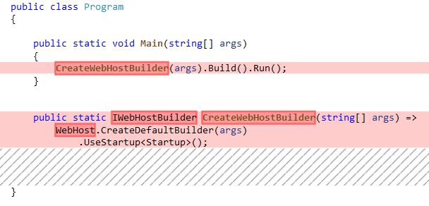

# What's new in ASP.NET Core 3.0

This article highlights the most significant changes in ASP.NET Core 3.0 with links to relevant documentation.

## ASP.NET Core 3.0 only runs on .NET Core 3.0

As of ASP.NET Core 3.0, .NET Framework is no longer a supported target framework. Projects targeting .NET Framework can continue in a fully supported fashion using the [.NET Core 2.1 LTS release](https://www.microsoft.com/net/download/dotnet-core/2.1). ASP.NET Core 2.1 is supported until August 21, 2021. For more information, see [this GitHub announcement](https://github.com/aspnet/Announcements/issues/324).

See [Port your code from .NET Framework to .NET Core](/dotnet/core/porting/) for migration information.

## Use the ASP.NET Core shared framework

The [ASP.NET Core 3.0 shared framework](https://natemcmaster.com/blog/2018/08/29/netcore-primitives-2/), contained in the [Microsoft.AspNetCore.App metapackage](xref:fundamentals/metapackage-app), no longer requires an explicit `<PackageReference />` element in the project file. The shared framework is automatically referenced when using the `Microsoft.NET.Sdk.Web` SDK in your project file:

```xml
<Project Sdk="Microsoft.NET.Sdk.Web">
```

## Assemblies removed from the ASP.NET Core shared framework

The most notable assemblies removed from the ASP.NET Core 3.0 shared framework are:

* [Newtonsoft.Json](https://www.nuget.org/packages/Newtonsoft.Json/) (Json.NET). To add Json.NET to ASP.NET Core 3.0, see [Add Newtonsoft.Json-based JSON format support](xref:web-api/advanced/formatting#add-newtonsoftjson-based-json-format-support). ASP.NET Core 3.0 introduces `System.Text.Json` for reading and writing JSON. For more information, see [New JSON serialization](#json) in this document.
* [Entity Framework Core](/ef/core/)

For a complete list of assemblies removed from the shared framework, see [Assemblies being removed from Microsoft.AspNetCore.App 3.0](https://github.com/aspnet/AspNetCore/issues/3755). For more information on the motivation for this change, see [Breaking changes to Microsoft.AspNetCore.App in 3.0](https://github.com/aspnet/Announcements/issues/325) and [A first look at changes coming in ASP.NET Core 3.0](https://devblogs.microsoft.com/aspnet/a-first-look-at-changes-coming-in-asp-net-core-3-0/).

<a name="json"></a>

### New JSON serialization

ASP.NET Core 3.0 includes `System.Text.Json`:

* Reads and writes JSON asynchronously.
* Is optimized for UTF-8 text.
* Typically higher performance than `Newtonsoft.Json`.

## gRPC

See <xref:grpc/index>.

## New Razor features

The following list contains new Razor features:

* [@attribute](xref:mvc/views/razor#attribute) &ndash; The `@attribute` directive applies the given attribute to the class of the generated page or view. For example, `@Attribute [Authorize]`.
* [@implements](xref:mvc/views/razor#implements) &ndash; The `@implements` directive implements an interface for the generated class. For example, `@implements IDisposable`.
* [@page](xref:mvc/views/razor#page) &ndash; The `@page` directive has different effects depending on the type of the file where it appears. In a *.cshtml* file, `@page` indicates that the file is a Razor Page. In a *.razor* file, `@page` specifies that a Razor component should handle requests directly.

## Certificate and Kerberos authentication

Certificate authentication requires:

* Configuring the server to accept certificates.
* Adding the authentication middleware in `Startup.Configure`.
* Adding the certificate authentication service in `Startup.ConfigureServices`.

```csharp
public void ConfigureServices(IServiceCollection services)
{
    services.AddAuthentication(
        CertificateAuthenticationDefaults.AuthenticationScheme)
            .AddCertificate();
    // Other service configuration removed.
}

public void Configure(IApplicationBuilder app, IHostingEnvironment env)
{
    app.UseAuthentication();
    // Other app configuration removed.
}
```

Options for certificate authentication include the ability to:

* Accept self-signed certificates.
* Check for certificate revocation.
* Check that the proffered certificate has the right usage flags in it.

A default user principal is constructed from the certificate properties. The user principal contains an event that enables supplementing or replacing the principal. For more information, see <xref:security/authentication/certauth>.

[Windows Authentication](/windows-server/security/windows-authentication/windows-authentication-overview) has been extended onto Linux and macOS. In previous versions, Windows Authentication authentication was limited to [IIS](xref:host-and-deploy/iis/index) and [HttpSys](xref:fundamentals/servers/httpsys). In ASP.NET Core 3.0, [Kestrel](xref:fundamentals/servers/kestrel) has the ability to use Negotiate, [Kerberos](/windows-server/security/kerberos/kerberos-authentication-overview), and [NTLM on Windows](/windows-server/security/kerberos/ntlm-overview), Linux, and macOS for Windows domain joined hosts. Kestrel support of these authentication schemes is provide by the [Microsoft.AspNetCore.Authentication.Negotiate nuget](https://www.nuget.org/packages/Microsoft.AspNetCore.Authentication.Negotiate) package. As with the other authentication services, configure authentication app wide, then configure the service:

```csharp
public void ConfigureServices(IServiceCollection services)
{
    services.AddAuthentication(NegotiateDefaults.AuthenticationScheme)
        .AddNegotiate();
    // Other service configuration removed.
}

public void Configure(IApplicationBuilder app, IHostingEnvironment env)
{
    app.UseAuthentication();
    // Other app configuration removed.
}
```

Host requirements:

* Windows hosts must have [Service Principal Names](/windows/win32/ad/service-principal-names) (SPNs) added to the user account hosting the app.
* Linux and macOS machines must be joined to the domain.

  * SPNs must be created for the web process.
  * [Keytab files](https://blogs.technet.microsoft.com/pie/2018/01/03/all-you-need-to-know-about-keytab-files/) must be generated and configured on the host machine.

See <xref:security/authentication/windowsauth> for more information.

## Template changes

The web UI templates (Razor Pages, MVC with controller and views) have the following removed:

* The cookie consent UI is no longer included. To enable the cookie consent feature in an ASP.NET Core 3.0 template generated app, see <xref:security/gdpr>.
* Scripts and related static assets are now referenced as local files instead of using CDNs. For more information, see [this GitHub issue](https://github.com/aspnet/AspNetCore.Docs/issues/14350).

The Angular template updated to use Angular 8.

## Razor components

Razor components are self-contained chunks of user interface (UI), such as a page, dialog, or form. Razor components are normal .NET classes that define UI rendering logic and client-side event handlers. You can create rich interactive web apps without JavaScript. 

Razor components are typically authored using Razor syntax, a natural blend of HTML and C#. Razor components are similar to Razor Pages and MVC views in that they both use Razor. Unlike pages and views, which are based on a request-response model, components are used specifically for handling UI composition. 

For more information, see <xref:blazor/index>.

## SignalR

@bradygaster  to provide

## Generic Host

The ASP.NET Core 3.0 templates use <xref:fundamentals/host/generic-host>. Previous versions used <xref:Microsoft.AspNetCore.Hosting.WebHostBuilder>. Using the .NET Core Generic Host (<xref:Microsoft.Extensions.Hosting.HostBuilder>) provides better integration of ASP.NET Core apps with other server scenarios that are not web specific.

The following two images show the changes made to the template generated *Program.cs* file:

 
 

In the preceding images:

* The ASP.NET Core 2.2 version is shown first. The red boxes indicate code that has been removed in the 3.0 version.
* The ASP.NET Core 3.0 version is shown second. The green boxes indicate code that has been added. The 3.0 version requires `using Microsoft.Extensions.Hosting;`.

## Host configuration and options

Host builder configuration is provided by <xref:Microsoft.Extensions.Hosting.HostBuilder.ConfigureHostConfiguration*>:

```csharp
public static IHostBuilder CreateHostBuilder(string[] args) =>
    Host.CreateDefaultBuilder(args)
        .ConfigureHostConfiguration(configHost =>
        {
            configHost.SetBasePath(Directory.GetCurrentDirectory());
            configHost.AddJsonFile("hostsettings.json", optional: true);
            configHost.AddEnvironmentVariables(prefix: "PREFIX_");
            configHost.AddCommandLine(args);
    });
```

Prior to the release of ASP.NET Core 3.0, environment variables prefixed with `ASPNETCORE_` were loaded for host configuration of the Web Host. In 3.0, `AddEnvironmentVariables` is used to load environment variables prefixed with `DOTNET_` for host configuration with `CreateDefaultBuilder`. 

To configure host options in code, call `Configure<HostOptions>` on the host builder's services provided by `ConfigureServices`:

```csharp
public static IHostBuilder CreateHostBuilder2(string[] args) =>
    Host.CreateDefaultBuilder(args)
        .ConfigureServices((hostContext, services) =>
        {
            services.Configure(option =>
            {
                option.ShutdownTimeout = System.TimeSpan.FromSeconds(20);
            });
        });
```

For more information, see the following articles:

* <xref:fundamentals/configuration/index>
* <xref:fundamentals/host/generic-host>

## Kestrel

* Kestrel configuration has been updated for the migration to the Generic Host. In 3.0, Kestrel is configured on the web host builder provided by `ConfigureWebHostDefaults`.
* Connection Adapters have been removed from Kestrel and replaced with Connection Middleware, which is similar to HTTP Middleware in the ASP.NET Core pipeline but for lower-level connections.
* The Kestrel transport layer has been exposed as a public interface in `Connections.Abstractions`.
* Ambiguity between headers and trailers has been resolved by moving trailing headers to a new collection.
* Synchronous IO APIs, such as `HttpReqeuest.Body.Read`, are a common source of thread starvation leading to app crashes. In 3.0, `AllowSynchronousIO` is disabled by default.

For more information, see <xref:migration/22-to-30>.

## Hosting EventSourceProvider new request counters

The Hosting EventSourceProvider (Microsoft.AspNetCore.Hosting) emits the following request counters:

* `requests-per-second`
* `total-requests`
* `current-requests`
* `failed-requests`

## Endpoint routing

See https://github.com/aspnet/AspNetCore.Docs/issues/14291

## Health Checks

Health Checks use endpoint routing with the Generic Host. In `Startup.Configure`, call `MapHealthChecks` on the endpoint builder with the endpoint URL or relative path:

```csharp
app.UseEndpoints(endpoints =>
{
    endpoints.MapHealthChecks("/health");
});
```

Health Checks endpoints can:

* Specify one or more permitted hosts/ports.
* Require authorization.
* Require CORS.

For more information, see the following articles:

* <xref:migration/22-to-30#health-checks>
* <xref:host-and-deploy/health-checks>

## Pipes on HttpContext

TODO by PU

<!-- indirectly related, https://github.com/dotnet/docs/pull/14414 won't be published by 9/23  -->

## Worker service and SDK

See https://github.com/aspnet/AspNetCore.Docs/issues/14269

## Forwarded Headers Middleware improvements

In previous versions, calling <xref:Microsoft.AspNetCore.Builder.HstsBuilderExtensions.UseHsts*> and  <xref:Microsoft.AspNetCore.Builder.HttpsPolicyBuilderExtensions.UseHttpsRedirection*> were problematic when deployed to an Azure Linux or behind any reverse proxy other than IIS. The fix for previous versions is documented in [Forward the scheme for Linux and non-IIS reverse proxies](xref:host-and-deploy/proxy-load-balancer#forward-the-scheme-for-linux-and-non-iis-reverse-proxies).

In ASP.NET Core 3.0, this problem has been fixed. The host enables the [Forwarded Headers Middleware](xref:host-and-deploy/proxy-load-balancer#forwarded-headers-middleware-options) when the `ASPNETCORE_FORWARDEDHEADERS_ENABLED` environment variable has been set to `true`.

## Additional information

<!-- 
For the complete list of changes, see the [ASP.NET Core 2.2 Release Notes](https://github.com/aspnet/Home/releases/tag/2.2.0).
-->
