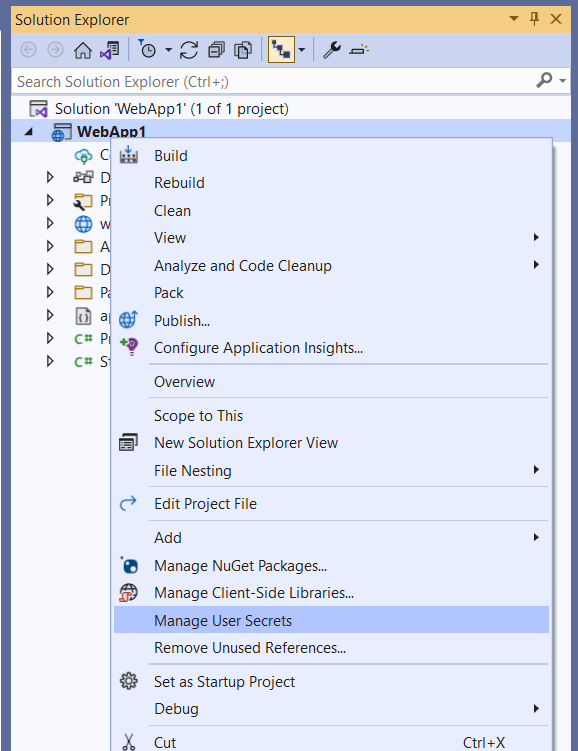

# Safe storage of app secrets in development in ASP.NET Core

:::moniker range=">= aspnetcore-6.0"

By [Rick Anderson](https://twitter.com/RickAndMSFT) and [Kirk Larkin](https://twitter.com/serpent5)

[View or download sample code](https://github.com/dotnet/AspNetCore.Docs/tree/main/aspnetcore/security/app-secrets/samples) ([how to download](xref:index#how-to-download-a-sample))

This document explains how to manage sensitive data for an ASP.NET Core app on a development machine. Never store passwords or other sensitive data in source code. Production secrets shouldn't be used for development or test. Secrets shouldn't be deployed with the app. Instead, production secrets should be accessed through a controlled means like environment variables or Azure Key Vault. You can store and protect Azure test and production secrets with the [Azure Key Vault configuration provider](xref:security/key-vault-configuration).

To use user secrets in a .NET console app, see [this GitHub issue](https://github.com/dotnet/EntityFramework.Docs/issues/3939#issuecomment-1191978026).

## Environment variables

Environment variables are used to avoid storage of app secrets in code or in local configuration files. Environment variables override configuration values for all previously specified configuration sources.

Consider an ASP.NET Core web app in which **Individual User Accounts** security is enabled. A default database connection string is included in the project's `appsettings.json` file with the key `DefaultConnection`. The default connection string is for LocalDB, which runs in user mode and doesn't require a password. During app deployment, the `DefaultConnection` key value can be overridden with an environment variable's value. The environment variable may store the complete connection string with sensitive credentials.

> [!WARNING]
> Environment variables are generally stored in plain, unencrypted text. If the machine or process is compromised, environment variables can be accessed by untrusted parties. Additional measures to prevent disclosure of user secrets may be required.

[!INCLUDE[](~/includes/environmentVarableColon.md)]

## Secret Manager

The Secret Manager tool stores sensitive data during the development of an ASP.NET Core project. In this context, a piece of sensitive data is an app secret. App secrets are stored in a separate location from the project tree. The app secrets are associated with a specific project or shared across several projects. The app secrets aren't checked into source control.

> [!WARNING]
> The Secret Manager tool doesn't encrypt the stored secrets and shouldn't be treated as a trusted store. It's for development purposes only. The keys and values are stored in a JSON configuration file in the user profile directory.

## How the Secret Manager tool works

The Secret Manager tool hides implementation details, such as where and how the values are stored. You can use the tool without knowing these implementation details. The values are stored in a JSON file in the local machine's user profile folder:

# [Windows](#tab/windows)

File system path:

`%APPDATA%\Microsoft\UserSecrets\<user_secrets_id>\secrets.json`

# [Linux / macOS](#tab/linux+macos)

File system path:

`~/.microsoft/usersecrets/<user_secrets_id>/secrets.json`

---

In the preceding file paths, replace `<user_secrets_id>` with the `UserSecretsId` value specified in the project file.

Don't write code that depends on the location or format of data saved with the Secret Manager tool. These implementation details may change. For example, the secret values aren't encrypted, but could be in the future.

## Enable secret storage

The Secret Manager tool operates on project-specific configuration settings stored in your user profile.

The Secret Manager tool includes an `init` command. To use user secrets, run the following command in the project directory:

```dotnetcli
dotnet user-secrets init
```

The preceding command adds a `UserSecretsId` element within a `PropertyGroup` of the project file. By default, the inner text of `UserSecretsId` is a GUID. The inner text is arbitrary, but is unique to the project.

[!code-xml[](app-secrets/samples/3.x/UserSecrets/UserSecrets.csproj?name=snippet_PropertyGroup&highlight=3)]

In Visual Studio, right-click the project in Solution Explorer, and select **Manage User Secrets** from the context menu. This gesture adds a `UserSecretsId` element, populated with a GUID, to the project file.

## Set a secret

Define an app secret consisting of a key and its value. The secret is associated with the project's `UserSecretsId` value. For example, run the following command from the directory in which the project file exists:

```dotnetcli
dotnet user-secrets set "Movies:ServiceApiKey" "12345"
```

In the preceding example, the colon denotes that `Movies` is an object literal with a `ServiceApiKey` property.

The Secret Manager tool can be used from other directories too. Use the `--project` option to supply the file system path at which the project file exists. For example:

```dotnetcli
dotnet user-secrets set "Movies:ServiceApiKey" "12345" --project "C:\apps\WebApp1\src\WebApp1"
```

### JSON structure flattening in Visual Studio

Visual Studio's **Manage User Secrets** gesture opens a `secrets.json` file in the text editor. Replace the contents of `secrets.json` with the key-value pairs to be stored. For example:

```json
{
  "Movies": {
    "ConnectionString": "Server=(localdb)\\mssqllocaldb;Database=Movie-1;Trusted_Connection=True;MultipleActiveResultSets=true",
    "ServiceApiKey": "12345"
  }
}
```

The JSON structure is flattened after modifications via `dotnet user-secrets remove` or `dotnet user-secrets set`. For example, running `dotnet user-secrets remove "Movies:ConnectionString"` collapses the `Movies` object literal. The modified file resembles the following JSON:

```json
{
  "Movies:ServiceApiKey": "12345"
}
```

## Set multiple secrets

A batch of secrets can be set by piping JSON to the `set` command. In the following example, the `input.json` file's contents are piped to the `set` command.

# [Windows](#tab/windows)

Open a command shell, and execute the following command:

  ```dotnetcli
  type .\input.json | dotnet user-secrets set
  ```

# [Linux / macOS](#tab/linux+macos)

Open a command shell, and execute the following command:

  ```dotnetcli
  cat ./input.json | dotnet user-secrets set
  ```

---

## Access a secret

To access a secret, complete the following steps:

1. [Register the user secrets configuration source](#register-the-user-secrets-configuration-source)
1. [Read the secret via the Configuration API](#read-the-secret-via-the-configuration-api)

### Register the user secrets configuration source

The user secrets [configuration provider](/dotnet/core/extensions/configuration-providers) registers the appropriate configuration source with the .NET [Configuration API](xref:fundamentals/configuration/index).

ASP.NET Core web apps created with [dotnet new](/dotnet/core/tools/dotnet-new) or Visual Studio generate the following code:

[!code-csharp[](app-secrets/samples/6.x/UserSecrets/Program.cs?name=snippet2&highlight=1)]

[WebApplication.CreateBuilder](xref:Microsoft.AspNetCore.Builder.WebApplication.CreateBuilder%2A) initializes a new instance of the <xref:Microsoft.AspNetCore.Builder.WebApplicationBuilder> class with preconfigured defaults. The initialized `WebApplicationBuilder` (`builder`) provides default configuration and calls <xref:Microsoft.Extensions.Configuration.UserSecretsConfigurationExtensions.AddUserSecrets%2A> when the <xref:Microsoft.Extensions.Hosting.IHostEnvironment.EnvironmentName> is <xref:Microsoft.Extensions.Hosting.EnvironmentName.Development>:

### Read the secret via the Configuration API

Consider the following examples of reading the `Movies:ServiceApiKey` key:

**Program.cs file:**

[!code-csharp[](app-secrets/samples/6.x/UserSecrets/Program.cs?name=snippet_s2&highlight=2)]

**Razor Pages page model:**

[!code-csharp[](app-secrets/samples/6.x/UserSecrets/Pages/Index.cshtml.cs?name=snippet_PageModel&highlight=12)]

For more information, see <xref:fundamentals/configuration/index>.

## Map secrets to a POCO

Mapping an entire object literal to a POCO (a simple .NET class with properties) is useful for aggregating related properties.

[!INCLUDE[secrets.json file](~/includes/app-secrets/secrets-json-file-and-text.md)]

To map the preceding secrets to a POCO, use the .NET Configuration API's [object graph binding](xref:fundamentals/configuration/index#boa) feature. The following code binds to a custom `MovieSettings` POCO and accesses the `ServiceApiKey` property value:

[!code-csharp[](app-secrets/samples/3.x/UserSecrets/Startup3.cs?name=snippet_BindToObjectGraph)]

The `Movies:ConnectionString` and `Movies:ServiceApiKey` secrets are mapped to the respective properties in `MovieSettings`:

[!code-csharp[](app-secrets/samples/3.x/UserSecrets/Models/MovieSettings.cs?name=snippet_MovieSettingsClass)]

## String replacement with secrets

Storing passwords in plain text is insecure. For example, a database connection string stored in `appsettings.json` may include a password for the specified user:

[!code-json[](app-secrets/samples/3.x/UserSecrets/appsettings-unsecure.json?highlight=3)]

A more secure approach is to store the password as a secret. For example:

```dotnetcli
dotnet user-secrets set "DbPassword" "pass123"
```

Remove the `Password` key-value pair from the connection string in `appsettings.json`. For example:

[!code-json[](app-secrets/samples/3.x/UserSecrets/appsettings.json?highlight=3)]

The secret's value can be set on a <xref:System.Data.SqlClient.SqlConnectionStringBuilder> object's <xref:System.Data.SqlClient.SqlConnectionStringBuilder.Password%2A> property to complete the connection string:

[!code-csharp[](app-secrets/samples/6.x/UserSecrets/Program.cs?name=snippet_sql&highlight=5-8)]

## List the secrets

[!INCLUDE[secrets.json file](~/includes/app-secrets/secrets-json-file-and-text.md)]

Run the following command from the directory in which the project file exists:

```dotnetcli
dotnet user-secrets list
```

The following output appears:

```console
Movies:ConnectionString = Server=(localdb)\mssqllocaldb;Database=Movie-1;Trusted_Connection=True;MultipleActiveResultSets=true
Movies:ServiceApiKey = 12345
```

In the preceding example, a colon in the key names denotes the object hierarchy within `secrets.json`.

## Remove a single secret

[!INCLUDE[secrets.json file](~/includes/app-secrets/secrets-json-file-and-text.md)]

Run the following command from the directory in which the project file exists:

```dotnetcli
dotnet user-secrets remove "Movies:ConnectionString"
```

The app's `secrets.json` file was modified to remove the key-value pair associated with the `Movies:ConnectionString` key:

```json
{
  "Movies": {
    "ServiceApiKey": "12345"
  }
}
```

`dotnet user-secrets list` displays the following message:

```console
Movies:ServiceApiKey = 12345
```

## Remove all secrets

[!INCLUDE[secrets.json file](~/includes/app-secrets/secrets-json-file-and-text.md)]

Run the following command from the directory in which the project file exists:

```dotnetcli
dotnet user-secrets clear
```

All user secrets for the app have been deleted from the `secrets.json` file:

```json
{}
```

Running `dotnet user-secrets list` displays the following message:

```console
No secrets configured for this application.
```

<a name="muswvs"></a>

## Manage user secrets with Visual Studio

To manage user secrets in Visual Studio, right click the project in solution explorer and select **Manage User Secrets**:



## Migrating User Secrets from ASP.NET Framework to ASP.NET Core

See [this GitHub issue](https://github.com/dotnet/AspNetCore.Docs/issues/27611).

## Additional resources


* See [this issue](https://github.com/dotnet/AspNetCore.Docs/issues/30378) and [this issue](https://github.com/dotnet/AspNetCore.Docs/issues/16328) for information on accessing user secrets from IIS.
* <xref:fundamentals/configuration/index>
* <xref:security/key-vault-configuration>

:::moniker-end

:::moniker range="< aspnetcore-6.0"

By [Rick Anderson](https://twitter.com/RickAndMSFT), [Kirk Larkin](https://twitter.com/serpent5), [Daniel Roth](https://github.com/danroth27), and [Scott Addie](https://github.com/scottaddie)

[View or download sample code](https://github.com/dotnet/AspNetCore.Docs/tree/main/aspnetcore/security/app-secrets/samples) ([how to download](xref:index#how-to-download-a-sample))

This document explains how to manage sensitive data for an ASP.NET Core app on a development machine. Never store passwords or other sensitive data in source code. Production secrets shouldn't be used for development or test. Secrets shouldn't be deployed with the app. Instead, production secrets should be accessed through a controlled means like environment variables or Azure Key Vault. You can store and protect Azure test and production secrets with the [Azure Key Vault configuration provider](xref:security/key-vault-configuration).

## Environment variables

Environment variables are used to avoid storage of app secrets in code or in local configuration files. Environment variables override configuration values for all previously specified configuration sources.

Consider an ASP.NET Core web app in which **Individual User Accounts** security is enabled. A default database connection string is included in the project's `appsettings.json` file with the key `DefaultConnection`. The default connection string is for LocalDB, which runs in user mode and doesn't require a password. During app deployment, the `DefaultConnection` key value can be overridden with an environment variable's value. The environment variable may store the complete connection string with sensitive credentials.

> [!WARNING]
> Environment variables are generally stored in plain, unencrypted text. If the machine or process is compromised, environment variables can be accessed by untrusted parties. Additional measures to prevent disclosure of user secrets may be required.

[!INCLUDE[](~/includes/environmentVarableColon.md)]

## Secret Manager

The Secret Manager tool stores sensitive data during the development of an ASP.NET Core project. In this context, a piece of sensitive data is an app secret. App secrets are stored in a separate location from the project tree. The app secrets are associated with a specific project or shared across several projects. The app secrets aren't checked into source control.

> [!WARNING]
> The Secret Manager tool doesn't encrypt the stored secrets and shouldn't be treated as a trusted store. It's for development purposes only. The keys and values are stored in a JSON configuration file in the user profile directory.

## How the Secret Manager tool works

The Secret Manager tool hides implementation details, such as where and how the values are stored. You can use the tool without knowing these implementation details. The values are stored in a JSON file in the local machine's user profile folder:

# [Windows](#tab/windows)

File system path:

`%APPDATA%\Microsoft\UserSecrets\<user_secrets_id>\secrets.json`

# [Linux / macOS](#tab/linux+macos)

File system path:

`~/.microsoft/usersecrets/<user_secrets_id>/secrets.json`

---

In the preceding file paths, replace `<user_secrets_id>` with the `UserSecretsId` value specified in the project file.

Don't write code that depends on the location or format of data saved with the Secret Manager tool. These implementation details may change. For example, the secret values aren't encrypted, but could be in the future.

## Enable secret storage

The Secret Manager tool operates on project-specific configuration settings stored in your user profile.

The Secret Manager tool includes an `init` command in .NET Core SDK 3.0.100 or later. To use user secrets, run the following command in the project directory:

```dotnetcli
dotnet user-secrets init
```

The preceding command adds a `UserSecretsId` element within a `PropertyGroup` of the project file. By default, the inner text of `UserSecretsId` is a GUID. The inner text is arbitrary, but is unique to the project.

[!code-xml[](app-secrets/samples/3.x/UserSecrets/UserSecrets.csproj?name=snippet_PropertyGroup&highlight=3)]

In Visual Studio, right-click the project in Solution Explorer, and select **Manage User Secrets** from the context menu. This gesture adds a `UserSecretsId` element, populated with a GUID, to the project file.

## Set a secret

Define an app secret consisting of a key and its value. The secret is associated with the project's `UserSecretsId` value. For example, run the following command from the directory in which the project file exists:

```dotnetcli
dotnet user-secrets set "Movies:ServiceApiKey" "12345"
```

In the preceding example, the colon denotes that `Movies` is an object literal with a `ServiceApiKey` property.

The Secret Manager tool can be used from other directories too. Use the `--project` option to supply the file system path at which the project file exists. For example:

```dotnetcli
dotnet user-secrets set "Movies:ServiceApiKey" "12345" --project "C:\apps\WebApp1\src\WebApp1"
```

### JSON structure flattening in Visual Studio

Visual Studio's **Manage User Secrets** gesture opens a `secrets.json` file in the text editor. Replace the contents of `secrets.json` with the key-value pairs to be stored. For example:

```json
{
  "Movies": {
    "ConnectionString": "Server=(localdb)\\mssqllocaldb;Database=Movie-1;Trusted_Connection=True;MultipleActiveResultSets=true",
    "ServiceApiKey": "12345"
  }
}
```

The JSON structure is flattened after modifications via `dotnet user-secrets remove` or `dotnet user-secrets set`. For example, running `dotnet user-secrets remove "Movies:ConnectionString"` collapses the `Movies` object literal. The modified file resembles the following JSON:

```json
{
  "Movies:ServiceApiKey": "12345"
}
```

## Set multiple secrets

A batch of secrets can be set by piping JSON to the `set` command. In the following example, the `input.json` file's contents are piped to the `set` command.

# [Windows](#tab/windows)

Open a command shell, and execute the following command:

  ```dotnetcli
  type .\input.json | dotnet user-secrets set
  ```

# [Linux / macOS](#tab/linux+macos)

Open a command shell, and execute the following command:

  ```dotnetcli
  cat ./input.json | dotnet user-secrets set
  ```

---

## Access a secret

To access a secret, complete the following steps:

1. [Register the user secrets configuration source](#register-the-user-secrets-configuration-source)
1. [Read the secret via the Configuration API](#read-the-secret-via-the-configuration-api)

### Register the user secrets configuration source

The user secrets [configuration provider](/dotnet/core/extensions/configuration-providers) registers the appropriate configuration source with the .NET [Configuration API](xref:fundamentals/configuration/index).

The user secrets configuration source is automatically added in Development mode when the project calls <xref:Microsoft.Extensions.Hosting.Host.CreateDefaultBuilder%2A>. `CreateDefaultBuilder` calls <xref:Microsoft.Extensions.Configuration.UserSecretsConfigurationExtensions.AddUserSecrets%2A> when the <xref:Microsoft.Extensions.Hosting.IHostEnvironment.EnvironmentName> is <xref:Microsoft.Extensions.Hosting.EnvironmentName.Development>:

[!code-csharp[](app-secrets/samples/3.x/UserSecrets/Program.cs?name=snippet_CreateHostBuilder&highlight=2)]

When `CreateDefaultBuilder` isn't called, add the user secrets configuration source explicitly by calling <xref:Microsoft.Extensions.Configuration.UserSecretsConfigurationExtensions.AddUserSecrets%2A> in <xref:Microsoft.Extensions.Hosting.HostBuilder.ConfigureAppConfiguration%2A>. Call `AddUserSecrets` only when the app runs in the Development environment, as shown in the following example:

[!code-csharp[](app-secrets/samples/3.x/UserSecrets/Program2.cs?name=snippet_Program&highlight=10-13)]

### Read the secret via the Configuration API

If the user secrets configuration source is registered, the .NET Configuration API can read the secrets. [Constructor injection](/dotnet/core/extensions/dependency-injection#constructor-injection-behavior) can be used to gain access to the .NET Configuration API. Consider the following examples of reading the `Movies:ServiceApiKey` key:

**Startup class:**

[!code-csharp[](app-secrets/samples/3.x/UserSecrets/Startup.cs?name=snippet_StartupClass&highlight=14)]

**Razor Pages page model:**

[!code-csharp[](app-secrets/samples/3.x/UserSecrets/Pages/Index.cshtml.cs?name=snippet_PageModel&highlight=12)]

For more information, see [Access configuration in Startup](xref:fundamentals/configuration/index#access-configuration-in-startup) and [Access configuration in Razor Pages](xref:fundamentals/configuration/index#access-configuration-in-razor-pages).

## Map secrets to a POCO

Mapping an entire object literal to a POCO (a simple .NET class with properties) is useful for aggregating related properties.

[!INCLUDE[secrets.json file](~/includes/app-secrets/secrets-json-file-and-text.md)]

To map the preceding secrets to a POCO, use the .NET Configuration API's [object graph binding](xref:fundamentals/configuration/index#boa) feature. The following code binds to a custom `MovieSettings` POCO and accesses the `ServiceApiKey` property value:

[!code-csharp[](app-secrets/samples/3.x/UserSecrets/Startup3.cs?name=snippet_BindToObjectGraph)]

The `Movies:ConnectionString` and `Movies:ServiceApiKey` secrets are mapped to the respective properties in `MovieSettings`:

[!code-csharp[](app-secrets/samples/3.x/UserSecrets/Models/MovieSettings.cs?name=snippet_MovieSettingsClass)]

## String replacement with secrets

Storing passwords in plain text is insecure. For example, a database connection string stored in `appsettings.json` may include a password for the specified user:

[!code-json[](app-secrets/samples/3.x/UserSecrets/appsettings-unsecure.json?highlight=3)]

A more secure approach is to store the password as a secret. For example:

```dotnetcli
dotnet user-secrets set "DbPassword" "pass123"
```

Remove the `Password` key-value pair from the connection string in `appsettings.json`. For example:

[!code-json[](app-secrets/samples/3.x/UserSecrets/appsettings.json?highlight=3)]

The secret's value can be set on a <xref:System.Data.SqlClient.SqlConnectionStringBuilder> object's <xref:System.Data.SqlClient.SqlConnectionStringBuilder.Password%2A> property to complete the connection string:

[!code-csharp[](app-secrets/samples/3.x/UserSecrets/Startup2.cs?name=snippet_StartupClass&highlight=14-17)]

## List the secrets

[!INCLUDE[secrets.json file](~/includes/app-secrets/secrets-json-file-and-text.md)]

Run the following command from the directory in which the project file exists:

```dotnetcli
dotnet user-secrets list
```

The following output appears:

```console
Movies:ConnectionString = Server=(localdb)\mssqllocaldb;Database=Movie-1;Trusted_Connection=True;MultipleActiveResultSets=true
Movies:ServiceApiKey = 12345
```

In the preceding example, a colon in the key names denotes the object hierarchy within `secrets.json`.

## Remove a single secret

[!INCLUDE[secrets.json file](~/includes/app-secrets/secrets-json-file-and-text.md)]

Run the following command from the directory in which the project file exists:

```dotnetcli
dotnet user-secrets remove "Movies:ConnectionString"
```

The app's `secrets.json` file was modified to remove the key-value pair associated with the `MoviesConnectionString` key:

```json
{
  "Movies": {
    "ServiceApiKey": "12345"
  }
}
```

`dotnet user-secrets list` displays the following message:

```console
Movies:ServiceApiKey = 12345
```

## Remove all secrets

[!INCLUDE[secrets.json file](~/includes/app-secrets/secrets-json-file-and-text.md)]

Run the following command from the directory in which the project file exists:

```dotnetcli
dotnet user-secrets clear
```

All user secrets for the app have been deleted from the `secrets.json` file:

```json
{}
```

Running `dotnet user-secrets list` displays the following message:

```console
No secrets configured for this application.
```

<a name="muswvs"></a>

## Manage user secrets with Visual Studio

To manage user secrets in Visual Studio, right click the project in solution explorer and select **Manage User Secrets**:


## Migrating User Secrets from ASP.NET Framework to ASP.NET Core

See [this GitHub issue](https://github.com/dotnet/AspNetCore.Docs/issues/27611).

## Additional resources

* See [this issue](https://github.com/dotnet/AspNetCore.Docs/issues/30378) and [this issue](https://github.com/dotnet/AspNetCore.Docs/issues/16328) for information on accessing user secrets from IIS.
* <xref:fundamentals/configuration/index>
* <xref:security/key-vault-configuration>

:::moniker-end
