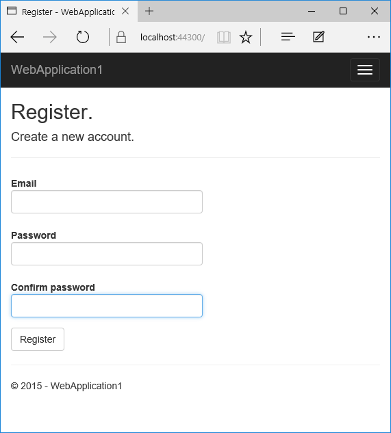
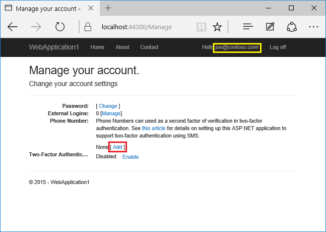
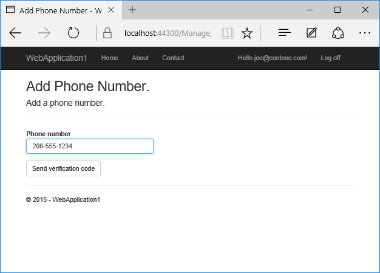
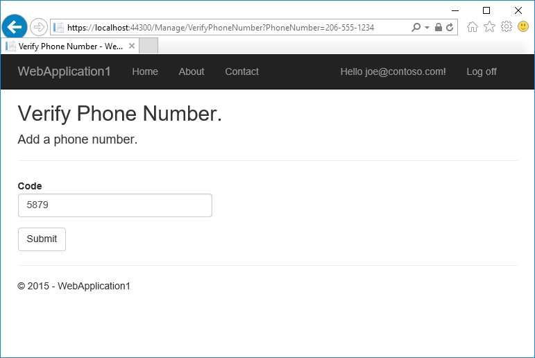
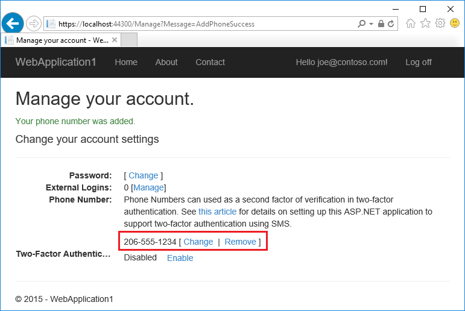
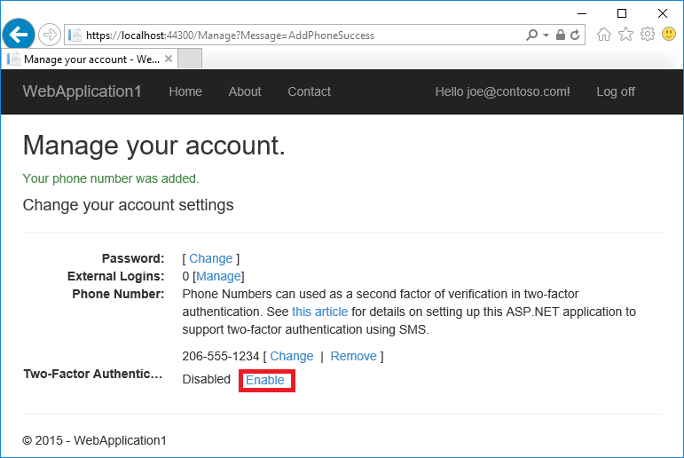
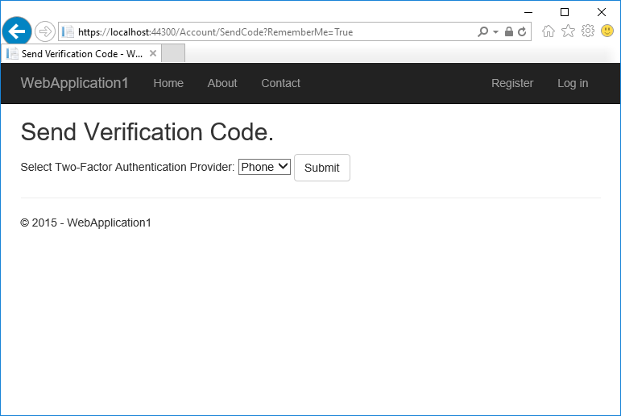
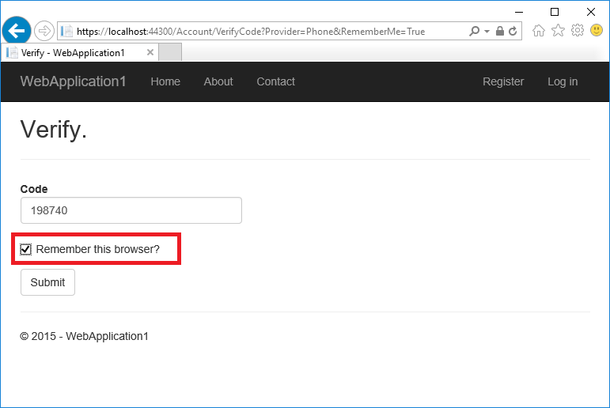

# Two-factor authentication with SMS in ASP.NET Core

By [Rick Anderson](https://twitter.com/RickAndMSFT) and [Swiss-Devs](https://github.com/Swiss-Devs)

>[!WARNING]
> Two factor authentication (2FA) authenticator apps, using a Time-based One-time Password Algorithm (TOTP), are the industry recommended approach for 2FA. 2FA using TOTP is preferred to SMS 2FA. For more information, see [Enable QR Code generation for TOTP authenticator apps in ASP.NET Core](xref:security/authentication/identity-enable-qrcodes) for ASP.NET Core 2.0 and later.

This tutorial shows how to set up two-factor authentication (2FA) using SMS. Instructions are given for [twilio](https://www.twilio.com/) and [ASPSMS](https://www.aspsms.com/asp.net/identity/core/testcredits/), but you can use any other SMS provider. We recommend you complete [Account Confirmation and Password Recovery](xref:security/authentication/accconfirm) before starting this tutorial.

[View or download sample code](https://github.com/dotnet/AspNetCore.Docs/tree/main/aspnetcore/security/authentication/2fa/sample/Web2FA). [How to download](xref:index#how-to-download-a-sample).

## Create a new ASP.NET Core project

Create a new ASP.NET Core web app named `Web2FA` with individual user accounts. Follow the instructions in <xref:security/enforcing-ssl> to set up and require HTTPS.

### Create an SMS account

Create an SMS account, for example, from [twilio](https://www.twilio.com/) or [ASPSMS](https://www.aspsms.com/asp.net/identity/core/testcredits/). Record the authentication credentials (for twilio: accountSid and authToken, for ASPSMS: Userkey and Password).

#### Figuring out SMS Provider credentials

**Twilio:**

From the Dashboard tab of your Twilio account, copy the **Account SID** and **Auth token**.

**ASPSMS:**

From your account settings, navigate to **Userkey** and copy it together with your **Password**.

We will later store these values in with the secret-manager tool within the keys `SMSAccountIdentification` and `SMSAccountPassword`.

#### Specifying SenderID / Originator

**Twilio:**
From the Numbers tab, copy your Twilio **phone number**.

**ASPSMS:**
Within the Unlock Originators Menu, unlock one or more Originators or choose an alphanumeric Originator (Not supported by all networks).

We will later store this value with the secret-manager tool within the key `SMSAccountFrom`.

### Provide credentials for the SMS service

We'll use the [Options pattern](xref:fundamentals/configuration/options) to access the user account and key settings.

* Create a class to fetch the secure SMS key. For this sample, the `SMSoptions` class is created in the `Services/SMSoptions.cs` file.

[!code-csharp[](2fa/sample/Web2FA/Services/SMSoptions.cs)]

Set the `SMSAccountIdentification`, `SMSAccountPassword` and `SMSAccountFrom` with the [secret-manager tool](xref:security/app-secrets). For example:

```none
C:/Web2FA/src/WebApp1>dotnet user-secrets set SMSAccountIdentification 12345
info: Successfully saved SMSAccountIdentification = 12345 to the secret store.
```

* Add the NuGet package for the SMS provider. From the Package Manager Console (PMC) run:

**Twilio:**

`Install-Package Twilio`

**ASPSMS:**

`Install-Package ASPSMS`

* Add code in the `Services/MessageServices.cs` file to enable SMS. Use either the Twilio or the ASPSMS section:

**Twilio:**  
[!code-csharp[](2fa/sample/Web2FA/Services/MessageServices_twilio.cs)]

**ASPSMS:**  
[!code-csharp[](2fa/sample/Web2FA/Services/MessageServices_ASPSMS.cs)]

### Configure startup to use `SMSoptions`

Add `SMSoptions` to the service container in the `ConfigureServices` method in the `Startup.cs`:

[!code-csharp[](2fa/sample/Web2FA/Startup.cs?name=snippet1&highlight=4)]

### Enable two-factor authentication

Open the `Views/Manage/Index.cshtml` Razor view file and remove the comment characters (so no markup is commented out).

## Log in with two-factor authentication

* Run the app and register a new user



* Tap on your user name, which activates the `Index` action method in Manage controller. Then tap the phone number **Add** link.



* Add a phone number that will receive the verification code, and tap **Send verification code**.



* You will get a text message with the verification code. Enter it and tap **Submit**



If you don't get a text message, see twilio log page.

* The Manage view shows your phone number was added successfully.



* Tap **Enable** to enable two-factor authentication.



### Test two-factor authentication

* Log off.

* Log in.

* The user account has enabled two-factor authentication, so you have to provide the second factor of authentication. In this tutorial you have enabled phone verification. The built in templates also allow you to set up email as the second factor. You can set up additional second factors for authentication such as QR codes. Tap **Submit**.



* Enter the code you get in the SMS message.

* Clicking on the **Remember this browser** checkbox will exempt you from needing to use 2FA to log on when using the same device and browser. Enabling 2FA and clicking on **Remember this browser** will provide you with strong 2FA protection from malicious users trying to access your account, as long as they don't have access to your device. You can do this on any private device you regularly use. By setting  **Remember this browser**, you get the added security of 2FA from devices you don't regularly use, and you get the convenience on not having to go through 2FA on your own devices.



## Account lockout for protecting against brute force attacks

Account lockout is recommended with 2FA. Once a user signs in through a local account or social account, each failed attempt at 2FA is stored. If the maximum failed access attempts is reached, the user is locked out (default: 5 minute lockout after 5 failed access attempts). A successful authentication resets the failed access attempts count and resets the clock. The maximum failed access attempts and lockout time can be set with <xref:Microsoft.AspNetCore.Identity.LockoutOptions.MaxFailedAccessAttempts%2A> and <xref:Microsoft.AspNetCore.Identity.LockoutOptions.DefaultLockoutTimeSpan%2A>. The following configures account lockout for 10 minutes after 10 failed access attempts:

[!code-csharp[](2fa/sample/Web2FA/Startup.cs?name=snippet2&highlight=13-17)]

Confirm that <xref:Microsoft.AspNetCore.Identity.SignInManager%601.PasswordSignInAsync%2A> sets `lockoutOnFailure` to `true`:

```csharp
var result = await _signInManager.PasswordSignInAsync(
                 Input.Email, Input.Password, Input.RememberMe, lockoutOnFailure: true);
```
