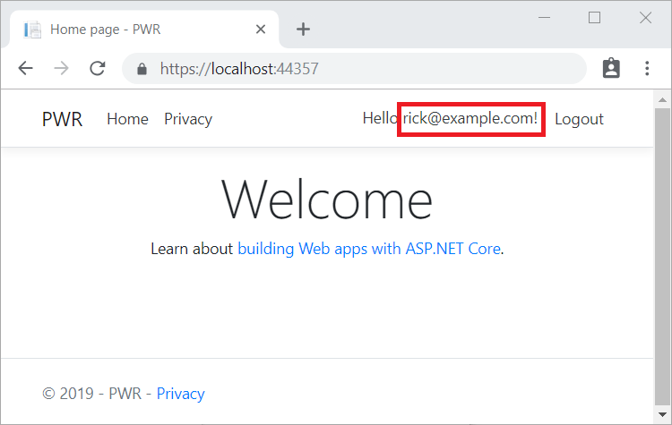

# Account confirmation and password recovery in ASP.NET Core

By [Rick Anderson](https://twitter.com/RickAndMSFT), [Ponant](https://github.com/Ponant), and [Joe Audette](https://twitter.com/joeaudette)

This tutorial shows how to build an ASP.NET Core app with email confirmation and password reset. This tutorial is **not** a beginning topic. You should be familiar with:

* [ASP.NET Core](xref:tutorials/razor-pages/razor-pages-start)
* [Authentication](xref:security/authentication/identity)
* [Entity Framework Core](xref:data/ef-mvc/intro)

<!-- see C:/Dropbox/wrk/Code/SendGridConsole/Program.cs -->

::: moniker range="<= aspnetcore-2.0"

See [this PDF file](https://webpifeed.blob.core.windows.net/webpifeed/Partners/asp.net_repo_pdf_1-16-18.pdf) for the ASP.NET Core 1.1 version.

::: moniker-end

::: moniker range="> aspnetcore-2.2"

## Prerequisites

[.NET Core 3.0 SDK or later](https://dotnet.microsoft.com/download/dotnet-core/3.0)

## Create and test a web app with authentication

Run the following commands to create a web app with authentication.

```dotnetcli
dotnet new webapp -au Individual -uld -o WebPWrecover
cd WebPWrecover
dotnet run
```

Run the app, select the **Register** link, and register a user. Once registered, you are redirected to the to `/Identity/Account/RegisterConfirmation` page which contains a link to simulate email confirmation:

* Select the `Click here to confirm your account` link.
* Select the **Login** link and sign-in with the same credentials.
* Select the `Hello YourEmail@provider.com!` link, which redirects you to the `/Identity/Account/Manage/PersonalData` page.
* Select the **Personal data** tab on the left, and then select **Delete**.

### Configure an email provider

In this tutorial, [SendGrid](https://sendgrid.com) is used to send email. You need a SendGrid account and key to send email. You can use other email providers. We recommend you use SendGrid or another email service to send email. SMTP is difficult to secure and set up correctly.

Create a class to fetch the secure email key. For this sample, create *Services/AuthMessageSenderOptions.cs*:

[!code-csharp[](accconfirm/sample/WebPWrecover30/Services/AuthMessageSenderOptions.cs?name=snippet1)]

#### Configure SendGrid user secrets

Set the `SendGridUser` and `SendGridKey` with the [secret-manager tool](xref:security/app-secrets). For example:

```dotnetcli
dotnet user-secrets set SendGridUser RickAndMSFT
dotnet user-secrets set SendGridKey <key>

Successfully saved SendGridUser = RickAndMSFT to the secret store.
```

On Windows, Secret Manager stores keys/value pairs in a *secrets.json* file in the `%APPDATA%/Microsoft/UserSecrets/<WebAppName-userSecretsId>` directory.

The contents of the *secrets.json* file aren't encrypted. The following markup shows the *secrets.json* file. The `SendGridKey` value has been removed.

```json
{
  "SendGridUser": "RickAndMSFT",
  "SendGridKey": "<key removed>"
}
```

For more information, see the [Options pattern](xref:fundamentals/configuration/options) and [configuration](xref:fundamentals/configuration/index).

### Install SendGrid

This tutorial shows how to add email notifications through [SendGrid](https://sendgrid.com/), but you can send email using SMTP and other mechanisms.

Install the `SendGrid` NuGet package:

# [Visual Studio](#tab/visual-studio)

From the Package Manager Console, enter the following command:

```powershell
Install-Package SendGrid
```

# [.NET Core CLI](#tab/netcore-cli)

From the console, enter the following command:

```dotnetcli
dotnet add package SendGrid
```

---

See [Get Started with SendGrid for Free](https://sendgrid.com/free/) to register for a free SendGrid account.

### Implement IEmailSender

To Implement `IEmailSender`, create *Services/EmailSender.cs* with code similar to the following:

[!code-csharp[](accconfirm/sample/WebPWrecover30/Services/EmailSender.cs)]

### Configure startup to support email

Add the following code to the `ConfigureServices` method in the *Startup.cs* file:

* Add `EmailSender` as a transient service.
* Register the `AuthMessageSenderOptions` configuration instance.

[!code-csharp[](accconfirm/sample/WebPWrecover30/Startup.cs?name=snippet1&highlight=11-15)]

## Register, confirm email, and reset password

Run the web app, and test the account confirmation and password recovery flow.

* Run the app and register a new user
* Check your email for the account confirmation link. See [Debug email](#debug) if you don't get the email.
* Click the link to confirm your email.
* Sign in with your email and password.
* Sign out.

### Test password reset

* If you're signed in, select **Logout**.
* Select the **Log in** link and select the **Forgot your password?** link.
* Enter the email you used to register the account.
* An email with a link to reset your password is sent. Check your email and click the link to reset your password. After your password has been successfully reset, you can sign in with your email and new password.

## Change email and activity timeout

The default inactivity timeout is 14 days. The following code sets the inactivity timeout to 5 days:

[!code-csharp[](accconfirm/sample/WebPWrecover30/StartupAppCookie.cs?name=snippet1)]

### Change all data protection token lifespans

The following code changes all data protection tokens timeout period to 3 hours:

[!code-csharp[](accconfirm/sample/WebPWrecover30/StartupAllTokens.cs?name=snippet1&highlight=11-12)]

The built in Identity user tokens (see [AspNetCore/src/Identity/Extensions.Core/src/TokenOptions.cs](https://github.com/dotnet/AspNetCore/blob/v2.2.2/src/Identity/Extensions.Core/src/TokenOptions.cs) )have a [one day timeout](https://github.com/dotnet/AspNetCore/blob/v2.2.2/src/Identity/Core/src/DataProtectionTokenProviderOptions.cs).

### Change the email token lifespan

The default token lifespan of [the Identity user tokens](https://github.com/dotnet/AspNetCore/blob/v2.2.2/src/Identity/Extensions.Core/src/TokenOptions.cs) is [one day](https://github.com/dotnet/AspNetCore/blob/v2.2.2/src/Identity/Core/src/DataProtectionTokenProviderOptions.cs). This section shows how to change the email token lifespan.

Add a custom [DataProtectorTokenProvider\<TUser>](/dotnet/api/microsoft.aspnetcore.identity.dataprotectortokenprovider-1) and <xref:Microsoft.AspNetCore.Identity.DataProtectionTokenProviderOptions>:

[!code-csharp[](accconfirm/sample/WebPWrecover30/TokenProviders/CustomTokenProvider.cs?name=snippet1)]

Add the custom provider to the service container:

[!code-csharp[](accconfirm/sample/WebPWrecover30/StartupEmail.cs?name=snippet1&highlight=10-16)]

### Resend email confirmation

See [this GitHub issue](https://github.com/dotnet/AspNetCore/issues/5410).

<a name="debug"></a>

### Debug email

If you can't get email working:

* Set a breakpoint in `EmailSender.Execute` to verify `SendGridClient.SendEmailAsync` is called.
* Create a [console app to send email](https://sendgrid.com/docs/Integrate/Code_Examples/v2_Mail/csharp.html) using similar code to `EmailSender.Execute`.
* Review the [Email Activity](https://sendgrid.com/docs/User_Guide/email_activity.html) page.
* Check your spam folder.
* Try another email alias on a different email provider (Microsoft, Yahoo, Gmail, etc.)
* Try sending to different email accounts.

**A security best practice** is to **not** use production secrets in test and development. If you publish the app to Azure, set the SendGrid secrets as application settings in the Azure Web App portal. The configuration system is set up to read keys from environment variables.

## Combine social and local login accounts

To complete this section, you must first enable an external authentication provider. See [Facebook, Google, and external provider authentication](xref:security/authentication/social/index).

You can combine local and social accounts by clicking on your email link. In the following sequence, "RickAndMSFT@gmail.com" is first created as a local login; however, you can create the account as a social login first, then add a local login.


Click on the **Manage** link. Note the 0 external (social logins) associated with this account.


Click the link to another login service and accept the app requests. In the following image, Facebook is the external authentication provider:


The two accounts have been combined. You are able to sign in with either account. You might want your users to add local accounts in case their social login authentication service is down, or more likely they've lost access to their social account.

## Enable account confirmation after a site has users

Enabling account confirmation on a site with users locks out all the existing users. Existing users are locked out because their accounts aren't confirmed. To work around existing user lockout, use one of the following approaches:

* Update the database to mark all existing users as being confirmed.
* Confirm existing users. For example, batch-send emails with confirmation links.

::: moniker-end

::: moniker range="> aspnetcore-2.0 < aspnetcore-3.0"

## Prerequisites

[.NET Core 2.2 SDK or later](https://dotnet.microsoft.com/download/dotnet-core)

## Create a web  app and scaffold Identity

Run the following commands to create a web app with authentication.

```dotnetcli
dotnet new webapp -au Individual -uld -o WebPWrecover
cd WebPWrecover
dotnet add package Microsoft.VisualStudio.Web.CodeGeneration.Design
dotnet tool install -g dotnet-aspnet-codegenerator
dotnet aspnet-codegenerator identity -dc WebPWrecover.Data.ApplicationDbContext --files "Account.Register;Account.Login;Account.Logout;Account.ConfirmEmail"
dotnet ef database drop -f
dotnet ef database update
dotnet run

```

## Test new user registration

Run the app, select the **Register** link, and register a user. At this point, the only validation on the email is with the [`[EmailAddress]`](/dotnet/api/system.componentmodel.dataannotations.emailaddressattribute) attribute. After submitting the registration, you are logged into the app. Later in the tutorial, the code is updated so new users can't sign in until their email is validated.

[!INCLUDE[](~/includes/view-identity-db.md)]

Note the table's `EmailConfirmed` field is `False`.

You might want to use this email again in the next step when the app sends a confirmation email. Right-click on the row and select **Delete**. Deleting the email alias makes it easier in the following steps.

<a name="prevent-login-at-registration"></a>

## Require email confirmation

It's a best practice to confirm the email of a new user registration. Email confirmation helps to verify they're not impersonating someone else (that is, they haven't registered with someone else's email). Suppose you had a discussion forum, and you wanted to prevent "yli@example.com" from registering as "nolivetto@contoso.com". Without email confirmation, "nolivetto@contoso.com" could receive unwanted email from your app. Suppose the user accidentally registered as "ylo@example.com" and hadn't noticed the misspelling of "yli". They wouldn't be able to use password recovery because the app doesn't have their correct email. Email confirmation provides limited protection from bots. Email confirmation doesn't provide protection from malicious users with many email accounts.

You generally want to prevent new users from posting any data to your web site before they have a confirmed email.

Update `Startup.ConfigureServices`  to require a confirmed email:

[!code-csharp[](accconfirm/sample/WebPWrecover22/Startup.cs?name=snippet1&highlight=8-11)]

`config.SignIn.RequireConfirmedEmail = true;` prevents registered users from logging in until their email is confirmed.

### Configure email provider

In this tutorial, [SendGrid](https://sendgrid.com) is used to send email. You need a SendGrid account and key to send email. You can use other email providers. ASP.NET Core 2.x includes `System.Net.Mail`, which allows you to send email from your app. We recommend you use SendGrid or another email service to send email. SMTP is difficult to secure and set up correctly.

Create a class to fetch the secure email key. For this sample, create *Services/AuthMessageSenderOptions.cs*:

[!code-csharp[](accconfirm/sample/WebPWrecover22/Services/AuthMessageSenderOptions.cs?name=snippet1)]

#### Configure SendGrid user secrets

Set the `SendGridUser` and `SendGridKey` with the [secret-manager tool](xref:security/app-secrets). For example:

```console
C:/WebAppl>dotnet user-secrets set SendGridUser RickAndMSFT
info: Successfully saved SendGridUser = RickAndMSFT to the secret store.
```

On Windows, Secret Manager stores keys/value pairs in a *secrets.json* file in the `%APPDATA%/Microsoft/UserSecrets/<WebAppName-userSecretsId>` directory.

The contents of the *secrets.json* file aren't encrypted. The following markup shows the *secrets.json* file. The `SendGridKey` value has been removed.

```json
{
  "SendGridUser": "RickAndMSFT",
  "SendGridKey": "<key removed>"
}
```

For more information, see the [Options pattern](xref:fundamentals/configuration/options) and [configuration](xref:fundamentals/configuration/index).

### Install SendGrid

This tutorial shows how to add email notifications through [SendGrid](https://sendgrid.com/), but you can send email using SMTP and other mechanisms.

Install the `SendGrid` NuGet package:

# [Visual Studio](#tab/visual-studio)

From the Package Manager Console, enter the following command:

```powershell
Install-Package SendGrid
```

# [.NET Core CLI](#tab/netcore-cli)

From the console, enter the following command:

```dotnetcli
dotnet add package SendGrid
```

---

See [Get Started with SendGrid for Free](https://sendgrid.com/free/) to register for a free SendGrid account.

### Implement IEmailSender

To Implement `IEmailSender`, create *Services/EmailSender.cs* with code similar to the following:

[!code-csharp[](accconfirm/sample/WebPWrecover22/Services/EmailSender.cs)]

### Configure startup to support email

Add the following code to the `ConfigureServices` method in the *Startup.cs* file:

* Add `EmailSender` as a transient service.
* Register the `AuthMessageSenderOptions` configuration instance.

[!code-csharp[](accconfirm/sample/WebPWrecover22/Startup.cs?name=snippet1&highlight=15-99)]

## Enable account confirmation and password recovery

The template has the code for account confirmation and password recovery. Find the `OnPostAsync` method in *Areas/Identity/Pages/Account/Register.cshtml.cs*.

Prevent newly registered users from being automatically signed in by commenting out the following line:

```csharp
await _signInManager.SignInAsync(user, isPersistent: false);
```

The complete method is shown with the changed line highlighted:

[!code-csharp[](accconfirm/sample/WebPWrecover22/Areas/Identity/Pages/Account/Register.cshtml.cs?highlight=22&name=snippet_Register)]

## Register, confirm email, and reset password

Run the web app, and test the account confirmation and password recovery flow.

* Run the app and register a new user
* Check your email for the account confirmation link. See [Debug email](#debug) if you don't get the email.
* Click the link to confirm your email.
* Sign in with your email and password.
* Sign out.

### View the manage page

Select your user name in the browser:


The manage page is displayed with the **Profile** tab selected. The **Email** shows a check box indicating the email has been confirmed.

### Test password reset

* If you're signed in, select **Logout**.
* Select the **Log in** link and select the **Forgot your password?** link.
* Enter the email you used to register the account.
* An email with a link to reset your password is sent. Check your email and click the link to reset your password. After your password has been successfully reset, you can sign in with your email and new password.

## Change email and activity timeout

The default inactivity timeout is 14 days. The following code sets the inactivity timeout to 5 days:

[!code-csharp[](accconfirm/sample/WebPWrecover22/StartupAppCookie.cs?name=snippet1)]

### Change all data protection token lifespans

The following code changes all data protection tokens timeout period to 3 hours:

[!code-csharp[](accconfirm/sample/WebPWrecover22/StartupAllTokens.cs?name=snippet1&highlight=15-16)]

The built in Identity user tokens (see [AspNetCore/src/Identity/Extensions.Core/src/TokenOptions.cs](https://github.com/dotnet/AspNetCore/blob/v2.2.2/src/Identity/Extensions.Core/src/TokenOptions.cs) )have a [one day timeout](https://github.com/dotnet/AspNetCore/blob/v2.2.2/src/Identity/Core/src/DataProtectionTokenProviderOptions.cs).

### Change the email token lifespan

The default token lifespan of [the Identity user tokens](https://github.com/dotnet/AspNetCore/blob/v2.2.2/src/Identity/Extensions.Core/src/TokenOptions.cs) is [one day](https://github.com/dotnet/AspNetCore/blob/v2.2.2/src/Identity/Core/src/DataProtectionTokenProviderOptions.cs). This section shows how to change the email token lifespan.

Add a custom [DataProtectorTokenProvider\<TUser>](/dotnet/api/microsoft.aspnetcore.identity.dataprotectortokenprovider-1) and <xref:Microsoft.AspNetCore.Identity.DataProtectionTokenProviderOptions>:

[!code-csharp[](accconfirm/sample/WebPWrecover22/TokenProviders/CustomTokenProvider.cs?name=snippet1)]

Add the custom provider to the service container:

[!code-csharp[](accconfirm/sample/WebPWrecover22/StartupEmail.cs?name=snippet1&highlight=10-13,18)]

### Resend email confirmation

See [this GitHub issue](https://github.com/dotnet/AspNetCore/issues/5410).

<a name="debug"></a>

### Debug email

If you can't get email working:

* Set a breakpoint in `EmailSender.Execute` to verify `SendGridClient.SendEmailAsync` is called.
* Create a [console app to send email](https://sendgrid.com/docs/Integrate/Code_Examples/v2_Mail/csharp.html) using similar code to `EmailSender.Execute`.
* Review the [Email Activity](https://sendgrid.com/docs/User_Guide/email_activity.html) page.
* Check your spam folder.
* Try another email alias on a different email provider (Microsoft, Yahoo, Gmail, etc.)
* Try sending to different email accounts.

**A security best practice** is to **not** use production secrets in test and development. If you publish the app to Azure, you can set the SendGrid secrets as application settings in the Azure Web App portal. The configuration system is set up to read keys from environment variables.

## Combine social and local login accounts

To complete this section, you must first enable an external authentication provider. See [Facebook, Google, and external provider authentication](xref:security/authentication/social/index).

You can combine local and social accounts by clicking on your email link. In the following sequence, "RickAndMSFT@gmail.com" is first created as a local login; however, you can create the account as a social login first, then add a local login.


Click on the **Manage** link. Note the 0 external (social logins) associated with this account.


Click the link to another login service and accept the app requests. In the following image, Facebook is the external authentication provider:


The two accounts have been combined. You are able to sign in with either account. You might want your users to add local accounts in case their social login authentication service is down, or more likely they've lost access to their social account.

## Enable account confirmation after a site has users

Enabling account confirmation on a site with users locks out all the existing users. Existing users are locked out because their accounts aren't confirmed. To work around existing user lockout, use one of the following approaches:

* Update the database to mark all existing users as being confirmed.
* Confirm existing users. For example, batch-send emails with confirmation links.

::: moniker-end
