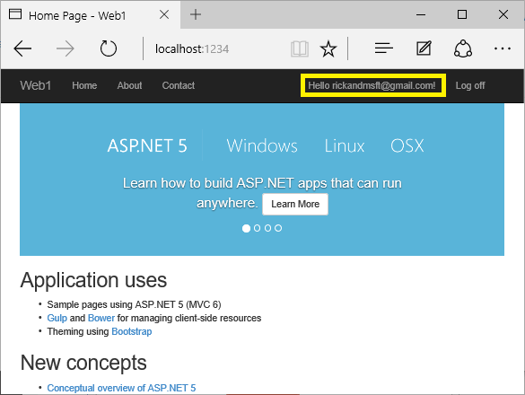
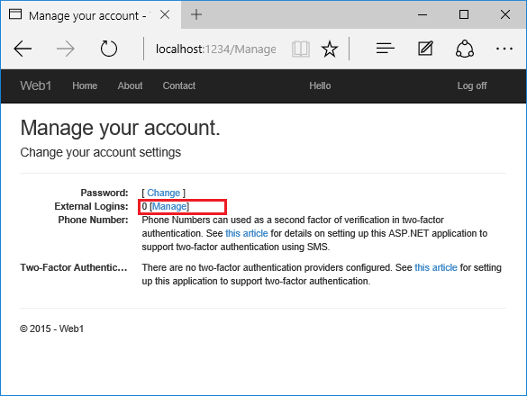
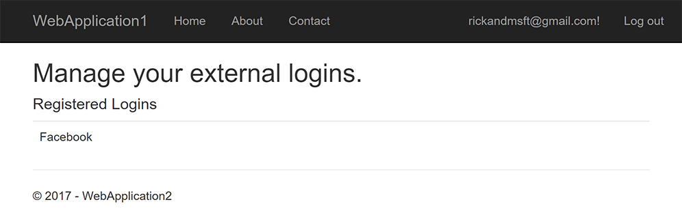

# Account confirmation and password recovery in ASP.NET Core

By [Rick Anderson](https://twitter.com/RickAndMSFT), [Ponant](https://github.com/Ponant), and [Joe Audette](https://twitter.com/joeaudette)

This tutorial shows how to build an ASP.NET Core app with email confirmation and password reset. This tutorial is **not** a beginning topic. You should be familiar with:

* [ASP.NET Core](xref:tutorials/razor-pages/razor-pages-start)
* [Authentication](xref:security/authentication/identity)
* [Entity Framework Core](xref:data/ef-mvc/intro)

<!-- see Dropbox/wrk/Code/SendGridConsole/Program.cs -->

:::moniker range=">= aspnetcore-6.0"

## Prerequisites

* [.NET Core 6.0 SDK or later](https://dotnet.microsoft.com/download/dotnet/6.0)
* Successfully [send email from a C# console app](https://www.twilio.com/blog/send-emails-using-the-sendgrid-api-with-dotnetnet-6-and-csharp).

## Create and test a web app with authentication

Run the following commands to create a web app with authentication.

```dotnetcli
dotnet new webapp -au Individual -o WebPWrecover
cd WebPWrecover
dotnet run
```

<a name="regsim"></a>

### Register user with simulated email confirmation

Run the app, select the **Register** link, and register a user. Once registered, you are redirected to the to `/Identity/Account/RegisterConfirmation` page which contains a link to simulate email confirmation:

* Select the `Click here to confirm your account` link.
* Select the **Login** link and sign-in with the same credentials.
* Select the `Hello YourEmail@provider.com!` link, which redirects to the `/Identity/Account/Manage/PersonalData` page.
* Select the **Personal data** tab on the left, and then select **Delete**.

The `Click here to confirm your account` link is displayed because an [IEmailSender](https://github.com/dotnet/aspnetcore/blob/1dcf7acfacf0fe154adcc23270cb0da11ff44ace/src/Identity/UI/src/Areas/Identity/Services/EmailSender.cs) has not been implemented and registered with the [dependency injection container](xref:fundamentals/dependency-injection). See the [`RegisterConfirmation` source](https://github.com/dotnet/aspnetcore/blob/main/src/Identity/UI/src/Areas/Identity/Pages/V4/Account/RegisterConfirmation.cshtml.cs#L71-L74).

[!INCLUDE[](~/includes/aspnetcore-repo-ref-source-links.md)]

### Configure an email provider

In this tutorial, [SendGrid](https://sendgrid.com) is used to send email. A SendGrid account and key is needed to send email. We recommend using SendGrid or another email service to send email rather than SMTP. SMTP is difficult to secure and set up correctly.

The SendGrid account may require [adding a Sender](https://sendgrid.com/docs/ui/sending-email/senders/).

Create a class to fetch the secure email key. For this sample, create `Services/AuthMessageSenderOptions.cs`:

[!code-csharp[](accconfirm/sample/WebPWrecover60/Services/AuthMessageSenderOptions.cs)]

#### Configure SendGrid user secrets

Set the `SendGridKey` with the [secret-manager tool](xref:security/app-secrets). For example:

```dotnetcli
dotnet user-secrets set SendGridKey <key>

Successfully saved SendGridKey to the secret store.
```

On Windows, Secret Manager stores keys/value pairs in a `secrets.json` file in the `%APPDATA%/Microsoft/UserSecrets/<WebAppName-userSecretsId>` directory.

The contents of the `secrets.json` file aren't encrypted. The following markup shows the `secrets.json` file. The `SendGridKey` value has been removed.

```json
{
  "SendGridKey": "<key removed>"
}
```

For more information, see the [Options pattern](xref:fundamentals/configuration/options) and [configuration](xref:fundamentals/configuration/index).

### Install SendGrid

This tutorial shows how to add email notifications through [SendGrid](https://sendgrid.com/), but other email providers can be used.

Install the `SendGrid` NuGet package:

# [Visual Studio](#tab/visual-studio)

From the Package Manager Console, enter the following command:

```powershell
Install-Package SendGrid
```

# [.NET Core CLI](#tab/netcore-cli)

From the console, enter the following command:

```dotnetcli
dotnet add package SendGrid
```

---

See [Get Started with SendGrid for Free](https://sendgrid.com/free/) to register for a free SendGrid account.

### Implement IEmailSender

To Implement `IEmailSender`, create `Services/EmailSender.cs` with code similar to the following:

[!code-csharp[](accconfirm/sample/WebPWrecover60/Services/EmailSender.cs)]

### Configure app to support email

Add the following code to the `Program.cs` file:

* Add `EmailSender` as a transient service.
* Register the `AuthMessageSenderOptions` configuration instance.

[!code-csharp[](accconfirm/sample/WebPWrecover60/Program.cs?name=snippet1&highlight=2,5,18-19)]

<!-- instructions when you scaffold RegisterConfirmation -->
[!INCLUDE[](~/includes/disableVer6.md)]

## Register, confirm email, and reset password

Run the web app, and test the account confirmation and password recovery flow.

* Run the app and register a new user
* Check your email for the account confirmation link. See [Debug email](#debug) if you don't get the email.
* Click the link to confirm your email.
* Sign in with your email and password.
* Sign out.

### Test password reset

* If you're signed in, select **Logout**.
* Select the **Log in** link and select the **Forgot your password?** link.
* Enter the email you used to register the account.
* An email with a link to reset your password is sent. Check your email and click the link to reset your password. After your password has been successfully reset, you can sign in with your email and new password.

<a name="resend"></a>

## Resend email confirmation

Select the **Resend email confirmation** link on the **Login** page.

### Change email and activity timeout

The default inactivity timeout is 14 days. The following code sets the inactivity timeout to 5 days:

[!code-csharp[](accconfirm/sample/WebPWrecover60/Program.cs?name=snippet_timeout&highlight=21-24)]

### Change all data protection token lifespans

The following code changes all data protection tokens timeout period to 3 hours:

[!code-csharp[](accconfirm/sample/WebPWrecover60/Program.cs?name=snippet_dpt&highlight=21-22)]

The built in Identity user tokens (see [AspNetCore/src/Identity/Extensions.Core/src/TokenOptions.cs](https://github.com/dotnet/AspNetCore/blob/v2.2.2/src/Identity/Extensions.Core/src/TokenOptions.cs) )have a [one day timeout](https://github.com/dotnet/AspNetCore/blob/v2.2.2/src/Identity/Core/src/DataProtectionTokenProviderOptions.cs).

### Change the email token lifespan

The default token lifespan of [the Identity user tokens](https://github.com/dotnet/AspNetCore/blob/v2.2.2/src/Identity/Extensions.Core/src/TokenOptions.cs) is [one day](https://github.com/dotnet/AspNetCore/blob/v2.2.2/src/Identity/Core/src/DataProtectionTokenProviderOptions.cs). This section shows how to change the email token lifespan.

Add a custom <xref:Microsoft.AspNetCore.Identity.DataProtectorTokenProvider%601> and <xref:Microsoft.AspNetCore.Identity.DataProtectionTokenProviderOptions>:

[!code-csharp[](accconfirm/sample/WebPWrecover60/TokenProviders/CustomTokenProvider.cs?name=snippet1)]

Add the custom provider to the service container:

[!code-csharp[](accconfirm/sample/WebPWrecover60/Program.cs?name=snippet_etl&highlight=18-24)]

<a name="debug"></a>

### Debug email

If you can't get email working:

* Set a breakpoint in `EmailSender.Execute` to verify `SendGridClient.SendEmailAsync` is called.
* Create a [console app to send email](https://sendgrid.com/docs/Integrate/Code_Examples/v2_Mail/csharp.html) using similar code to `EmailSender.Execute`.
* Review the [Email Activity](https://sendgrid.com/docs/User_Guide/email_activity.html) page.
* Check your spam folder.
* Try another email alias on a different email provider (Microsoft, Yahoo, Gmail, etc.)
* Try sending to different email accounts.

**A security best practice** is to **not** use production secrets in test and development. If you publish the app to Azure, set the SendGrid secrets as application settings in the Azure Web App portal. The configuration system is set up to read keys from environment variables.

## Combine social and local login accounts

To complete this section, you must first enable an external authentication provider. See [Facebook, Google, and external provider authentication](xref:security/authentication/social/index).

You can combine local and social accounts by clicking on your email link. In the following sequence, "RickAndMSFT@gmail.com" is first created as a local login; however, you can create the account as a social login first, then add a local login.



Click on the **Manage** link. Note the 0 external (social logins) associated with this account.



Click the link to another login service and accept the app requests. In the following image, Facebook is the external authentication provider:



The two accounts have been combined. You are able to sign in with either account. You might want your users to add local accounts in case their social login authentication service is down, or more likely they've lost access to their social account.

## Enable account confirmation after a site has users

Enabling account confirmation on a site with users locks out all the existing users. Existing users are locked out because their accounts aren't confirmed. To work around existing user lockout, use one of the following approaches:

* Update the database to mark all existing users as being confirmed.
* Confirm existing users. For example, batch-send emails with confirmation links.

:::moniker-end

:::moniker range="< aspnetcore-6.0"

## Prerequisites

[.NET Core 3.0 SDK or later](https://dotnet.microsoft.com/download/dotnet-core/3.0)

## Create and test a web app with authentication

Run the following commands to create a web app with authentication.

```dotnetcli
dotnet new webapp -au Individual -uld -o WebPWrecover
cd WebPWrecover
dotnet run
```

Run the app, select the **Register** link, and register a user. Once registered, you are redirected to the to `/Identity/Account/RegisterConfirmation` page which contains a link to simulate email confirmation:

* Select the `Click here to confirm your account` link.
* Select the **Login** link and sign-in with the same credentials.
* Select the `Hello YourEmail@provider.com!` link, which redirects you to the `/Identity/Account/Manage/PersonalData` page.
* Select the **Personal data** tab on the left, and then select **Delete**.

### Configure an email provider

In this tutorial, [SendGrid](https://sendgrid.com) is used to send email. You can use other email providers. We recommend you use SendGrid or another email service to send email. SMTP is difficult to configure so mail is not marked as spam.

The SendGrid account may require [adding a Sender](https://sendgrid.com/docs/ui/sending-email/senders/).

Create a class to fetch the secure email key. For this sample, create `Services/AuthMessageSenderOptions.cs`:

[!code-csharp[](accconfirm/sample/WebPWrecover60/Services/AuthMessageSenderOptions.cs)]

#### Configure SendGrid user secrets

Set the `SendGridKey` with the [secret-manager tool](xref:security/app-secrets). For example:

```dotnetcli
dotnet user-secrets set SendGridKey <SG.key>

Successfully saved SendGridKey = SG.keyVal to the secret store.
```

On Windows, Secret Manager stores keys/value pairs in a `secrets.json` file in the `%APPDATA%/Microsoft/UserSecrets/<WebAppName-userSecretsId>` directory.

The contents of the `secrets.json` file aren't encrypted. The following markup shows the `secrets.json` file. The `SendGridKey` value has been removed.

```json
{
  "SendGridKey": "<key removed>"
}
```

For more information, see the [Options pattern](xref:fundamentals/configuration/options) and [configuration](xref:fundamentals/configuration/index).

### Install SendGrid

This tutorial shows how to add email notifications through [SendGrid](https://sendgrid.com/), but you can send email using SMTP and other mechanisms.

Install the `SendGrid` NuGet package:

# [Visual Studio](#tab/visual-studio)

From the Package Manager Console, enter the following command:

```powershell
Install-Package SendGrid
```

# [.NET Core CLI](#tab/netcore-cli)

From the console, enter the following command:

```dotnetcli
dotnet add package SendGrid
```

---

See [Get Started with SendGrid for Free](https://sendgrid.com/free/) to register for a free SendGrid account.

### Implement IEmailSender

To Implement `IEmailSender`, create `Services/EmailSender.cs` with code similar to the following:

[!code-csharp[](accconfirm/sample/WebPWrecover60/Services/EmailSender.cs)]

### Configure startup to support email

Add the following code to the `ConfigureServices` method in the `Startup.cs` file:

* Add `EmailSender` as a transient service.
* Register the `AuthMessageSenderOptions` configuration instance.

[!code-csharp[](accconfirm/sample/WebPWrecover60/Program.cs?name=snippet1&highlight=2,5,19-20)]

## Scaffold RegisterConfirmation

Follow the instructions for [Scaffold Identity](xref:security/authentication/scaffold-identity) and scaffold `Account\RegisterConfirmation`.

<!-- .NET 5 fixes this, see
https://github.com/dotnet/aspnetcore/blob/main/src/Identity/UI/src/Areas/Identity/Pages/V4/Account/RegisterConfirmation.cshtml.cs#L74-L77
-->

[!INCLUDE[](~/includes/disableVer6.md)]

## Register, confirm email, and reset password

Run the web app, and test the account confirmation and password recovery flow.

* Run the app and register a new user
* Check your email for the account confirmation link. See [Debug email](#debug) if you don't get the email.
* Click the link to confirm your email.
* Sign in with your email and password.
* Sign out.

### Test password reset

* If you're signed in, select **Logout**.
* Select the **Log in** link and select the **Forgot your password?** link.
* Enter the email you used to register the account.
* An email with a link to reset your password is sent. Check your email and click the link to reset your password. After your password has been successfully reset, you can sign in with your email and new password.

<a name="resend"></a>

## Resend email confirmation

In ASP.NET Core 5.0 and later, select the **Resend email confirmation** link on the **Login** page.

### Change email and activity timeout

The default inactivity timeout is 14 days. The following code sets the inactivity timeout to 5 days:

[!code-csharp[](accconfirm/sample/WebPWrecover30/StartupAppCookie.cs?name=snippet1)]

### Change all data protection token lifespans

The following code changes all data protection tokens timeout period to 3 hours:

[!code-csharp[](accconfirm/sample/WebPWrecover30/StartupAllTokens.cs?name=snippet1&highlight=11-12)]

The built in Identity user tokens (see [AspNetCore/src/Identity/Extensions.Core/src/TokenOptions.cs](https://github.com/dotnet/AspNetCore/blob/v2.2.2/src/Identity/Extensions.Core/src/TokenOptions.cs) )have a [one day timeout](https://github.com/dotnet/AspNetCore/blob/v2.2.2/src/Identity/Core/src/DataProtectionTokenProviderOptions.cs).

### Change the email token lifespan

The default token lifespan of [the Identity user tokens](https://github.com/dotnet/AspNetCore/blob/v2.2.2/src/Identity/Extensions.Core/src/TokenOptions.cs) is [one day](https://github.com/dotnet/AspNetCore/blob/v2.2.2/src/Identity/Core/src/DataProtectionTokenProviderOptions.cs). This section shows how to change the email token lifespan.

Add a custom <xref:Microsoft.AspNetCore.Identity.DataProtectorTokenProvider%601> and <xref:Microsoft.AspNetCore.Identity.DataProtectionTokenProviderOptions>:

[!code-csharp[](accconfirm/sample/WebPWrecover30/TokenProviders/CustomTokenProvider.cs?name=snippet1)]

Add the custom provider to the service container:

[!code-csharp[](accconfirm/sample/WebPWrecover30/StartupEmail.cs?name=snippet1&highlight=10-16)]

<a name="debug"></a>

### Debug email

If you can't get email working:

* Set a breakpoint in `EmailSender.Execute` to verify `SendGridClient.SendEmailAsync` is called.
* Create a [console app to send email](https://sendgrid.com/docs/Integrate/Code_Examples/v2_Mail/csharp.html) using similar code to `EmailSender.Execute`.
* Review the [Email Activity](https://sendgrid.com/docs/User_Guide/email_activity.html) page.
* Check your spam folder.
* Try another email alias on a different email provider (Microsoft, Yahoo, Gmail, etc.)
* Try sending to different email accounts.

**A security best practice** is to **not** use production secrets in test and development. If you publish the app to Azure, set the SendGrid secrets as application settings in the Azure Web App portal. The configuration system is set up to read keys from environment variables.

## Combine social and local login accounts

To complete this section, you must first enable an external authentication provider. See [Facebook, Google, and external provider authentication](xref:security/authentication/social/index).

You can combine local and social accounts by clicking on your email link. In the following sequence, "RickAndMSFT@gmail.com" is first created as a local login; however, you can create the account as a social login first, then add a local login.


Click on the **Manage** link. Note the 0 external (social logins) associated with this account.


Click the link to another login service and accept the app requests. In the following image, Facebook is the external authentication provider:


The two accounts have been combined. You are able to sign in with either account. You might want your users to add local accounts in case their social login authentication service is down, or more likely they've lost access to their social account.

## Enable account confirmation after a site has users

Enabling account confirmation on a site with users locks out all the existing users. Existing users are locked out because their accounts aren't confirmed. To work around existing user lockout, use one of the following approaches:

* Update the database to mark all existing users as being confirmed.
* Confirm existing users. For example, batch-send emails with confirmation links.

:::moniker-end
