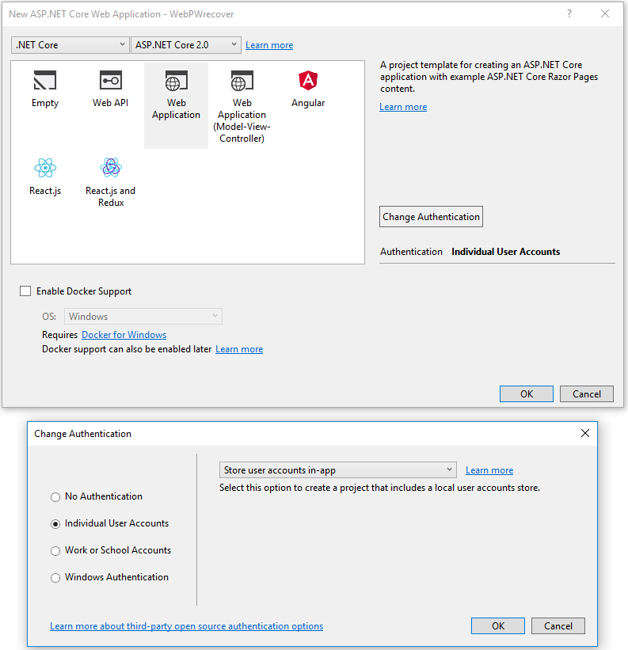
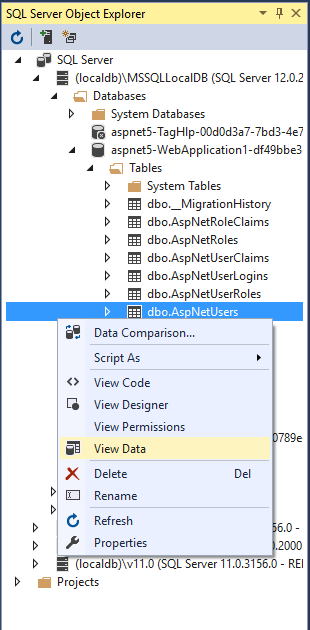
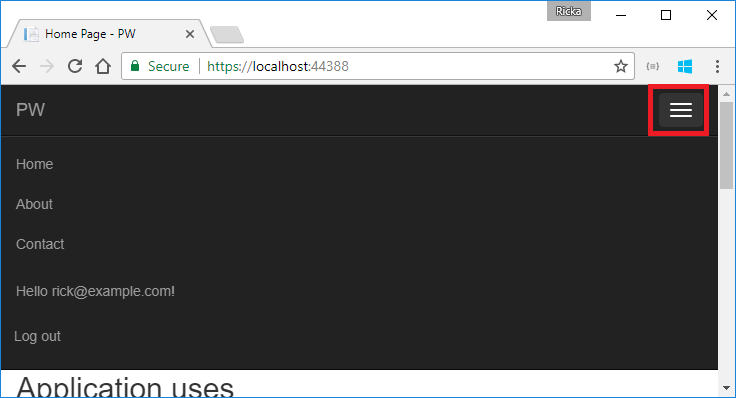
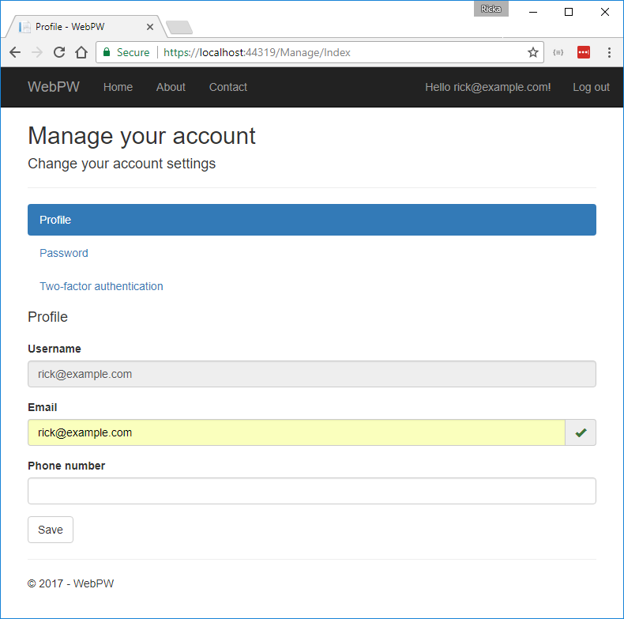

# Account confirmation and password recovery in ASP.NET Core

By [Rick Anderson](https://twitter.com/RickAndMSFT)

This tutorial shows you how to build an ASP.NET Core app with email confirmation and password reset.

## Create a New ASP.NET Core Project

# [ASP.NET Core 2.x](#tab/aspnetcore2x)

This step applies to Visual Studio on Windows. See the next section for CLI instructions.

The tutorial requires Visual Studio 2017 Preview 2 or later.

* In Visual Studio, create a New Web Application Project.
* Select **ASP.NET Core 2.0**. The following image show **.NET Core** selected, but you can select **.NET Framework**.
* Select **Change Authentication** and set to **Individual User Accounts**.
* Keep the default **Store user accounts in-app**.



# [ASP.NET Core 1.x](#tab/aspnetcore1x)

The tutorial requires Visual Studio 2017 or later.

* In Visual Studio, create a New Web Application Project.
* Select **Change Authentication** and set to **Individual User Accounts**.


---

### .NET Core CLI project creation for macOS and Linux

If you're using the CLI or SQLite, run the following in a command window:

```console
dotnet new mvc --auth Individual
```

* `--auth Individual` specifies the Individual User Accounts template.
* On Windows, add the `-uld` option. The `-uld` option creates a LocalDB connection string rather than a SQLite DB.
* Run `new mvc --help` to get help on this command.

## Test new user registration

Run the app, select the **Register** link, and register a user. Follow the instructions to run Entity Framework Core migrations. At this  point, the only validation on the email is with the [[EmailAddress]](https://docs.microsoft.com/dotnet/api/system.componentmodel.dataannotations.emailaddressattribute) attribute. After you submit the registration, you are logged into the app. Later in the tutorial, we'll change this so new users cannot log in until their email has been validated.

## View the Identity database

# [SQL Server](#tab/sql-server)

* From the **View** menu, select **SQL Server Object Explorer** (SSOX). 
* Navigate to **(localdb)MSSQLLocalDB(SQL Server 13)**. Right-click on **dbo.AspNetUsers** > **View Data**:



Note the `EmailConfirmed` field is `False`.

You might want to use this email again in the next step when the app sends a confirmation email. Right-click on the row and select **Delete**. Deleting the email alias now will make it easier in the following steps.

# [SQLite](#tab/sqlite)

See [Working with SQLite in an ASP.NET Core MVC project](xref:tutorials/first-mvc-app-xplat/working-with-sql) for instructions on how to view the SQLite DB. 

---

## Require SSL and setup IIS Express for SSL

See [Enforcing SSL](xref:security/enforcing-ssl).

<a name="prevent-login-at-registration"></a>
## Require email confirmation

It's a best practice to confirm the email of a new user registration to verify they are not impersonating someone else (that is, they haven't registered with someone else's email). Suppose you had a discussion forum, and you wanted to prevent "yli@example.com" from registering as "nolivetto@contoso.com." Without email confirmation, "nolivetto@contoso.com" could get unwanted email from your app. Suppose the user accidentally registered as "ylo@example.com" and hadn't noticed the misspelling of "yli," they wouldn't be able to use password recovery because the app doesn't have their correct email. Email confirmation provides only limited protection from bots and doesn't provide protection from determined spammers who have many working email aliases they can use to register.

You generally want to prevent new users from posting any data to your web site before they have a confirmed email. 

Update `ConfigureServices` to require a confirmed email:

# [ASP.NET Core 2.x](#tab/aspnetcore2x)

[!code-csharp[Main](accconfirm/sample/WebPW/Startup.cs?name=snippet1&highlight=6-9)]


# [ASP.NET Core 1.x](#tab/aspnetcore1x)

[!code-csharp[Main](accconfirm/sample/WebApp1/Startup.cs?name=snippet1&highlight=13-16)]

---

 
```csharp
config.SignIn.RequireConfirmedEmail = true;
```
The preceding line prevents registered users from being logged in until their email is confirmed. However, that line does not prevent new users from being logged in after they register. The default code logs in a user after they register. Once they log out, they won't be able to log in again until they register. Later in the tutorial we'll change the code so newly registered user are **not** logged in.

### Configure email provider

In this tutorial, SendGrid is used to send email. You need a SendGrid account and key to send email. You can use other email providers. ASP.NET Core 2.x includes `System.Net.Mail`, which allows you to send email from your app. We recommend you use SendGrid or another email service to send email.

The [Options pattern](xref:fundamentals/configuration#options-config-objects) is used to access the user account and key settings. For more information, see [configuration](xref:fundamentals/configuration#fundamentals-configuration).

Create a class to fetch the secure email key. For this sample, the `AuthMessageSenderOptions` class is created in the *Services/AuthMessageSenderOptions.cs* file.

[!code-csharp[Main](accconfirm/sample/WebApp1/Services/AuthMessageSenderOptions.cs?name=snippet1)]

Set the `SendGridUser` and `SendGridKey` with the [secret-manager tool](../app-secrets.md). For example:

```none
C:\WebAppl\src\WebApp1>dotnet user-secrets set SendGridUser RickAndMSFT
info: Successfully saved SendGridUser = RickAndMSFT to the secret store.
```

On Windows, Secret Manager stores your keys/value pairs in a *secrets.json* file in the %APPDATA%/Microsoft/UserSecrets/<WebAppName-userSecretsId> directory.

The contents of the *secrets.json* file are not encrypted. The *secrets.json* file is shown below (the `SendGridKey` value has been removed.)

  ```json
  {
    "SendGridUser": "RickAndMSFT",
    "SendGridKey": "<key removed>"
  }
  ```

### Configure startup to use AuthMessageSenderOptions

Add `AuthMessageSenderOptions` to the service container at the end of the `ConfigureServices` method in the *Startup.cs* file:

# [ASP.NET Core 2.x](#tab/aspnetcore2x)

[!code-csharp[Main](accconfirm/sample/WebPW/Startup.cs?name=snippet1&highlight=18)]

# [ASP.NET Core 1.x](#tab/aspnetcore1x)
[!code-csharp[Main](accconfirm/sample/WebApp1/Startup.cs?name=snippet1&highlight=26)]

---

### Configure the AuthMessageSender class

This tutorial shows how to add email notifications through [SendGrid](https://sendgrid.com/), but you can send email using SMTP and other mechanisms.

* Install the `SendGrid` NuGet package. From the Package Manager Console,  enter the following the following command:

  `Install-Package SendGrid`

* See [Get Started with SendGrid for Free](https://sendgrid.com/free/) to register for a free SendGrid account.

#### Configure SendGrid

# [ASP.NET Core 2.x](#tab/aspnetcore2x)

* Add code in *Services/EmailSender.cs* similar to the following to configure SendGrid:

[!code-csharp[Main](accconfirm/sample/WebPW/Services/EmailSender.cs)]


# [ASP.NET Core 1.x](#tab/aspnetcore1x)
* Add code in *Services/MessageServices.cs* similar to the following to configure SendGrid:

[!code-csharp[Main](accconfirm/sample/WebApp1/Services/MessageServices.cs)]

---

## Enable account confirmation and password recovery

The template has the code for account confirmation and password recovery. Find the `[HttpPost] Register` method in the  *AccountController.cs* file.

# [ASP.NET Core 2.x](#tab/aspnetcore2x)

Prevent newly registered users from being automatically logged on by commenting out the following line:

```csharp 
await _signInManager.SignInAsync(user, isPersistent: false);
```

The complete method is shown with the changed line highlighted:

[!code-csharp[Main](accconfirm/sample/WebPW/Controllers/AccountController.cs?highlight=19&name=snippet_Register)]

# [ASP.NET Core 1.x](#tab/aspnetcore1x)

Uncomment the code to enable account confirmation.

[!code-csharp[Main](accconfirm/sample/WebApp1/Controllers/AccountController.cs?highlight=16-25&name=snippet_Register)]

Note: We're also preventing a newly-registered user from being automatically logged on by commenting out the following line:

```csharp 
//await _signInManager.SignInAsync(user, isPersistent: false);
```

Enable password recovery by uncommenting the code in the `ForgotPassword` action in the *Controllers/AccountController.cs* file.

[!code-csharp[Main](accconfirm/sample/WebApp1/Controllers/AccountController.cs?highlight=17-23&name=snippet_ForgotPassword)]

Uncomment the form element in *Views/Account/ForgotPassword.cshtml*. You might want to remove the `<p> For more information on how to enable reset password ... </p>` element which contains a link to this article.

[!code-html[Main](accconfirm/sample/WebApp1/Views/Account/ForgotPassword.cshtml?highlight=7-10,12,28)]

---

## Register, confirm email, and reset password

Run the web app, and test the account confirmation and password recovery flow.

* Run the app and register a new user

 

* Check your email for the account confirmation link. See [Debug email](#debug) if you don't get the email.
* Click the link to confirm your email.
* Log in with your email and password.
* Log off.

### View the manage page

Select your user name in the browser:


You might need to expand the navbar to see user name.



# [ASP.NET Core 2.x](#tab/aspnetcore2x)

The manage page is displayed with the **Profile** tab selected. The **Email** shows a check box indicating the email has been confirmed. 




# [ASP.NET Core 1.x](#tab/aspnetcore1x)

We'll talk about this page later in the tutorial.


---

### Test password reset

* If you're logged in, select **Logout**.  
* Select the **Log in** link and select the **Forgot your password?** link.
* Enter the email you used to register the account.
* An email with a link to reset your password will be sent. Check your email and click the link to reset your password.  After your password has been successfully reset, you can login with your email and new password.

<a name="debug"></a>

### Debug email

If you can't get email working:

* Review the [Email Activity](https://sendgrid.com/docs/User_Guide/email_activity.html) page.
* Check your spam folder.
* Try another email alias on a different email provider (Microsoft, Yahoo, Gmail, etc.)
* Create a [console app to send email](https://sendgrid.com/docs/Integrate/Code_Examples/v2_Mail/csharp.html).
* Try sending to different email accounts.

**Note:** A security best practice is to not use production secrets in test and development. If you publish the app to Azure, you can set the SendGrid secrets as application settings in the Azure Web App portal. The configuration system is setup to read keys from environment variables.

## Prevent login at registration

With the current templates, once a user completes the registration form, they are logged in (authenticated). You generally want to confirm their email before logging them in. In the section below, we will modify the code to require new users have a confirmed email before they are logged in. Update the `[HttpPost] Login` action in the *AccountController.cs* file with the following highlighted changes.

[!code-csharp[Main](accconfirm/sample/WebApp1/Controllers/AccountController.cs?highlight=11-21&name=snippet_Login)]

**Note:** A security best practice is to not use production secrets in test and development. If you publish the app to Azure, you can set the SendGrid secrets as application settings in the Azure Web App portal. The configuration system is setup to read keys from environment variables.


## Combine social and local login accounts

Note: This section applies only to ASP.NET Core 1.x. For ASP.NET Core 2.x, see [this](https://github.com/aspnet/Docs/issues/3753) issue.

To complete this section, you must first enable an external authentication provider. See [Enabling authentication using Facebook, Google and other external providers](social/index.md).

You can combine local and social accounts by clicking on your email link. In the following sequence, "RickAndMSFT@gmail.com" is first created as a local login; however, you can create the account as a social login first, then add a local login.


Click on the **Manage** link. Note the 0 external (social logins) associated with this account.


Click the link to another login service and accept the app requests. In the image below, Facebook is the external authentication provider:


The two accounts have been combined. You will be able to log on with either account. You might want your users to add local accounts in case their social log in authentication service is down, or more likely they have lost access to their social account.
