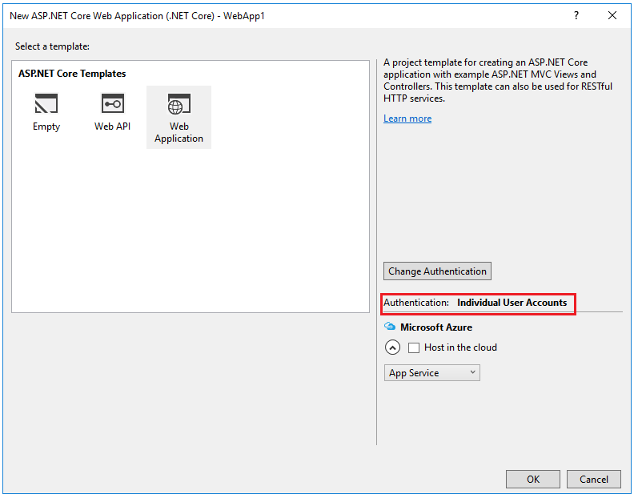
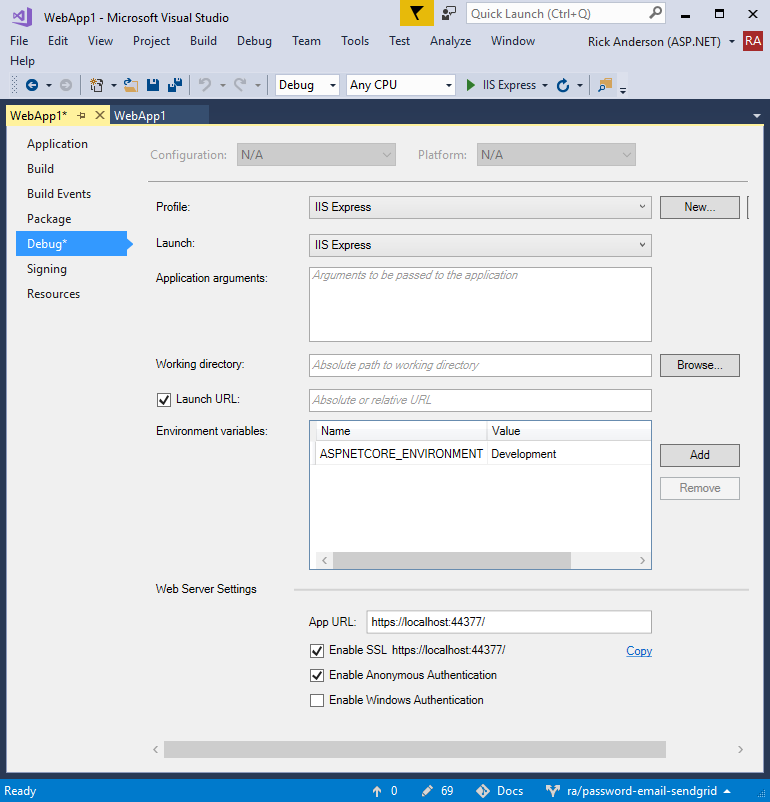

# Account Confirmation and Password Recovery

>[!WARNING]
> This page documents version 1.0.0-rc2 and has not yet been updated for version 1.0.0

<a name=security-authentication-account-confirmation></a>

By [Rick Anderson](https://twitter.com/RickAndMSFT)

This tutorial shows you how to build an ASP.NET Core app with email confirmation and password reset support.

## Create a New ASP.NET Core Project

> [!NOTE]
> The tutorial requires Visual Studio 2015 updated 2 and ASP.NET Core RC2 or higher.

* In Visual Studio, create a New Project (from the Start Page, or via **File > New > Project**)


* Tap **Web Application** and verify **Authentication** is set to **Individual User Accounts**



Run the app and then click on the **Register** link and register a user. At this  point, the only validation on the email is with the [[EmailAddress]](http://msdn.microsoft.com/en-us/library/system.componentmodel.dataannotations.emailaddressattribute(v=vs.110).aspx) attribute. After you submit the registration, you are logged into the app. Later in the tutorial we'll change this so new users cannot log in until their email has been validated.

In **SQL Server Object Explorer** (SSOX), navigate to **(localdb)MSSQLLocalDB(SQL Server 12)**. Right click on **dbo.AspNetUsers** > **View Data**:


Note the `EmailConfirmed` field is `False`.

Right-click on the row and from the context menu, select **Delete**. You might want to use this email again in the next step, when the app sends a confirmation email. Deleting the email alias now will make it easier in the following steps.

## Require SSL

In this section we'll set up our Visual Studio project to use SSL and our project to require SSL.

### Enable SSL in Visual Studio

   * In solution explorer, right click the project and select **Properties**

   * On the left pane, tap **Debug**

   * Check **Enable SSL**

   * Copy the SSL URL and paste it into the **App URL**



* Add the following code to `ConfigureServices` in `Startup`:

```csharp
services.Configure<MvcOptions>(options =>
{
    options.Filters.Add(new RequireHttpsAttribute ());
});
```
 `[services.Configure<MvcOptions>]` requires `[using Microsoft.AspNetCore.Mvc;]`.

Add the `[RequireHttps]` attribute to each controller. The `[RequireHttps]` attribute will redirect all HTTP GET requests to HTTPS GET and will reject all HTTP POSTs. A security best practice is to use HTTPS for all requests.

[!code-csharp[Main](accconfirm/sample/WebApplication3/src/WebApplication3/Controllers/HomeController.cs?range=9-10&highlight=1)]

## Require email confirmation

It's a best practice to confirm the email of a new user registration to verify they are not impersonating someone else (that is, they haven't registered with someone else's email). Suppose you had a discussion forum, you would want to prevent "yli@example.com" from registering as "nolivetto@contoso.com." Without email confirmation, "nolivetto@contoso.com" could get unwanted email from your app. Suppose the user accidentally registered as "ylo@example.com" and hadn't noticed the misspelling of "yli," they wouldn't be able to use password recovery because the app doesn't have their correct email. Email confirmation provides only limited protection from bots and doesn't provide protection from determined spammers who have many working email aliases they can use to register.

You generally want to prevent new users from posting any data to your web site before they have a confirmed email. In the sections below, we will enable email confirmation and modify the code to prevent newly registered users from logging in until their email has been confirmed.

Update `ConfigureServices` to require a confirmed email:

[!code-csharp[Main](accconfirm/sample/WebApplication3/src/WebApplication3/Startup.cs?highlight=11&name=snippet1)]

### Configure email provider

We'll use the [Options pattern](../../fundamentals/configuration.md#options-config-objects) to access the user account and key settings. For more information, see [configuration](../../fundamentals/configuration.md#fundamentals-configuration).

   * Create a class to fetch the secure email key. For this sample, the `AuthMessageSenderOptions` class is created in the *Services/AuthMessageSenderOptions.cs* file.

[!code-csharp[Main](accconfirm/sample/WebApplication3/src/WebApplication3/Services/AuthMessageSenderOptions.cs?range=8-12)]

Set the `SendGridUser` and `SendGridKey` with the [secret-manager tool](../app-secrets.md). For example:

```none
C:\WebApplication3\src\WebApplication3>dotnet user-secrets set SendGridUser RickAndMSFT
info: Successfully saved SendGridUser = RickAndMSFT to the secret store.
```

On Windows, Secret Manager stores your keys/value pairs in a *secrets.json* file in the %APPDATA%/Microsoft/UserSecrets/<**userSecretsId**> directory. The **userSecretsId** directory can be found in your *project.json* file. For this example, the first few lines of the *project.json* file are shown below:

[!code-json[Main](../../security/authentication/accconfirm/sample/WebApplication3/src/WebApplication3/project.json?highlight=3&range=1-6)]

At this time, the contents of the *secrets.json* file are not encrypted. The *secrets.json* file is shown below (the sensitive keys have been removed.)

```json
{
  "SendGridUser": "RickAndMSFT",
  "SendGridKey": "",
  "Authentication:Facebook:AppId": "",
  "Authentication:Facebook:AppSecret": ""
}
```

### Configure startup to use `AuthMessageSenderOptions`

Add the dependency `Microsoft.Extensions.Options.ConfigurationExtensions` in the project.json file.

Add `AuthMessageSenderOptions` to the service container at the end of the `ConfigureServices` method in the *Startup.cs* file:

[!code-csharp[Main](../../security/authentication/accconfirm/sample/WebApplication3/src/WebApplication3/Startup.cs?highlight=4&range=62-65)]

### Configure the `AuthMessageSender` class

This tutorial shows how to add email notification through [SendGrid](https://sendgrid.com/), but you can send email using SMTP and other mechanisms.

* Install the SendGrid.NetCore NuGet package. From the Package Manager Console,  enter the following the following command:

    `Install-Package SendGrid.NetCore -Pre`

>[!NOTE]
>SendGrid.NetCore package is a prerelease version , to install it is necessary to use -Pre option on Install-Package.

* Follow the instructions [Create a SendGrid account](https://azure.microsoft.com/en-us/documentation/articles/sendgrid-dotnet-how-to-send-email/#create-a-sendgrid-account) to register for a free SendGrid account.

* Add code in *Services/MessageServices.cs* similar to the following to configure SendGrid

[!code-csharp[Main](accconfirm/sample/WebApplication3/src/WebApplication3/Services/MessageServices.cs?range=13-53)]

## Enable account confirmation and password recovery

The template already has the code for account confirmation and password recovery. Follow these steps to enable it:

*  Find the `[HttpPost] Register` method in the  *AccountController.cs* file.

*  Uncomment the code to enable account confirmation.

[!code-csharp[Main](accconfirm/sample/WebApplication3/src/WebApplication3/Controllers/AccountController.cs?highlight=17-21&range=113-142)]

> [!NOTE]
> We're also preventing a newly registered user from being automatically logged on by commenting out the following line:
>
> ```csharp
> //await _signInManager.SignInAsync(user, isPersistent: false);
> ```

*  Enable password recovery by uncommenting the code in the `ForgotPassword` action in the *Controllers/AccountController.cs* file.

[!code-csharp[Main](accconfirm/sample/WebApplication3/src/WebApplication3/Controllers/AccountController.cs?highlight=17-21&range=272-297)]

Uncomment the highlighted `ForgotPassword` from in the *Views/Account/ForgotPassword.cshtml* view file.

[!code-html[Main](accconfirm/sample/WebApplication3/src/WebApplication3/Views/Account/ForgotPassword.cshtml?highlight=11,12,13,14,15,16,17,18,19,20,21,22,23,24,25,26,27)]

## Register, confirm email, and reset password

In this section, run the web app and show the account confirmation and password recovery flow.

* Run the application and register a new user


* Check your email for the account confirmation link. If you don't get the email notification:

  * Check the SendGrid web site to verify your sent mail messages.

  * Check your spam folder.

  * Try another email alias on a different email provider (Microsoft, Yahoo, Gmail, etc.)

  * In SSOX, navigate to **dbo.AspNetUsers** and delete the email entry and try again.

* Click the link to confirm your email.

* Log in with your email and password.

* Log off.

### Test password reset

* Login and select **Forgot your password?**

* Enter the email you used to register the account.

* An email with a link to reset your password will be sent. Check your email and click the link to reset your password.  After your password has been successfully reset, you can login with your email and new password.

## Require email confirmation before login

With the current templates, once a user completes the registration form, they are logged in (authenticated). You generally want to confirm their email before logging them in. In the section below, we will modify the code to require new users have a confirmed email before they are logged in. Update the `[HttpPost] Login` action in the *AccountController.cs* file with the following highlighted changes.

[!code-csharp[Main](accconfirm/sample/WebApplication3/src/WebApplication3/Controllers/AccountController.cs?highlight=11-20&range=51-96)]

> [!NOTE]
> A security best practice is to not use production secrets in test and development. If you publish the app to Azure, you can set the SendGrid secrets as application settings in the Azure Web App portal. The configuration system is setup to read keys from environment variables.

## Combine social and local login accounts

To complete this section, you must first enable an external authentication provider. See [Enabling authentication using Facebook, Google and other external providers](social/index.md).

You can combine local and social accounts by clicking on your email link. In the following sequence "RickAndMSFT@gmail.com" is first created as a local login, but you can create the account as a social login first, then add a local login.


Click on the **Manage** link. Note the 0 external (social logins) associated with this account.


Click the link to another login service and accept the app requests. In the image below, Facebook is the external authentication provider:


The two accounts have been combined. You will be able to log on with either account. You might want your users to add local accounts in case their social log in authentication service is down, or more likely they have lost access to their social account.
