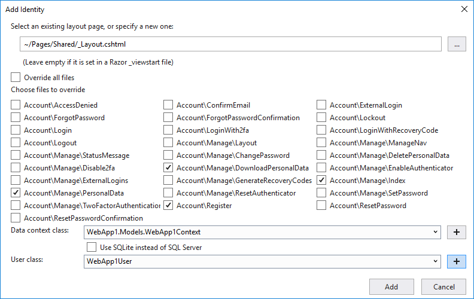

# Add, download, and delete custom user data to Identity in an ASP.NET Core project

https://docs.microsoft.com/en-us

By [Rick Anderson](https://twitter.com/RickAndMSFT)

This article shows how to:

* Add custom user data to an ASP.NET Core web app.
* Decorade the custom user data model with the [PersonalData](https://docs.microsoft.com/en-us/dotnet/api/microsoft.aspnetcore.identity.personaldataattribute?view=aspnetcore-2.1) attribute so it's automatically available for download and deletion. Making the data able to be downloaded and deleted helps meet [GDPR](xref:security/gdpr) requirements.

The project sample is created from a Razor Pages web app, but the instructions are similar for a ASP.NET Core MVC web app.

[View or download sample code](https://github.com/aspnet/Docs/tree/live/aspnetcore/security/authentication/add-user-data/sample) ([how to download](xref:tutorials/index#how-to-download-a-sample))

D:/GH/1/Docs/

## Prerequisites

[!INCLUDE [](~/includes/2.1-SDK.md)]

## Create a Razor web app

# [Visual Studio](#tab/visual-studio) 

* From the Visual Studio **File** menu, select **New** > **Project**. Name the project **WebApp1** if you want to match the namespace of the [download sample](https://github.com/aspnet/Docs/tree/live/aspnetcore/security/authentication/add-user-data/sample) code.
* Select **ASP.NET Core Web Application** > **OK**
* Select **ASP.NET Core 2.1** in the dropdown
* Select **Web Application**  > **OK**

# [.NET Core CLI](#tab/netcore-cli)

```cli
dotnet new webapp -o WebApp1
```

------

## Run the Identity scaffolder

# [Visual Studio](#tab/visual-studio) 

* From **Solution Explorer**, right-click on the project > **Add** > **New Scaffolded Item**.
* From the left pane of the **Add Scaffold** dialog, select **Identity** > **ADD**.
* In the **ADD Identity** dialog, the following options:
  * Select your existing layout  file  `~/Pages/Shared/_Layout.cshtml`
  * Select the following files to override:
    *
  * Select the **+** button to create a new **Data context class**. Accept the type (**WebApp1.Models.WebApp1Context** if you named the project **WebApp1**) > **Add**.
  * Select the **+** button to create a new **User class**. Accept the type (**WebApp1User** if you named the project **WebApp1**) > **Add**.
* Select **ADD**.



# [.NET Core CLI](#tab/netcore-cli)

If you have not previously installed the ASP.NET scaffolder, install it now:

```cli
dotnet tool install -g dotnet-aspnet-codegenerator
```

Add a package reference to [Microsoft.VisualStudio.Web.CodeGeneration.Design](https://www.nuget.org/packages/Microsoft.VisualStudio.Web.CodeGeneration.Design/) to the project (\*.csproj) file. Run the following command in the project directory:

```cli
dotnet add package Microsoft.VisualStudio.Web.CodeGeneration.Design --version 2.1.0
dotnet restore
```

Run the following command to list the Identity scaffolder options:

```cli
dotnet aspnet-codegenerator identity -h
```

In the project folder, run the Identity scaffolder with the options you want. For example, to setup identity with the default UI and the minimum number of files, run the following command:

```cli
dotnet aspnet-codegenerator identity --useDefaultUI
```

-------------

Follow the instruction in [Migrations, UseAuthentication, and layout](xref:security/authentication/scaffold-identity#efm) to perform the following steps:

* Create a migration and update the database.
* Add `UseAuthentication` to `Startup.Configure`.
* Add `<partial name="_LoginPartial" />` to the layout file.
* Run the app and register a user.