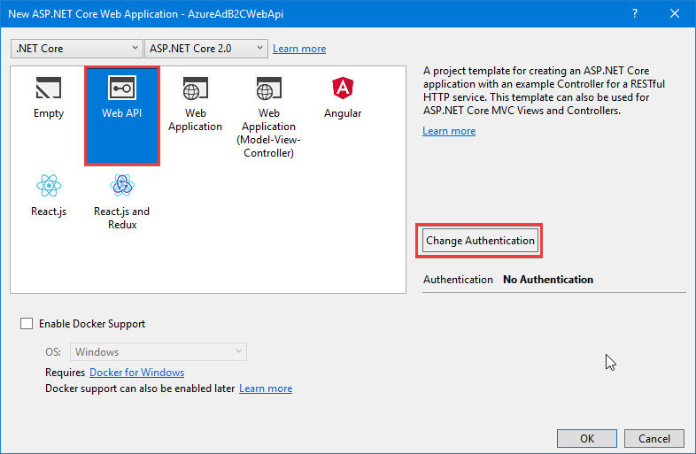
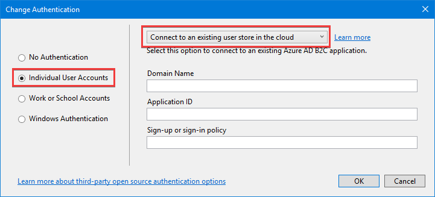
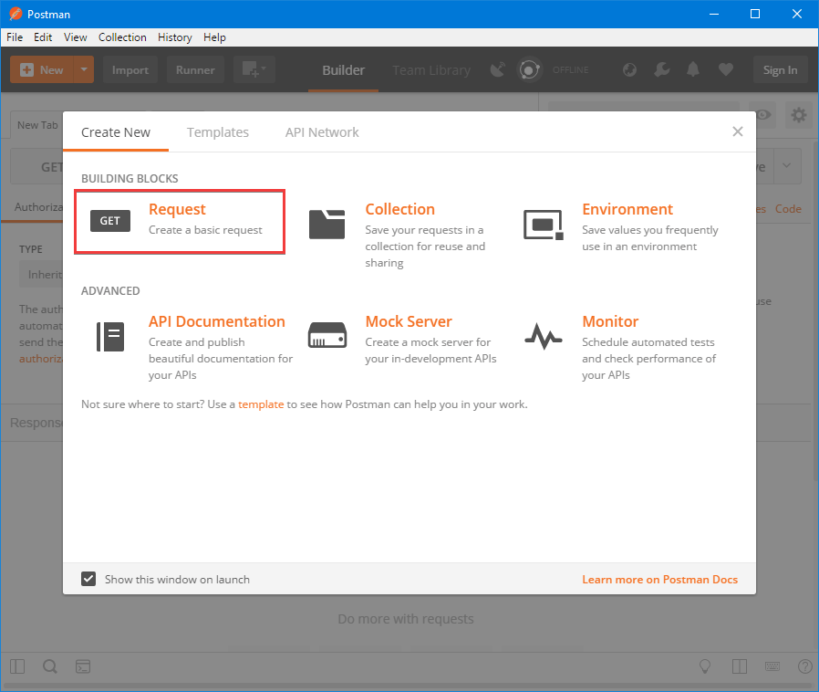
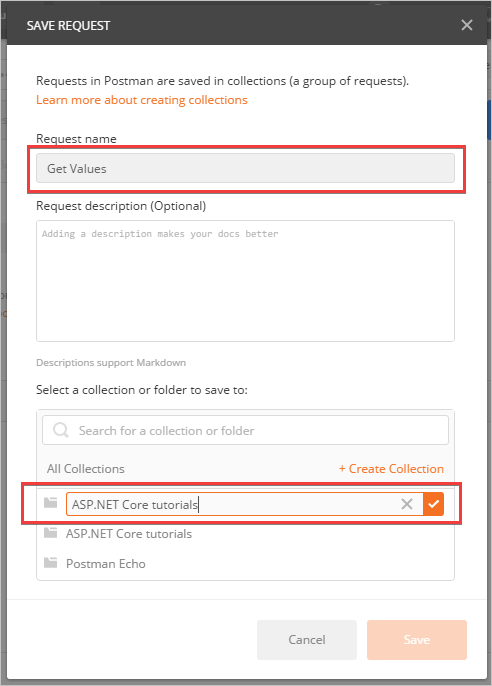
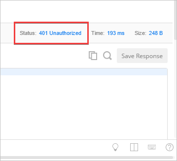
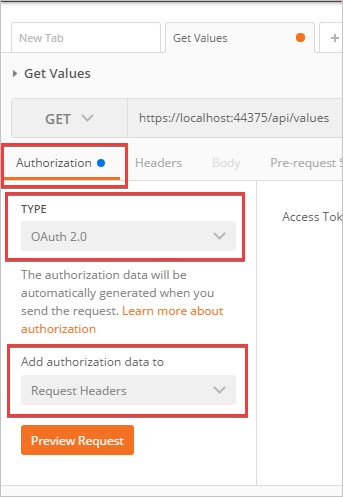
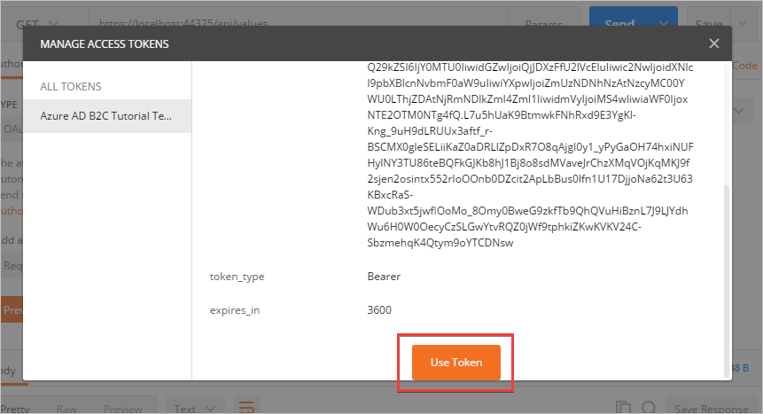
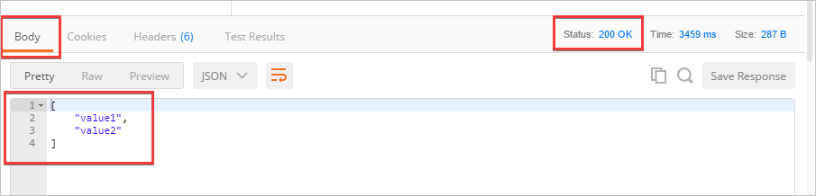

# Cloud authentication in web APIs with Azure Active Directory B2C

By [Cam Soper](https://twitter.com/camsoper)

[Azure Active Directory B2C](/azure/active-directory-b2c/active-directory-b2c-overview) (Azure AD B2C) is a cloud identity management solution for web and mobile apps. The service provides authentication for apps hosted in the cloud and on-premises. Authentication types include include individual accounts, social network accounts, and federated enterprise accounts. Additionally, Azure AD B2C can provide multi-factor authentication with minimal configuration.

> [!TIP]
> Azure Active Directory (Azure AD) Azure AD B2C are separate product offerings. An Azure AD tenant represents an organization, while an Azure AD B2C tenant represents a collection of identities to be used with relying party applications. To learn more, see [Azure AD B2C: Frequently asked questions (FAQ)](/azure/active-directory-b2c/active-directory-b2c-faqs).

Since web APIs have no user interface, they're unable to redirect the user to a secure token service like Azure AD B2C. Instead, the API is passed a bearer token from the calling app, which has already authenticated the user with Azure AD B2C. The API then validates the token without direct user interaction.

In this tutorial, learn how to:

> [!div class="checklist"]
> * Create an Azure Active Directory B2C tenant.
> * Register a Web API in Azure AD B2C.
> * Use Visual Studio to create a Web API configured to use the Azure AD B2C tenant for authentication.
> * Configure policies controlling the behavior of the Azure AD B2C tenant.
> * Use Postman to simulate a web app which presents a login dialog, retrieves a token, and uses it to make a request against the web API.

## Prerequisites

The following are required for this walkthrough:

* [Microsoft Azure subscription](https://azure.microsoft.com/free/?ref=microsoft.com&utm_source=microsoft.com&utm_medium=docs&utm_campaign=visualstudio)
* [Visual Studio 2017](https://aka.ms/vsdownload?utm_source=mscom&utm_campaign=msdocs) (any edition)
* [Postman](https://www.getpostman.com/postman)

## Create the Azure Active Directory B2C tenant

Create an Azure AD B2C tenant [as described in the documentation](/azure/active-directory-b2c/active-directory-b2c-get-started). When prompted, associating the tenant with an Azure subscription is optional for this tutorial.

## Configure a sign-up or sign-in policy

Use the steps in the Azure AD B2C documentation to [create a sign-up or sign-in policy](/azure/active-directory-b2c/active-directory-b2c-reference-policies#create-a-sign-up-or-sign-in-policy). Name the policy **SiUpIn**.  Use the example values provided in the documentation for **Identity providers**, **Sign-up attributes**, and **Application claims**. Using the **Run now** button to test the policy as described in the documentation is optional.

## Register the API in Azure AD B2C

In the newly created Azure AD B2C tenant, register your API using [the steps in the documentation](/azure/active-directory-b2c/active-directory-b2c-app-registration#register-a-web-api) under the **Register a web API** section.

Use the following values:

| Setting                       | Value               | Notes                                                                                  |
|-------------------------------|---------------------|----------------------------------------------------------------------------------------|
| **Name**                      | *&lt;API name&gt;*  | Enter a **Name** for the app that describes your app to consumers.                     |
| **Include web app / web API** | Yes                 |                                                                                        |
| **Allow implicit flow**       | Yes                 |                                                                                        |
| **Reply URL**                 | `https://localhost` | Reply URLs are endpoints where Azure AD B2C returns any tokens that your app requests. |
| **App ID URI**                | *api*               | The URI doesn't need to resolve to a physical address. It only needs to be unique.     |
| **Include native client**     | No                  |                                                                                        |

After the API is registered, the list of apps and APIs in the tenant is displayed. Select the API that was just registered. Select the **Copy** icon to the right of the **Application ID** field to copy it to the clipboard. Select **Published scopes** and verify the default *user_impersonation* scope is present.

## Create an ASP.NET Core app in Visual Studio 2017

The Visual Studio Web Application template can be configured to use the Azure AD B2C tenant for authentication.

In Visual Studio:

1. Create a new ASP.NET Core Web Application. 
2. Select **Web API** from the list of templates.
3. Select the **Change Authentication** button.
    
    

4. In the **Change Authentication** dialog, select **Individual User Accounts**, and then select **Connect to an existing user store in the cloud** in the dropdown. 
    
    

5. Complete the form with the following values:
    
    | Setting                       | Value                                                 |
    |-------------------------------|-------------------------------------------------------|
    | **Domain Name**               | *&lt;the domain name of your B2C tenant&gt;*          |
    | **Application ID**            | *&lt;paste the Application ID from the clipboard&gt;* |
    | **Sign-up or sign-in policy** | `B2C_1_SiUpIn`                                        |
    
    Select **OK** to close the **Change Authentication** dialog. Select **OK** to create the web app.

Visual Studio creates the web API with a controller named *ValuesController.cs* that returns hard-coded values for GET requests. The class is decorated with the [Authorize attribute](xref:security/authorization/simple), so all requests require authentication.

## Run the web API

In Visual Studio, run the API. Visual Studio launches a browser pointed at the API's root URL. Note the URL in the address bar, and leave the API running in the background.

> [!NOTE] Since there is no controller defined for the root URL, the browser displays a 404 (page not found) error. This is expected behavior.

## Use Postman to get a token and test the API

[Postman](https://getpostman.com/postman) is a tool for testing web APIs. For this tutorial, Postman simulates a web app that accesses the web API on the user's behalf.

### Register Postman as a web app

Since Postman simulates a web app that can obtain tokens from the Azure AD B2C tenant, it must be registered in the tenant as a web app. Register Postman using [the steps in the documentation](/azure/active-directory-b2c/active-directory-b2c-app-registration#register-a-web-app) under the **Register a web app** section. Stop at the **Create a web app client secret** section. A client secret isn't required for this tutorial. 

Use the following values:

| Setting                       | Value                            | Notes                           |
|-------------------------------|----------------------------------|---------------------------------|
| **Name**                      | Postman                          |                                 |
| **Include web app / web API** | Yes                              |                                 |
| **Allow implicit flow**       | Yes                              |                                 |
| **Reply URL**                 | `https://getpostman.com/postman` |                                 |
| **App ID URI**                | *&lt;leave blank&gt;*            | Not required for this tutorial. |
| **Include native client**     | No                               |                                 |

The newly registered web app needs permission to access the web API on the user's behalf.  

1. Select **Postman** in the list of apps and then select **API access** from the menu on the left.
2. Select **+ Add**.
3. In the **Select API** dropdown, select the name of the web API.
4. In the **Select Scopes** dropdown, ensure all scopes are selected.
5. Select **Ok**.

Note the Postman app's Application ID, as it's required to obtain a bearer token.

### Create a Postman request

Launch Postman. By default, Postman displays the **Create New** dialog upon launching. If the dialog isn't displayed, select the **+ New** button in the upper left.

From the **Create New** dialog:

1. Select **Request**.
    
    

2. Enter *Get Values* in the **Request name** box.
3. Select **+ Create Collection** to create a new collection for storing the request. Name the collection *ASP.NET Core tutorials* and then select the checkmark.
    
    

4. Select the **Save to ASP.NET Core tutorials** button.

### Test the web API withoutauthentication

To verify that the web API requires authentication, first make a request without authentication.

1. In the **Enter request URL** box, enter the URL for `ValuesController`. The URL is the same as displayed in the browser with **api/values** appended. An example would be `https://localhost:44375/api/values`.
2. Select the **Send** button.
3. Note the status of the response is *401 Unauthorized*.

    

### Obtain a bearer token

To make an authenticated request to the web API, a bearer token is required. Postman makes it easy to sign in to the Azure AD B2C tenant and obtain a token.

1. On the **Authorization** tab, in the **TYPE** dropdown, select **OAuth 2.0**. In the **Add authorization data to** dropdown, select **Request Headers**. Select **Get New Access Token**.
    
    

2. Complete the **GET NEW ACCESS TOKEN** dialog as follows:
    
    | Setting                   | Value                                                                                         | Notes                                                                                      |
    |---------------------------|-----------------------------------------------------------------------------------------------|--------------------------------------------------------------------------------------------|
    | **Token Name**            | *&lt;token name&gt;*                                                                          | Enter a descriptive name for the token.                                                    |
    | **Grant Type**            | Implicit                                                                                      |                                                                                            |
    | **Callback URL**          | `https://getpostman.com/postman`                                                              |                                                                                            |
    | **Auth URL**              | `https://login.microsoftonline.com/<tenant domain name>/oauth2/v2.0/authorize?p=B2C_1_SiUpIn` | Replace *&lt;tenant domain name&gt;* with the tenant's domain name without angle brackets. |
    | **Client ID**             | *&lt;enter the Postman app's <b>Application ID</b>&gt;*                                       |                                                                                            |
    | **Client Secret**         | *&lt;leave blank&gt;*                                                                         |                                                                                            |
    | **Scope**                 | `https://<tenant domain name>/api/user_impersonation openid offline_access`                   | Replace *&lt;tenant domain name&gt;* with the tenant's domain name without angle brackets. |
    | **Client Authentication** | Send client credentials in body                                                               |                                                                                            |
    
3. Select the **Request Token** button.

4. Postman opens a new window containing the Azure AD B2C tenant's sign in dialog. Sign in with an existing account (if one was created testing the policies) or select **Sign up now** to create a new account. The **Forgot your password?** link is used to reset a forgotten password.

5. After successfully signing in, the window closes and the **MANAGE ACCESS TOKENS** dialog appears. Scroll down to the bottom and select the **Use Token** button.
    
    

### Test the web API with authentication

Select the **Send** button to send the request again. This time, the response status is *200 OK* and the JSON payload is visible on the response **Body** tab.
    

## Next steps

In this tutorial, you learned how to:

> [!div class="checklist"]
> * Create an Azure Active Directory B2C tenant.
> * Register a Web API in Azure AD B2C.
> * Use Visual Studio to create a Web API configured to use the Azure AD B2C tenant for authentication.
> * Configure policies controlling the behavior of the Azure AD B2C tenant.
> * Use Postman to simulate a web app which presents a login dialog, retrieves a token, and uses it to make a request against the web API.

Continue developing your API by learning to:

* [Secure an ASP.NET Core web app using Azure AD B2C](xref:security/authentication/azure-ad-b2c).
* [Call a .NET web API from a .NET web app using Azure AD B2C](/azure/active-directory-b2c/active-directory-b2c-devquickstarts-web-api-dotnet).
* [Customize the Azure AD B2C user interface](/azure/active-directory-b2c/active-directory-b2c-reference-ui-customization).
* [Configure password complexity requirements](/azure/active-directory-b2c/active-directory-b2c-reference-password-complexity).
* [Enable multi-factor authentication](/azure/active-directory-b2c/active-directory-b2c-reference-mfa).
* Configure additional identity providers, such as [Microsoft](/azure/active-directory-b2c/active-directory-b2c-setup-msa-app), [Facebook](/azure/active-directory-b2c/active-directory-b2c-setup-fb-app), [Google](/azure/active-directory-b2c/active-directory-b2c-setup-goog-app), [Amazon](/azure/active-directory-b2c/active-directory-b2c-setup-amzn-app), [Twitter](/azure/active-directory-b2c/active-directory-b2c-setup-twitter-app), and others.
* [Use the Azure AD Graph API](/azure/active-directory-b2c/active-directory-b2c-devquickstarts-graph-dotnet) to retrieve additional user information, such as group membership, from the Azure AD B2C tenant.