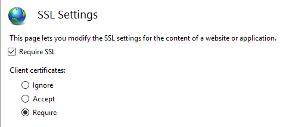

# Configure certificate authentication in ASP.NET Core

`Microsoft.AspNetCore.Authentication.Certificate` contains an implementation similar to [Certificate Authentication](https://tools.ietf.org/html/rfc5246#section-7.4.4) for ASP.NET Core. Certificate authentication happens at the TLS level, long before it ever gets to ASP.NET Core. More accurately, this is an authentication handler that validates the certificate and then gives you an event where you can resolve that certificate to a `ClaimsPrincipal`. 

[Configure your host](#configure-your-host-to-require-certificates) for certificate authentication, be it IIS, Kestrel, Azure Web Apps, or whatever else you're using.

## Proxy and load balancer scenarios

Certificate authentication is a stateful scenario primarily used where a proxy or load balancer doesn't handle traffic between clients and servers. If a proxy or load balancer is used, certificate authentication only works if the proxy or load balancer:

* Handles the authentication.
* Passes the user authentication information to the app (for example, in a request header), which acts on the authentication information.

An alternative to certificate authentication in environments where proxies and load balancers are used is Active Directory Federated Services (ADFS) with OpenID Connect (OIDC).

## Get started

Acquire an HTTPS certificate, apply it, and [configure your host](#configure-your-host-to-require-certificates) to require certificates.

In your web app, add a reference to the `Microsoft.AspNetCore.Authentication.Certificate` package. Then in the `Startup.ConfigureServices` method, call
`services.AddAuthentication(CertificateAuthenticationDefaults.AuthenticationScheme).AddCertificate(...);` with your options, providing a delegate for `OnCertificateValidated` to do any supplementary validation on the client certificate sent with requests. Turn that information into a `ClaimsPrincipal` and set it on the `context.Principal` property.

If authentication fails, this handler returns a `403 (Forbidden)` response rather a `401 (Unauthorized)`, as you might expect. The reasoning is that the authentication should happen during the initial TLS connection. By the time it reaches the handler, it's too late. There's no way to upgrade the connection from an anonymous connection to one with a certificate.

Also add `app.UseAuthentication();` in the `Startup.Configure` method. Otherwise, the `HttpContext.User` will not be set to `ClaimsPrincipal` created from the certificate. For example:

```csharp
public void ConfigureServices(IServiceCollection services)
{
    services.AddAuthentication(
        CertificateAuthenticationDefaults.AuthenticationScheme)
        .AddCertificate();
    // All the other service configuration.
}

public void Configure(IApplicationBuilder app, IHostingEnvironment env)
{
    app.UseAuthentication();

    // All the other app configuration.
}
```

The preceding example demonstrates the default way to add certificate authentication. The handler constructs a user principal using the common certificate properties.

## Configure certificate validation

The `CertificateAuthenticationOptions` handler has some built-in validations that are the minimum validations you should perform on a certificate. Each of these settings is enabled by default.

### AllowedCertificateTypes = Chained, SelfSigned, or All (Chained | SelfSigned)

Default value: `CertificateTypes.Chained`

This check validates that only the appropriate certificate type is allowed. If the app is using self-signed certificates, this option needs to be set to `CertificateTypes.All` or `CertificateTypes.SelfSigned`.

### ValidateCertificateUse

Default value: `true`

This check validates that the certificate presented by the client has the Client Authentication extended key use (EKU), or no EKUs at all. As the specifications say, if no EKU is specified, then all EKUs are deemed valid.

### ValidateValidityPeriod

Default value: `true`

This check validates that the certificate is within its validity period. On each request, the handler ensures that a certificate that was valid when it was presented hasn't expired during its current session.

### RevocationFlag

Default value: `X509RevocationFlag.ExcludeRoot`

A flag that specifies which certificates in the chain are checked for revocation.

Revocation checks are only performed when the certificate is chained to a root certificate.

### RevocationMode

Default value: `X509RevocationMode.Online`

A flag that specifies how revocation checks are performed.

Specifying an online check can result in a long delay while the certificate authority is contacted.

Revocation checks are only performed when the certificate is chained to a root certificate.

### Can I configure my app to require a certificate only on certain paths?

This isn't possible. Remember the certificate exchange is done that the start of the HTTPS conversation, it's done by the server before the first request is received on that connection so it's not possible to scope based on any request fields.

## Handler events

The handler has two events:

* `OnAuthenticationFailed`: Called if an exception happens during authentication and allows you to react.
* `OnCertificateValidated`: Called after the certificate has been validated, passed validation and a default principal has been created. This event allows you to perform your own validation and augment or replace the principal. For examples include:
  * Determining if the certificate is known to your services.
  * Constructing your own principal. Consider the following example in `Startup.ConfigureServices`:

```csharp
services.AddAuthentication(
    CertificateAuthenticationDefaults.AuthenticationScheme)
    .AddCertificate(options =>
    {
        options.Events = new CertificateAuthenticationEvents
        {
            OnCertificateValidated = context =>
            {
                var claims = new[]
                {
                    new Claim(
                        ClaimTypes.NameIdentifier, 
                        context.ClientCertificate.Subject,
                        ClaimValueTypes.String, 
                        context.Options.ClaimsIssuer),
                    new Claim(ClaimTypes.Name,
                        context.ClientCertificate.Subject,
                        ClaimValueTypes.String, 
                        context.Options.ClaimsIssuer)
                };

                context.Principal = new ClaimsPrincipal(
                    new ClaimsIdentity(claims, context.Scheme.Name));
                context.Success();

                return Task.CompletedTask;
            }
        };
    });
```

If you find the inbound certificate doesn't meet your extra validation, call `context.Fail("failure reason")` with a failure reason.

For real functionality, you'll probably want to call a service registered in dependency injection that connects to a database or other type of user store. Access your service by using the context passed into your delegate. Consider the following example in `Startup.ConfigureServices`:

```csharp
services.AddAuthentication(
    CertificateAuthenticationDefaults.AuthenticationScheme)
    .AddCertificate(options =>
    {
        options.Events = new CertificateAuthenticationEvents
        {
            OnCertificateValidated = context =>
            {
                var validationService =
                    context.HttpContext.RequestServices
                        .GetService<ICertificateValidationService>();
                
                if (validationService.ValidateCertificate(
                    context.ClientCertificate))
                {
                    var claims = new[]
                    {
                        new Claim(
                            ClaimTypes.NameIdentifier, 
                            context.ClientCertificate.Subject, 
                            ClaimValueTypes.String, 
                            context.Options.ClaimsIssuer),
                        new Claim(
                            ClaimTypes.Name, 
                            context.ClientCertificate.Subject, 
                            ClaimValueTypes.String, 
                            context.Options.ClaimsIssuer)
                    };

                    context.Principal = new ClaimsPrincipal(
                        new ClaimsIdentity(claims, context.Scheme.Name));
                    context.Success();
                }                     

                return Task.CompletedTask;
            }
        };
    });
```

Conceptually, the validation of the certificate is an authorization concern. Adding a check on, for example, an issuer or thumbprint in an authorization policy, rather than inside `OnCertificateValidated`, is perfectly acceptable.

## Configure your host to require certificates

### Kestrel

In *Program.cs*, configure Kestrel as follows:

```csharp
public static void Main(string[] args)
{
    CreateHostBuilder(args).Build().Run();
}

public static IHostBuilder CreateHostBuilder(string[] args)
{
    return Host.CreateDefaultBuilder(args)
        .ConfigureWebHostDefaults(webBuilder =>
        {
            webBuilder.UseStartup<Startup>();
            webBuilder.ConfigureKestrel(o =>
            {
                o.ConfigureHttpsDefaults(o => 
		    o.ClientCertificateMode = 
		        ClientCertificateMode.RequireCertificate);
            });
        });
}
```

> [!NOTE]
> Endpoints created by calling <xref:Microsoft.AspNetCore.Server.Kestrel.Core.KestrelServerOptions.Listen*> **before** calling <xref:Microsoft.AspNetCore.Server.Kestrel.Core.KestrelServerOptions.ConfigureHttpsDefaults*> won't have the defaults applied.

### IIS

Complete the following steps in IIS Manager:

1. Select your site from the **Connections** tab.
1. Double-click the **SSL Settings** option in the **Features View** window.
1. Check the **Require SSL** checkbox, and select the **Require** radio button in the **Client certificates** section.



### Azure and custom web proxies

See the [host and deploy documentation](xref:host-and-deploy/proxy-load-balancer#certificate-forwarding) for how to configure the certificate forwarding middleware.

### Use certificate authentication in Azure Web Apps

No forwarding configuration is required for Azure. This is already setup in the certificate forwarding middleware.

> [!NOTE]
> This requires that the CertificateForwardingMiddleware is present.

### Use certificate authentication in custom web proxies

The `AddCertificateForwarding` method is used to specify:

* The client header name.
* How the certificate is to be loaded (using the `HeaderConverter` property).

In custom web proxies, the certificate is passed as a custom request header, for example `X-SSL-CERT`. To use it, configure certificate forwarding in `Startup.ConfigureServices`:

```csharp
public void ConfigureServices(IServiceCollection services)
{
    services.AddCertificateForwarding(options =>
    {
        options.CertificateHeader = "X-SSL-CERT";
        options.HeaderConverter = (headerValue) =>
        {
            X509Certificate2 clientCertificate = null;
	    
            if(!string.IsNullOrWhiteSpace(headerValue))
            {
                byte[] bytes = StringToByteArray(headerValue);
                clientCertificate = new X509Certificate2(bytes);
            }

            return clientCertificate;
        };
    });
}

private static byte[] StringToByteArray(string hex)
{
    int NumberChars = hex.Length;
    byte[] bytes = new byte[NumberChars / 2];

    for (int i = 0; i < NumberChars; i += 2)
    {
        bytes[i / 2] = Convert.ToByte(hex.Substring(i, 2), 16);
    }

    return bytes;
}
```

The `Startup.Configure` method then adds the middleware. `UseCertificateForwarding` is called before the calls to `UseAuthentication` and `UseAuthorization`:

```csharp
public void Configure(IApplicationBuilder app, IWebHostEnvironment env)
{
    ...

    app.UseRouting();

    app.UseCertificateForwarding();
    app.UseAuthentication();
    app.UseAuthorization();

    app.UseEndpoints(endpoints =>
    {
        endpoints.MapControllers();
    });
}
```

A separate class can be used to implement validation logic. Because the same self-signed certificate is used in this example, ensure that only your certificate can be used. Validate that the thumbprints of both the client certificate and the server certificate match, otherwise any certificate can be used and will be enough to authenticate. This would be used inside the `AddCertificate` method. You could also validate the subject or the issuer here if you're using intermediate or child certificates.

```csharp
using System.IO;
using System.Security.Cryptography.X509Certificates;

namespace AspNetCoreCertificateAuthApi
{
    public class MyCertificateValidationService
    {
        public bool ValidateCertificate(X509Certificate2 clientCertificate)
        {
            // Do not hardcode passwords in production code
            // Use thumbprint or key vault
            var cert = new X509Certificate2(
                Path.Combine("sts_dev_cert.pfx"), "1234");

            if (clientCertificate.Thumbprint == cert.Thumbprint)
            {
                return true;
            }

            return false;
        }
    }
}
```

#### Implement an HttpClient using a certificate and the HttpClientHandler

The HttpClientHandler could be added directly in the constructor of the HttpClient class. Care should be taken when creating instances of the HttpClient. The HttpClient will then send the certificate with each request.

```csharp
private async Task<JsonDocument> GetApiDataUsingHttpClientHandler()
{
    var cert = new X509Certificate2(Path.Combine(_environment.ContentRootPath, "sts_dev_cert.pfx"), "1234");
    var handler = new HttpClientHandler();
    handler.ClientCertificates.Add(cert);
    var client = new HttpClient(handler);
     
    var request = new HttpRequestMessage()
    {
        RequestUri = new Uri("https://localhost:44379/api/values"),
        Method = HttpMethod.Get,
    };
    var response = await client.SendAsync(request);
    if (response.IsSuccessStatusCode)
    {
        var responseContent = await response.Content.ReadAsStringAsync();
        var data = JsonDocument.Parse(responseContent);
        return data;
    }
 
    throw new ApplicationException($"Status code: {response.StatusCode}, Error: {response.ReasonPhrase}");
}
```

#### Implement an HttpClient using a certificate and a named HttpClient from IHttpClientFactory 

In the following example, a client certificate is added to a HttpClientHandler using the ClientCertificates property from the handler. This handler can then be used in a named instance of a HttpClient using the ConfigurePrimaryHttpMessageHandler method. This is setup in the Startup class in the
ConfigureServices method.

```csharp
var clientCertificate = 
    new X509Certificate2(
      Path.Combine(_environment.ContentRootPath, "sts_dev_cert.pfx"), "1234");
 
var handler = new HttpClientHandler();
handler.ClientCertificates.Add(clientCertificate);
 
services.AddHttpClient("namedClient", c =>
{
}).ConfigurePrimaryHttpMessageHandler(() => handler);
```

The IHttpClientFactory can then be used to get the named instance with the handler and the certificate. The CreateClient method with the name of the client defined in the Startup class is used to get the instance. The HTTP request can be sent using the client as required.

```csharp
private readonly IHttpClientFactory _clientFactory;
 
public ApiService(IHttpClientFactory clientFactory)
{
    _clientFactory = clientFactory;
}
 
private async Task<JsonDocument> GetApiDataWithNamedClient()
{
    var client = _clientFactory.CreateClient("namedClient");
 
    var request = new HttpRequestMessage()
    {
        RequestUri = new Uri("https://localhost:44379/api/values"),
        Method = HttpMethod.Get,
    };
    var response = await client.SendAsync(request);
    if (response.IsSuccessStatusCode)
    {
        var responseContent = await response.Content.ReadAsStringAsync();
        var data = JsonDocument.Parse(responseContent);
        return data;
    }
 
    throw new ApplicationException($"Status code: {response.StatusCode}, Error: {response.ReasonPhrase}");
}
```

If the correct certificate is sent to the server, the data is returned. If no certificate or the wrong certificate is sent, an HTTP 403 status code is returned.

### Create certificates in PowerShell

Creating the certificates is the hardest part in setting up this flow. A root certificate can be created using the `New-SelfSignedCertificate` PowerShell cmdlet. When creating the certificate, use a strong password. It's important to add the `KeyUsageProperty` parameter and the `KeyUsage` parameter as shown.

#### Create root CA

```powershell
New-SelfSignedCertificate -DnsName "root_ca_dev_damienbod.com", "root_ca_dev_damienbod.com" -CertStoreLocation "cert:\LocalMachine\My" -NotAfter (Get-Date).AddYears(20) -FriendlyName "root_ca_dev_damienbod.com" -KeyUsageProperty All -KeyUsage CertSign, CRLSign, DigitalSignature

$mypwd = ConvertTo-SecureString -String "1234" -Force -AsPlainText

Get-ChildItem -Path cert:\localMachine\my\"The thumbprint..." | Export-PfxCertificate -FilePath C:\git\root_ca_dev_damienbod.pfx -Password $mypwd

Export-Certificate -Cert cert:\localMachine\my\"The thumbprint..." -FilePath root_ca_dev_damienbod.crt
```

> [!NOTE]
> The `-DnsName` parameter value must match the deployment target of the app. For example, "localhost" for development.

#### Install in the trusted root

The root certificate needs to be trusted on your host system. A root certificate which was not created by a certificate authority won't be trusted by default. The following link explains how this can be accomplished on Windows:

https://social.msdn.microsoft.com/Forums/SqlServer/5ed119ef-1704-4be4-8a4f-ef11de7c8f34/a-certificate-chain-processed-but-terminated-in-a-root-certificate-which-is-not-trusted-by-the

#### Intermediate certificate

An intermediate certificate can now be created from the root certificate. This isn't required for all use cases, but you might need to create many certificates or need to activate or disable groups of certificates. The `TextExtension` parameter is required to set the path length in the basic constraints of the certificate.

The intermediate certificate can then be added to the trusted intermediate certificate in the Windows host system.

```powershell
$mypwd = ConvertTo-SecureString -String "1234" -Force -AsPlainText

$parentcert = ( Get-ChildItem -Path cert:\LocalMachine\My\"The thumbprint of the root..." )

New-SelfSignedCertificate -certstorelocation cert:\localmachine\my -dnsname "intermediate_dev_damienbod.com" -Signer $parentcert -NotAfter (Get-Date).AddYears(20) -FriendlyName "intermediate_dev_damienbod.com" -KeyUsageProperty All -KeyUsage CertSign, CRLSign, DigitalSignature -TextExtension @("2.5.29.19={text}CA=1&pathlength=1")

Get-ChildItem -Path cert:\localMachine\my\"The thumbprint..." | Export-PfxCertificate -FilePath C:\git\AspNetCoreCertificateAuth\Certs\intermediate_dev_damienbod.pfx -Password $mypwd

Export-Certificate -Cert cert:\localMachine\my\"The thumbprint..." -FilePath intermediate_dev_damienbod.crt
```

#### Create child certificate from intermediate certificate

A child certificate can be created from the intermediate certificate. This is the end entity and doesn't need to create more child certificates.

```powershell
$parentcert = ( Get-ChildItem -Path cert:\LocalMachine\My\"The thumbprint from the Intermediate certificate..." )

New-SelfSignedCertificate -certstorelocation cert:\localmachine\my -dnsname "child_a_dev_damienbod.com" -Signer $parentcert -NotAfter (Get-Date).AddYears(20) -FriendlyName "child_a_dev_damienbod.com"

$mypwd = ConvertTo-SecureString -String "1234" -Force -AsPlainText

Get-ChildItem -Path cert:\localMachine\my\"The thumbprint..." | Export-PfxCertificate -FilePath C:\git\AspNetCoreCertificateAuth\Certs\child_a_dev_damienbod.pfx -Password $mypwd

Export-Certificate -Cert cert:\localMachine\my\"The thumbprint..." -FilePath child_a_dev_damienbod.crt
```

#### Create child certificate from root certificate

A child certificate can also be created from the root certificate directly. 

```powershell
$rootcert = ( Get-ChildItem -Path cert:\LocalMachine\My\"The thumbprint from the root cert..." )

New-SelfSignedCertificate -certstorelocation cert:\localmachine\my -dnsname "child_a_dev_damienbod.com" -Signer $rootcert -NotAfter (Get-Date).AddYears(20) -FriendlyName "child_a_dev_damienbod.com"

$mypwd = ConvertTo-SecureString -String "1234" -Force -AsPlainText

Get-ChildItem -Path cert:\localMachine\my\"The thumbprint..." | Export-PfxCertificate -FilePath C:\git\AspNetCoreCertificateAuth\Certs\child_a_dev_damienbod.pfx -Password $mypwd

Export-Certificate -Cert cert:\localMachine\my\"The thumbprint..." -FilePath child_a_dev_damienbod.crt
```

#### Example root - intermediate certificate - certificate

```powershell
$mypwdroot = ConvertTo-SecureString -String "1234" -Force -AsPlainText
$mypwd = ConvertTo-SecureString -String "1234" -Force -AsPlainText

New-SelfSignedCertificate -DnsName "root_ca_dev_damienbod.com", "root_ca_dev_damienbod.com" -CertStoreLocation "cert:\LocalMachine\My" -NotAfter (Get-Date).AddYears(20) -FriendlyName "root_ca_dev_damienbod.com" -KeyUsageProperty All -KeyUsage CertSign, CRLSign, DigitalSignature

Get-ChildItem -Path cert:\localMachine\my\0C89639E4E2998A93E423F919B36D4009A0F9991 | Export-PfxCertificate -FilePath C:\git\root_ca_dev_damienbod.pfx -Password $mypwdroot

Export-Certificate -Cert cert:\localMachine\my\0C89639E4E2998A93E423F919B36D4009A0F9991 -FilePath root_ca_dev_damienbod.crt

$rootcert = ( Get-ChildItem -Path cert:\LocalMachine\My\0C89639E4E2998A93E423F919B36D4009A0F9991 )

New-SelfSignedCertificate -certstorelocation cert:\localmachine\my -dnsname "child_a_dev_damienbod.com" -Signer $rootcert -NotAfter (Get-Date).AddYears(20) -FriendlyName "child_a_dev_damienbod.com" -KeyUsageProperty All -KeyUsage CertSign, CRLSign, DigitalSignature -TextExtension @("2.5.29.19={text}CA=1&pathlength=1")

Get-ChildItem -Path cert:\localMachine\my\BA9BF91ED35538A01375EFC212A2F46104B33A44 | Export-PfxCertificate -FilePath C:\git\AspNetCoreCertificateAuth\Certs\child_a_dev_damienbod.pfx -Password $mypwd

Export-Certificate -Cert cert:\localMachine\my\BA9BF91ED35538A01375EFC212A2F46104B33A44 -FilePath child_a_dev_damienbod.crt

$parentcert = ( Get-ChildItem -Path cert:\LocalMachine\My\BA9BF91ED35538A01375EFC212A2F46104B33A44 )

New-SelfSignedCertificate -certstorelocation cert:\localmachine\my -dnsname "child_b_from_a_dev_damienbod.com" -Signer $parentcert -NotAfter (Get-Date).AddYears(20) -FriendlyName "child_b_from_a_dev_damienbod.com" 

Get-ChildItem -Path cert:\localMachine\my\141594A0AE38CBBECED7AF680F7945CD51D8F28A | Export-PfxCertificate -FilePath C:\git\AspNetCoreCertificateAuth\Certs\child_b_from_a_dev_damienbod.pfx -Password $mypwd

Export-Certificate -Cert cert:\localMachine\my\141594A0AE38CBBECED7AF680F7945CD51D8F28A -FilePath child_b_from_a_dev_damienbod.crt
```

When using the root, intermediate, or child certificates, the certificates can be validated using the Thumbprint or PublicKey as required.

```csharp
using System.Collections.Generic;
using System.IO;
using System.Security.Cryptography.X509Certificates;

namespace AspNetCoreCertificateAuthApi
{
    public class MyCertificateValidationService 
    {
        public bool ValidateCertificate(X509Certificate2 clientCertificate)
        {
            return CheckIfThumbprintIsValid(clientCertificate);
        }

        private bool CheckIfThumbprintIsValid(X509Certificate2 clientCertificate)
        {
            var listOfValidThumbprints = new List<string>
            {
                "141594A0AE38CBBECED7AF680F7945CD51D8F28A",
                "0C89639E4E2998A93E423F919B36D4009A0F9991",
                "BA9BF91ED35538A01375EFC212A2F46104B33A44"
            };

            if (listOfValidThumbprints.Contains(clientCertificate.Thumbprint))
            {
                return true;
            }

            return false;
        }
    }
}
```
