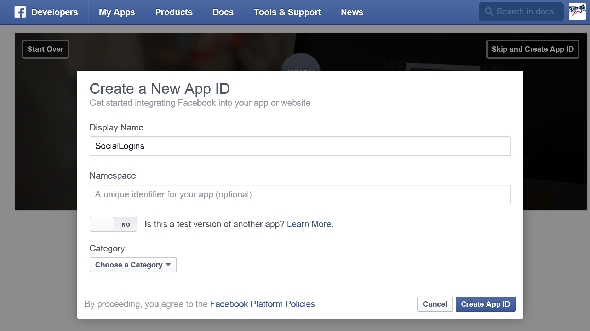
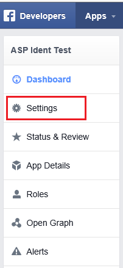
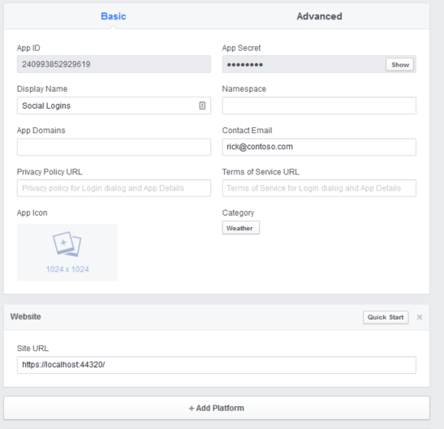

# Configuring Facebook authentication

<a name=security-authentication-facebook-logins></a>

By [Rick Anderson](https://twitter.com/RickAndMSFT) and [Pranav Rastogi](https://github.com/rustd)

This tutorial shows you how to enable your users to log into your application with their Facebook account using a sample ASP.NET Core project created in the [previous topic](sociallogins.md). We start by registering our app with Facebook by following the [official steps](https://developers.facebook.com/docs/apps/register).

## Creating the app in Facebook

* Navigate to [https://developers.facebook.com/apps](https://developers.facebook.com/apps) and log in.

* Login to your Facebook user account or create a new user account using the [Facebook login page](https://www.facebook.com/login.php).

* Upgrade your Facebook account to a Developer account if you are not yet registered as a a developer.

* Tap **Add a New App**

* Select **Website** from the platform choices.

* Tap **Skip and Create App ID**


* Enter a display name,  category, contact email and tap **Create App ID**.



* Tap **Settings** from the left menu bar.



* On the **Basic** settings section of the page select Add Platform to specify that you are adding a website app.


* Select Website from the platform choices.


* Add your Site URL (https://localhost:44320/)

* Make a note of your App ID and your App Secret so that you can add both into your ASP.NET Core app later in this tutorial. Also, Add your Site URL (https://localhost:44300/) to test your application.



## Use SecretManager to store Facebook AppId and AppSecret

The project created has code in Startup which reads the configuration values from a secret store. As a best practice, it is not recommended to store the secrets in a configuration file in the application since they can be checked into source control which may be publicly accessible.

Follow these steps to add the Facebook AppId and AppSecret to the Secret Manager:

* Install the [Secret Manager tool](../app-secrets.md).

* Set the Facebook AppId:

  <!-- literal_block {"ids": [], "xml:space": "preserve"} -->

  ````
  dotnet user-secrets set Authentication:Facebook:AppId <app-Id>
     ````

* Set the Facebook AppSecret:

  <!-- literal_block {"ids": [], "xml:space": "preserve"} -->

  ````
  dotnet user-secrets set Authentication:Facebook:AppSecret <app-secret>
     ````

The following code reads the configuration values stored by the [Secret Manager](../app-secrets.md#security-app-secrets).

[!code-csharp[Main](../../common/samples/WebApplication1/src/WebApplication1/Startup.cs?highlight=11&range=20-36)]

## Enable Facebook middleware

**Note:** You will need to use NuGet to install the Microsoft.AspNetCore.Authentication.Facebook package if it hasn't already been installed.

Add the Facebook middleware in the `Configure` method in `Startup`:

[!code-csharp[Main](./sociallogins/sample/Startup.cs?highlight=21,22,23,24,25&range=64-96)]

## Login with Facebook

Run your application and click Login. You will see an option for Facebook.


When you click on Facebook, you will be redirected to Facebook for authentication.


Once you enter your Facebook credentials, then you will be redirected back to the Web site where you can set your email.

You are now logged in using your Facebook credentials.


## Optionally set password

When you register with an external login provider, you do not have a password registered with the app. This alleviates you from creating and remembering a password for the site, but it also makes you dependent on the external login provider. If the external login provider is unavailable, you won't be able to log in to the web site.

To create a password and login using your email that you set during the login process with external providers:

* Tap the **Hello <email alias>** link at the top right corner to navigate to the **Manage** view.


* Tap **Create**


* Set a valid password and you can use this to login with your email

## Next steps

* This article showed how you can authenticate with Facebook. You can follow a similar approach to authenticate with Microsoft Account, Twitter, Google and other providers.

* Once you publish your Web site to Azure Web App, you should reset the AppSecret in the Facebook developer portal.

* Set the Facebook AppId and AppSecret as application setting in the Azure Web App portal. The configuration system is setup to read keys from environment variables.