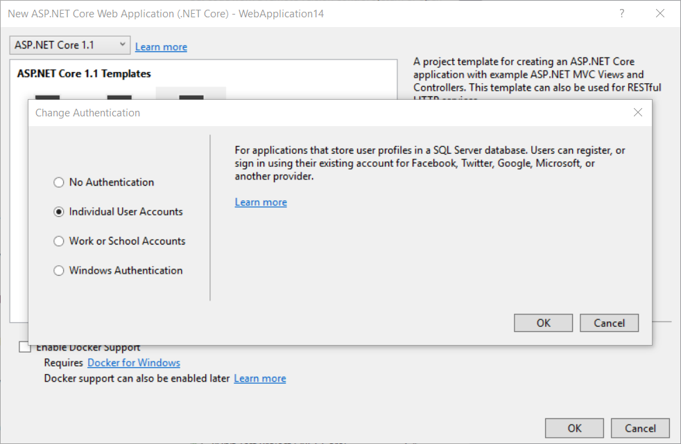
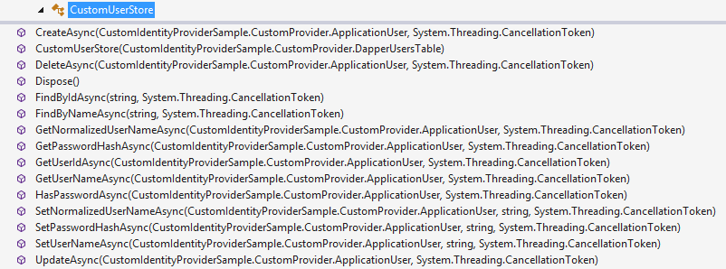
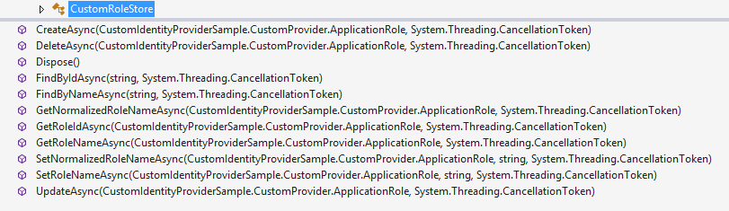

# Custom storage providers for ASP.NET Core Identity

By [Steve Smith](http://ardalis.com)

ASP.NET Core Identity is an extensible system which enables you to create a custom storage provider and connect it to your app. This topic describes how to create a customized storage provider for ASP.NET Core Identity. It covers the important concepts for creating your own storage provider, but is not a step-by-step walkthrough.

[View or download sample from GitHub](https://github.com/aspnet/Docs/tree/master/aspnetcore/security/authentication/identity/sample).

## Introduction

By default, the ASP.NET Core Identity system stores user information in a SQL Server database, and uses Entity Framework Core to create the database. For many applications, this approach works well. However, you may prefer to use a different type of persistence mechanism, such as [Azure Table Storage](https://docs.microsoft.com/en-us/azure/storage/), or you may already have database tables with a very different structure than the default implementation. You may wish to use a different data access approach, such as [Dapper](https://github.com/StackExchange/Dapper). In each of these cases, you can write a customized provider for your storage mechanism and plug that provider into your application.

ASP.NET Core Identity is included in application templates in Visual Studio when the "Individual User Accounts" option is chosen:



When using the dotnet CLI, you can include ASP.NET Core Identity by adding the ``-au`` or ``--auth`` option and specifying ``Individual``:

```
dotnet new mvc -au Individual
dotnet new webapi -au Individual
```

## Understand the architecture

ASP.NET Core Identity consists of classes called managers and stores. *Managers* are high-level classes which an application developer uses to perform operations, such as creating a user, in the ASP.NET Core Identity system. *Stores* are lower-level classes that specify how entities, such as users and roles, are persisted. Stores follow the [repository pattern](http://deviq.com/repository-pattern/) and are closely coupled with the persistence mechanism, but managers are decoupled from stores which means you can replace the persistence mechanism without disrupting the entire application.

The following diagram shows how your web application interacts with the managers, while stores interact with the data access layer.


To create a custom storage provider for ASP.NET Core Identity, you have to create the data source, the data access layer, and the store classes that interact with this data access layer (the green and grey boxes in the diagram above). You can continue using the same managers to perform data operations on the user, and the same application code that interacts with these managers (the blue boxes above).

You do not need to customize the manager classes because when creating a new instance of UserManager or RoleManager you provide the type of the user class and pass an instance of the store class as an argument. This approach enables you to plug your customized classes into the existing structure. You will see how to instantiate UserManager and RoleManager with your customized store classes in the section [Reconfigure application to use new storage provider](#reconfigure-app-to-use-new-storage-provider).

## Understand the data that is stored

To implement a custom storage provider, you should understand the types of data used with ASP.NET Core Identity. This will help you decide which features are relevant to your application. ASP.NET Core stores details about the four different data types shown below.

### Users

Registered users of your web site, including the user Id and user name. May include a hashed password if users log in with credentials that are specific to your site (rather than using credentials from an external site like Facebook), and security stamp to indicate whether anything has changed in the user credentials. May also include email address, phone number, whether two factor authentication is enabled, the current number of failed logins, and whether an account has been locked.

### User Claims

A set of statements (or claims) about the user that represent the user's identity. Can enable greater expression of the user's identity than can be achieved through roles.

### User Logins

Information about the external authentication provider (like Facebook or a Microsoft account) to use when logging in a user.

### Roles

Authorization groups for your site. Includes the role Id and role name (like "Admin" or "Employee").

## Create the data access layer

This topic assumes you are familiar with the persistence mechanism that you are going to use and how to create entities for that mechanism. This topic does not provide details about how to create the repositories or data access classes; instead, it provides some suggestions about the design decisions you need to make when working with ASP.NET Core Identity.

You have a lot of freedom when designing the data access layer for a customized store provider. You only need to create persistence mechanisms for features that you intend to use in your application. For example, if you are not using roles in your application, you do not need to create storage for roles or user role associations. Your technology and existing infrastructure may require a structure that is very different from the default implementation of ASP.NET Core Identity. In your data access layer, you provide the logic to work with the structure of your storage implementation.

In the data access layer, you provide the logic to save the data from ASP.NET Core Identity to your data source. The data access layer for your customized storage provider might include the following classes to store user and role information.

### Context class

Encapsulates the information to connect to your persistence mechanism and execute queries. This class is central to your data access layer. The other data classes will require an instance of this class to perform their operations. You will also initialize your store classes with an instance of this class.

### User Storage

Stores and retrieves user information (such as user name and password hash).

### Role Storage

Stores and retrieves role information (such as the role name).	

### UserClaims Storage

Stores and retrieves user claim information (such as the claim type and value).

### UserLogins Storage

Stores and retrieves user login information (such as an external authentication provider).	

### UserRole Storage

Stores and retrieves which roles are assigned to which users.

**TIP:** Only implement the classes you intend to use in your app.

In the data access classes, you provide code to perform data operations for your particular persistence mechanism. For example, within a custom provider, you might have the following code to create a new user in the *store* class:

[!code-csharp[Main](identity-custom-storage-providers/sample/CustomIdentityProviderSample/CustomProvider/CustomUserStore.cs?name=createuser&highlight=7)]

The implementation logic for creating the user is located in the ``_usersTable.CreateAsync`` method, shown below.

## Customize the user class

When implementing your own storage provider, you must create a user class which is equivalent to the [`IdentityUser` class](https://docs.microsoft.com/aspnet/core/api/microsoft.aspnet.identity.corecompat.identityuser).

At a minimum your user class must include an `Id` and a `UserName` property.

The `IdentityUser` class defines the properties that the `UserManager` attempts to call when performing requested operations. The class includes the `Id` and `UserName` properties. The default type of the `Id` property is a string, but you can inherit from `IdentityUser<TKey, TUserClaim, TUserRole, TUserLogin, TUserToken> and specify another key type. The framework expects the storage implementation to handle data type conversions if necessary.

## Customize the user store

You also create a UserStore class that provides the methods for all data operations on the user. This class is equivalent to the [UserStore<TUser>](https://docs.microsoft.com/aspnet/core/api/microsoft.aspnetcore.identity.entityframeworkcore.userstore-1) class. In your UserStore class, you implement `IUserStore<TUser>` and any of the optional interfaces. You select which optional interfaces to implement based on on the functionality you wish to provide in your application.

### Optional interfaces

- IUserRoleStore
- IUserClaimStore
- IUserPasswordStore
- IUserSecurityStampStore
- IUserEmailStore
- IPhoneNumberStore
- IQueryableUserStore
- IUserLoginStore
- IUserTwoFactorStore
- IUserLockoutStore

All of these optional interfaces inherit from `IUserStore`.

The following example shows a simple user store class. The `TUser` generic parameter takes the type of your user class.



Within your `UserStore` class, you use the data access classes that you created to perform operations. These are passed in using dependency injection. For example, in the SQL Server with Dapper implementation, the `UserStore` class has the `CreateAsync` method which uses an instance of `DapperUsersTable` to insert a new record:

[!code-csharp[Main](identity-custom-storage-providers/sample/CustomIdentityProviderSample/CustomProvider/DapperUsersTable.cs?name=createuser&highlight=7)]

### Interfaces to implement when customizing user store

- **IUserStore**  
 The [IUserStore&lt;TUser&gt;](https://msdn.microsoft.com/en-us/library/dn613278(v=vs.108).aspx) interface is the only interface you must implement in your user store. It defines methods for creating, updating, deleting, and retrieving users.
- **IUserClaimStore**  
 The [IUserClaimStore&lt;TUser&gt;](https://msdn.microsoft.com/en-us/library/dn613265(v=vs.108).aspx) interface defines the methods you must implement in your user store to enable user claims. It contains methods or adding, removing and retrieving user claims.
- **IUserLoginStore**  
 The [IUserLoginStore&lt;TUser&gt;](https://msdn.microsoft.com/en-us/library/dn613272(v=vs.108).aspx) defines the methods you must implement in your user store to enable external authentication providers. It contains methods for adding, removing and retrieving user logins, and a method for retrieving a user based on the login information.
- **IUserRoleStore**  
 The [IUserRoleStore&lt;TUser&gt;](https://msdn.microsoft.com/en-us/library/dn613276(v=vs.108).aspx) interface defines the methods you must implement in your user store to map a user to a role. It contains methods to add, remove, and retrieve a user's roles, and a method to check if a user is assigned to a role.
- **IUserPasswordStore**  
 The [IUserPasswordStore&lt;TUser&gt;](https://msdn.microsoft.com/en-us/library/dn613273(v=vs.108).aspx) interface defines the methods you must implement in your user store to persist hashed passwords. It contains methods for getting and setting the hashed password, and a method that indicates whether the user has set a password.
- **IUserSecurityStampStore**  
 The [IUserSecurityStampStore&lt;TUser&gt;](https://msdn.microsoft.com/en-us/library/dn613277(v=vs.108).aspx) interface defines the methods you must implement in your user store to use a security stamp for indicating whether the user's account information has changed. This stamp is updated when a user changes the password, or adds or removes logins. It contains methods for getting and setting the security stamp.
- **IUserTwoFactorStore**  
 The [IUserTwoFactorStore&lt;TUser&gt;](https://msdn.microsoft.com/en-us/library/dn613279(v=vs.108).aspx) interface defines the methods you must implement to implement two factor authentication. It contains methods for getting and setting whether two factor authentication is enabled for a user.
- **IUserPhoneNumberStore**  
 The [IUserPhoneNumberStore&lt;TUser&gt;](https://msdn.microsoft.com/en-us/library/dn613275(v=vs.108).aspx) interface defines the methods you must implement to store user phone numbers. It contains methods for getting and setting the phone number and whether the phone number is confirmed.
- **IUserEmailStore**  
 The [IUserEmailStore&lt;TUser&gt;](https://msdn.microsoft.com/en-us/library/dn613143(v=vs.108).aspx) interface defines the methods you must implement to store user email addresses. It contains methods for getting and setting the email address and whether the email is confirmed.
- **IUserLockoutStore**  
 The [IUserLockoutStore&lt;TUser&gt;](https://msdn.microsoft.com/en-us/library/dn613271(v=vs.108).aspx) interface defines the methods you must implement to store information about locking an account. It contains methods for getting the current number of failed access attempts, getting and setting whether the account can be locked, getting and setting the lock out end date, incrementing the number of failed attempts, and resetting the number of failed attempts.
- **IQueryableUserStore**  
 The [IQueryableUserStore&lt;TUser&gt;](https://msdn.microsoft.com/en-us/library/dn613267(v=vs.108).aspx) interface defines the members you must implement to provide a queryable user store. It contains a property that holds the queryable users.

You implement only the interfaces that are needed in your application. For example:

```csharp
public class UserStore : IUserStore<IdentityUser>,
                         IUserClaimStore<IdentityUser>,
                         IUserLoginStore<IdentityUser>,
                         IUserRoleStore<IdentityUser>,
                         IUserPasswordStore<IdentityUser>,
                         IUserSecurityStampStore<IdentityUser>
{
    // interface implementations not shown
}
```

### IdentityUserClaim, IdentityUserLogin, and IdentityUserRole

The ``Microsoft.AspNet.Identity.EntityFramework`` namespace contains implementations of the [IdentityUserClaim](https://msdn.microsoft.com/en-us/library/dn613250(v=vs.108).aspx), [IdentityUserLogin](https://msdn.microsoft.com/en-us/library/dn613251(v=vs.108).aspx), and [IdentityUserRole](https://msdn.microsoft.com/en-us/library/dn613252(v=vs.108).aspx) classes. If you are using these features, you may want to create your own versions of these classes and define the properties for your application. However, sometimes it is more efficient to not load these entities into memory when performing basic operations (such as adding or removing a user's claim). Instead, the backend store classes can execute these operations directly on the data source. For example, the ``UserStore.GetClaimsAsync`` method can call the ``userClaimTable.FindByUserId(user.Id)`` method to execute a query on that table directly and return a list of claims.

## Customize the role class

When implementing your own role storage provider, you can create a custom role type. It need not implement a particular interface, but it must have an Id and typically it will have a Name property.

The following is an example role class:

[!code-csharp[Main](identity-custom-storage-providers/sample/CustomIdentityProviderSample/CustomProvider/ApplicationRole.cs)]

## Customize the role store

You also create a ``RoleStore`` class that provides the methods for all data operations on roles. This class is equivalent to the ``RoleStore<TRole>`` class. In your RoleStore class, you implement the ``IRoleStore<TRole>`` and optionally the ``IQueryableRoleStore<TRole>`` interface.

The following class view diagram shows a role store class. The ``TRole`` generic parameter takes the type of your role class.



- **IRoleStore&lt;TRole&gt;**  
 The [IRoleStore](https://msdn.microsoft.com/en-us/library/dn468195.aspx) interface defines the methods to implement in your role store class. It contains methods for creating, updating, deleting and retrieving roles.
- **RoleStore&lt;TRole&gt;**  
 To customize RoleStore, create a class that implements the IRoleStore interface. You only have to implement this class if want to use roles on your system. The constructor that takes a parameter named *database* of type ExampleDatabase is only an illustration of how to pass in your data access class. For example, in the MySQL implementation, this constructor takes a parameter of type MySQLDatabase.  

## Reconfigure app to use new storage provider

You have implemented your new storage provider. Now, you must configure your application to use this storage provider. If the default storage provider was included in your project, you must remove the default provider and replace it with your provider.

1. Remove the `Microsoft.AspNetCore.EntityFramework.Identity' NuGet package from your web app project.
2. If your storage provider resides in a separate project or package, add a reference to it.
3. Replace all references to `Microsoft.AspNetCore.EntityFramework.Identity' with a using statement for the namespace of your storage provider.
4. In Startup.cs, in the ``ConfigureServices`` method, change the `AddIdentity` method to use your custom types. You can create your own extension methods for this purpose.
5. If you are using Roles, you must update the RoleManager to use your RoleStore class.
6. If necessary, add connection string or credentials to your app's configuration.

Example:

```csharp
public void ConfigureServices(IServiceCollection services)
{
    // Add identity types
    services.AddIdentity<ApplicationUser, ApplicationRole>()
        .AddDefaultTokenProviders();

    // Identity Services
    services.AddTransient<IUserStore<ApplicationUser>, CustomUserStore>();
    services.AddTransient<IRoleStore<ApplicationRole>, CustomRoleStore>();
    string connectionString = Configuration.GetConnectionString("DefaultConnection");
    services.AddTransient<SqlConnection>(e => new SqlConnection(connectionString));
    services.AddTransient<DapperUsersTable>();

    // additional configuration
}
```

## References

- [Custom Storage Providers for ASP.NET Identity](https://docs.microsoft.com/en-us/aspnet/identity/overview/extensibility/overview-of-custom-storage-providers-for-aspnet-identity)
