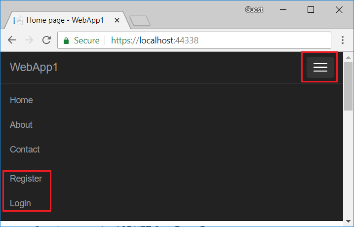

# Introduction to Identity on ASP.NET Core

By [Rick Anderson](https://twitter.com/RickAndMSFT)

ASP.NET Core Identity is a membership system that adds login functionality to ASP.NET Core apps. Users can create an account with the login information stored in Identity or they can use an external login provider. Supported external login providers include [Facebook, Google, Microsoft Account, and Twitter](xref:security/authentication/social/index).

Identity can be configured using a SQL Server database to store user names, passwords, and profile data. Alternatively, another persistent store can be used, for example, Azure Table Storage.

[View or download the sample code.](https://github.com/aspnet/Docs/tree/master/aspnetcore/security/authentication/identity/sample/src/ASPNETCore-IdentityDemoComplete/) [(How to download)](xref:tutorials/index#how-to-download-a-sample)

In this topic, you learn how to use Identity to register, log in, and log out a user. For more detailed instructions about creating apps that use Identity, see the Next Steps section at the end of this article.

## Create a Web app with authentication

Create an ASP.NET Core Web Application project with Individual User Accounts.

# [Visual Studio](#tab/visual-studio)

* Select **File** > **New** > **Project**. 
* Select **ASP.NET Core Web Application**. Name the project **WebApp1** to have the same namespace as the project download. Click **OK**.
* Select an ASP.NET Core **Web Application** for ASP.NET Core 2.1, then select **Change Authentication**.
* Select **Individual User Accounts** and click **OK**.

# [.NET Core CLI](#tab/netcore-cli)

```cli
dotnet new webapp --auth Individual -o WebApp1
```

---

The generated project provides [ASP.NET Core Identity](xref:security/authentication/identity) as a [Razor Class Library](xref:razor-pages/ui-class).

### Test Register and Login

Run the app and register a user. Depending on your screen size, you might need to select the navigation toggle button to see the **Register** and **Login** links.



[!INCLUDE[](~/includes/view-identity-db.md)]

<a name="pw"></a>
### Configure Identity services

Services are added in `ConfigureServices`.

::: moniker range=">= aspnetcore-2.1"

   [!code-csharp[](identity/sample/src/ASPNETv2.1-IdentityDemo/Startup.cs?name=snippet_configureservices)]

The preceding code configures Identity with default option values. Services are made available to the app through [dependency injection](xref:fundamentals/dependency-injection).

   Identity is enabled by calling [UseAuthentication](/dotnet/api/microsoft.aspnetcore.builder.authappbuilderextensions.useauthentication#Microsoft_AspNetCore_Builder_AuthAppBuilderExtensions_UseAuthentication_Microsoft_AspNetCore_Builder_IApplicationBuilder_). `UseAuthentication` adds authentication [middleware](xref:fundamentals/middleware/index) to the request pipeline.

   [!code-csharp[](identity/sample/src/ASPNETv2.1-IdentityDemo/Startup.cs?name=snippet_configure&highlight=18)]

::: moniker-end

::: moniker range="<= aspnetcore-2.0"

   [!code-csharp[](identity/sample/src/ASPNETv2-IdentityDemo/Startup.cs?name=snippet_configureservices&highlight=7-9,11-28,30-42)]

   Services are made available to the application through [dependency injection](xref:fundamentals/dependency-injection).

   Identity is enabled for the application by calling `UseAuthentication` in the `Configure` method. `UseAuthentication` adds authentication [middleware](xref:fundamentals/middleware/index) to the request pipeline.

   [!code-csharp[](identity/sample/src/ASPNETv2-IdentityDemo/Startup.cs?name=snippet_configure&highlight=17)]

::: moniker-end

::: moniker range="= aspnetcore-1.1"

   [!code-csharp[](identity/sample/src/ASPNET-IdentityDemo/Startup.cs?name=snippet_configureservices&highlight=7-9,13-33)]

   These services are made available to the application through [dependency injection](xref:fundamentals/dependency-injection).

   Identity is enabled for the application by calling `UseIdentity` in the `Configure` method. `UseIdentity` adds cookie-based authentication [middleware](xref:fundamentals/middleware/index) to the request pipeline.

   [!code-csharp[](identity/sample/src/ASPNET-IdentityDemo/Startup.cs?name=snippet_configure&highlight=21)]

::: moniker-end

For more information, see the [IdentityOptions Class](/dotnet/api/microsoft.aspnetcore.identity.identityoptions) and [Application Startup](xref:fundamentals/startup).

## Scaffold Register, Login, and LogOut

Follow the [Scaffold identity into a Razor project with authorization](xref:security/authentication/scaffold-identity#scaffold-identity-into-a-razor-project-with-authorization) instructions.

# [Visual Studio](#tab/visual-studio)

Add the Register, Login, and LogOut files.


# [.NET Core CLI](#tab/netcore-cli)

If you created the project with name **WebApp1**, run the following commands. Otherwise, use the correct namespace for the `ApplicationDbContext`:


```cli
dotnet aspnet-codegenerator identity -dc WebApp1.Data.ApplicationDbContext --files "Account.Register;Account.Login;Account.Logout"

```

PowerShell uses semicolon as a command separator. When using PowerShell, escape the semicolons in the file list or put the file list in double quotes, as the preceding example shows.

---

### Examine Register

::: moniker range=">= aspnetcore-2.1"

   When a user clicks the **Register** link, the `RegisterModel.OnPostAsync` action is invoked. The user is created by [CreateAsync](/dotnet/api/microsoft.aspnetcore.identity.usermanager-1.createasync#Microsoft_AspNetCore_Identity_UserManager_1_CreateAsync__0_System_String_) on the `_userManager` object. `_userManager` is provided by dependency injection):

   [!code-csharp[](identity/sample/src/ASPNETv2.1-IdentityDemo/Register.cshtml.cs?name=snippet&highlight=7,22)]

::: moniker-end
::: moniker range="= aspnetcore-2.0"

   When a user clicks the **Register** link, the `Register` action is invoked on `AccountController`. The `Register` action creates the user by calling `CreateAsync` on the `_userManager` object (provided to `AccountController` by dependency injection):

   [!code-csharp[](identity/sample/src/ASPNET-IdentityDemo/Controllers/AccountController.cs?name=snippet_register&highlight=11)]

::: moniker-end

   If the user was created successfully, the user is logged in by the call to `_signInManager.SignInAsync`.

   **Note:** See [account confirmation](xref:security/authentication/accconfirm#prevent-login-at-registration) for steps to prevent immediate login at registration.

### Log in

::: moniker range=">= aspnetcore-2.1"

The Login form is displayed when:

* The **Log in** link  is selected.
* When a user accesses a page where they are not authenticated **or** authorized, they are redirected to the Login page. 

When the form on the Login page is submitted, the `OnPostAsync` action is called. `PasswordSignInAsync` is called on the `_signInManager` object (provided by dependency injection).

   [!code-csharp[](identity/sample/src/ASPNETv2.1-IdentityDemo/Login.cshtml.cs?name=snippet&highlight=10-11)]

   The base `Controller` class exposes a `User` property that you can access from controller methods. For instance, you can enumerate `User.Claims` and make authorization decisions. For more information, see [Authorization](xref:security/authorization/index).

::: moniker-end
::: moniker range="= aspnetcore-2.0"

The Login form is displayed when users select the **Log in** link or are redirected when accessing a page that requires authentication. When the user submits the form on the Login page, the `AccountController` `Login` action is called.

The `Login` action calls `PasswordSignInAsync` on the `_signInManager` object (provided to `AccountController` by dependency injection).

[!code-csharp[](identity/sample/src/ASPNET-IdentityDemo/Controllers/AccountController.cs?name=snippet_login&highlight=13-14)]

The base (`Controller` or `PageModel`) class exposes a `User` property. For example, `User.Claims` can be enumerated to make authorization decisions.

::: moniker-end

### Log out

::: moniker range=">= aspnetcore-2.1"

The **Log out** link invokes the `LogoutModel.OnPost` action. 

[!code-csharp[](identity/sample/src/ASPNETv2.1-IdentityDemo/Logout.cshtml.cs)]

[SignOutAsync](/dotnet/api/microsoft.aspnetcore.identity.signinmanager-1.signoutasync#Microsoft_AspNetCore_Identity_SignInManager_1_SignOutAsync) clears the user's claims stored in a cookie. Don't redirect after calling `SignOutAsync` or the user will **not** be signed out.

Post is specified in the *Pages/Shared/_LoginPartial.cshtml*:

[!code-csharp[](identity/sample/src/ASPNETv2.1-IdentityDemo/_LoginPartial.cshtml?highlight=10)]

::: moniker-end
::: moniker range="= aspnetcore-2.0"
   Clicking the **Log out** link calls the `LogOut` action.

   [!code-csharp[](identity/sample/src/ASPNET-IdentityDemo/Controllers/AccountController.cs?name=snippet_logout&highlight=7)]

   The preceding code calls the `_signInManager.SignOutAsync` method. The `SignOutAsync` method clears the user's claims stored in a cookie.
::: moniker-end

## Test Identity

The default web project templates allow anonymous access to the home pages. To test Identity, add [`[Authorize]`](/dotnet/api/microsoft.aspnetcore.authorization.authorizeattribute) to the About page.

[!code-csharp[](identity/sample/src/ASPNETv2.1-IdentityDemo/About.cshtml.cs)]

If you are signed in, sign out. Run the app and select the **About** link. You are redirected to the login page.

::: moniker range=">= aspnetcore-2.1"

### Explore Identity

To explore Identity in more detail:

* [Create full identity UI source](xref:security/authentication/scaffold-identity#create-full-identity-ui-source)
* Examine the source of each page and step through the debugger.

::: moniker-end

## Identity Components

::: moniker range=">= aspnetcore-2.1"

All the Identity dependent NuGet packages are included in the [Microsoft.AspNetCore.App metapackage](xref:fundamentals/metapackage-app).
::: moniker-end

The primary package for Identity is [Microsoft.AspNetCore.Identity](https://www.nuget.org/packages/Microsoft.AspNetCore.Identity/). This package contains the core set of interfaces for ASP.NET Core Identity, and is included by `Microsoft.AspNetCore.Identity.EntityFrameworkCore`.

## Migrating to ASP.NET Core Identity

For more information and guidance on migrating your existing Identity store, see [Migrate Authentication and Identity](xref:migration/identity).

## Setting password strength

See [Configuration](#pw) for a sample that sets the minimum password requirements.

## Next Steps

* [Configure Identity](xref:security/authentication/identity-configuration)
* <xref:security/authorization/secure-data>
* <xref:security/authentication/add-user-data>
* <xref:security/authentication/identity-enable-qrcodes>
* [Configure Identity primary keys data type](xref:security/authentication/identity-primary-key-configuration).
* <xref:migration/identity>
* <xref:security/authentication/accconfirm>
* <xref:security/authentication/2fa>
* <xref:host-and-deploy/web-farm>
