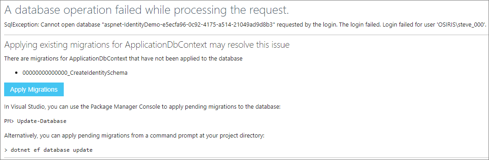

# Introduction to Identity

By [Pranav Rastogi](https://github.com/rustd), [Rick Anderson](https://twitter.com/RickAndMSFT), [Tom Dykstra](https://github.com/tdykstra), Jon Galloway, [Erik Reitan](https://github.com/Erikre), and [Steve Smith](http://ardalis.com)

ASP.NET Core Identity is a membership system which allows you to add login functionality to your application. Users can create an account and login with a user name and password or they can use an external login provider such as Facebook, Google, Microsoft Account, Twitter or others.

You can configure ASP.NET Core Identity to use a SQL Server database to store user names, passwords, and profile data. Alternatively, you can use your own persistent store to store data in another persistent storage, such as Azure Table Storage.

## Overview of Identity

In this topic, you'll learn how to use ASP.NET Core Identity to add functionality to register, log in, and log out a user. You can follow along step by step or just read the details. For more detailed instructions about creating apps using ASP.NET Core Identity, see the Next Steps section at the end of this article.

1.  Create an ASP.NET Core Web Application project with Individual User Accounts.

    In Visual Studio, select **File** -> **New** -> **Project**. Then, select the **ASP.NET Web Application** from the **New Project** dialog box. Continue by selecting an ASP.NET Core **Web Application** with **Individual User Accounts** as the authentication method.

    > [!NOTE]
    > Don't forget to click **Change Authentication** and select **Individual User Accounts**.
 
    

    If using the dotnet CLI, create the new project using ``dotnet new mvc --auth Individual``. This will create a new project with the same identity template code as the above instructions.
 
    The created project contains the `Microsoft.AspNetCore.Identity.EntityFrameworkCore` package, which will persist the identity data and schema to SQL Server using [Entity Framework Core](https://docs.efproject.net).
 
2.  Configure identity services and add middleware in Startup.

    The identity services are added to the application in the `ConfigureServices` method in the `Startup` class:
 
    [!code-csharp[Main](identity/sample/src/ASPNET-IdentityDemo/Startup.cs?name=configureservices&highlight=7-9,13-34)]
	
    These services are then made available to the application through [dependency injection](xref:fundamentals/dependency-injection).
 
    Identity is enabled for the application by calling  `UseIdentity` in the `Configure` method of the `Startup` class. This adds cookie-based authentication [middleware](xref:fundamentals/middleware) to the request pipeline.
 
    [!code-csharp[Main](identity/sample/src/ASPNET-IdentityDemo/Startup.cs?name=configure&highlight=21)]
 
    For more information about the application start up process, see [Application Startup](xref:fundamentals/startup).

3.  Create a user.
 
    Launch the application and then click on the **Register** link in the browser to create a user.

    If this is the first time you're performing this action, you may be required to run migrations. The application prompt you to **Apply Migrations** with a screen similar to this one:
    
    
    
    Alternately, you can test using ASP.NET Core Identity with your app without an actual database by using an in-memory database. To do so, add the ``Microsoft.EntityFrameworkCore.InMemory`` package to your app and modify your app's call to ``AddDbContext`` in ``ConfigureServices`` as follows:

    ```
    services.AddDbContext<ApplicationDbContext>(options =>
        options.UseInMemoryDatabase(Guid.NewGuid().ToString()));
    ```
    
    When the user clicks the **Register** link, the ``Register`` action is invoked on ``AccountController``. This action creates the user by calling `CreateAsync` on the  `_userManager` object (provided to ``AccountController`` by dependency injection):
 
    [!code-csharp[Main](identity/sample/src/ASPNET-IdentityDemo/Controllers/AccountController.cs?name=register&highlight=11)]

    If the user was created successfully, the user is logged in by the call to ``_signInManager.SignInAsync``.
 
4.  Log in.
 
    Users can sign in by clicking the **Log in** link at the top of the site, or they may be navigated to the Login page if they attempt to access a part of the site that requires authorization. When the user submits the form on the Login page, the ``Login`` action is called on ``AccountController``.

    [!code-csharp[Main](identity/sample/src/ASPNET-IdentityDemo/Controllers/AccountController.cs?name=login&highlight=13-14)]
 
    The ``Login`` action calls ``PasswordSignInAsync`` on the ``_signInManager`` object (provided to ``AccountController`` by dependency injection).
 
    The base ``Controller`` class exposes a ``User`` property that you can access from controller methods. For instance, you can enumerate `User.Claims` and make authorization decisions. For more information, see [Authorization](xref:security/authorization/index).
 
5.  Log out.
 
    Clicking the **Log out** link calls the `LogOut` action in the account controller.
 
    [!code-csharp[Main](identity/sample/src/ASPNET-IdentityDemo/Controllers/AccountController.cs?name=logout&highlight=7)]
 
    The code above shows the `_signInManager.SignOutAsync` method. The `SignOutAsync` method clears the user's claims stored in a cookie.
 
6.  Configuration.

    Identity has some default behaviors that you can override in your application's startup class. You do not need to configure ``IdentityOptions`` if you are using the default behaviors.
 
    [!code-csharp[Main](identity/sample/src/ASPNET-IdentityDemo/Startup.cs?name=configureservices&highlight=13-34)]
	
	For more information about how to configure Identity, see [Configure Identity](xref:security/authentication/identity-configuration).
	
	You also can configure the data type of the primary key, see [Configure Identity primary keys data type](xref:security/authentication/identity-primary-key-configuration).
 
7.  View the database.

    If your app is using a SQL Server database (the default on Windows and for Visual Studio users), you can view the database the app created. You can use **SQL Server Management Studio**, or from Visual Studio select **View** -> **SQL Server Object Explorer**. Connect to **(localdb)\MSSQLLocalDB**. You should see a database with a name matching **aspnet-<*name of your project*>-<*unique string*>**.

    
    
    Expand the database and its **Tables** then right-click the **dbo.AspNetUsers** table and select **View Data** to see the properties of the user you created.

## Identity Components

The primary reference assembly for the identity system is `Microsoft.AspNetCore.Identity`. This package contains the core set of interfaces for ASP.NET Core Identity, and is included by `Microsoft.AspNetCore.Identity.EntityFrameworkCore`.

These dependencies are needed to use the identity system in ASP.NET Core applications:

* `Microsoft.AspNetCore.Identity.EntityFrameworkCore` - Contains the required types to use Identity with Entity Framework Core.

* `Microsoft.EntityFrameworkCore.SqlServer` - Entity Framework Core is Microsoft's recommended data access technology for relational databases like SQL Server. For testing, you can use `Microsoft.EntityFrameworkCore.InMemory`.

* `Microsoft.AspNetCore.Authentication.Cookies` - Middleware that enables an app to use cookie-based authentication.

## Migrating to ASP.NET Core Identity

For additional information and guidance on migrating your existing identity store see [Migrating Authentication and Identity](xref:migration/identity).

## Next Steps

* [Migrating Authentication and Identity](xref:migration/identity)
* [Account Confirmation and Password Recovery](xref:security/authentication/accconfirm)
* [Two-factor authentication with SMS](xref:security/authentication/2fa)
* [Enabling authentication using Facebook, Google and other external providers](xref:security/authentication/social/index)
