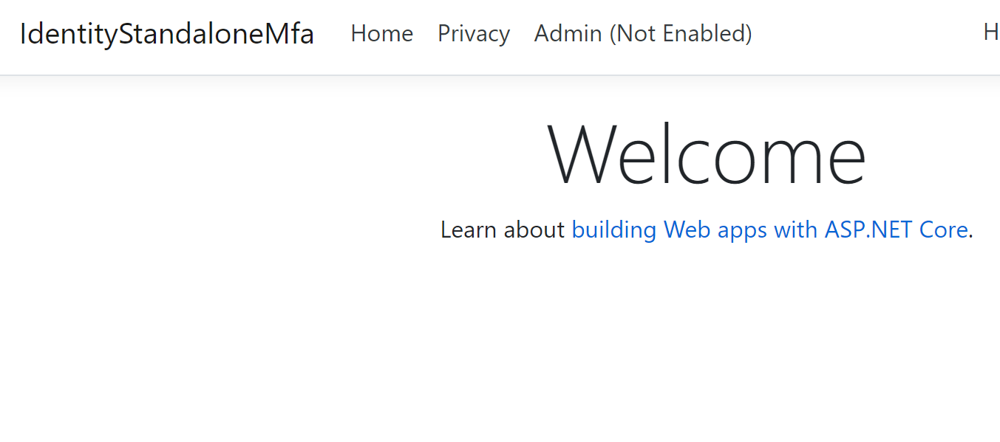
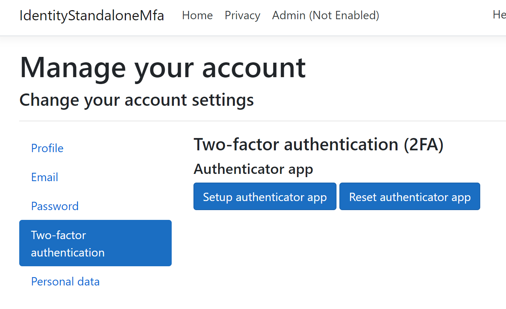
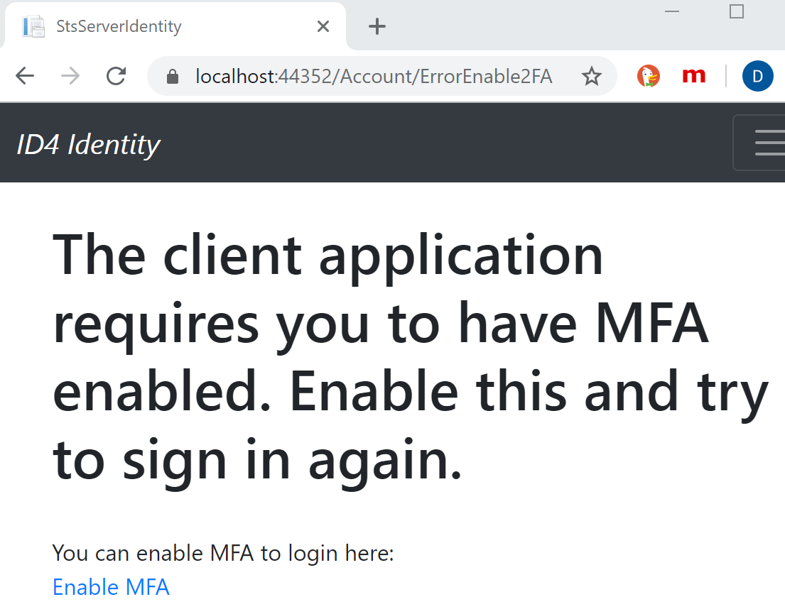
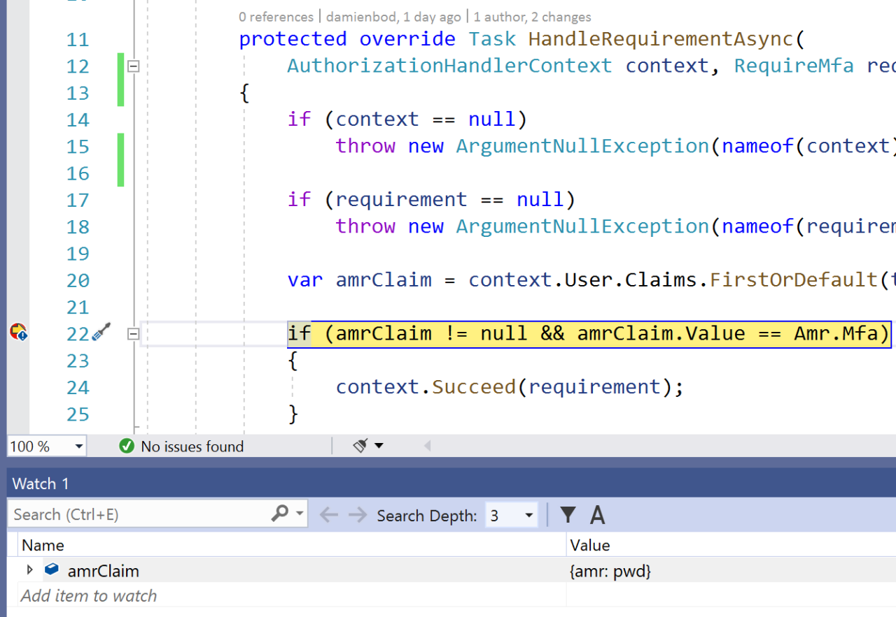
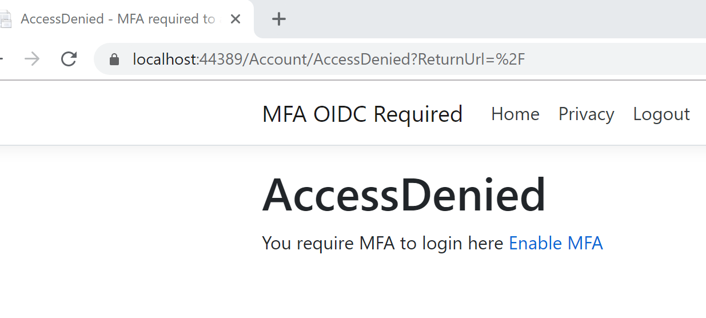
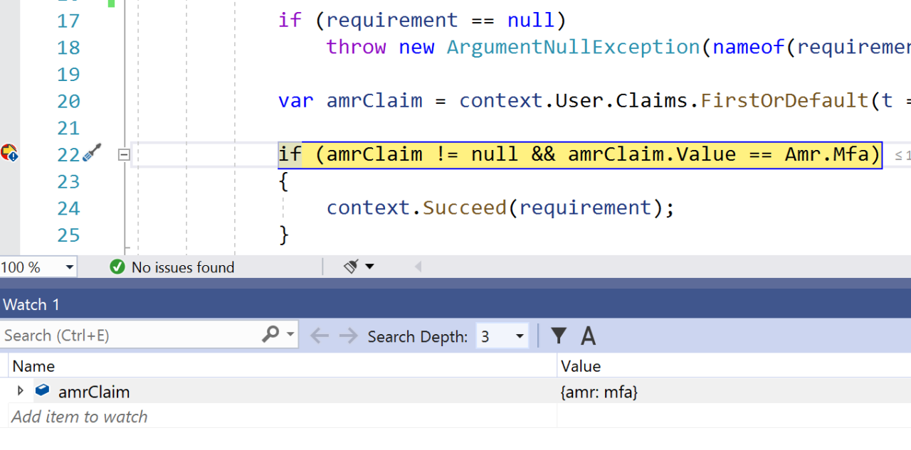

# Multi-factor authentication in ASP.NET Core

:::moniker range=">= aspnetcore-6.0"

By [Damien Bowden](https://github.com/damienbod)

[View or download sample code (damienbod/AspNetCoreHybridFlowWithApi GitHub repository)](https://github.com/damienbod/AspNetCoreHybridFlowWithApi)

Multi-factor authentication (MFA) is a process in which a user is requested during a sign-in event for additional forms of identification. This prompt could be to enter a code from a cellphone, use a FIDO2 key, or to provide a fingerprint scan. When you require a second form of authentication, security is enhanced. The additional factor isn't easily obtained or duplicated by an attacker.

This article covers the following areas:

* What is MFA and what MFA flows are recommended
* Configure MFA for administration pages using ASP.NET Core Identity
* Send MFA sign-in requirement to OpenID Connect server
* Force ASP.NET Core OpenID Connect client to require MFA

## MFA, 2FA

MFA requires at least two or more types of proof for an identity like something you know, something you possess, or biometric validation for the user to authenticate.

Two-factor authentication (2FA) is like a subset of MFA, but the difference being that MFA can require two or more factors to prove the identity.

2FA is supported by default when using ASP.NET Core Identity. To enable or disable 2FA for a specific user, set the <xref:Microsoft.AspNetCore.Identity.IdentityUser%601.TwoFactorEnabled%2A?displayProperty=nameWithType> property. The ASP.NET Core Identity Default UI includes pages for configuring 2FA.

### MFA TOTP (Time-based One-time Password Algorithm)

MFA using TOTP is supported by default when using ASP.NET Core Identity. This approach can be used together with any compliant authenticator app, including:

* Microsoft Authenticator
* Google Authenticator

For implementation details, see [Enable QR Code generation for TOTP authenticator apps in ASP.NET Core](xref:security/authentication/identity-enable-qrcodes).

To disable support for MFA TOTP, configure authentication using <xref:Microsoft.Extensions.DependencyInjection.IdentityServiceCollectionExtensions.AddIdentity%2A> instead of <xref:Microsoft.Extensions.DependencyInjection.IdentityServiceCollectionUIExtensions.AddDefaultIdentity%2A>. `AddDefaultIdentity` calls <xref:Microsoft.AspNetCore.Identity.IdentityBuilderExtensions.AddDefaultTokenProviders%2A> internally, which registers multiple token providers including one for MFA TOTP. To register only specific token providers, call <xref:Microsoft.AspNetCore.Identity.IdentityBuilder.AddTokenProvider%2A> for each required provider. For more information about available token providers, see the [AddDefaultTokenProviders source on GitHub](https://github.com/dotnet/aspnetcore/blob/release/6.0/src/Identity/Core/src/IdentityBuilderExtensions.cs#L21-L32).

### MFA passkeys/FIDO2 or passwordless

passkeys/FIDO2 is currently:

* The most secure way of achieving MFA.
* MFA that protects against phishing attacks. (As well as certificate authentication and Windows for business)

At present, ASP.NET Core doesn't support passkeys/FIDO2 directly. Passkeys/FIDO2 can be used for MFA or passwordless flows.

Microsoft Entra ID provides support for passkeys/FIDO2 and passwordless flows. For more information, see [Passwordless authentication options](/azure/active-directory/authentication/concept-authentication-passwordless).

Other forms of passwordless MFA do not or may not protect against phishing.

### MFA SMS

MFA with SMS increases security massively compared with password authentication (single factor). However, using SMS as a second factor is no longer recommended. Too many known attack vectors exist for this type of implementation.

[NIST guidelines](https://pages.nist.gov/800-63-3/sp800-63b.html)

## Configure MFA for administration pages using ASP.NET Core Identity

MFA could be forced on users to access sensitive pages within an ASP.NET Core Identity app. This could be useful for apps where different levels of access exist for the different identities. For example, users might be able to view the profile data using a password login, but an administrator would be required to use MFA to access the administrative pages.

### Extend the login with an MFA claim

The demo code is setup using ASP.NET Core with Identity and Razor Pages. The `AddIdentity` method is used instead of `AddDefaultIdentity` one, so an `IUserClaimsPrincipalFactory` implementation can be used to add claims to the identity after a successful login.

```csharp
builder.Services.AddDbContext<ApplicationDbContext>(options =>
    options.UseSqlite(
        Configuration.GetConnectionString("DefaultConnection")));
		
builder.Services.AddIdentity<IdentityUser, IdentityRole>(options =>
		options.SignIn.RequireConfirmedAccount = false)
    .AddEntityFrameworkStores<ApplicationDbContext>()
    .AddDefaultTokenProviders();
	
builder.Services.AddSingleton<IEmailSender, EmailSender>();
builder.Services.AddScoped<IUserClaimsPrincipalFactory<IdentityUser>, 
    AdditionalUserClaimsPrincipalFactory>();
	
builder.Services.AddAuthorization(options =>
    options.AddPolicy("TwoFactorEnabled", x => x.RequireClaim("amr", "mfa")));
	
builder.Services.AddRazorPages();
```

The `AdditionalUserClaimsPrincipalFactory` class adds the `amr` claim to the user claims only after a successful login. The claim's value is read from the database. The claim is added here because the user should only access the higher protected view if the identity has logged in with MFA. If the database view is read from the database directly instead of using the claim, it's possible to access the view without MFA directly after activating the MFA.

```csharp
using Microsoft.AspNetCore.Identity;
using Microsoft.Extensions.Options;
using System.Collections.Generic;
using System.Security.Claims;
using System.Threading.Tasks;

namespace IdentityStandaloneMfa
{
    public class AdditionalUserClaimsPrincipalFactory : 
        UserClaimsPrincipalFactory<IdentityUser, IdentityRole>
    {
        public AdditionalUserClaimsPrincipalFactory( 
            UserManager<IdentityUser> userManager,
            RoleManager<IdentityRole> roleManager, 
            IOptions<IdentityOptions> optionsAccessor) 
            : base(userManager, roleManager, optionsAccessor)
        {
        }

        public async override Task<ClaimsPrincipal> CreateAsync(IdentityUser user)
        {
            var principal = await base.CreateAsync(user);
            var identity = (ClaimsIdentity)principal.Identity;

            var claims = new List<Claim>();

            if (user.TwoFactorEnabled)
            {
                claims.Add(new Claim("amr", "mfa"));
            }
            else
            {
                claims.Add(new Claim("amr", "pwd"));
            }

            identity.AddClaims(claims);
            return principal;
        }
    }
}
```

Because the Identity service setup changed in the `Startup` class, the layouts of the Identity need to be updated. Scaffold the Identity pages into the app. Define the layout in the `Identity/Account/Manage/_Layout.cshtml` file.

```cshtml
@{
    Layout = "/Pages/Shared/_Layout.cshtml";
}
```

Also assign the layout for all the manage pages from the Identity pages:

```cshtml
@{
    Layout = "_Layout.cshtml";
}
```

### Validate the MFA requirement in the administration page

The administration Razor Page validates that the user has logged in using MFA. In the `OnGet` method, the identity is used to access the user claims. The `amr` claim is checked for the value `mfa`. If the identity is missing this claim or is `false`, the page redirects to the Enable MFA page. This is possible because the user has logged in already, but without MFA.

```csharp
using System;
using System.Collections.Generic;
using System.Linq;
using System.Threading.Tasks;
using Microsoft.AspNetCore.Mvc;
using Microsoft.AspNetCore.Mvc.RazorPages;

namespace IdentityStandaloneMfa
{
    public class AdminModel : PageModel
    {
        public IActionResult OnGet()
        {
            var claimTwoFactorEnabled = 
                User.Claims.FirstOrDefault(t => t.Type == "amr");

            if (claimTwoFactorEnabled != null && 
                "mfa".Equals(claimTwoFactorEnabled.Value))
            {
                // You logged in with MFA, do the administrative stuff
            }
            else
            {
                return Redirect(
                    "/Identity/Account/Manage/TwoFactorAuthentication");
            }

            return Page();
        }
    }
}
```

### UI logic to toggle user login information

An authorization policy was added at startup. The policy requires the `amr` claim with the value `mfa`.

```csharp
services.AddAuthorization(options =>
    options.AddPolicy("TwoFactorEnabled",
        x => x.RequireClaim("amr", "mfa")));
```

This policy can then be used in the `_Layout` view to show or hide the **Admin** menu with the warning:

```cshtml
@using Microsoft.AspNetCore.Authorization
@using Microsoft.AspNetCore.Identity
@inject SignInManager<IdentityUser> SignInManager
@inject UserManager<IdentityUser> UserManager
@inject IAuthorizationService AuthorizationService
```

If the identity has logged in using MFA, the **Admin** menu is displayed without the tooltip warning. When the user has logged in without MFA, the **Admin (Not Enabled)** menu is displayed along with the tooltip that informs the user (explaining the warning).

```cshtml
@if (SignInManager.IsSignedIn(User))
{
    @if ((AuthorizationService.AuthorizeAsync(User, "TwoFactorEnabled")).Result.Succeeded)
    {
        <li class="nav-item">
            <a class="nav-link text-dark" asp-area="" asp-page="/Admin">Admin</a>
        </li>
    }
    else
    {
        <li class="nav-item">
            <a class="nav-link text-dark" asp-area="" asp-page="/Admin" 
               id="tooltip-demo"  
               data-toggle="tooltip" 
               data-placement="bottom" 
               title="MFA is NOT enabled. This is required for the Admin Page. If you have activated MFA, then logout, login again.">
                Admin (Not Enabled)
            </a>
        </li>
    }
}
```

If the user logs in without MFA, the warning is displayed:



The user is redirected to the MFA enable view when clicking the **Admin** link:



## Send MFA sign-in requirement to OpenID Connect server 

The `acr_values` parameter can be used to pass the `mfa` required value from the client to the server in an authentication request.

> [!NOTE]
> The `acr_values` parameter needs to be handled on the OpenID Connect server for this to work.

### OpenID Connect ASP.NET Core client

The ASP.NET Core Razor Pages OpenID Connect client app uses the `AddOpenIdConnect` method to login to the OpenID Connect server. The `acr_values` parameter is set with the `mfa` value and sent with the authentication request. The `OpenIdConnectEvents` is used to add this.

For recommended `acr_values` parameter values, see [Authentication Method Reference Values](https://tools.ietf.org/html/draft-ietf-oauth-amr-values-08).

```csharp
build.Services.AddAuthentication(options =>
{
	options.DefaultScheme =
		CookieAuthenticationDefaults.AuthenticationScheme;
	options.DefaultChallengeScheme =
		OpenIdConnectDefaults.AuthenticationScheme;
})
.AddCookie()
.AddOpenIdConnect(options =>
{
	options.SignInScheme =
		CookieAuthenticationDefaults.AuthenticationScheme;
	options.Authority = "<OpenID Connect server URL>";
	options.RequireHttpsMetadata = true;
	options.ClientId = "<OpenID Connect client ID>";
	options.ClientSecret = "<>";
	options.ResponseType = "code";
	options.UsePkce = true;	
	options.Scope.Add("profile");
	options.Scope.Add("offline_access");
	options.SaveTokens = true;
	options.Events = new OpenIdConnectEvents
	{
		OnRedirectToIdentityProvider = context =>
		{
			context.ProtocolMessage.SetParameter("acr_values", "mfa");
			return Task.FromResult(0);
		}
	};
});
```

### Example OpenID Connect Duende IdentityServer server with ASP.NET Core Identity

On the OpenID Connect server, which is implemented using ASP.NET Core Identity with Razor Pages, a new page named `ErrorEnable2FA.cshtml` is created. The view:

* Displays if the Identity comes from an app that requires MFA but the user hasn't activated this in Identity.
* Informs the user and adds a link to activate this.

```cshtml
@{
    ViewData["Title"] = "ErrorEnable2FA";
}

<h1>The client application requires you to have MFA enabled. Enable this, try login again.</h1>

<br />

You can enable MFA to login here:

<br />

<a href="~/Identity/Account/Manage/TwoFactorAuthentication">Enable MFA</a>
```

In the `Login` method, the `IIdentityServerInteractionService` interface implementation `_interaction` is used to access the OpenID Connect request parameters. The `acr_values` parameter is accessed using the `AcrValues` property. As the client sent this with `mfa` set, this can then be checked.

If MFA is required, and the user in ASP.NET Core Identity has MFA enabled, then the login continues. When the user has no MFA enabled, the user is redirected to the custom view `ErrorEnable2FA.cshtml`. Then ASP.NET Core Identity signs the user in.

The Fido2Store is used to check if the user has activated MFA using a custom FIDO2 Token Provider.

```csharp
public async Task<IActionResult> OnPost()
{
	// check if we are in the context of an authorization request
	var context = await _interaction.GetAuthorizationContextAsync(Input.ReturnUrl);

	var requires2Fa = context?.AcrValues.Count(t => t.Contains("mfa")) >= 1;

	var user = await _userManager.FindByNameAsync(Input.Username);
	if (user != null && !user.TwoFactorEnabled && requires2Fa)
	{
		return RedirectToPage("/Home/ErrorEnable2FA/Index");
	}

	// code omitted for brevity

	if (ModelState.IsValid)
	{
		var result = await _signInManager.PasswordSignInAsync(Input.Username, Input.Password, Input.RememberLogin, lockoutOnFailure: true);
		if (result.Succeeded)
		{
			// code omitted for brevity
		}
		if (result.RequiresTwoFactor)
		{
			var fido2ItemExistsForUser = await _fido2Store.GetCredentialsByUserNameAsync(user.UserName);
			if (fido2ItemExistsForUser.Count > 0)
			{
				return RedirectToPage("/Account/LoginFido2Mfa", new { area = "Identity", Input.ReturnUrl, Input.RememberLogin });
			}

			return RedirectToPage("/Account/LoginWith2fa", new { area = "Identity", Input.ReturnUrl, RememberMe = Input.RememberLogin });
		}
		
		await _events.RaiseAsync(new UserLoginFailureEvent(Input.Username, "invalid credentials", clientId: context?.Client.ClientId));
		ModelState.AddModelError(string.Empty, LoginOptions.InvalidCredentialsErrorMessage);
	}

	// something went wrong, show form with error
	await BuildModelAsync(Input.ReturnUrl);
	return Page();
}
```


If the user is already logged in, the client app:

* Still validates the `amr` claim.
* Can set up the MFA with a link to the ASP.NET Core Identity view.



## Force ASP.NET Core OpenID Connect client to require MFA

This example shows how an ASP.NET Core Razor Page app, which uses OpenID Connect to sign in, can require that users have authenticated using MFA.

To validate the MFA requirement, an `IAuthorizationRequirement` requirement is created. This will be added to the pages using a policy that requires MFA.

```csharp
using Microsoft.AspNetCore.Authorization;
 
namespace AspNetCoreRequireMfaOidc;

public class RequireMfa : IAuthorizationRequirement{}

```

An `AuthorizationHandler` is implemented that will use the `amr` claim and check for the value `mfa`. The `amr` is returned in the `id_token` of a successful authentication and can have many different values as defined in the [Authentication Method Reference Values](https://tools.ietf.org/html/draft-ietf-oauth-amr-values-08) specification.

The returned value depends on how the identity authenticated and on the OpenID Connect server implementation.

The `AuthorizationHandler` uses the `RequireMfa` requirement and validates the `amr` claim. The OpenID Connect server can be implemented using Duende Identity Server with ASP.NET Core Identity. When a user logs in using TOTP, the `amr` claim is returned with an MFA value. If using a different OpenID Connect server implementation or a different MFA type, the `amr` claim will, or can, have a different value. The code must be extended to accept this as well.

```csharp
public class RequireMfaHandler : AuthorizationHandler<RequireMfa>
{
	protected override Task HandleRequirementAsync(
		AuthorizationHandlerContext context, 
		RequireMfa requirement)
	{
		if (context == null)
			throw new ArgumentNullException(nameof(context));
		if (requirement == null)
			throw new ArgumentNullException(nameof(requirement));

		var amrClaim =
			context.User.Claims.FirstOrDefault(t => t.Type == "amr");

		if (amrClaim != null && amrClaim.Value == Amr.Mfa)
		{
			context.Succeed(requirement);
		}

		return Task.CompletedTask;
	}
}
```

In the program file, the `AddOpenIdConnect` method is used as the default challenge scheme. The authorization handler, which is used to check the `amr` claim, is added to the Inversion of Control container. A policy is then created which adds the `RequireMfa` requirement.

```csharp
builder.Services.ConfigureApplicationCookie(options =>
        options.Cookie.SecurePolicy =
            CookieSecurePolicy.Always);

builder.Services.AddSingleton<IAuthorizationHandler, RequireMfaHandler>();

builder.Services.AddAuthentication(options =>
{
	options.DefaultScheme =
		CookieAuthenticationDefaults.AuthenticationScheme;
	options.DefaultChallengeScheme =
		OpenIdConnectDefaults.AuthenticationScheme;
})
.AddCookie()
.AddOpenIdConnect(options =>
{
	options.SignInScheme =
		CookieAuthenticationDefaults.AuthenticationScheme;
	options.Authority = "https://localhost:44352";
	options.RequireHttpsMetadata = true;
	options.ClientId = "AspNetCoreRequireMfaOidc";
	options.ClientSecret = "AspNetCoreRequireMfaOidcSecret";
	options.ResponseType = "code";
	options.UsePkce = true;	
	options.Scope.Add("profile");
	options.Scope.Add("offline_access");
	options.SaveTokens = true;
});

builder.Services.AddAuthorization(options =>
{
	options.AddPolicy("RequireMfa", policyIsAdminRequirement =>
	{
		policyIsAdminRequirement.Requirements.Add(new RequireMfa());
	});
});

builder.Services.AddRazorPages();
```

This policy is then used in the Razor page as required. The policy could be added globally for the entire app as well.

```csharp
[Authorize(Policy= "RequireMfa")]
public class IndexModel : PageModel
{
    public void OnGet()
    {
    }
}
```

If the user authenticates without MFA, the `amr` claim will probably have a `pwd` value. The request won't be authorized to access the page. Using the default values, the user will be redirected to the *Account/AccessDenied* page. This behavior can be changed or you can implement your own custom logic here. In this example, a link is added so that the valid user can set up MFA for their account.

```cshtml
@page
@model AspNetCoreRequireMfaOidc.AccessDeniedModel
@{
    ViewData["Title"] = "AccessDenied";
    Layout = "~/Pages/Shared/_Layout.cshtml";
}

<h1>AccessDenied</h1>

You require MFA to login here

<a href="https://localhost:44352/Manage/TwoFactorAuthentication">Enable MFA</a>
```

Now only users that authenticate with MFA can access the page or website. If different MFA types are used or if 2FA is okay, the `amr` claim will have different values and needs to be processed correctly. Different OpenID Connect servers also return different values for this claim and might not follow the [Authentication Method Reference Values](https://tools.ietf.org/html/draft-ietf-oauth-amr-values-08) specification.

When logging in without MFA (for example, using just a password):

* The `amr` has the `pwd` value:

  

* Access is denied:

  

Alternatively, logging in using OTP with Identity:



## Additional resources

* [Enable QR Code generation for TOTP authenticator apps in ASP.NET Core](xref:security/authentication/identity-enable-qrcodes)
* [Passwordless authentication options for Azure Active Directory](/azure/active-directory/authentication/concept-authentication-passwordless)
* [FIDO2 .NET library for FIDO2 / WebAuthn Attestation and Assertion using .NET](https://github.com/abergs/fido2-net-lib)
* [WebAuthn Awesome](https://github.com/herrjemand/awesome-webauthn)

:::moniker-end

:::moniker range="< aspnetcore-6.0"

By [Damien Bowden](https://github.com/damienbod)

[View or download sample code (damienbod/AspNetCoreHybridFlowWithApi GitHub repository)](https://github.com/damienbod/AspNetCoreHybridFlowWithApi)

Multi-factor authentication (MFA) is a process in which a user is requested during a sign-in event for additional forms of identification. This prompt could be to enter a code from a cellphone, use a FIDO2 key, or to provide a fingerprint scan. When you require a second form of authentication, security is enhanced. The additional factor isn't easily obtained or duplicated by an attacker.

This article covers the following areas:

* What is MFA and what MFA flows are recommended
* Configure MFA for administration pages using ASP.NET Core Identity
* Send MFA sign-in requirement to OpenID Connect server
* Force ASP.NET Core OpenID Connect client to require MFA

## MFA, 2FA

MFA requires at least two or more types of proof for an identity like something you know, something you possess, or biometric validation for the user to authenticate.

Two-factor authentication (2FA) is like a subset of MFA, but the difference being that MFA can require two or more factors to prove the identity.

### MFA TOTP (Time-based One-time Password Algorithm)

MFA using TOTP is a supported implementation using ASP.NET Core Identity. This can be used together with any compliant authenticator app, including:

* Microsoft Authenticator App
* Google Authenticator App

See the following link for implementation details:

[Enable QR Code generation for TOTP authenticator apps in ASP.NET Core](xref:security/authentication/identity-enable-qrcodes)

### MFA passkeys/FIDO2 or passwordless

passkeys/FIDO2 is currently:

* The most secure way of achieving MFA.
* MFA that protects against phishing attacks. (As well as certificate authentication and Windows for business)

At present, ASP.NET Core doesn't support passkeys/FIDO2 directly. Passkeys/FIDO2 can be used for MFA or passwordless flows.

Microsoft Entra ID provides support for passkeys/FIDO2 and passwordless flows. For more information, see [Passwordless authentication options](/azure/active-directory/authentication/concept-authentication-passwordless).

Other forms of passwordless MFA do not or may not protect against phishing.

### MFA SMS

MFA with SMS increases security massively compared with password authentication (single factor). However, using SMS as a second factor is no longer recommended. Too many known attack vectors exist for this type of implementation.

[NIST guidelines](https://pages.nist.gov/800-63-3/sp800-63b.html)

## Configure MFA for administration pages using ASP.NET Core Identity

MFA could be forced on users to access sensitive pages within an ASP.NET Core Identity app. This could be useful for apps where different levels of access exist for the different identities. For example, users might be able to view the profile data using a password login, but an administrator would be required to use MFA to access the administrative pages.

### Extend the login with an MFA claim

The demo code is setup using ASP.NET Core with Identity and Razor Pages. The `AddIdentity` method is used instead of `AddDefaultIdentity` one, so an `IUserClaimsPrincipalFactory` implementation can be used to add claims to the identity after a successful login.

```csharp
public void ConfigureServices(IServiceCollection services)
{
    services.AddDbContext<ApplicationDbContext>(options =>
        options.UseSqlite(
            Configuration.GetConnectionString("DefaultConnection")));
    
    services.AddIdentity<IdentityUser, IdentityRole>(
            options => options.SignIn.RequireConfirmedAccount = false)
        .AddEntityFrameworkStores<ApplicationDbContext>()
        .AddDefaultTokenProviders();

    services.AddSingleton<IEmailSender, EmailSender>();
    services.AddScoped<IUserClaimsPrincipalFactory<IdentityUser>, 
        AdditionalUserClaimsPrincipalFactory>();

    services.AddAuthorization(options =>
        options.AddPolicy("TwoFactorEnabled",
            x => x.RequireClaim("amr", "mfa")));

    services.AddRazorPages();
}
```

The `AdditionalUserClaimsPrincipalFactory` class adds the `amr` claim to the user claims only after a successful login. The claim's value is read from the database. The claim is added here because the user should only access the higher protected view if the identity has logged in with MFA. If the database view is read from the database directly instead of using the claim, it's possible to access the view without MFA directly after activating the MFA.

```csharp
using Microsoft.AspNetCore.Identity;
using Microsoft.Extensions.Options;
using System.Collections.Generic;
using System.Security.Claims;
using System.Threading.Tasks;

namespace IdentityStandaloneMfa
{
    public class AdditionalUserClaimsPrincipalFactory : 
        UserClaimsPrincipalFactory<IdentityUser, IdentityRole>
    {
        public AdditionalUserClaimsPrincipalFactory( 
            UserManager<IdentityUser> userManager,
            RoleManager<IdentityRole> roleManager, 
            IOptions<IdentityOptions> optionsAccessor) 
            : base(userManager, roleManager, optionsAccessor)
        {
        }

        public async override Task<ClaimsPrincipal> CreateAsync(IdentityUser user)
        {
            var principal = await base.CreateAsync(user);
            var identity = (ClaimsIdentity)principal.Identity;

            var claims = new List<Claim>();

            if (user.TwoFactorEnabled)
            {
                claims.Add(new Claim("amr", "mfa"));
            }
            else
            {
                claims.Add(new Claim("amr", "pwd"));
            }

            identity.AddClaims(claims);
            return principal;
        }
    }
}
```

Because the Identity service setup changed in the `Startup` class, the layouts of the Identity need to be updated. Scaffold the Identity pages into the app. Define the layout in the `Identity/Account/Manage/_Layout.cshtml` file.

```cshtml
@{
    Layout = "/Pages/Shared/_Layout.cshtml";
}
```

Also assign the layout for all the manage pages from the Identity pages:

```cshtml
@{
    Layout = "_Layout.cshtml";
}
```

### Validate the MFA requirement in the administration page

The administration Razor Page validates that the user has logged in using MFA. In the `OnGet` method, the identity is used to access the user claims. The `amr` claim is checked for the value `mfa`. If the identity is missing this claim or is `false`, the page redirects to the Enable MFA page. This is possible because the user has logged in already, but without MFA.

```csharp
using System;
using System.Collections.Generic;
using System.Linq;
using System.Threading.Tasks;
using Microsoft.AspNetCore.Mvc;
using Microsoft.AspNetCore.Mvc.RazorPages;

namespace IdentityStandaloneMfa
{
    public class AdminModel : PageModel
    {
        public IActionResult OnGet()
        {
            var claimTwoFactorEnabled = 
                User.Claims.FirstOrDefault(t => t.Type == "amr");

            if (claimTwoFactorEnabled != null && 
                "mfa".Equals(claimTwoFactorEnabled.Value))
            {
                // You logged in with MFA, do the administrative stuff
            }
            else
            {
                return Redirect(
                    "/Identity/Account/Manage/TwoFactorAuthentication");
            }

            return Page();
        }
    }
}
```

### UI logic to toggle user login information

An authorization policy was added in the program file. The policy requires the `amr` claim with the value `mfa`.

```csharp
builder.Services.AddAuthorization(options =>
    options.AddPolicy("TwoFactorEnabled",
        x => x.RequireClaim("amr", "mfa")));
```

This policy can then be used in the `_Layout` view to show or hide the **Admin** menu with the warning:

```cshtml
@using Microsoft.AspNetCore.Authorization
@using Microsoft.AspNetCore.Identity
@inject SignInManager<IdentityUser> SignInManager
@inject UserManager<IdentityUser> UserManager
@inject IAuthorizationService AuthorizationService
```

If the identity has logged in using MFA, the **Admin** menu is displayed without the tooltip warning. When the user has logged in without MFA, the **Admin (Not Enabled)** menu is displayed along with the tooltip that informs the user (explaining the warning).

```cshtml
@if (SignInManager.IsSignedIn(User))
{
    @if ((AuthorizationService.AuthorizeAsync(User, "TwoFactorEnabled")).Result.Succeeded)
    {
        <li class="nav-item">
            <a class="nav-link text-dark" asp-area="" asp-page="/Admin">Admin</a>
        </li>
    }
    else
    {
        <li class="nav-item">
            <a class="nav-link text-dark" asp-area="" asp-page="/Admin" 
               id="tooltip-demo"  
               data-toggle="tooltip" 
               data-placement="bottom" 
               title="MFA is NOT enabled. This is required for the Admin Page. If you have activated MFA, then logout, login again.">
                Admin (Not Enabled)
            </a>
        </li>
    }
}
```

If the user logs in without MFA, the warning is displayed:


The user is redirected to the MFA enable view when clicking the **Admin** link:


## Send MFA sign-in requirement to OpenID Connect server 

The `acr_values` parameter can be used to pass the `mfa` required value from the client to the server in an authentication request.

> [!NOTE]
> The `acr_values` parameter needs to be handled on the OpenID Connect server for this to work.

### OpenID Connect ASP.NET Core client

The ASP.NET Core Razor Pages OpenID Connect client app uses the `AddOpenIdConnect` method to login to the OpenID Connect server. The `acr_values` parameter is set with the `mfa` value and sent with the authentication request. The `OpenIdConnectEvents` is used to add this.

For recommended `acr_values` parameter values, see [Authentication Method Reference Values](https://tools.ietf.org/html/draft-ietf-oauth-amr-values-08).

```csharp
public void ConfigureServices(IServiceCollection services)
{
    services.AddAuthentication(options =>
    {
        options.DefaultScheme =
            CookieAuthenticationDefaults.AuthenticationScheme;
        options.DefaultChallengeScheme =
            OpenIdConnectDefaults.AuthenticationScheme;
    })
    .AddCookie()
    .AddOpenIdConnect(options =>
    {
        options.SignInScheme =
            CookieAuthenticationDefaults.AuthenticationScheme;
        options.Authority = "<OpenID Connect server URL>";
        options.RequireHttpsMetadata = true;
        options.ClientId = "<OpenID Connect client ID>";
        options.ClientSecret = "<>";
        options.ResponseType = "code";
        options.UsePkce = true;	
        options.Scope.Add("profile");
        options.Scope.Add("offline_access");
        options.SaveTokens = true;
        options.Events = new OpenIdConnectEvents
        {
            OnRedirectToIdentityProvider = context =>
            {
                context.ProtocolMessage.SetParameter("acr_values", "mfa");
                return Task.FromResult(0);
            }
        };
    });
```

### Example OpenID Connect IdentityServer 4 server with ASP.NET Core Identity

On the OpenID Connect server, which is implemented using ASP.NET Core Identity with MVC views, a new view named `ErrorEnable2FA.cshtml` is created. The view:

* Displays if the Identity comes from an app that requires MFA but the user hasn't activated this in Identity.
* Informs the user and adds a link to activate this.

```cshtml
@{
    ViewData["Title"] = "ErrorEnable2FA";
}

<h1>The client application requires you to have MFA enabled. Enable this, try login again.</h1>

<br />

You can enable MFA to login here:

<br />

<a asp-controller="Manage" asp-action="TwoFactorAuthentication">Enable MFA</a>
```

In the `Login` method, the `IIdentityServerInteractionService` interface implementation `_interaction` is used to access the OpenID Connect request parameters. The `acr_values` parameter is accessed using the `AcrValues` property. As the client sent this with `mfa` set, this can then be checked.

If MFA is required, and the user in ASP.NET Core Identity has MFA enabled, then the login continues. When the user has no MFA enabled, the user is redirected to the custom view `ErrorEnable2FA.cshtml`. Then ASP.NET Core Identity signs the user in.

```csharp
//
// POST: /Account/Login
[HttpPost]
[AllowAnonymous]
[ValidateAntiForgeryToken]
public async Task<IActionResult> Login(LoginInputModel model)
{
    var returnUrl = model.ReturnUrl;
    var context = 
        await _interaction.GetAuthorizationContextAsync(returnUrl);
    var requires2Fa = 
        context?.AcrValues.Count(t => t.Contains("mfa")) >= 1;

    var user = await _userManager.FindByNameAsync(model.Email);
    if (user != null && !user.TwoFactorEnabled && requires2Fa)
    {
        return RedirectToAction(nameof(ErrorEnable2FA));
    }

    // code omitted for brevity
```

The `ExternalLoginCallback` method works like the local Identity login. The `AcrValues` property is checked for the `mfa` value. If the `mfa` value is present, MFA is forced before the login completes (for example, redirected to the `ErrorEnable2FA` view).

```csharp
//
// GET: /Account/ExternalLoginCallback
[HttpGet]
[AllowAnonymous]
public async Task<IActionResult> ExternalLoginCallback(
    string returnUrl = null,
    string remoteError = null)
{
    var context =
        await _interaction.GetAuthorizationContextAsync(returnUrl);
    var requires2Fa =
        context?.AcrValues.Count(t => t.Contains("mfa")) >= 1;

    if (remoteError != null)
    {
        ModelState.AddModelError(
            string.Empty,
            _sharedLocalizer["EXTERNAL_PROVIDER_ERROR", 
            remoteError]);
        return View(nameof(Login));
    }
    var info = await _signInManager.GetExternalLoginInfoAsync();

    if (info == null)
    {
        return RedirectToAction(nameof(Login));
    }

    var email = info.Principal.FindFirstValue(ClaimTypes.Email);

    if (!string.IsNullOrEmpty(email))
    {
        var user = await _userManager.FindByNameAsync(email);
        if (user != null && !user.TwoFactorEnabled && requires2Fa)
        {
            return RedirectToAction(nameof(ErrorEnable2FA));
        }
    }

    // Sign in the user with this external login provider if the user already has a login.
    var result = await _signInManager
        .ExternalLoginSignInAsync(
            info.LoginProvider, 
            info.ProviderKey, 
            isPersistent: 
            false);

    // code omitted for brevity
```

If the user is already logged in, the client app:

* Still validates the `amr` claim.
* Can set up the MFA with a link to the ASP.NET Core Identity view.


## Force ASP.NET Core OpenID Connect client to require MFA

This example shows how an ASP.NET Core Razor Page app, which uses OpenID Connect to sign in, can require that users have authenticated using MFA.

To validate the MFA requirement, an `IAuthorizationRequirement` requirement is created. This will be added to the pages using a policy that requires MFA.

```csharp
using Microsoft.AspNetCore.Authorization;
 
namespace AspNetCoreRequireMfaOidc
{
    public class RequireMfa : IAuthorizationRequirement{}
}
```

An `AuthorizationHandler` is implemented that will use the `amr` claim and check for the value `mfa`. The `amr` is returned in the `id_token` of a successful authentication and can have many different values as defined in the [Authentication Method Reference Values](https://tools.ietf.org/html/draft-ietf-oauth-amr-values-08) specification.

The returned value depends on how the identity authenticated and on the OpenID Connect server implementation.

The `AuthorizationHandler` uses the `RequireMfa` requirement and validates the `amr` claim. The OpenID Connect server can be implemented using IdentityServer4 with ASP.NET Core Identity. When a user logs in using TOTP, the `amr` claim is returned with an MFA value. If using a different OpenID Connect server implementation or a different MFA type, the `amr` claim will, or can, have a different value. The code must be extended to accept this as well.

```csharp
public class RequireMfaHandler : AuthorizationHandler<RequireMfa>
{
	protected override Task HandleRequirementAsync(
		AuthorizationHandlerContext context, 
		RequireMfa requirement)
	{
		if (context == null)
			throw new ArgumentNullException(nameof(context));
		if (requirement == null)
			throw new ArgumentNullException(nameof(requirement));

		var amrClaim =
			context.User.Claims.FirstOrDefault(t => t.Type == "amr");

		if (amrClaim != null && amrClaim.Value == Amr.Mfa)
		{
			context.Succeed(requirement);
		}

		return Task.CompletedTask;
	}
}
```

In the `Startup.ConfigureServices` method, the `AddOpenIdConnect` method is used as the default challenge scheme. The authorization handler, which is used to check the `amr` claim, is added to the Inversion of Control container. A policy is then created which adds the `RequireMfa` requirement.

```csharp
public void ConfigureServices(IServiceCollection services)
{
    services.ConfigureApplicationCookie(options =>
        options.Cookie.SecurePolicy =
            CookieSecurePolicy.Always);

    services.AddSingleton<IAuthorizationHandler, RequireMfaHandler>();

    services.AddAuthentication(options =>
    {
        options.DefaultScheme =
            CookieAuthenticationDefaults.AuthenticationScheme;
        options.DefaultChallengeScheme =
            OpenIdConnectDefaults.AuthenticationScheme;
    })
    .AddCookie()
    .AddOpenIdConnect(options =>
    {
        options.SignInScheme =
            CookieAuthenticationDefaults.AuthenticationScheme;
        options.Authority = "https://localhost:44352";
        options.RequireHttpsMetadata = true;
        options.ClientId = "AspNetCoreRequireMfaOidc";
        options.ClientSecret = "AspNetCoreRequireMfaOidcSecret";
        options.ResponseType = "code";
        options.UsePkce = true;	
        options.Scope.Add("profile");
        options.Scope.Add("offline_access");
        options.SaveTokens = true;
    });

    services.AddAuthorization(options =>
    {
        options.AddPolicy("RequireMfa", policyIsAdminRequirement =>
        {
            policyIsAdminRequirement.Requirements.Add(new RequireMfa());
        });
    });

    services.AddRazorPages();
}
```

This policy is then used in the Razor page as required. The policy could be added globally for the entire app as well.

```csharp
[Authorize(Policy= "RequireMfa")]
public class IndexModel : PageModel
{
    public void OnGet()
    {
    }
}
```

If the user authenticates without MFA, the `amr` claim will probably have a `pwd` value. The request won't be authorized to access the page. Using the default values, the user will be redirected to the *Account/AccessDenied* page. This behavior can be changed or you can implement your own custom logic here. In this example, a link is added so that the valid user can set up MFA for their account.

```cshtml
@page
@model AspNetCoreRequireMfaOidc.AccessDeniedModel
@{
    ViewData["Title"] = "AccessDenied";
    Layout = "~/Pages/Shared/_Layout.cshtml";
}

<h1>AccessDenied</h1>

You require MFA to login here

<a href="https://localhost:44352/Manage/TwoFactorAuthentication">Enable MFA</a>
```

Now only users that authenticate with MFA can access the page or website. If different MFA types are used or if 2FA is okay, the `amr` claim will have different values and needs to be processed correctly. Different OpenID Connect servers also return different values for this claim and might not follow the [Authentication Method Reference Values](https://tools.ietf.org/html/draft-ietf-oauth-amr-values-08) specification.

When logging in without MFA (for example, using just a password):

* The `amr` has the `pwd` value:

  

* Access is denied:

  

Alternatively, logging in using OTP with Identity:


## Additional resources

* [Enable QR Code generation for TOTP authenticator apps in ASP.NET Core](xref:security/authentication/identity-enable-qrcodes)
* [Passwordless authentication options for Azure Active Directory](/azure/active-directory/authentication/concept-authentication-passwordless)
* [FIDO2 .NET library for FIDO2 / WebAuthn Attestation and Assertion using .NET](https://github.com/abergs/fido2-net-lib)
* [WebAuthn Awesome](https://github.com/herrjemand/awesome-webauthn)

:::moniker-end
