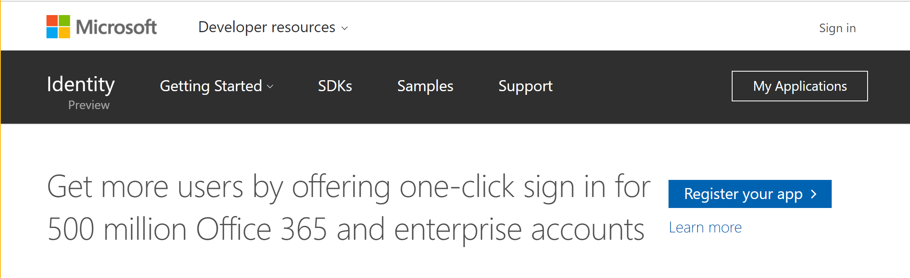
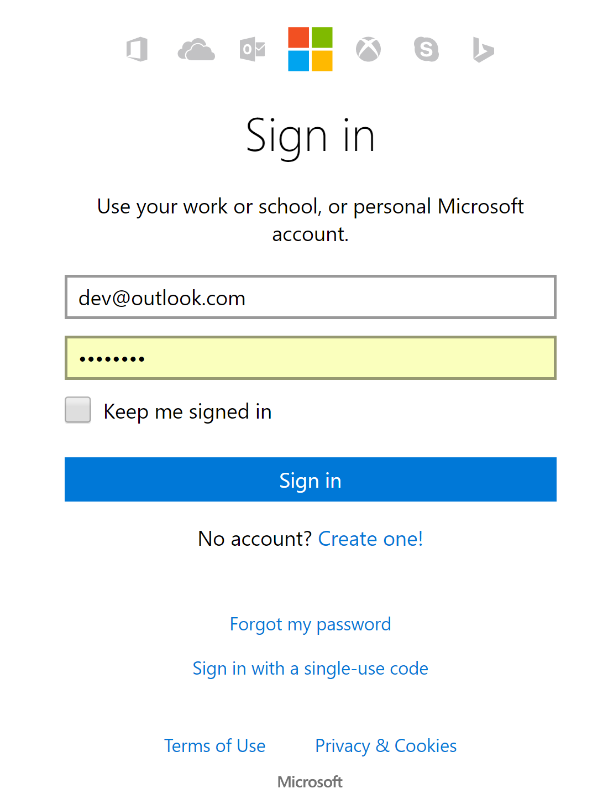
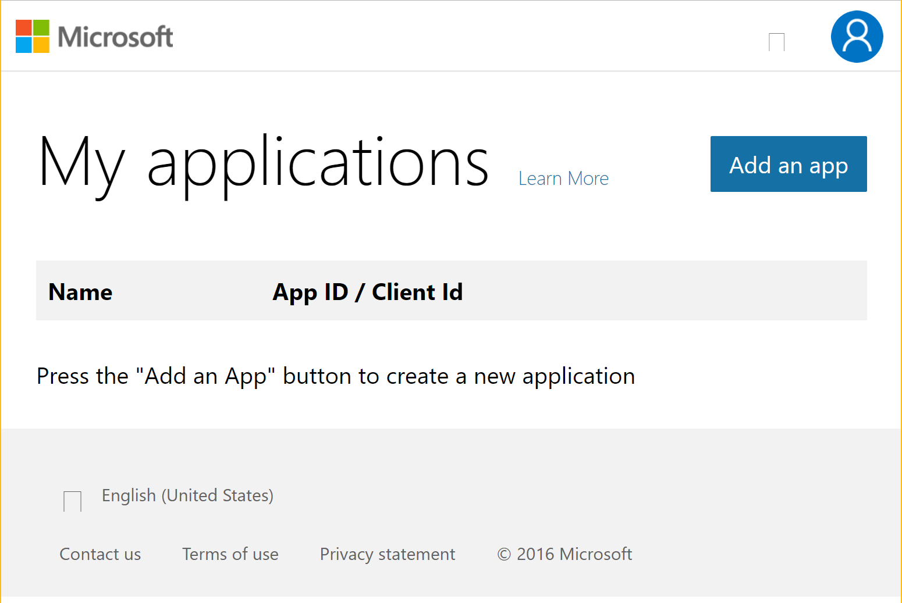
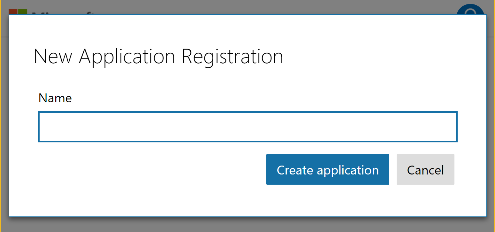
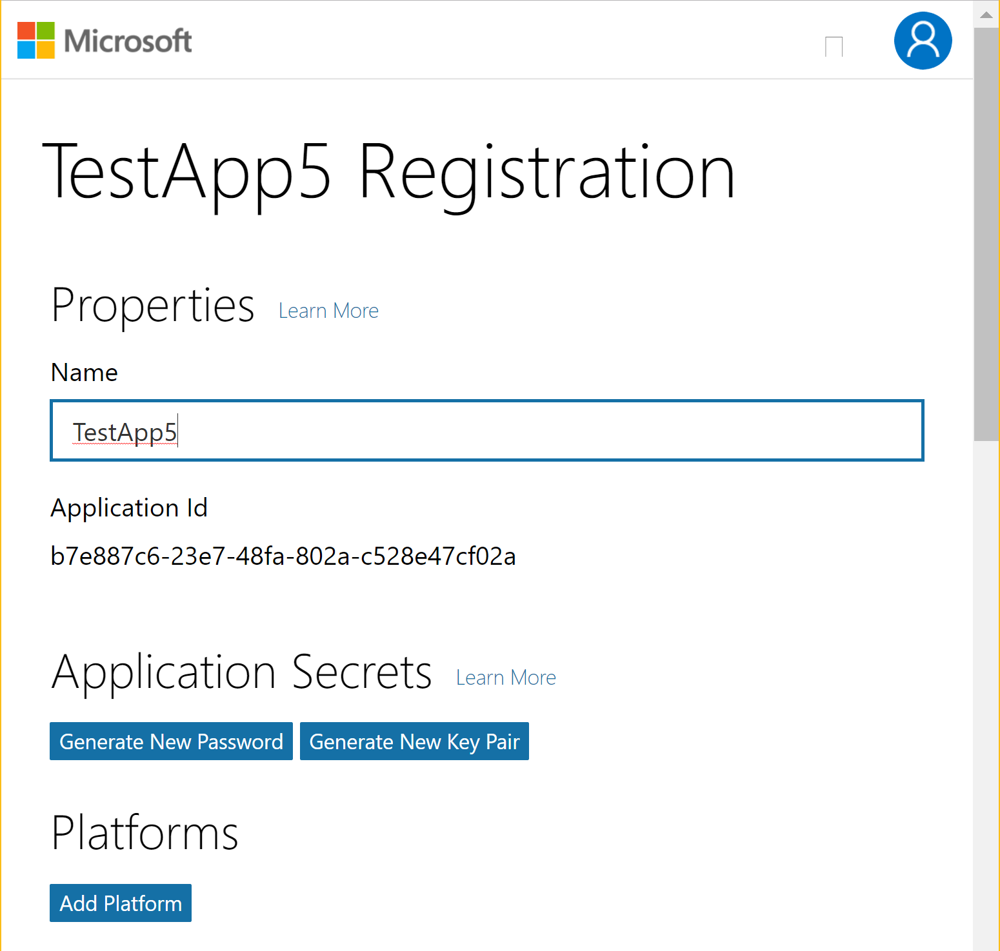
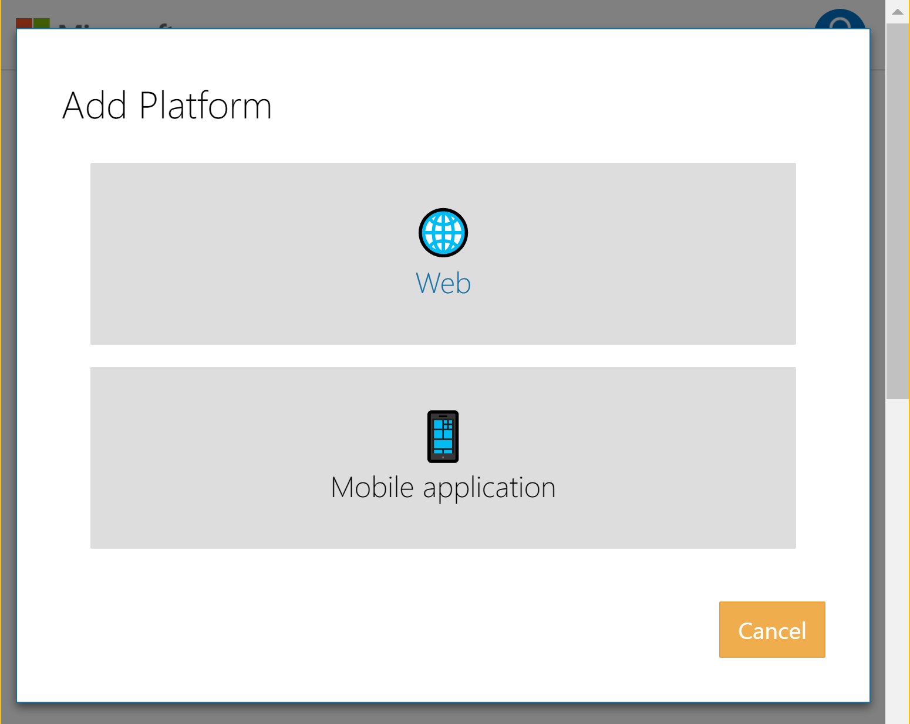
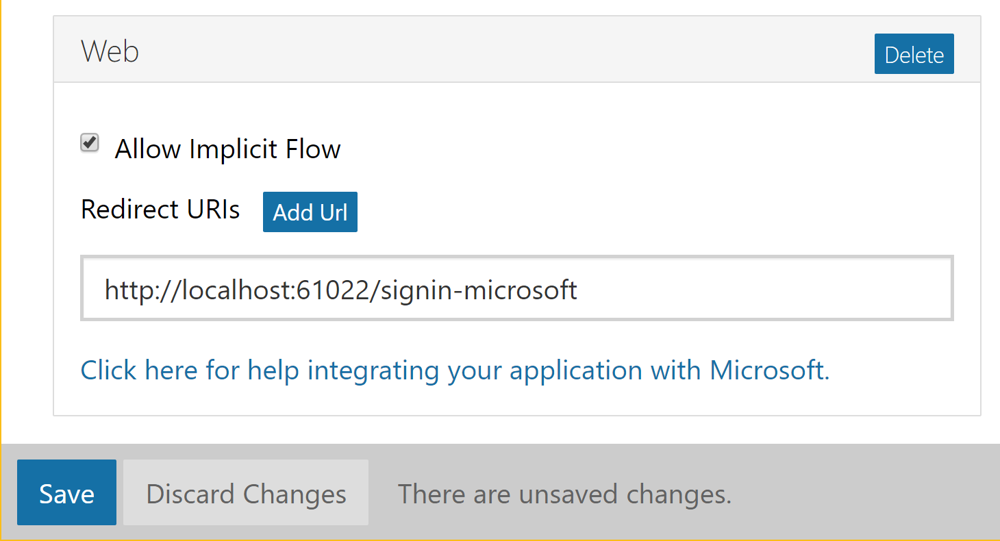
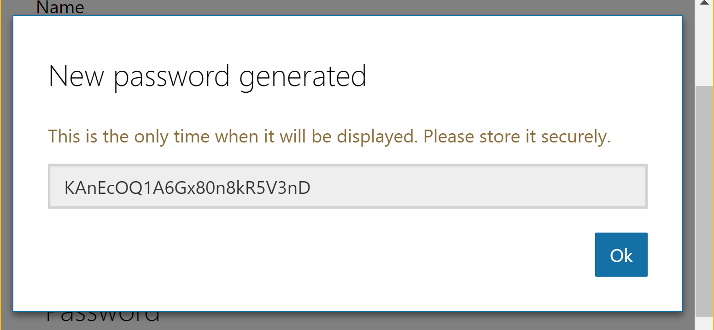
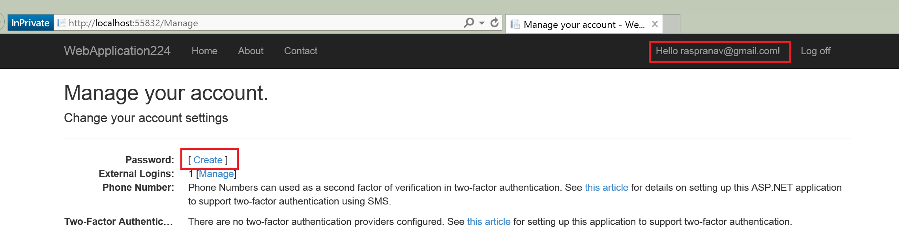

# Configuring Microsoft Account authentication

<a name=security-authentication-microsoft-logins></a>

This tutorial shows you how to enable your users to log in with their Microsoft account using a sample ASP.NET Core project created in the [previous section](sociallogins.md).

## Creating the app in Microsoft Developer Portal

* Navigate to [https://apps.dev.microsoft.com](https://apps.dev.microsoft.com):



* Tap **sign in**:



If you don't already have a Microsoft account, tap *[Create one!](https://signup.live.com/signup?wa=wsignin1.0&rpsnv=13&ct=1478151035&rver=6.7.6643.0&wp=SAPI_LONG&wreply=https%3a%2f%2fapps.dev.microsoft.com%2fLoginPostBack&id=293053&aadredir=1&contextid=D70D4F21246BAB50&bk=1478151036&uiflavor=web&uaid=f0c3de863a914c358b8dc01b1ff49e85&mkt=EN-US&lc=1033&lic=1)*. After signing in you will be redirected to *My applications* page:



* Tap **Add an app** in the upper right corner and enter your *application name*:



* The *Registration* page will be displayed:



* Tap **Add Platform** in the *Platforms* section and select the **Web** platform:



* In the new *Web* platform section, enter your current site URL with *signin-microsoft* appended into the **Redirect URIs** field. For example, `https://localhost:44320/signin-microsoft`:



> [!NOTE]
> You don't need to configure **signin-microsoft** as a route in your app. The ASP.NET Core team's implementation of the OAuth flow will create a temporary socket (called a *backchannel*) that listens at this route just for the duration of the OAuth flow.

* Don't forget to tap **Add Url** to ensure the Url was added.

* Tap **Save** to save changes.

## Storing Microsoft ApplicationId and Secret

Link sensitive settings like Microsoft *ApplicationId* and *Secret* to your application configuration by using the [Secret Manager tool](../app-secrets.md) instead of storing them in your configuration file directly, as described in the [previous section](sociallogins.md).

* Note the **Application Id** displayed on the *Registration* page.

* Tap **Generate New Password** in the *Application Secrets* section. This will display a box where you can copy the application secret:



* Execute the following in your project working directory to store the Microsoft secrets:

  <!-- literal_block {"ids": [], "xml:space": "preserve"} -->

  ````
  dotnet user-secrets set Authentication:Microsoft:ClientId <client-id>
  dotnet user-secrets set Authentication:Microsoft:ClientSecret <client-secret>
     ````

The following code reads the configuration values stored by the [Secret Manager](../app-secrets.md#security-app-secrets):

[!code-csharp[Main](../../common/samples/WebApplication1/Startup.cs?highlight=11&range=20-36)]

## Enable Microsoft Account middleware

> [!NOTE]
> You will need to use NuGet to install the [Microsoft.AspNetCore.Authentication.Microsoft](https://www.nuget.org/packages/Microsoft.AspNetCore.Authentication.Twitter/1.1.0-preview1-final) package if it hasn't already been installed. Alternatively, execute the following in your project directory:
>
> `dotnet install Microsoft.AspNetCore.Authentication.Microsoft`

Add the Microsoft Account middleware in the `Configure` method in `Startup.cs`:

[!code-csharp[Main](./sociallogins/sample/Startup.cs?highlight=39,40,41,42,43&range=64-115)]

## Login with Microsoft Account

Run your application and click Login. You will see an option for Microsoft:


When you click on Microsoft, you will be redirected to Microsoft for authentication:


Once you enter your Microsoft Account credentials, then you will be redirected back to the Web site where you can set your email.

You are now logged in using your Microsoft credentials:


## Optionally set password

When you register with an external login provider, you do not have a password registered with the app. This alleviates you from creating and remembering a password for the site, but it also makes you dependent on the external login provider. If the external login provider is unavailable, you won't be able to log in to the web site.

To create a password and login using your email that you set during the login process with external providers:

* Tap the **Hello <email alias>** link at the top right corner to navigate to the **Manage** view.



* Tap **Create**


* Set a valid password and you can use this to login with your email

## Next steps

* This article showed how you can authenticate with Microsoft. You can follow a similar approach to authenticate with [Facebook](facebook-logins.md), [Twitter](twitter-logins.md), [Google](google-logins.md) and other providers.

* Once you publish your Web site to Azure Web App, you should reset the *Secret* in the Microsoft developer portal.

* Set the *Authentication:Microsoft:ClientId* and *Authentication:Microsoft:ClientSecret* as application settings in the Azure Web App portal. The configuration system is setup to read keys from environment variables.