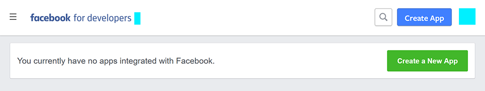
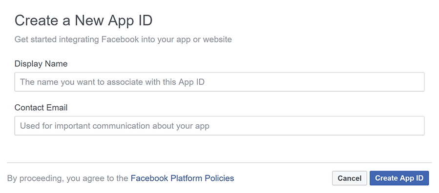
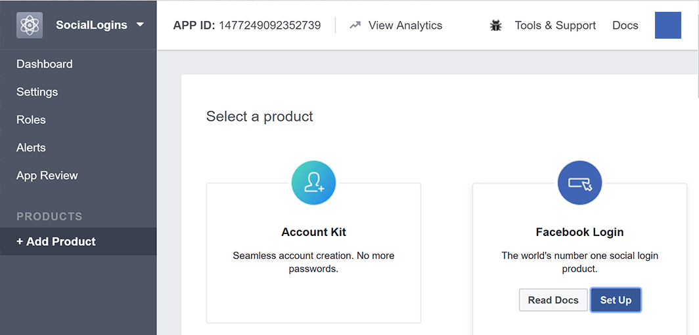
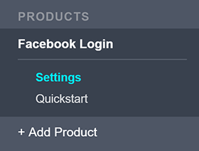
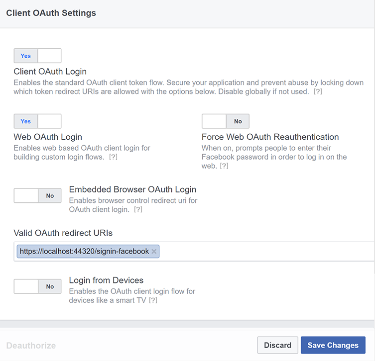

# Facebook external login setup in ASP.NET Core

By [Valeriy Novytskyy](https://github.com/01binary) and [Rick Anderson](https://twitter.com/RickAndMSFT)

<!-- per @rick-anderson and scott addie, don't update images. Remove images and point the customer to the FB set up page. FB needs to maintain  instructions to get key and secret.
-->

This tutorial with code examples shows how to enable your users to sign in with their Facebook account using a sample ASP.NET Core project created on the [previous page](xref:security/authentication/social/index). We start by creating a Facebook App ID by following the [official steps](https://developers.facebook.com).

## Create the app in Facebook

* Add the [Microsoft.AspNetCore.Authentication.Facebook](https://www.nuget.org/packages/Microsoft.AspNetCore.Authentication.Facebook) NuGet package to the project.

* Navigate to the [Facebook Developers app](https://developers.facebook.com/apps/) page and sign in. If you don't already have a Facebook account, use the **Sign up for Facebook** link on the login page to create one.  Once you have a Facebook account, follow the instructions to register as a Facebook Developer.

* From the **My Apps** menu select **Create App**. The **Create an app** form appears.
   

* Select an app type that best fits your project. For this project, select **Consumer**, and then **Next**. A new App ID is created.

* Fill out the form and tap the **Create App** button.

  

* On the **Add Products to Your App** page, select **Set Up** on the **Facebook Login** card.

  

* The **Quickstart** wizard launches with **Choose a Platform** as the first page. Bypass the wizard for now by clicking the **FaceBook Login** **Settings** link in the menu on the lower left:

  

* The **Client OAuth Settings** page is presented:

  

* Enter your development URI with */signin-facebook* appended into the **Valid OAuth Redirect URIs** field (for example: `https://localhost:44320/signin-facebook`). The Facebook authentication configured later in this tutorial will automatically handle requests at */signin-facebook* route to implement the OAuth flow.

> [!NOTE]
> The URI */signin-facebook* is set as the default callback of the Facebook authentication provider. You can change the default callback URI while configuring the Facebook authentication middleware via the inherited <xref:Microsoft.AspNetCore.Authentication.RemoteAuthenticationOptions.CallbackPath%2A?displayProperty=nameWithType> property of the <xref:Microsoft.AspNetCore.Authentication.Facebook.FacebookOptions> class.

* Select **Save Changes**.

* Select **Settings** > **Basic** link in the left navigation.

* Make a note of your `App ID` and your `App Secret`. You will add both into your ASP.NET Core application in the next section:

* When deploying the site you need to revisit the **Facebook Login** setup page, and register a new public URI.

## Store the Facebook app ID and secret

Store sensitive settings such as the Facebook app ID and secret values with [Secret Manager](xref:security/app-secrets). For this sample, use the following steps:

1. Initialize the project for secret storage per the instructions at [Enable secret storage](xref:security/app-secrets#enable-secret-storage).
1. Store the sensitive settings in the local secret store with the secret keys `Authentication:Facebook:AppId` and `Authentication:Facebook:AppSecret`:

    ```dotnetcli
    dotnet user-secrets set "Authentication:Facebook:AppId" "<app-id>"
    dotnet user-secrets set "Authentication:Facebook:AppSecret" "<app-secret>"
    ```

[!INCLUDE[](~/includes/environmentVarableColon.md)]

## Configure Facebook Authentication

:::moniker range="< aspnetcore-6.0"

Add the Authentication service to the `Startup.ConfigureServices`:

```csharp
services.AddAuthentication().AddFacebook(facebookOptions =>
{
    facebookOptions.AppId = Configuration["Authentication:Facebook:AppId"];
    facebookOptions.AppSecret = Configuration["Authentication:Facebook:AppSecret"];
});
```

:::moniker-end

:::moniker range=">= aspnetcore-6.0"

Add the Authentication service to the `Program`:

[!code-csharp[](~/security/authentication/social/social-code/6.x/ProgramFacebook.cs)]

:::moniker-end

[!INCLUDE [default settings configuration](includes/default-settings.md)]

## Sign in with Facebook

* Run the app and select **Log in**. 
* Under **Use another service to log in.**, select Facebook.
* You are redirected to **Facebook** for authentication.
* Enter your Facebook credentials.
* You are redirected back to your site where you can set your email.

You are now logged in using your Facebook credentials:

<a name="react"></a>

## React to cancel authorize external sign-in

<xref:Microsoft.AspNetCore.Authentication.RemoteAuthenticationOptions.AccessDeniedPath> can provide a redirect path to the user agent when the user doesn't approve the requested authorization demand.

The following code sets the `AccessDeniedPath` to `"/AccessDeniedPathInfo"`:

[!code-csharp[](~/security/authentication/social/social-code/StartupAccessDeniedPath.cs?name=snippetFB)]

We recommend the `AccessDeniedPath` page contains the following information:

* Remote authentication was canceled.
* This app requires authentication.
* To try sign-in again, select the Login link.

### Test AccessDeniedPath

* Navigate to [facebook.com](https://www.facebook.com/)
* If you are signed in, you must sign out.
* Run the app and select Facebook sign-in.
* Select **Not now**. You are redirected to the specified `AccessDeniedPath` page.

<!-- End of React  -->
[!INCLUDE[Forward request information when behind a proxy or load balancer section](includes/forwarded-headers-middleware.md)]

[!INCLUDE[](includes/chain-auth-providers.md)]

 For more information on configuration options supported by Facebook authentication, see the <xref:Microsoft.AspNetCore.Builder.FacebookOptions> API reference. Configuration options can be used to:

* Request different information about the user.
* Add query string arguments to customize the login experience.

## Troubleshooting

* **ASP.NET Core 2.x only:** If Identity isn't configured by calling `services.AddIdentity` in `ConfigureServices`, attempting to authenticate will result in *ArgumentException: The 'SignInScheme' option must be provided*. The project template used in this tutorial ensures that this is done.
* If the site database has not been created by applying the initial migration, you get *A database operation failed while processing the request* error. Tap **Apply Migrations** to create the database and refresh to continue past the error.

## Next steps

* This article showed how you can authenticate with Facebook. You can follow a similar approach to authenticate with other providers listed on the [previous page](xref:security/authentication/social/index).

* Once you publish your web site to Azure web app, you should reset the `AppSecret` in the Facebook developer portal.

* Set the `Authentication:Facebook:AppId` and `Authentication:Facebook:AppSecret` as application settings in the Azure portal. The configuration system is set up to read keys from environment variables.
