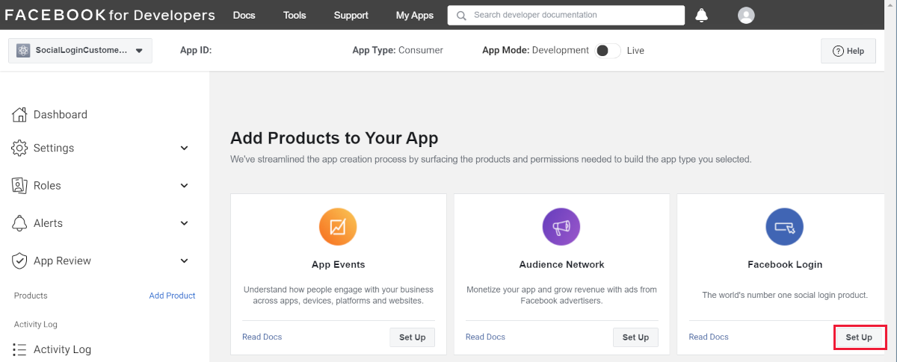

# Facebook external login setup in ASP.NET Core

By [Valeriy Novytskyy](https://github.com/01binary) and [Rick Anderson](https://twitter.com/RickAndMSFT)

This tutorial with code examples shows how to enable your users to sign in with their Facebook account using a sample ASP.NET Core 2.0 project created on the [previous page](xref:security/authentication/social/index). We start by creating a Facebook App ID by following the [official steps](https://developers.facebook.com).

## Create the app in Facebook

* Navigate to the [Facebook Developers app](https://developers.facebook.com/apps/) page and sign in. If you don't already have a Facebook account, use the **Sign up for Facebook** link on the login page to create one.

* Tap the **Add a New App** button in the upper right corner to create a new App ID.

   

* Fill out the form and tap the **Create App ID** button.

  

* On the **Select a product** page, click **Set Up** on the **Facebook Login** card.

  

* The **Quickstart** wizard will launch with **Choose a Platform** as the first page. Bypass the wizard for now by clicking the **Settings** link in the menu on the left:

  

* You are presented with the **Client OAuth Settings** page:

  

* Enter your development URI with */signin-facebook* appended into the **Valid OAuth Redirect URIs** field (for example: `https://localhost:44320/signin-facebook`). The Facebook authentication configured later in this tutorial will automatically handle requests at */signin-facebook* route to implement the OAuth flow.

> [!NOTE]
> The URI */signin-facebook* is set as the default callback of the Facebook authentication provider. You can change the default callback URI while configuring the Facebook authentication middleware via the inherited [RemoteAuthenticationOptions.CallbackPath](/dotnet/api/microsoft.aspnetcore.authentication.remoteauthenticationoptions.callbackpath) property of the [FacebookOptions](/dotnet/api/microsoft.aspnetcore.authentication.facebook.facebookoptions) class.

* Click **Save Changes**.

* Click **Settings** > **Basic** link in the left navigation.

  On this page, make a note of your `App ID` and your `App Secret`. You will add both into your ASP.NET Core application in the next section:

* When deploying the site you need to revisit the **Facebook Login** setup page and register a new public URI.

## Store Facebook App ID and App Secret

Link sensitive settings like Facebook `App ID` and `App Secret` to your application configuration using the [Secret Manager](xref:security/app-secrets). For the purposes of this tutorial, name the tokens `Authentication:Facebook:AppId` and `Authentication:Facebook:AppSecret`.

[!INCLUDE[](~/includes/environmentVarableColon.md)]

Execute the following commands to securely store `App ID` and `App Secret` using Secret Manager:

```dotnetcli
dotnet user-secrets set Authentication:Facebook:AppId <app-id>
dotnet user-secrets set Authentication:Facebook:AppSecret <app-secret>
```

## Configure Facebook Authentication

::: moniker range=">= aspnetcore-2.0"

Add the Facebook service in the `ConfigureServices` method in the *Startup.cs* file:

```csharp
services.AddDefaultIdentity<IdentityUser>()
        .AddDefaultUI(UIFramework.Bootstrap4)
        .AddEntityFrameworkStores<ApplicationDbContext>();

services.AddAuthentication().AddFacebook(facebookOptions =>
{
    facebookOptions.AppId = Configuration["Authentication:Facebook:AppId"];
    facebookOptions.AppSecret = Configuration["Authentication:Facebook:AppSecret"];
});
```

[!INCLUDE [default settings configuration](includes/default-settings.md)]

[!INCLUDE[](includes/chain-auth-providers.md)]

::: moniker-end

::: moniker range="< aspnetcore-2.0"

Install the [Microsoft.AspNetCore.Authentication.Facebook](https://www.nuget.org/packages/Microsoft.AspNetCore.Authentication.Facebook) package.

* To install this package with Visual Studio 2017, right-click on the project and select **Manage NuGet Packages**.
* To install with .NET Core CLI, execute the following in your project directory:

   `dotnet add package Microsoft.AspNetCore.Authentication.Facebook`

Add the Facebook middleware in the `Configure` method in *Startup.cs* file:

```csharp
app.UseFacebookAuthentication(new FacebookOptions()
{
    AppId = Configuration["Authentication:Facebook:AppId"],
    AppSecret = Configuration["Authentication:Facebook:AppSecret"]
});
```

::: moniker-end

See the [FacebookOptions](/dotnet/api/microsoft.aspnetcore.builder.facebookoptions) API reference for more information on configuration options supported by Facebook authentication. Configuration options can be used to:

* Request different information about the user.
* Add query string arguments to customize the login experience.

## Sign in with Facebook

Run your application and click **Log in**. You see an option to sign in with Facebook.


When you click on **Facebook**, you are redirected to Facebook for authentication:


Facebook authentication requests public profile and email address by default:


Once you enter your Facebook credentials you are redirected back to your site where you can set your email.

You are now logged in using your Facebook credentials:


[!INCLUDE[Forward request information when behind a proxy or load balancer section](includes/forwarded-headers-middleware.md)]

## Troubleshooting

* **ASP.NET Core 2.x only:** If Identity isn't configured by calling `services.AddIdentity` in `ConfigureServices`, attempting to authenticate will result in *ArgumentException: The 'SignInScheme' option must be provided*. The project template used in this tutorial ensures that this is done.
* If the site database has not been created by applying the initial migration, you get *A database operation failed while processing the request* error. Tap **Apply Migrations** to create the database and refresh to continue past the error.

## Next steps

* Add the [Microsoft.AspNetCore.Authentication.Facebook](https://www.nuget.org/packages/Microsoft.AspNetCore.Authentication.Facebook) NuGet package to your project for advanced Facebook authentication scenarios. This package isn't required to integrate Facebook external login functionality with your app. 

* This article showed how you can authenticate with Facebook. You can follow a similar approach to authenticate with other providers listed on the [previous page](xref:security/authentication/social/index).

* Once you publish your web site to Azure web app, you should reset the `AppSecret` in the Facebook developer portal.

* Set the `Authentication:Facebook:AppId` and `Authentication:Facebook:AppSecret` as application settings in the Azure portal. The configuration system is set up to read keys from environment variables.
