# Configuring Google authentication in ASP.NET Core

<a name=security-authentication-google-logins></a>

By [Valeriy Novytskyy](https://github.com/01binary) and [Rick Anderson](https://twitter.com/RickAndMSFT)

This tutorial shows you how to enable your users to sign in with their Google+ account using a sample ASP.NET Core 2.0 project created on the [previous page](index.md). We start by following the [official steps](https://developers.google.com/identity/sign-in/web/devconsole-project) to create a new app in Google API Console.

## Create the app in Google API Console

* Navigate to [https://console.developers.google.com/projectselector/apis/library](https://console.developers.google.com/projectselector/apis/library) and sign in. If you don't already have a Google account, use **More options** > **[Create account](https://accounts.google.com/SignUpWithoutGmail?service=cloudconsole&continue=https%3A%2F%2Fconsole.developers.google.com%2Fprojectselector%2Fapis%2Flibrary&ltmpl=api)** link to create one:

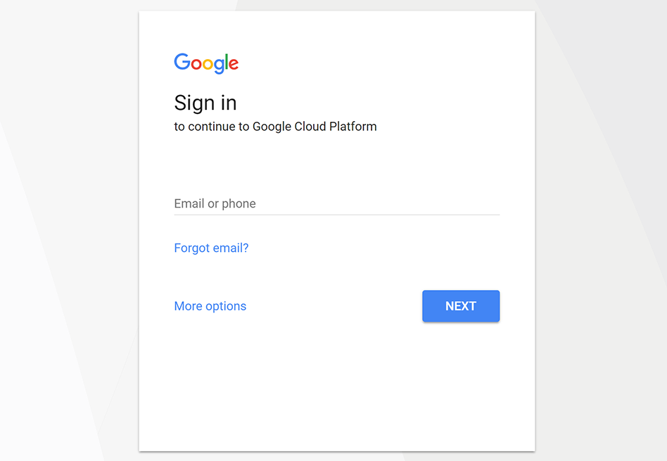

* You are redirected to **API Manager Library** page:

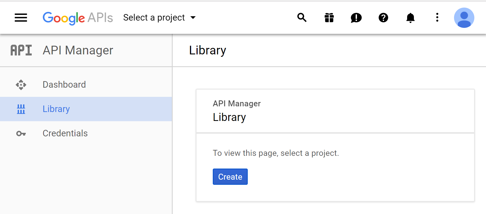

* Tap **Create** and enter your **Project name**:

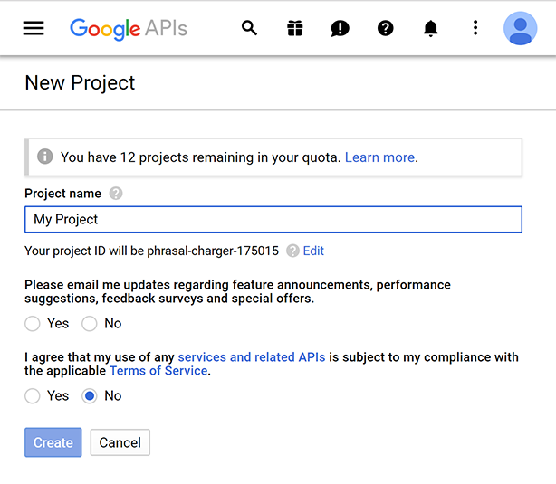

* After accepting the dialog, you are redirected back to the Library page allowing you to choose features for your new app. Find **Google+ API** in the list and click on its link to add the API feature:

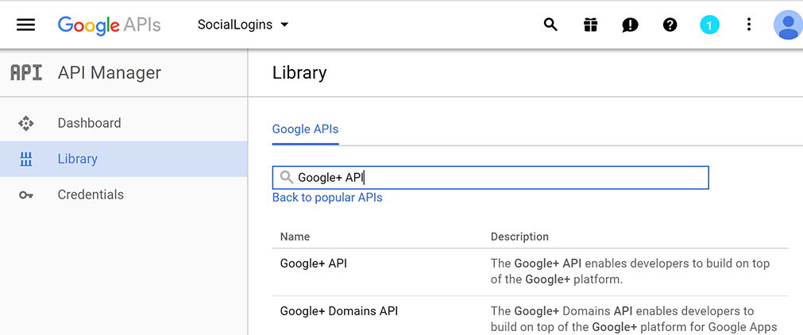

* The page for the newly added API is displayed. Tap **Enable** to add Google+ sign in feature to your app:

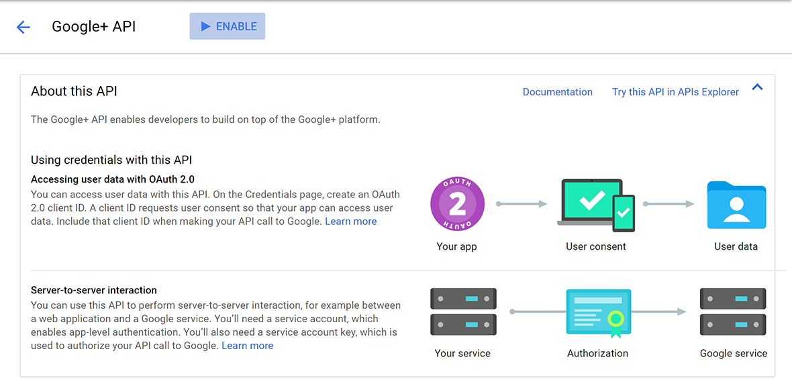

* After enabling the API, tap **Create credentials** to configure the secrets:

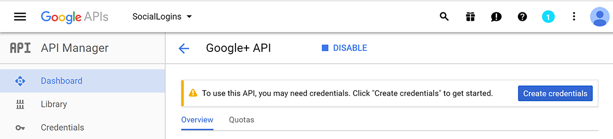

* Choose:
   * **Google+ API**
   * **Web server (e.g. node.js, Tomcat)**, and
   * **User data**:

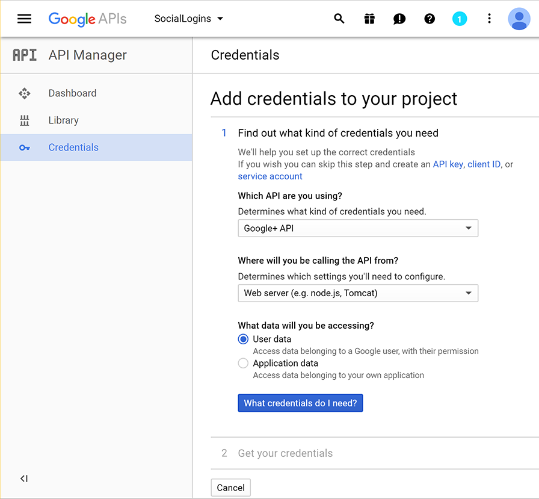

* Tap **What credentials do I need?** which takes you to the second step of app configuration, **Create an OAuth 2.0 client ID**:

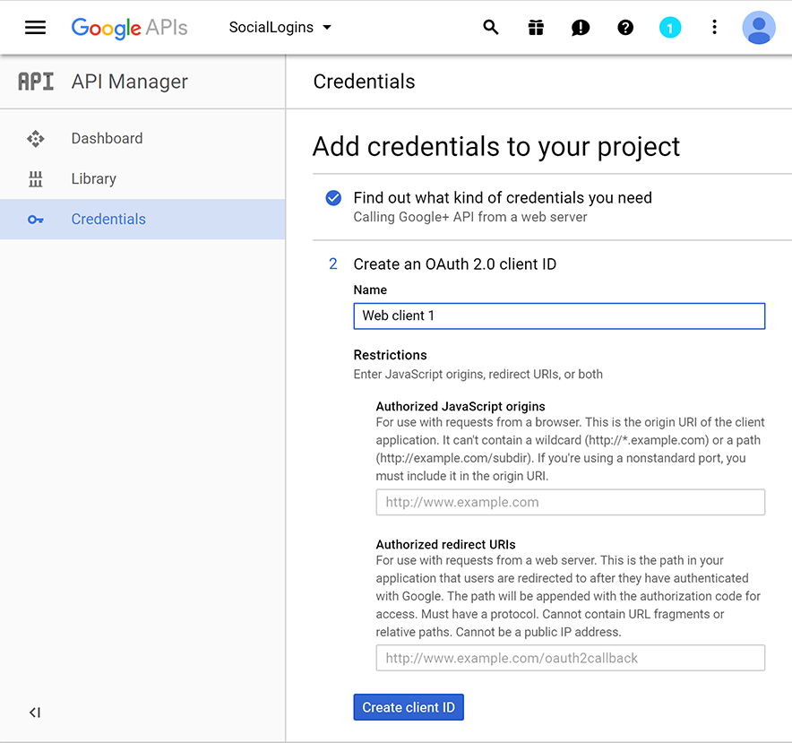

* Because we are creating a Google+ project with just one feature (sign in), we can enter the same **Name** for the OAuth 2.0 client ID as the one we used for the project.

* Enter your development URI with */signin-google* appended into the **Authorized redirect URIs** field (for example: `https://localhost:44320/signin-google`). The Google authentication configured later in this tutorial will automatically handle requests at */signin-google* route to implement the OAuth flow.

* Press TAB to add the **Authorized redirect URIs** entry.

* Tap **Create client ID**, which takes you to the third step, **Set up the OAuth 2.0 consent screen**:

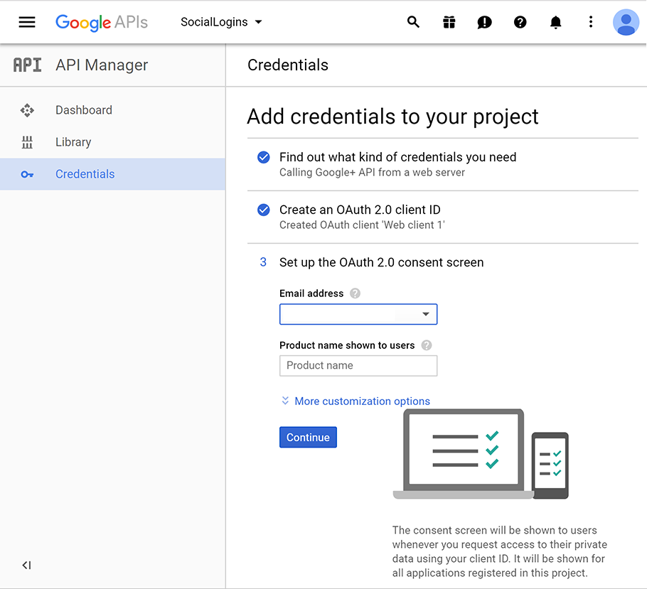

* Enter your public facing **Email address** and the **Product name** shown for your app when Google+ prompts the user to sign in. Additional options are available under **More customization options**.

* Tap **Continue** to proceed to the last step, **Download credentials**:

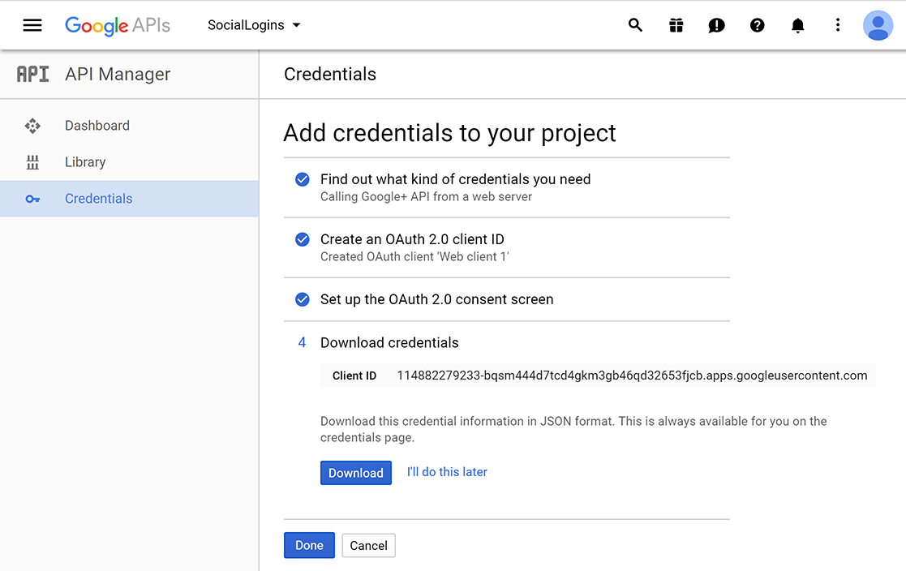

* Tap **Download** to save a JSON file with application secrets, and **Done** to complete creation of the new app.

* When deploying the site you'll need to revisit the **Google Console** and register a new public url.

## Store Google ClientID and ClientSecret

Link sensitive settings like Google `Client ID` and `Client Secret` to your application configuration using the [Secret Manager](../../app-secrets.md). For the purposes of this tutorial, name the tokens `Authentication:Google:ClientId` and `Authentication:Google:ClientSecret`.

The values for these tokens can be found in the JSON file downloaded in the previous step under `web.client_id` and `web.client_secret`.

## Configure Google Authentication

The project template used in this tutorial ensures that [Microsoft.AspNetCore.Authentication.Google](https://www.nuget.org/packages/Microsoft.AspNetCore.Authentication.Google) package is installed.

 * To install this package with Visual Studio 2017, right-click on the project and select **Manage NuGet Packages**.
 * To install with .NET Core CLI, execute the following in your project directory:

   `dotnet add package Microsoft.AspNetCore.Authentication.Google`

# [ASP.NET Core 2.x](#tab/aspnetcore2x)

Add the Google service in the `ConfigureServices` method in *Startup.cs* file:

```csharp
services.AddAuthentication().AddGoogle(googleOptions =>
{
    googleOptions.ClientId = Configuration["Authentication:Google:ClientId"];
    googleOptions.ClientSecret = Configuration["Authentication:Google:ClientSecret"];
});
```

The `AddAuthentication` method should only be called once when adding multiple authentication providers. Subsequent calls to it have the potential of overriding any previously configured [AuthenticationOptions](https://docs.microsoft.com/aspnet/core/api/microsoft.aspnetcore.builder.authenticationoptions) properties.

# [ASP.NET Core 1.x](#tab/aspnetcore1x)

Add the Google middleware in the `Configure` method in *Startup.cs* file:

```csharp
app.UseGoogleAuthentication(new GoogleOptions()
{
    ClientId = Configuration["Authentication:Google:ClientId"],
    ClientSecret = Configuration["Authentication:Google:ClientSecret"]
});
```

---

See the [GoogleOptions](https://docs.microsoft.com/aspnet/core/api/microsoft.aspnetcore.builder.googleoptions) API reference for more information on configuration options supported by Google authentication. This can be used to request different information about the user.

## Sign in with Google

Run your application and click **Log in**. An option to sign in with Google appears:

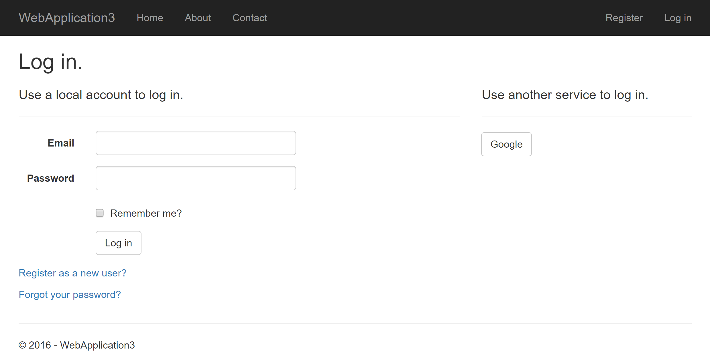

When you click on Google, you are redirected to Google for authentication:

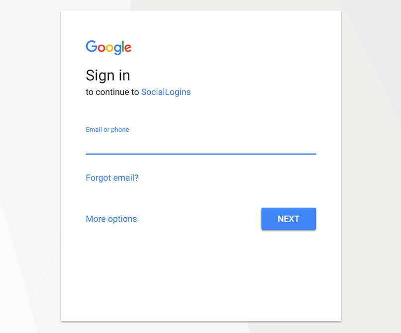

After entering your Google credentials, then you are redirected back to the web site where you can set your email.

You are now logged in using your Google credentials:


## Troubleshooting

* If you receive a `403 (Forbidden)` error page from your own app when running in development mode (or break into the debugger with the same error), ensure that **Google+ API** has been enabled in the **API Manager Library** by following the steps listed [earlier on this page](#create-the-app-in-google-api-console). If the sign in doesn't work and you aren't getting any errors, switch to development mode to make the issue easier to debug.
* **ASP.NET Core 2.x only:** If Identity is not configured by calling `services.AddIdentity` in `ConfigureServices`, attempting to authenticate will result in *ArgumentException: The 'SignInScheme' option must be provided*. The project template used in this tutorial ensures that this is done.
* If the site database has not been created by applying the initial migration, you will get *A database operation failed while processing the request* error. Tap **Apply Migrations** to create the database and refresh to continue past the error.

## Next steps

* This article showed how you can authenticate with Google. You can follow a similar approach to authenticate with other providers listed on the [previous page](index.md).

* Once you publish your web site to Azure web app, you should reset the `ClientSecret` in the Google API Console.

* Set the `Authentication:Google:ClientId` and `Authentication:Google:ClientSecret` as application settings in the Azure portal. The configuration system is set up to read keys from environment variables.
