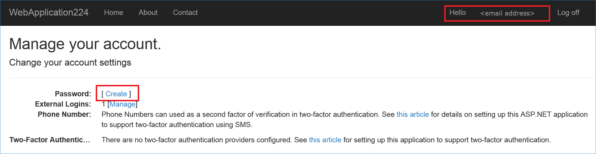

# Enabling authentication using Facebook, Google and other external providers

<a name=security-authentication-social-logins></a>

By [Rick Anderson](https://twitter.com/RickAndMSFT), [Pranav Rastogi](https://github.com/rustd), and [Valeriy Novytskyy](https://github.com/01binary)

This tutorial demonstrates how to build an ASP.NET Core app that enables users to log in using OAuth 2.0/1.0a with credentials from external authentication providers.

[Facebook](facebook-logins.md), [Twitter](twitter-logins.md), [Google](google-logins.md), and [Microsoft](microsoft-logins.md) providers are covered in the following sections. Many third-party packages facilitate the use of other providers not covered here.


Enabling users to sign in with their existing credentials is convenient for the users and shifts many of the complexities of managing the sign-in process onto a third party. For examples of how social logins can drive traffic and customer conversions, see case studies by [Facebook](https://developers.facebook.com/case-studies) and [Twitter](https://dev.twitter.com/resources/case-studies).

> [!NOTE]
> Packages presented here abstract a great deal of complexity of the OAuth authentication flow, but understanding the details may become necessary when troubleshooting. Many resources are available; for example, see [Introduction to OAuth 2](https://www.digitalocean.com/community/tutorials/an-introduction-to-oauth-2) or [Understanding OAuth 2](http://www.bubblecode.net/en/2016/01/22/understanding-oauth2/). Some issues can be resolved by looking at the [ASP.NET Core source code for the provider packages](https://github.com/aspnet/Security/tree/dev/src).

## Create a New ASP.NET Core Project

> [!NOTE]
> This tutorial requires the latest update (**Update 3**) for Visual Studio 2015 and ASP.NET Core.

* In Visual Studio, create a new project (from the Start Page, or via **File > New > Project**):


* Tap **Web Application** and verify **Authentication** is set to **Individual User Accounts**:


## Enable SSL

Some external authentication providers reject requests coming from origins that don't use the **https** protocol. This reflects the trend of major providers like [Google](https://security.googleblog.com/2014/08/https-as-ranking-signal_6.html) moving their public API services to https and discontinuing the use of unencrypted endpoints. We encourage you to follow this trend and enable SSL for your entire site. For Visual Studio 2017 RC1, see instructions below.

* In **Solution Explorer**, right-click the project and select **Properties**.

* On the left pane, tap **Debug**.

* Check **Enable SSL**.

* Copy the SSL URL and paste it into the **App URL**:


Visual Studio 2017 RC1:

Edit the *properties/launchsettings.json* file. Add an sslPort between 44300 and 44399:

```
{
  "iisSettings": {
    "windowsAuthentication": false,
    "anonymousAuthentication": true,
    "iisExpress": {
      "applicationUrl": "http://localhost:62183/",
      "sslPort": 0
    }
  },
```

* Modify the `services.AddMvc();` code in `Startup.cs` under `ConfigureServices` to reject all requests that are not coming over *https*:

```csharp
services.AddMvc(options =>
{
    options.SslPort = 44321;
    options.Filters.Add(new RequireHttpsAttribute ());
});
```

* Test the app to ensure that static files are still being served and publicly exposed routes are accessible.
   * There shouldn't be any warnings logged to the browser console in Developer Tools.
   * Attempting to navigate to the previous URL that used the *http* protocol should now result in **connection rejected** errors from the browser or a blank page.

## Use SecretManager to store tokens assigned by login providers

The template used to create the sample project in this tutorial has code in `Startup.cs` which reads the configuration values from a secret store:

[!code-csharp[Main](../../../common/samples/WebApplication1/Startup.cs?highlight=11&range=20-36)]

As a best practice, it is not recommended to store the secrets in a configuration file in the application since they can be checked into source control which may be publicly accessible.

The **SecretManager** tool stores sensitive application settings in the user profile folder on the local machine. These settings are then seamlessly merged with settings from all other sources during application startup.

> [!NOTE]
> Most login providers assign **Application Id** and **Application Secret** during the registration process. These values are effectively the *user name* and *password* your application uses to access their API, and constitute the "secrets" linked to your application configuration with the help of **Secret Manager** instead of storing them in configuration files directly.

Install the [Secret Manager tool](../../app-secrets.md) so that you can use it to store tokens assigned by each login provider below.

## Setup login providers required by your application

Use the following pages to configure your application to use the respective providers:

* [Facebook](facebook-logins.md) instructions
* [Twitter](twitter-logins.md) instructions
* [Google](google-logins.md) instructions
* [Microsoft](microsoft-logins.md) instructions
* [Other provider](other-logins.md) instructions

> [!NOTE]
> Call `app.UseIdentity` (in `Configure`) before any other external providers.

## Optionally set password

When you register with an external login provider, you do not have a password registered with the app. This alleviates you from creating and remembering a password for the site, but it also makes you dependent on the external login provider. If the external login provider is unavailable, you won't be able to log in to the web site.

To create a password and sign in using your email that you set during the sign in process with external providers:

* Tap the **Hello <email alias>** link at the top right corner to navigate to the **Manage** view.



* Tap **Create**


* Set a valid password and you can use this to sign in with your email.

## Next steps

* This article introduced external authentication and explained the prerequisites required to add external logins to your ASP.NET Core app.

* Reference provider-specific pages to configure logins for the providers required by your app.
