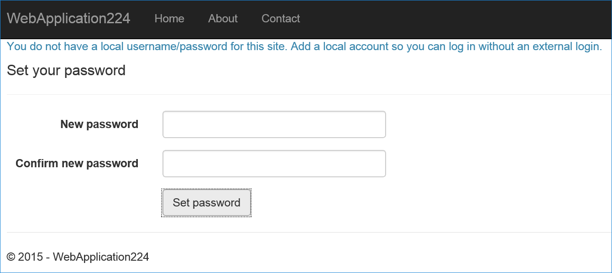

# Facebook, Google, and external provider authentication in ASP.NET Core

By [Valeriy Novytskyy](https://github.com/01binary) and [Rick Anderson](https://twitter.com/RickAndMSFT)

This tutorial demonstrates how to build an ASP.NET Core app that enables users to sign in using OAuth 2.0 with credentials from external authentication providers.

[Facebook](xref:security/authentication/facebook-logins), [Twitter](xref:security/authentication/twitter-logins), [Google](xref:security/authentication/google-logins), and [Microsoft](xref:security/authentication/microsoft-logins) providers are covered in the following sections and use the starter project created in this article. Other providers are available in third-party packages such as [AspNet.Security.OAuth.Providers](https://github.com/aspnet-contrib/AspNet.Security.OAuth.Providers) and [AspNet.Security.OpenId.Providers](https://github.com/aspnet-contrib/AspNet.Security.OpenId.Providers).

Enabling users to sign in with their existing credentials:

* Is convenient for the users.
* Shifts many of the complexities of managing the sign-in process onto a third party.

## Create a New ASP.NET Core Project

# [Visual Studio](#tab/visual-studio)

* Select the **ASP.NET Core Web App** template. Select **OK**.
* In the **Authentication type** input,  select  **Individual User Accounts**.

# [Visual Studio Code / Visual Studio for Mac](#tab/visual-studio-code+visual-studio-mac)

* Open the terminal.  For Visual Studio Code you can open the [integrated terminal](https://code.visualstudio.com/docs/editor/integrated-terminal).

* Change directories (`cd`) to a folder which will contain the project.

* For Windows, run the following command:

  ```dotnetcli
  dotnet new webapp -o WebApp1 -au Individual -uld
  ```

  For macOS and Linux, run the following command:

  ```dotnetcli
  dotnet new webapp -o WebApp1 -au Individual
  ```

  * The `dotnet new` command creates a new Razor Pages project in the *WebApp1* folder.
  * `-au Individual` creates the code for Individual authentication.
  * `-uld` uses LocalDB, a lightweight version of SQL Server Express for Windows. Omit `-uld` to use SQLite.
  * The `code` command opens the *WebApp1* folder in a new instance of Visual Studio Code.

---

## Apply migrations

* Run the app and select the **Register** link.
* Enter the email and password for the new account, and then select **Register**.
* Follow the instructions to apply migrations.

[!INCLUDE[Forward request information when behind a proxy or load balancer section](includes/forwarded-headers-middleware.md)]

## Use SecretManager to store tokens assigned by login providers

Social login providers assign **Application Id** and **Application Secret** tokens during the registration process. The exact token names vary by provider. These tokens represent the credentials your app uses to access their API. The tokens constitute the "user secrets" that can be linked to your app configuration with the help of [Secret Manager](xref:security/app-secrets#secret-manager). User secrets are a more secure alternative to storing the tokens in a configuration file, such as `appsettings.json`.

> [!IMPORTANT]
> Secret Manager is for development purposes only. You can store and protect Azure test and production secrets with the [Azure Key Vault configuration provider](xref:security/key-vault-configuration).

Follow the steps in [Safe storage of app secrets in development in ASP.NET Core](xref:security/app-secrets) topic to store tokens assigned by each login provider below.

## Setup login providers required by your application

Use the following topics to configure your application to use the respective providers:

* [Facebook](xref:security/authentication/facebook-logins) instructions
* [Twitter](xref:security/authentication/twitter-logins) instructions
* [Google](xref:security/authentication/google-logins) instructions
* [Microsoft](xref:security/authentication/microsoft-logins) instructions
* [Other provider](xref:security/authentication/otherlogins) instructions

[!INCLUDE[](includes/chain-auth-providers6.md)]

## Optionally set password

When you register with an external login provider, you don't have a password registered with the app. This alleviates you from creating and remembering a password for the site, but it also makes you dependent on the external login provider. If the external login provider is unavailable, you won't be able to sign in to the web site.

To create a password and sign in using your email that you set during the sign in process with external providers:

* Select the **Hello &lt;email alias&gt;** link at the top-right corner to navigate to the **Manage** view.


* Select **Create**



* Set a valid password and you can use this to sign in with your email.

## Next steps

* See [this GitHub issue](https://github.com/dotnet/AspNetCore.Docs/issues/10563) for information on how to customize the login buttons.
* This article introduced external authentication and explained the prerequisites required to add external logins to your ASP.NET Core app.
* Reference provider-specific pages to configure logins for the providers required by your app.
* You may want to persist additional data about the user and their access and refresh tokens. For more information, see <xref:security/authentication/social/additional-claims>.
