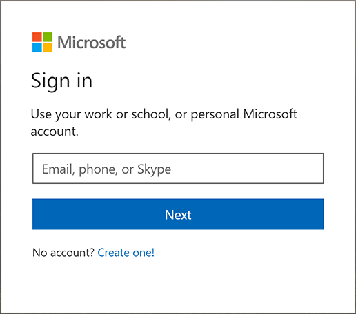
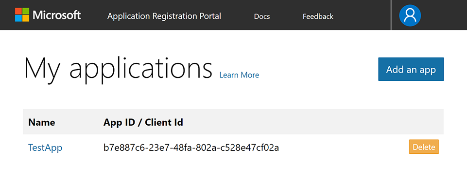
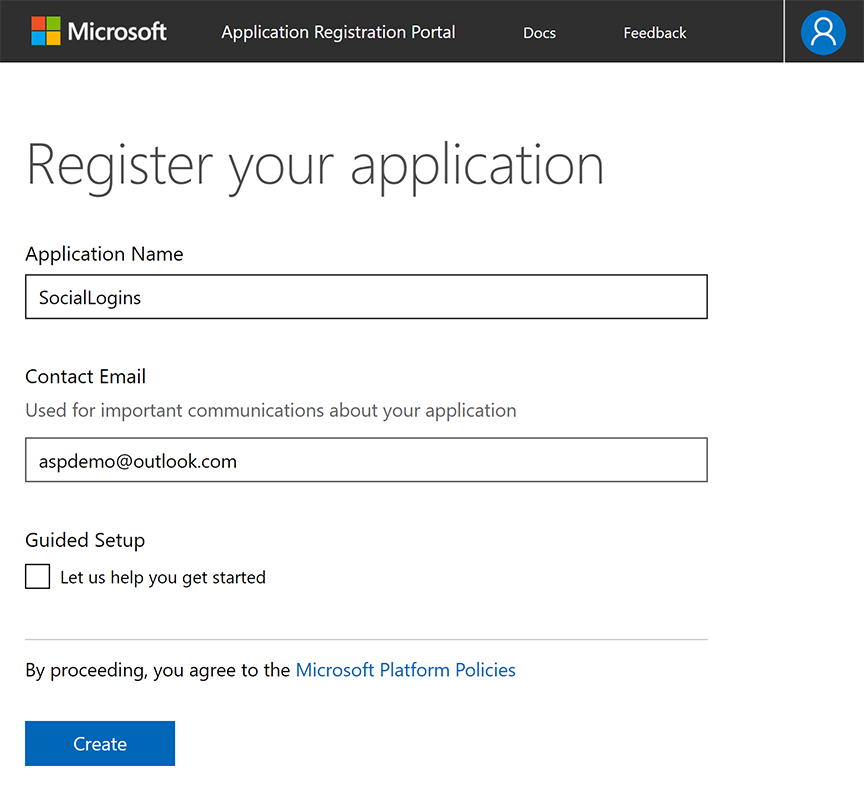
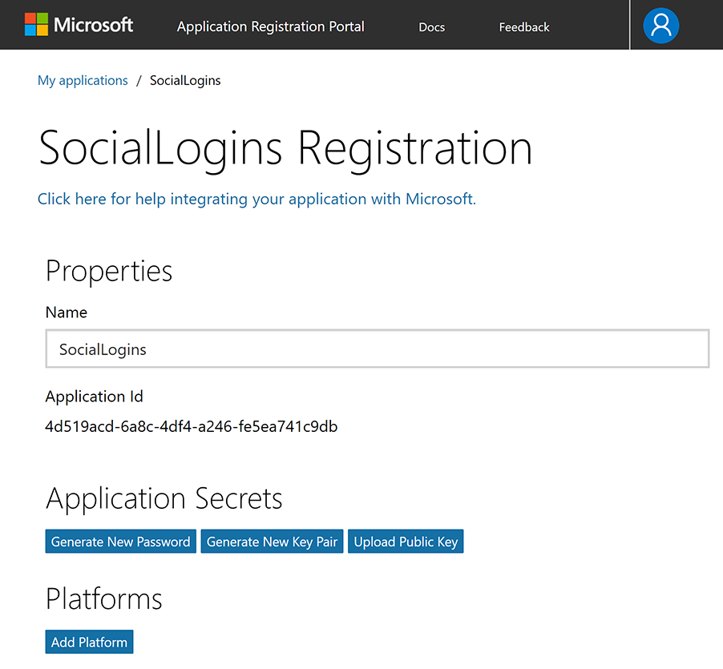
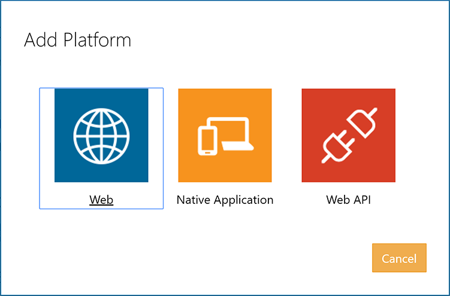
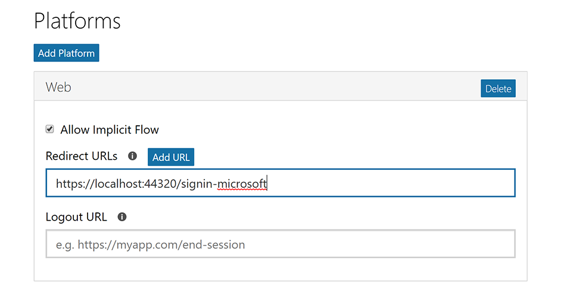
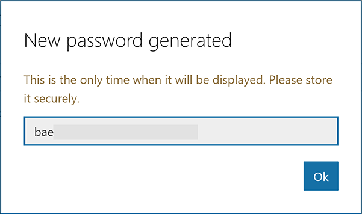
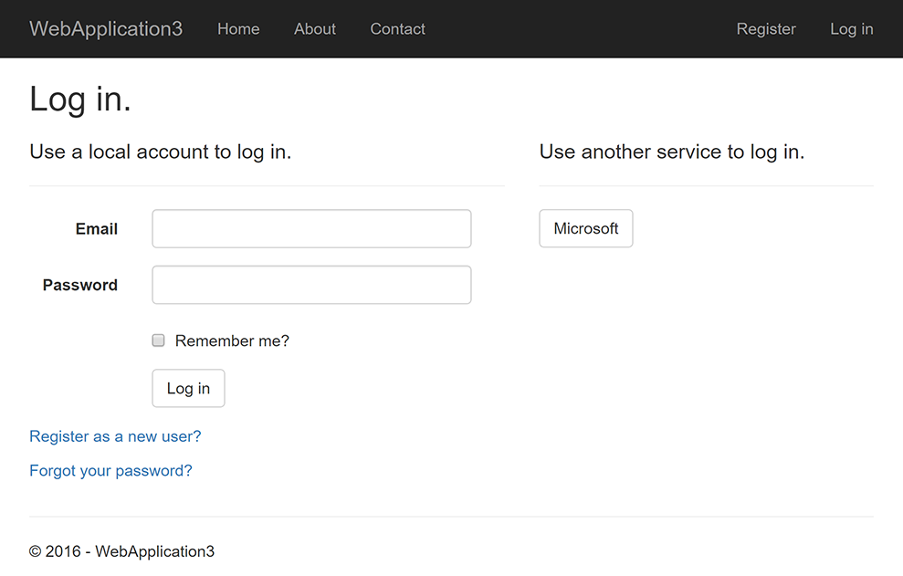
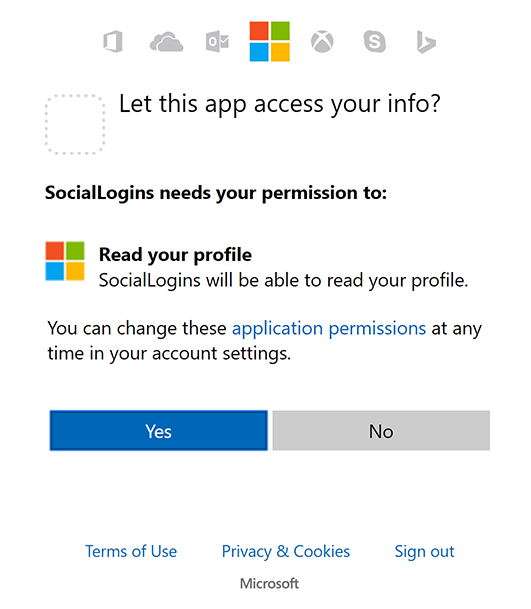

# Configuring Microsoft Account authentication

<a name=security-authentication-microsoft-logins></a>

By [Valeriy Novytskyy](https://github.com/01binary) and [Rick Anderson](https://twitter.com/RickAndMSFT)

This tutorial shows you how to enable your users to sign in with their Microsoft account using a sample ASP.NET Core 2.0 project created on the [previous page](index.md).

## Create the app in Microsoft Developer Portal

* Navigate to [https://apps.dev.microsoft.com](https://apps.dev.microsoft.com) and create or sign into a Microsoft account:



If you don't already have a Microsoft account, tap **[Create one!](https://signup.live.com/signup?wa=wsignin1.0&rpsnv=13&ct=1478151035&rver=6.7.6643.0&wp=SAPI_LONG&wreply=https%3a%2f%2fapps.dev.microsoft.com%2fLoginPostBack&id=293053&aadredir=1&contextid=D70D4F21246BAB50&bk=1478151036&uiflavor=web&uaid=f0c3de863a914c358b8dc01b1ff49e85&mkt=EN-US&lc=1033&lic=1)** After signing in you are redirected to **My applications** page:



* Tap **Add an app** in the upper right corner and enter your **Application Name** and **Contact Email**:



* For the purposes of this tutorial, clear the **Guided Setup** check box.

* Tap **Create** to continue to the **Registration** page. Provide a **Name** and note the value of the **Application Id**, which you use as `ClientId` later in the tutorial:



* Tap **Add Platform** in the **Platforms** section and select the **Web** platform:



* In the new **Web** platform section, enter your development URL with */signin-microsoft* appended into the **Redirect URLs** field (for example: `https://localhost:44320/signin-microsoft`). The Microsoft authentication scheme configured later in this tutorial will automatically handle requests at */signin-microsoft* route to implement the OAuth flow:



* Tap **Add URL** to ensure the URL was added.

* Fill out any other application settings if necessary and tap **Save** at the bottom of the page to save changes to app configuration.

* When deploying the site you'll need to revisit the **Registration** page and set a new public URL.

## Store Microsoft Application Id and Password

* Note the `Application Id` displayed on the **Registration** page.

* Tap **Generate New Password** in the **Application Secrets** section. This displays a box where you can copy the application password:



Link sensitive settings like Microsoft `Application ID` and `Password` to your application configuration using the [Secret Manager](../../app-secrets.md). For the purposes of this tutorial, name the tokens `Authentication:Microsoft:ApplicationId` and `Authentication:Microsoft:Password`.

## Configure Microsoft Account Authentication

The project template used in this tutorial ensures that [Microsoft.AspNetCore.Authentication.MicrosoftAccount](https://www.nuget.org/packages/Microsoft.AspNetCore.Authentication.MicrosoftAccount) package is already installed.

* To install this package with Visual Studio 2017, right-click on the project and select **Manage NuGet Packages**.
* To install with .NET Core CLI, execute the following in your project directory:

   `dotnet add package Microsoft.AspNetCore.Authentication.MicrosoftAccount`

# [ASP.NET Core 2.x](#tab/aspnetcore2x)

Add the Microsoft Account service in the `ConfigureServices` method in *Startup.cs* file:

```csharp
services.AddAuthentication().AddMicrosoftAccount(microsoftOptions =>
{
    microsoftOptions.ClientId = Configuration["Authentication:Microsoft:ApplicationId"];
    microsoftOptions.ClientSecret = Configuration["Authentication:Microsoft:Password"];
});
```

The `AddAuthentication` method should only be called once when adding multiple authentication providers. Subsequent calls to it have the potential of overriding any previously configured [AuthenticationOptions](https://docs.microsoft.com/aspnet/core/api/microsoft.aspnetcore.builder.authenticationoptions) properties.

# [ASP.NET Core 1.x](#tab/aspnetcore1x)

Add the Microsoft Account middleware in the `Configure` method in *Startup.cs* file:

```csharp
app.UseMicrosoftAccountAuthentication(new MicrosoftAccountOptions()
{
    ClientId = Configuration["Authentication:Microsoft:ApplicationId"],
    ClientSecret = Configuration["Authentication:Microsoft:Password"]
});
```

---

Although the terminology used on Microsoft Developer Portal names these tokens `ApplicationId` and `Password`, they are exposed as `ClientId` and `ClientSecret` to the configuration API.

See the [MicrosoftAccountOptions](https://docs.microsoft.com/aspnet/core/api/microsoft.aspnetcore.builder.microsoftaccountoptions) API reference for more information on configuration options supported by Microsoft Account authentication. This can be used to request different information about the user.

## Sign in with Microsoft Account

Run your application and click **Log in**. An option to sign in with Microsoft appears:



When you click on Microsoft, you are redirected to Microsoft for authentication. After signing in with your Microsoft Account (if not already signed in) you will be prompted to let the app access your info:



Tap **Yes** and you will be redirected back to the web site where you can set your email.

You are now logged in using your Microsoft credentials:


## Troubleshooting

* If the Microsoft Account provider redirects you to a sign in error page, note the error title and description query string parameters directly following the `#` (hashtag) in the Uri.

  Although the error message seems to indicate a problem with Microsoft authentication, the most common cause is your application Uri not matching any of the **Redirect URIs** specified for the **Web** platform.
* **ASP.NET Core 2.x only:** If Identity is not configured by calling `services.AddIdentity` in `ConfigureServices`, attempting to authenticate will result in *ArgumentException: The 'SignInScheme' option must be provided*. The project template used in this tutorial ensures that this is done.
* If the site database has not been created by applying the initial migration, you will get *A database operation failed while processing the request* error. Tap **Apply Migrations** to create the database and refresh to continue past the error.

## Next steps

* This article showed how you can authenticate with Microsoft. You can follow a similar approach to authenticate with other providers listed on the [previous page](index.md).

* Once you publish your web site to Azure web app, you should create a new `Password` in the Microsoft Developer Portal.

* Set the `Authentication:Microsoft:ApplicationId` and `Authentication:Microsoft:Password` as application settings in the Azure portal. The configuration system is set up to read keys from environment variables.
