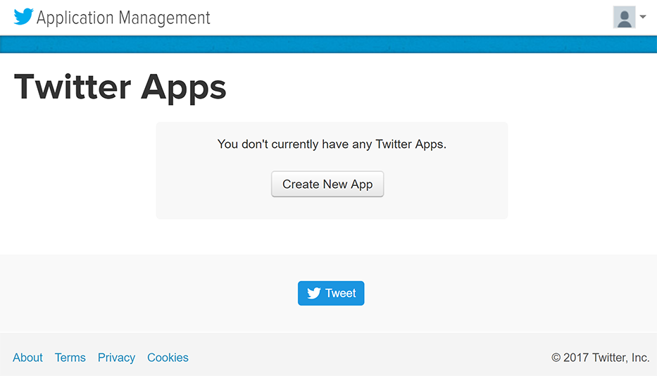
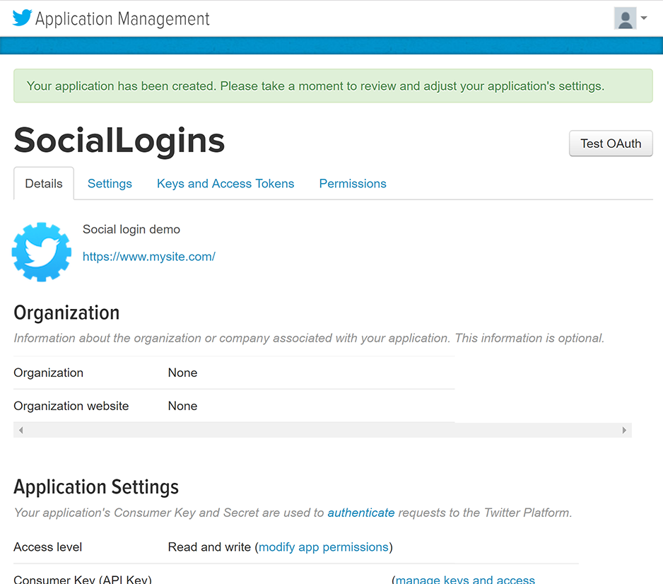
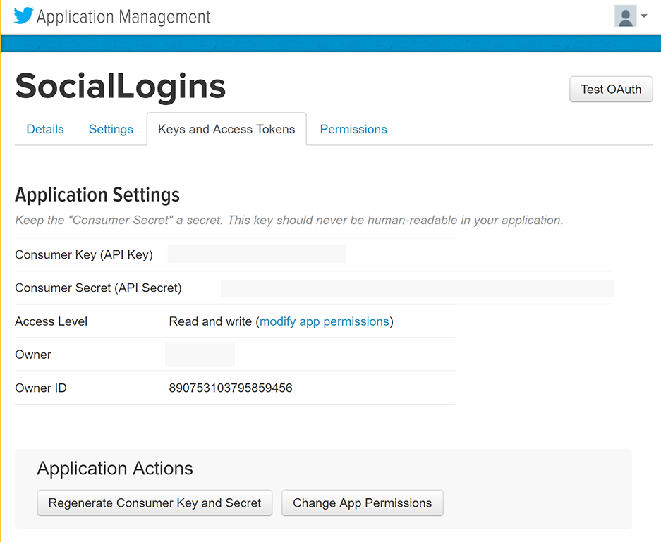
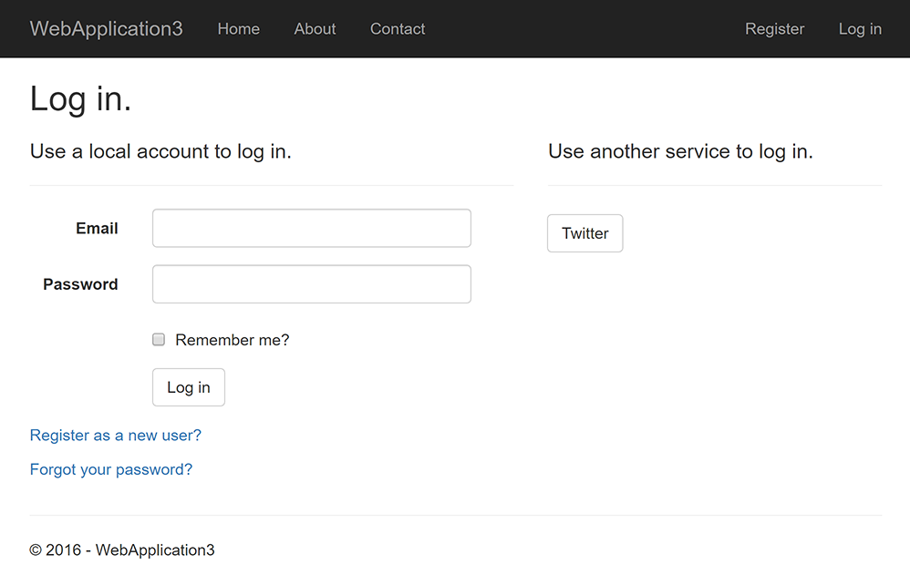
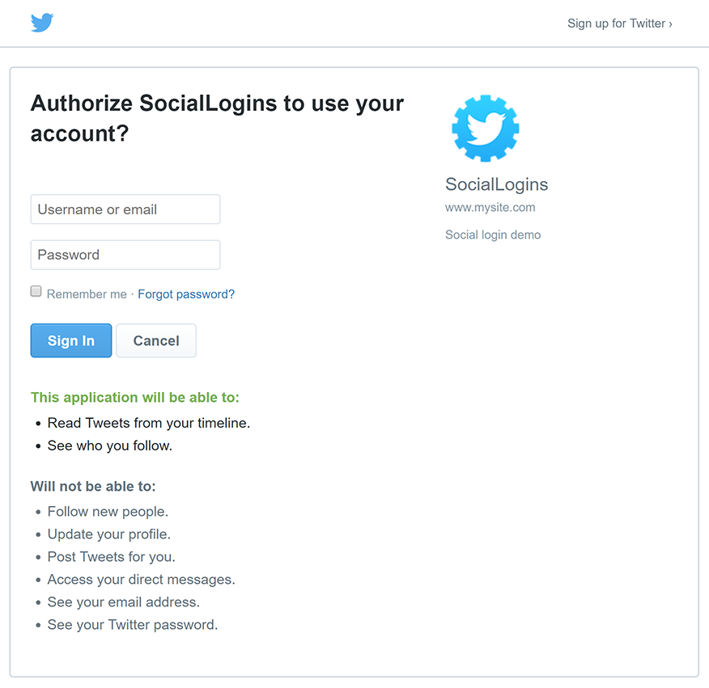

# Configuring Twitter authentication

<a name=security-authentication-twitter-logins></a>

By [Valeriy Novytskyy](https://github.com/01binary) and [Rick Anderson](https://twitter.com/RickAndMSFT)

This tutorial shows you how to enable your users to [sign in with their Twitter account](https://dev.twitter.com/web/sign-in/desktop-browser) using a sample ASP.NET Core 2.0 project created on the [previous page](index.md).

## Create the app in Twitter

* Navigate to [https://apps.twitter.com/](https://apps.twitter.com/) and sign in. If you don't already have a Twitter account, use the **[Sign up now](https://twitter.com/signup)** link to create one. After signing in, the **Application Management** page is shown:



* Tap **Create New App** and fill out the application **Name**, **Description** and public **Website** URI (this can be temporary until you register the domain name):


* Enter your development URI with */signin-twitter* appended into the **Valid OAuth Redirect URIs** field (for example: `https://localhost:44320/signin-twitter`). The Twitter authentication scheme configured later in this tutorial will automatically handle requests at */signin-twitter* route to implement the OAuth flow.

* Fill out the rest of the form and tap **Create your Twitter application**. New application details are displayed:



* When deploying the site you'll need to revisit the **Application Management** page and register a new public URI.

## Storing Twitter ConsumerKey and ConsumerSecret

Link sensitive settings like Twitter `Consumer Key` and `Consumer Secret` to your application configuration using the [Secret Manager](../../app-secrets.md). For the purposes of this tutorial, name the tokens `Authentication:Twitter:ConsumerKey` and `Authentication:Twitter:ConsumerSecret`.

These tokens can be found on the **Keys and Access Tokens** tab after creating your new Twitter application:



## Configure Twitter Authentication

The project template used in this tutorial ensures that [Microsoft.AspNetCore.Authentication.Twitter](https://www.nuget.org/packages/Microsoft.AspNetCore.Authentication.Twitter) package is already installed.

* To install this package with Visual Studio 2017, right-click on the project and select **Manage NuGet Packages**.
* To install with .NET Core CLI, execute the following in your project directory:

   `dotnet add package Microsoft.AspNetCore.Authentication.Twitter`

# [ASP.NET Core 2.x](#tab/aspnetcore2x)

Add the Twitter service in the `ConfigureServices` method in *Startup.cs* file:

```csharp
services.AddAuthentication().AddTwitter(twitterOptions =>
{
    twitterOptions.ConsumerKey = Configuration["Authentication:Twitter:ConsumerKey"];
    twitterOptions.ConsumerSecret = Configuration["Authentication:Twitter:ConsumerSecret"];
});
```

The `AddAuthentication` method should only be called once when adding multiple authentication providers. Subsequent calls to it have the potential of overriding any previously configured [AuthenticationOptions](https://docs.microsoft.com/aspnet/core/api/microsoft.aspnetcore.builder.authenticationoptions) properties.

# [ASP.NET Core 1.x](#tab/aspnetcore1x)

Add the Twitter middleware in the `Configure` method in *Startup.cs* file:

```csharp
app.UseTwitterAuthentication(new TwitterOptions()
{
    ConsumerKey = Configuration["Authentication:Twitter:ConsumerKey"],
    ConsumerSecret = Configuration["Authentication:Twitter:ConsumerSecret"]
});
```

---

See the [TwitterOptions](https://docs.microsoft.com/aspnet/core/api/microsoft.aspnetcore.builder.twitteroptions) API reference for more information on configuration options supported by Twitter authentication. This can be used to request different information about the user.

## Sign in with Twitter

Run your application and click **Log in**. An option to sign in with Twitter appears:



Clicking on **Twitter** redirects to Twitter for authentication:



After entering your Twitter credentials, you are redirected back to the web site where you can set your email.

You are now logged in using your Twitter credentials:


## Troubleshooting

* **ASP.NET Core 2.x only:** If Identity is not configured by calling `services.AddIdentity` in `ConfigureServices`, attempting to authenticate will result in *ArgumentException: The 'SignInScheme' option must be provided*. The project template used in this tutorial ensures that this is done.
* If the site database has not been created by applying the initial migration, you will get *A database operation failed while processing the request* error. Tap **Apply Migrations** to create the database and refresh to continue past the error.

## Next steps

* This article showed how you can authenticate with Twitter. You can follow a similar approach to authenticate with other providers listed on the [previous page](index.md).

* Once you publish your web site to Azure web app, you should reset the `ConsumerSecret` in the Twitter developer portal.

* Set the `Authentication:Twitter:ConsumerKey` and `Authentication:Twitter:ConsumerSecret` as application settings in the Azure portal. The configuration system is set up to read keys from environment variables.
