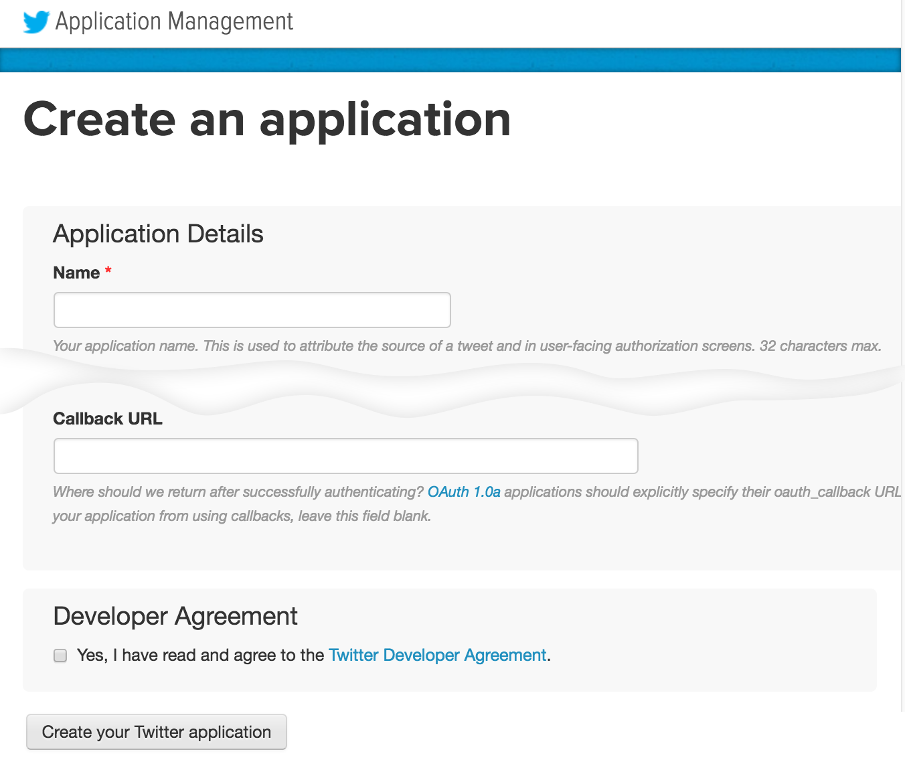
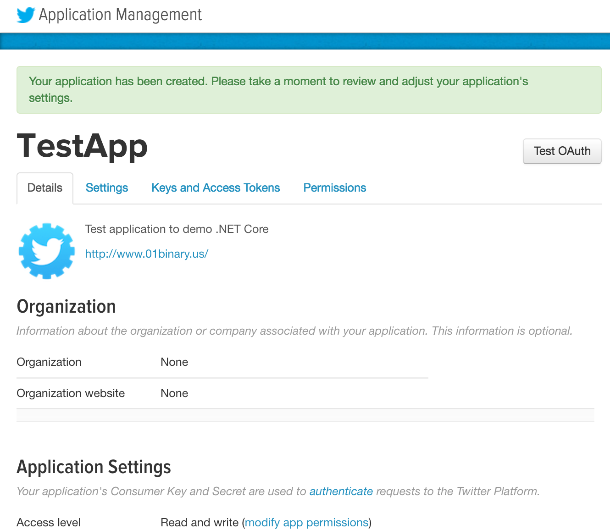
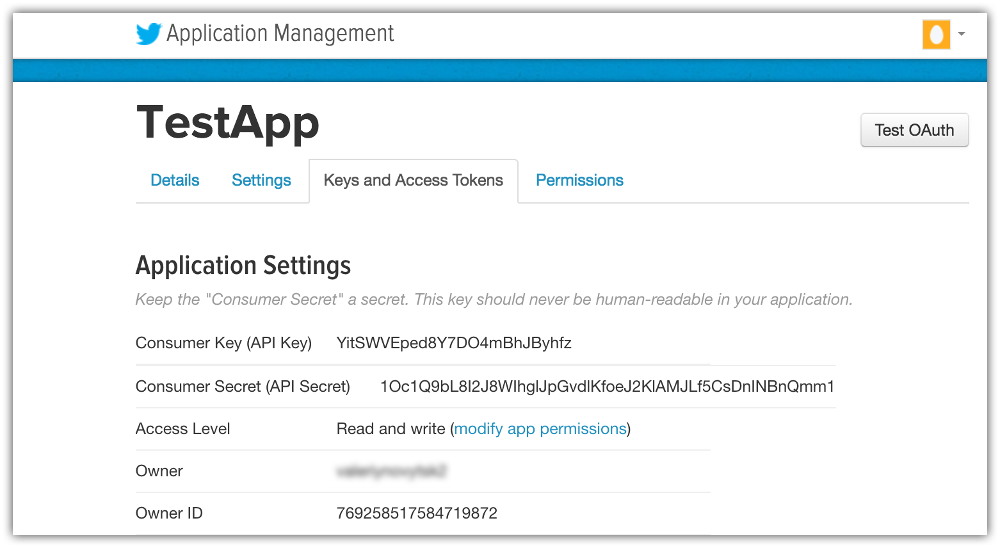
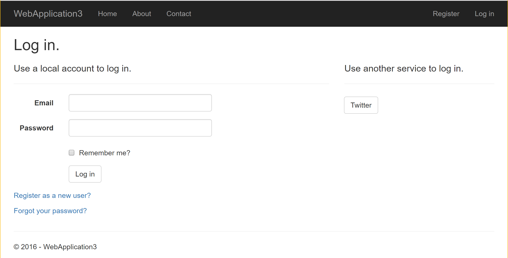
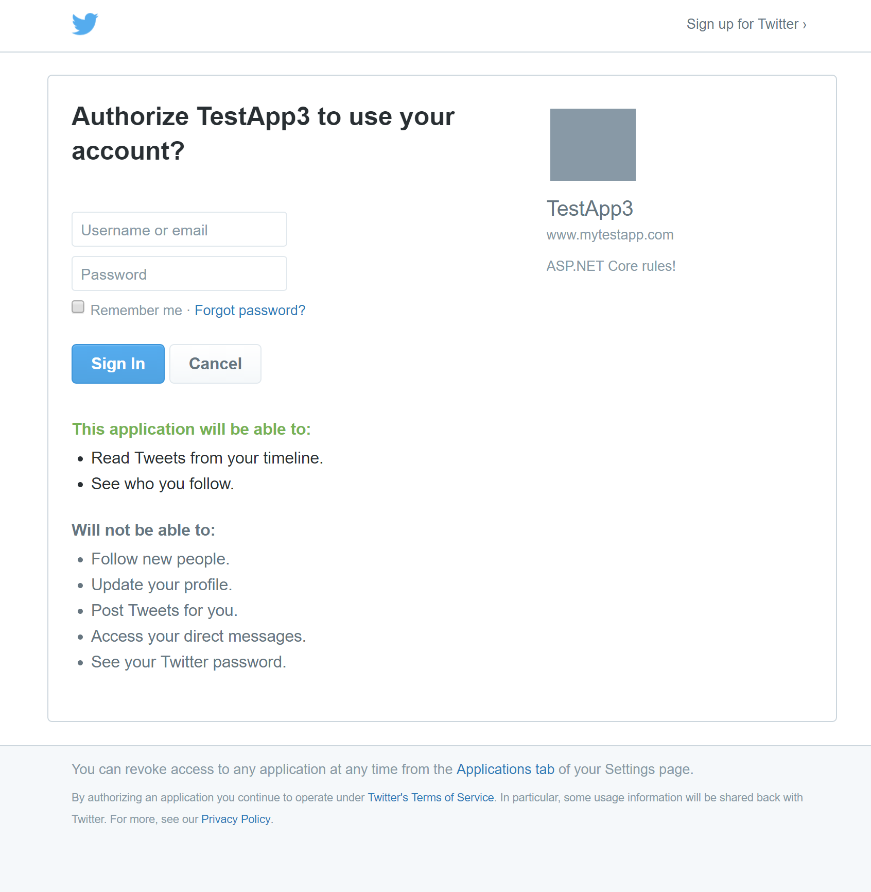

# Configuring Twitter authentication

<a name=security-authentication-twitter-logins></a>

By [Rick Anderson](https://twitter.com/RickAndMSFT), [Pranav Rastogi](https://github.com/rustd) and [Valeriy Novytskyy](https://github.com/01binary)

This tutorial shows you how to enable your users to [sign in with their Twitter account](https://dev.twitter.com/web/sign-in/desktop-browser) using a sample ASP.NET Core project created on the [previous page](sociallogins.md).

## Creating the app in Twitter

* Navigate to [https://apps.twitter.com/](https://apps.twitter.com/) and sign in. If you don't already have a Twitter account, use the **[Sign up now](https://twitter.com/signup)** link to create one. After signing in, the **Application Management** page is shown:


* Tap **Create New App** and fill out the application **Name**:



* Enter your current site URL with *signin-twitter* appended into the **Callback URL** field. For example, `https://localhost:44320/signin-twitter`.
  
  > [!NOTE]
  > When deploying the site you'll need to register a new public url.

  > [!NOTE]
  > You don't need to configure **signin-twitter** as a route in your app. The Twitter middleware automatically intercepts requests at this route and handles them to implement the OAuth flow.

* Tap **Create your Twitter application**. New application details are displayed:



## Storing Twitter ConsumerKey and ConsumerSecret

Link sensitive settings like Twitter `ConsumerKey` and `ConsumerSecret` to your application configuration by using the [Secret Manager tool](../app-secrets.md) instead of storing them in your configuration file directly, as described on the [social login overview page](sociallogins.md).

* Switch to the **Keys and Access Tokens** tab. Note the `Consumer Key` and `Consumer Secret`:



* Execute the following commands in your project working directory to store the Twitter secrets:

  <!-- literal_block {"ids": [], "xml:space": "preserve"} -->

  ```
  dotnet user-secrets set Authentication:Twitter:ConsumerKey <consumer-key>
  dotnet user-secrets set Authentication:Twitter:ConsumerSecret <consumer-secret>
     ```

The following code reads the configuration values stored by the [Secret Manager](../app-secrets.md#security-app-secrets):

[!code-csharp[Main](../../common/samples/WebApplication1/Startup.cs?highlight=11&range=20-36)]

## Enable Twitter middleware

> [!NOTE]
> Use NuGet to install the [Microsoft.AspNetCore.Authentication.Twitter](https://www.nuget.org/packages/Microsoft.AspNetCore.Authentication.Twitter) package if it hasn't already been installed. Alternatively, execute the following commands in your project directory:
>
> `dotnet install Microsoft.AspNetCore.Authentication.Twitter`

Add the Twitter middleware in the `Configure` method in `Startup.cs`:

```csharp
app.UseTwitterAuthentication(new TwitterOptions()
{
    ConsumerKey = Configuration["Authentication:Twitter:ConsumerId"],
    ConsumerSecret = Configuration["Authentication:Twitter:ConsumerSecret"]
});
```

## Sign in with Twitter

Run your application and click **Log in**. An option to sign in with Twitter appears:



Clicking on **Twitter** redirects to Twitter for authentication:



After entering your Twitter credentials, you are redirected back to the web site where you can set your email.

You are now logged in using your Twitter credentials:


## Next steps

* This article showed how you can authenticate with Twitter. You can follow a similar approach to authenticate with other providers listed on the [previous page](sociallogins.md).

* Once you publish your web site to Azure web app, you should reset the `ConsumerSecret` in the Twitter developer portal.

* Set the `Authentication:Twitter:ConsumerKey` and `Authentication:Twitter:ConsumerSecret` as application settings in the Azure portal. The configuration system is set up to read keys from environment variables.