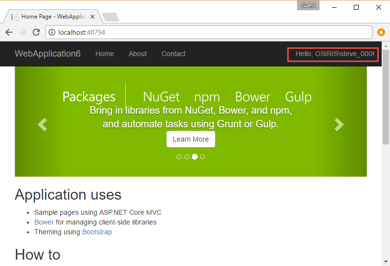
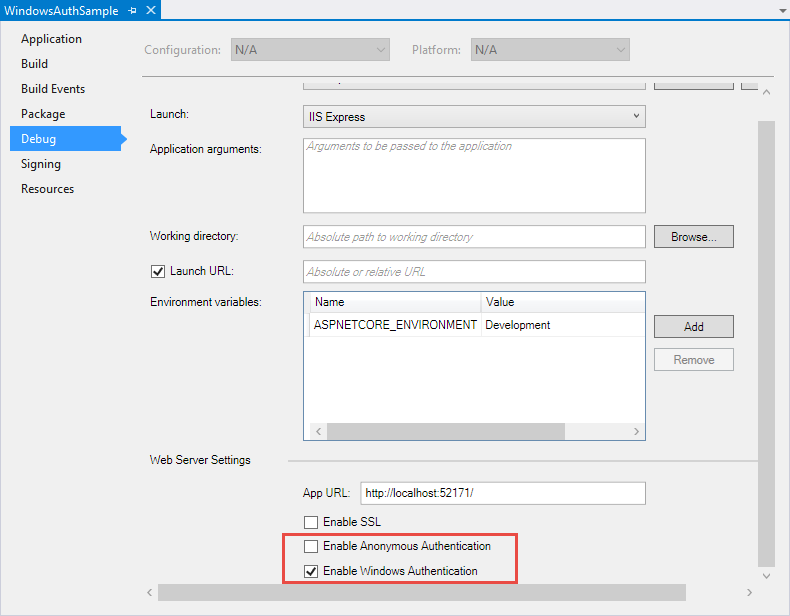
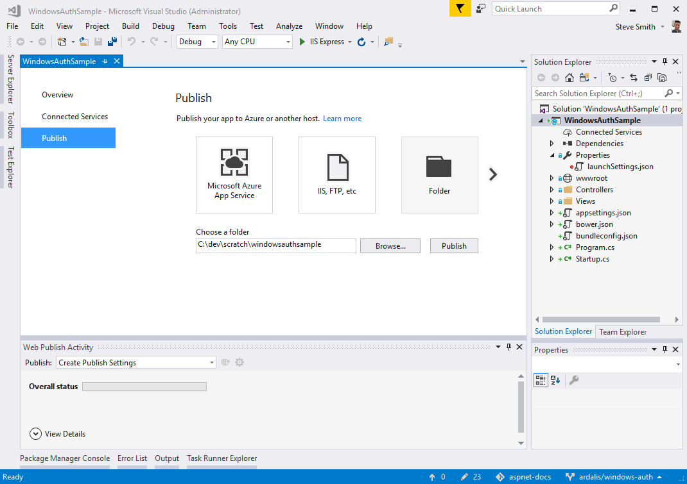

# Configure Windows Authentication in ASP.NET Core

By [Steve Smith](https://ardalis.com)

Windows authentication can be configured for ASP.NET Core apps hosted with IIS or WebListener.

## What is Windows authentication

Windows authentication relies on the operating system to authenticate users of ASP.NET Core apps. You can use Windows authentication when your server runs on a corporate network using Active Directory domain identities or other Windows accounts to identify users. Windows authentication is a secure form of authentication best suited to intranet environments where users, client applications, and web servers belong to the same Windows domain.

[Learn more about Windows Authentication and installing it for IIS](https://docs.microsoft.com/iis/configuration/system.webServer/security/authentication/windowsAuthentication/).

## Enabling Windows authentication in an ASP.NET Core application

The Visual Studio Web Application template can be configured to support Windows authentication.

### Using the Windows authentication app template

In Visual Studio:
* Create a new ASP.NET Core Web Application. 
* Select Web Application from the list of templates.
* Select the Change Authentication button and select **Windows Authentication**. 

Run the app. The username appears in the top right of the app.



For development work using IIS Express, the template provides all the configuration necessary to use Windows authentication. The next section shows how to configure an ASP.NET Core app manually for Windows authentication.

### Visual Studio settings for Windows and anonymous authentication

The Visual Studio properties page, debug tab provides check boxes for Windows authentication and anonymous authentication.



You can also configure these properties in the `launchSettings.json` file:

```json
{
  "iisSettings": {
    "windowsAuthentication": true,
    "anonymousAuthentication": false,
    "iisExpress": {
      "applicationUrl": "http://localhost:52171/",
      "sslPort": 0
    }
  } // additional options trimmed
}
```

## Enabling Windows Authentication with IIS

IIS uses the [ASP.NET Core Module](xref:fundamentals/servers/aspnet-core-module) (ANCM) to host ASP.NET Core apps. The ANCM flows Windows authentication to IIS by default. Configuration of Windows authentication is done within IIS, not the application project. The following sections show how to use IIS Manager to configure an ASP.NET Core app to use Windows authentication:

### Create a new IIS site

Specify a name and folder and allow it to create a new application pool.

### Customize Authentication

Open the Authentication menu for the site.


Disable Anonymous Authentication and enable Windows Authentication.


### Publish your project to the IIS site folder

Using Visual Studio or the .NET Core CLI, *publish* your app to the destination folder.



Learn more about [publishing to IIS](xref:publishing/iis).

Launch the app to verify Windows authentication is working.

## Enabling Windows authentication with WebListener

Although Kestrel doesn't support Windows authentication, you can use [WebListener](xref:fundamentals/servers/weblistener) to support self-hosted scenarios on Windows. The following example configures the app's web host to use WebListener with Windows authentication:

```csharp
public class Program
{
    public static void Main(string[] args)
    {
        var host = new WebHostBuilder()
            .UseWebListener(options =>
            {
                options.ListenerSettings.Authentication.Schemes = 
                    AuthenticationSchemes.Negotiate | AuthenticationSchemes.NTLM;
                options.ListenerSettings.Authentication.AllowAnonymous = false;
            })
            .UseContentRoot(Directory.GetCurrentDirectory())
            .UseStartup<Startup>()
            .Build();

        host.Run();
    }
}
```

## Working with Windows authentication

If your app uses Windows authentication and anonymous access, you can use the ``[Authorize]`` and ``[AllowAnonymous]`` attributes. Apps that do not have anonymous enabled do not require ``[Authorize]``; the  app is treated as requiring authentication, anonymous requests are rejected. Note, if the IIS site is configured **not** to allow anonymous access, the ``[AllowAnonymous]`` attribute does **not** allow anonymous requests. The ``[AllowAnonymous]`` attribute overrides ``[Authorize]`` attribute usage within apps that allow anonymous access.

### Impersonation

ASP.NET Core does not implement impersonation. Apps run with the application identity for all requests, using app pool or process identity. If you need to explicitly perform an action on behalf of a user, use ``WindowsIdentity.RunImpersonated``. Run a single action in this context and then close the context. Note that ``RunImpersonated`` does not support async and should not be used for complex scenarios. For example, wrapping entire requests or middleware chains is not supported or recommended.
