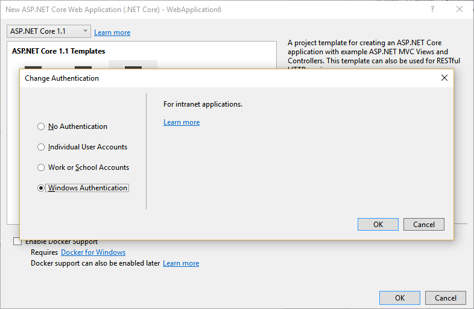

# Configure Windows Authentication in ASP.NET Core

By [Steve Smith](https://ardalis.com)

Windows authentication can be configured for ASP.NET Core apps hosted with IIS or WebListener.

## What is Windows authentication

Windows authentication relies on the underlying operating system to authenticate users of ASP.NET Core apps. For obvious reasons, it only works on apps running on Windows hosts. You can use Windows authentication when your server runs on a corporate network using Active Directory domain identities or other Windows accounts to identify users. Windows authentication is a secure form of authentication best suited to intranet environments where client applications and web servers belong to the same Windows domain.

[Learn more about Windows Authentication](https://www.iis.net/configreference/system.webserver/security/authentication/windowsauthentication).

## Enabling Windows authentication in your app

You can use Window authentication in your ASP.NET Core app hosted in IIS Express by installing the appropriate template or configuring the app's properties.

### Installing the Windows authentication app template

In Visual Studio, create a new ASP.NET Core Web Application. Next, select Web Application from the list of templates, and click the Change Authentication button. Choose Windows Authentication from the dialog that appears.



Once you've create the project, run the application (on Windows) and you should see your username appear in the top right of the page that appears when the app is run.


During development, this is all that is required to work with Windows authentication. IIS Express does not require any additional configuration to support Windows authentication. The app template configures Visual Studio to support Windows authentication. The next section shows how to perform this same configuration yourself.

### Setting app properties to support Windows authentication

During development in Visual Studio, you can configure whether your app allows anonymous requests and whether it supports Windows authentication. You can edit your app's properties and toggle these behaviors from the Debug menu:


You can also configure these same properties by editing the `launchSettings.json` file:

```javascript
{
  "iisSettings": {
    "windowsAuthentication": true,
    "anonymousAuthentication": false,
    "iisExpress": {
      "applicationUrl": "http://localhost:52171/",
      "sslPort": 0
    }
  } // additional options trimmed
}
```

## Enabling Windows Authentication with IIS

IIS uses the [ASP.NET Core Module](https://docs.microsoft.com/en-us/aspnet/core/fundamentals/servers/aspnet-core-module) (ANCM) to host ASP.NET Core apps. The ANCM will flow Windows authentication to IIS by default. Configuration of Windows authentication is done within IIS, not the application project. Take the following steps to configure your ASP.NET Core app to use Windows authentication on a local install of IIS:

### Create a new IIS site

Specify a name and folder and allow it to create a new application pool.

### Customize Authentication

Open the Authentication menu for the site.


Disable Anonymous Authentication and enable Windows Authentication.


### Publish your project to the IIS site folder

Using Visual Studio or the dotnet CLI, *publish* your app to the destination folder.


Learn more about [publishing to IIS](https://docs.microsoft.com/en-us/aspnet/core/publishing/iis).

After completing these steps, you should be able to launch your app from its IIS-bound path and Windows authentication should work correctly.

## Enabling Windows authentication with WebListener

Although Kestrel doesn't support Windows authentication, you can use [WebListener](/fundamentals/servers/weblistener) to support self-hosted scenarios on Windows. Use the following code snippet to configure your app's web host to use WebListener with Windows authentication:

```
public class Program
{
    public static void Main(string[] args)
    {
        var host = new WebHostBuilder()
            .UseWebListener(options =>
            {
                options.ListenerSettings.Authentication.Schemes = 
                    AuthenticationSchemes.Negotiate | AuthenticationSchemes.NTLM;
                options.ListenerSettings.Authentication.AllowAnonymous = false;
            })
            .UseContentRoot(Directory.GetCurrentDirectory())
            .UseStartup<Startup>()
            .Build();

        host.Run();
    }
}
```

## Working with Windows authentication

If your app mixes Windows authentication and anonymous access, you can still use the ``[Authorize]`` attribute. Apps that do not have anonymous enabled do not need to use the ``[Authorize]`` attribute at all. In this case, the whole app is treated as requiring authentication, and the server rejects anonymous requests.

### Impersonation

ASP.NET Core does not implement impersonation. Your app will run with its application identity for all requests, using app pool or process identity. If you need to explicitly perform an action on behalf of a user, you should use ``WindowsIdentity.RunImpersonated``. Run a single action in this conext and then close the context. Note that ``RunImpersonated`` does not support async and should not be used for complex scenarios (for example, wrapping entire requests or middleware chains is not supported or recommended).
