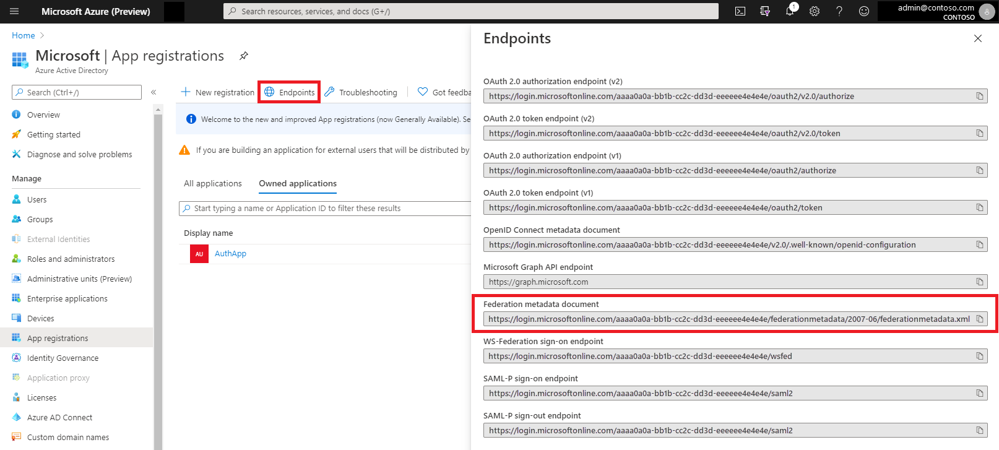

# Authenticate users with WS-Federation in ASP.NET Core

This tutorial demonstrates how to enable users to sign in with a WS-Federation authentication provider like Active Directory Federation Services (ADFS) or [Azure Active Directory](/azure/active-directory/) (AAD). It uses the ASP.NET Core sample app described in [Facebook, Google, and external provider authentication](xref:security/authentication/social/index).

For ASP.NET Core apps, WS-Federation support is provided by [Microsoft.AspNetCore.Authentication.WsFederation](https://www.nuget.org/packages/Microsoft.AspNetCore.Authentication.WsFederation). This component is ported from [Microsoft.Owin.Security.WsFederation](https://www.nuget.org/packages/Microsoft.Owin.Security.WsFederation) and shares many of that component's mechanics. However, the components differ in a couple of important ways.

By default, the new middleware:

* Doesn't allow unsolicited logins. This feature of the WS-Federation protocol is vulnerable to XSRF attacks. However, it can be enabled with the `AllowUnsolicitedLogins` option.
* Doesn't check every form post for sign-in messages. Only requests to the `CallbackPath` are checked for sign-ins. `CallbackPath` defaults to `/signin-wsfed` but can be changed via the inherited <xref:Microsoft.AspNetCore.Authentication.RemoteAuthenticationOptions.CallbackPath%2A?displayProperty=nameWithType> property of the <xref:Microsoft.AspNetCore.Authentication.WsFederation.WsFederationOptions> class. This path can be shared with other authentication providers by enabling the <xref:Microsoft.AspNetCore.Authentication.WsFederation.WsFederationOptions.SkipUnrecognizedRequests%2A> option.

## Register the app with Active Directory

### Active Directory Federation Services

* Open the server's **Add Relying Party Trust Wizard** from the ADFS Management console:

* Choose to enter data manually:

* Enter a display name for the relying party. The name isn't important to the ASP.NET Core app.

* [Microsoft.AspNetCore.Authentication.WsFederation](https://www.nuget.org/packages/Microsoft.AspNetCore.Authentication.WsFederation) lacks support for token encryption, so don't configure a token encryption certificate:

* Enable support for WS-Federation Passive protocol, using the app's URL. Verify the port is correct for the app:

> [!NOTE]
> This must be an HTTPS URL. IIS Express can provide a self-signed certificate when hosting the app during development. Kestrel requires manual certificate configuration. See the [Kestrel documentation](xref:fundamentals/servers/kestrel) for more details.

* Click **Next** through the rest of the wizard and **Close** at the end.

* ASP.NET Core Identity requires a **Name ID** claim. Add one from the **Edit Claim Rules** dialog:

* In the **Add Transform Claim Rule Wizard**, leave the default **Send LDAP Attributes as Claims** template selected, and click **Next**. Add a rule mapping the **SAM-Account-Name** LDAP attribute to the **Name ID** outgoing claim:

* Click **Finish** > **OK** in the **Edit Claim Rules** window.

### Azure Active Directory

* Navigate to the AAD tenant's app registrations blade. Click **New application registration**:

* Enter a name for the app registration. This isn't important to the ASP.NET Core app.
* Enter the URL the app listens on as the **Sign-on URL**:

* Click **Endpoints** and note the **Federation Metadata Document** URL. This is the WS-Federation middleware's `MetadataAddress`:

* Navigate to the new app registration. Click **Expose an API**. Click Application ID URI **Set** > **Save**. Make note of the  **Application ID URI**. This is the WS-Federation middleware's `Wtrealm`:

## Use WS-Federation without ASP.NET Core Identity

The WS-Federation middleware can be used without Identity. For example:
:::moniker range=">= aspnetcore-3.0"
[!code-csharp]
:::moniker-end

:::moniker range=">= aspnetcore-2.1 < aspnetcore-3.0"
[!code-csharp]
:::moniker-end

## Add WS-Federation as an external login provider for ASP.NET Core Identity

* Add a dependency on [Microsoft.AspNetCore.Authentication.WsFederation](https://www.nuget.org/packages/Microsoft.AspNetCore.Authentication.WsFederation) to the project.
* Add WS-Federation to `Startup.ConfigureServices`:

:::moniker range=">= aspnetcore-3.0"
[!code-csharp]
:::moniker-end

:::moniker range=">= aspnetcore-2.1 < aspnetcore-3.0"
[!code-csharp]
:::moniker-end

[!INCLUDE [default settings configuration](social/includes/default-settings.md)]

### Log in with WS-Federation

Browse to the app and click the **Log in** link in the nav header. There's an option to log in with WsFederation:

With ADFS as the provider, the button redirects to an ADFS sign-in page:

With Azure Active Directory as the provider, the button redirects to an AAD sign-in page:

A successful sign-in for a new user redirects to the app's user registration page:

