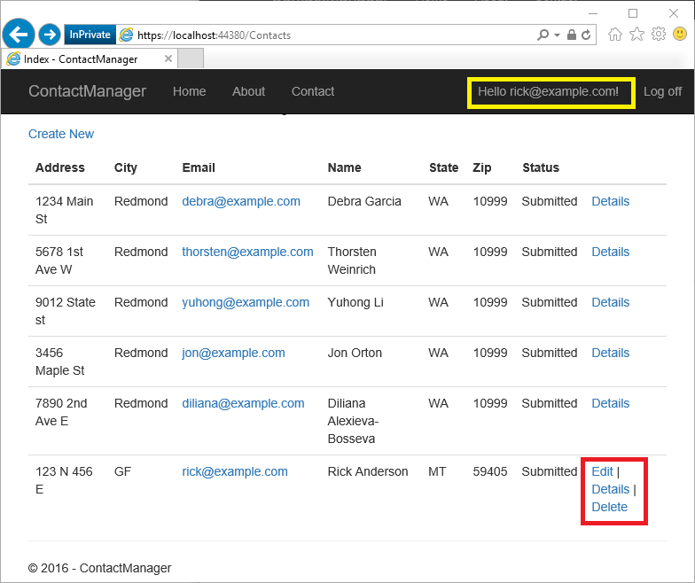
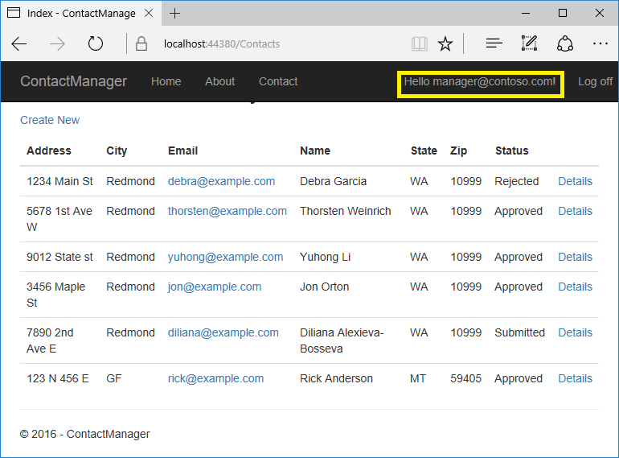
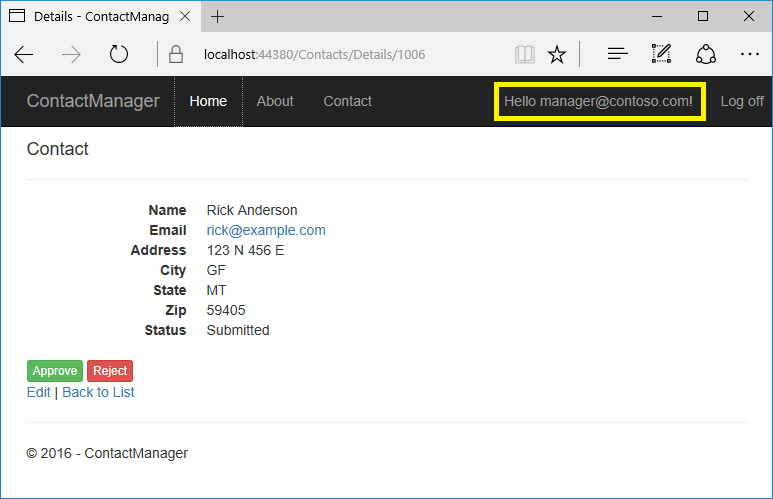
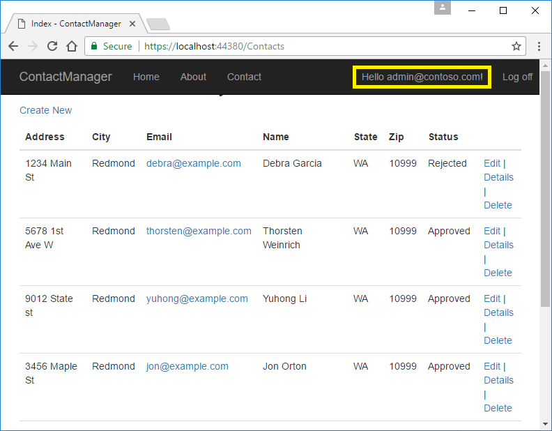

# Create an ASP.NET Core web app with user data protected by authorization

By [Rick Anderson](https://twitter.com/RickAndMSFT) and [Joe Audette](https://twitter.com/joeaudette)

:::moniker range=">= aspnetcore-6.0"

This tutorial shows how to create an ASP.NET Core web app with user data protected by authorization. It displays a list of contacts that authenticated (registered) users have created. There are three security groups:

* **Registered users** can view all the approved data and can edit/delete their own data.
* **Managers** can approve or reject contact data. Only approved contacts are visible to users.
* **Administrators** can approve/reject and edit/delete any data.

The images in this document don't exactly match the latest templates.

In the following image, user Rick (`rick@example.com`) is signed in. Rick can only view approved contacts and **Edit**/**Delete**/**Create New** links for his contacts. Only the last record, created by Rick, displays **Edit** and **Delete** links. Other users won't see the last record until a manager or administrator changes the status to "Approved".



In the following image, `manager@contoso.com` is signed in and in the manager's role:



The following image shows the managers details view of a contact:



The **Approve** and **Reject** buttons are only displayed for managers and administrators.

In the following image, `admin@contoso.com` is signed in and in the administrator's role:



The administrator has all privileges. She can read/edit/delete any contact and change the status of contacts.

The app was created by [scaffolding](xref:tutorials/first-mvc-app/adding-model#scaffold-the-movie-model) the following `Contact` model:

[!code-csharp[](secure-data/samples/starter2.1/Models/Contact.cs?name=snippet1)]

The sample contains the following authorization handlers:

* `ContactIsOwnerAuthorizationHandler`: Ensures that a user can only edit their data.
* `ContactManagerAuthorizationHandler`: Allows managers to approve or reject contacts.
* `ContactAdministratorsAuthorizationHandler`: Allows administrators to approve or reject contacts and to edit/delete contacts.

## Prerequisites

This tutorial is advanced. You should be familiar with:

* [ASP.NET Core](xref:tutorials/first-mvc-app/start-mvc)
* [Authentication](xref:security/authentication/identity)
* [Account Confirmation and Password Recovery](xref:security/authentication/accconfirm)
* [Authorization](xref:security/authorization/introduction)
* [Entity Framework Core](xref:data/ef-mvc/intro)

## The starter and completed app

[Download](xref:index#how-to-download-a-sample) the [completed](https://github.com/dotnet/AspNetCore.Docs/tree/main/aspnetcore/security/authorization/secure-data/samples) app. [Test](#test-the-completed-app) the completed app so you become familiar with its security features.

### The starter app

[Download](xref:index#how-to-download-a-sample) the [starter](https://github.com/dotnet/AspNetCore.Docs/tree/main/aspnetcore/security/authorization/secure-data/samples/) app.

Run the app, tap the **ContactManager** link, and verify you can create, edit, and delete a contact. To create the starter app, see [Create the starter app](#create-the-starter-app).

## Secure user data

The following sections have all the major steps to create the secure user data app. You may find it helpful to refer to the completed project.

### Tie the contact data to the user

Use the ASP.NET [Identity](xref:security/authentication/identity) user ID to ensure users can edit their data, but not other users data. Add `OwnerID` and `ContactStatus` to the `Contact` model:

[!code-csharp[](secure-data/samples/final6/Models/Contact.cs?name=snippet1&highlight=5-6,16-999)]

`OwnerID` is the user's ID from the `AspNetUser` table in the [Identity](xref:security/authentication/identity) database. The `Status` field determines if a contact is viewable by general users.

Create a new migration and update the database:

```dotnetcli
dotnet ef migrations add userID_Status
dotnet ef database update
```

### Add Role services to Identity

Append <xref:Microsoft.AspNetCore.Identity.IdentityBuilder.AddRoles%2A> to add Role services:

[!code-csharp[](secure-data/samples/final6/Program.cs?name=snippet&highlight=10)]

<a name="rau"></a>

### Require authenticated users

Set the fallback authorization policy to require users to be authenticated:

[!code-csharp[](secure-data/samples/final6/Program.cs?name=snippet2&highlight=15-99)]

The preceding highlighted code sets the [fallback authorization policy](xref:Microsoft.AspNetCore.Authorization.AuthorizationOptions.FallbackPolicy). The fallback authorization policy requires ***all*** users to be authenticated, except for Razor Pages, controllers, or action methods with an authorization attribute. For example, Razor Pages, controllers, or action methods with `[AllowAnonymous]` or `[Authorize(PolicyName="MyPolicy")]` use the applied authorization attribute rather than the fallback authorization policy.

<xref:Microsoft.AspNetCore.Authorization.AuthorizationPolicyBuilder.RequireAuthenticatedUser%2A> adds <xref:Microsoft.AspNetCore.Authorization.Infrastructure.DenyAnonymousAuthorizationRequirement> to the current instance, which enforces that the current user is authenticated.

The fallback authorization policy:

* Is applied to all requests that don't explicitly specify an authorization policy. For requests served by endpoint routing, this includes any endpoint that doesn't specify an authorization attribute. For requests served by other middleware after the authorization middleware, such as [static files](xref:fundamentals/static-files), this applies the policy to all requests.

Setting the fallback authorization policy to require users to be authenticated protects newly added Razor Pages and controllers. Having authorization required by default is more secure than relying on new controllers and Razor Pages to include the `[Authorize]` attribute.

The <xref:Microsoft.AspNetCore.Authorization.AuthorizationOptions> class also contains <xref:Microsoft.AspNetCore.Authorization.AuthorizationOptions.DefaultPolicy?displayProperty=nameWithType>. The `DefaultPolicy` is the policy used with the `[Authorize]` attribute when no policy is specified. `[Authorize]` doesn't contain a named policy, unlike `[Authorize(PolicyName="MyPolicy")]`.

For more information on policies, see <xref:security/authorization/policies>.

An alternative way for MVC controllers and Razor Pages to require all users be authenticated is adding an authorization filter:

[!code-csharp[](secure-data/samples/final6/Program.cs?name=snippet3&highlight=21-27)]

The preceding code uses an authorization filter, setting the fallback policy uses endpoint routing. Setting the fallback policy is the preferred way to require all users be authenticated.

Add [AllowAnonymous](xref:Microsoft.AspNetCore.Authorization.AllowAnonymousAttribute) to the `Index` and `Privacy` pages so anonymous users can get information about the site before they register:

[!code-csharp[](secure-data/samples/final6/Pages/Index.cshtml.cs?highlight=1,6)]

### Configure the test account

The `SeedData` class creates two accounts: administrator and manager. Use the [Secret Manager tool](xref:security/app-secrets) to set a password for these accounts. Set the password from the project directory (the directory containing `Program.cs`):

```dotnetcli
dotnet user-secrets set SeedUserPW <PW>
```

If a strong password is not specified, an exception is thrown when `SeedData.Initialize` is called.

Update the app to use the test password:

[!code-csharp[](secure-data/samples/final6/Program.cs?name=snippet4&highlight=34-99)]

### Create the test accounts and update the contacts

Update the `Initialize` method in the `SeedData` class to create the test accounts:

[!code-csharp[](secure-data/samples/final6/Data/SeedData.cs?name=snippet_Initialize)]

Add the administrator user ID and `ContactStatus` to the contacts. Make one of the contacts "Submitted" and one "Rejected". Add the user ID and status to all the contacts. Only one contact is shown:

[!code-csharp[](secure-data/samples/final6/Data/SeedData.cs?name=snippet1&highlight=17,18)]

## Create owner, manager, and administrator authorization handlers

Create a `ContactIsOwnerAuthorizationHandler` class in the *Authorization* folder. The `ContactIsOwnerAuthorizationHandler` verifies that the user acting on a resource owns the resource.

[!code-csharp[](secure-data/samples/final6/Authorization/ContactIsOwnerAuthorizationHandler.cs)]

The `ContactIsOwnerAuthorizationHandler` calls [context.Succeed](xref:Microsoft.AspNetCore.Authorization.AuthorizationHandlerContext.Succeed%2A) if the current authenticated user is the contact owner. Authorization handlers generally:

* Call `context.Succeed` when the requirements are met.
* Return `Task.CompletedTask` when requirements aren't met. Returning `Task.CompletedTask` without a prior call to `context.Success` or `context.Fail`, is not a success or failure, it allows other authorization handlers to run.

If you need to explicitly fail, call [context.Fail](xref:Microsoft.AspNetCore.Authorization.AuthorizationHandlerContext.Fail%2A).

The app allows contact owners to edit/delete/create their own data. `ContactIsOwnerAuthorizationHandler` doesn't need to check the operation passed in the requirement parameter.

### Create a manager authorization handler

Create a `ContactManagerAuthorizationHandler` class in the *Authorization* folder. The `ContactManagerAuthorizationHandler` verifies the user acting on the resource is a manager. Only managers can approve or reject content changes (new or changed).

[!code-csharp[](secure-data/samples/final6/Authorization/ContactManagerAuthorizationHandler.cs)]

### Create an administrator authorization handler

Create a `ContactAdministratorsAuthorizationHandler` class in the *Authorization* folder. The `ContactAdministratorsAuthorizationHandler` verifies the user acting on the resource is an administrator. Administrator can do all operations.

[!code-csharp[](secure-data/samples/final6/Authorization/ContactAdministratorsAuthorizationHandler.cs)]

## Register the authorization handlers

Services using Entity Framework Core must be registered for [dependency injection](xref:fundamentals/dependency-injection) using <xref:Microsoft.Extensions.DependencyInjection.ServiceCollectionServiceExtensions.AddScoped%2A>. The `ContactIsOwnerAuthorizationHandler` uses ASP.NET Core [Identity](xref:security/authentication/identity), which is built on Entity Framework Core. Register the handlers with the service collection so they're available to the `ContactsController` through [dependency injection](xref:fundamentals/dependency-injection). Add the following code to the end of `ConfigureServices`:

[!code-csharp[](secure-data/samples/final6/Program.cs?name=snippet4&highlight=22-30)]

`ContactAdministratorsAuthorizationHandler` and `ContactManagerAuthorizationHandler` are added as singletons. They're singletons because they don't use EF and all the information needed is in the `Context` parameter of the `HandleRequirementAsync` method.

## Support authorization

In this section, you update the Razor Pages and add an operations requirements class.

### Review the contact operations requirements class

Review the `ContactOperations` class. This class contains the requirements the app supports:

[!code-csharp[](secure-data/samples/final3/Authorization/ContactOperations.cs)]

### Create a base class for the Contacts Razor Pages

Create a base class that contains the services used in the contacts Razor Pages. The base class puts the initialization code in one location:

[!code-csharp[](secure-data/samples/final3/Pages/Contacts/DI_BasePageModel.cs)]

The preceding code:

* Adds the `IAuthorizationService` service to access to the authorization handlers.
* Adds the Identity `UserManager` service.
* Add the `ApplicationDbContext`.

### Update the CreateModel

Update the create page model:

* Constructor to use the `DI_BasePageModel` base class.
* `OnPostAsync` method to:
  * Add the user ID to the `Contact` model.
  * Call the authorization handler to verify the user has permission to create contacts.

[!code-csharp[](secure-data/samples/final6/Pages/Contacts/Create.cshtml.cs?name=snippet)]

### Update the IndexModel

Update the `OnGetAsync` method so only approved contacts are shown to general users:

[!code-csharp[](secure-data/samples/final6/Pages/Contacts/Index.cshtml.cs?name=snippet)]

### Update the EditModel

Add an authorization handler to verify the user owns the contact. Because resource authorization is being validated, the `[Authorize]` attribute is not enough. The app doesn't have access to the resource when attributes are evaluated. Resource-based authorization must be imperative. Checks must be performed once the app has access to the resource, either by loading it in the page model or by loading it within the handler itself. You frequently access the resource by passing in the resource key.

[!code-csharp[](secure-data/samples/final6/Pages/Contacts/Edit.cshtml.cs?name=snippet)]

### Update the DeleteModel

Update the delete page model to use the authorization handler to verify the user has delete permission on the contact.

[!code-csharp[](secure-data/samples/final6/Pages/Contacts/Delete.cshtml.cs?name=snippet)]

## Inject the authorization service into the views

Currently, the UI shows edit and delete links for contacts the user can't modify.

Inject the authorization service in the `Pages/_ViewImports.cshtml` file so it's available to all views:

[!code-cshtml[](secure-data/samples/final6/Pages/_ViewImports.cshtml?highlight=6-99)]

The preceding markup adds several `using` statements.

Update the **Edit** and **Delete** links in `Pages/Contacts/Index.cshtml` so they're only rendered for users with the appropriate permissions:

[!code-cshtml[](secure-data/samples/final6/Pages/Contacts/Index.cshtml?highlight=34-36,62-999)]

> [!WARNING]
> Hiding links from users that don't have permission to change data doesn't secure the app. Hiding links makes the app more user-friendly by displaying only valid links. Users can hack the generated URLs to invoke edit and delete operations on data they don't own. The Razor Page or controller must enforce access checks to secure the data.

### Update Details

Update the details view so managers can approve or reject contacts:

[!code-cshtml[](secure-data/samples/final6/Pages/Contacts/Details.cshtml?name=snippet)]

### Update the details page model

[!code-csharp[](secure-data/samples/final6/Pages/Contacts/Details.cshtml.cs?name=snippet)]

## Add or remove a user to a role

See [this issue](https://github.com/dotnet/AspNetCore.Docs/issues/8502) for information on:

* Removing privileges from a user. For example, muting a user in a chat app.
* Adding privileges to a user.

<a name="challenge"></a>

## Differences between Challenge and Forbid

This app sets the default policy to [require authenticated users](#rau). The following code allows anonymous users. Anonymous users are allowed to show the differences between Challenge vs Forbid.

[!code-csharp[](secure-data/samples/final6/Pages/Contacts/Details2.cshtml.cs?name=snippet)]

In the preceding code:

* When the user is **not** authenticated, a `ChallengeResult` is returned. When a `ChallengeResult` is returned, the user is redirected to the sign-in page.
* When the user is authenticated, but not authorized, a `ForbidResult` is returned. When a `ForbidResult` is returned, the user is redirected to the access denied page.

## Test the completed app

If you haven't already set a password for seeded user accounts, use the [Secret Manager tool](xref:security/app-secrets#secret-manager) to set a password:

* Choose a strong password: Use eight or more characters and at least one upper-case character, number, and symbol. For example, `Passw0rd!` meets the strong password requirements.
* Execute the following command from the project's folder, where `<PW>` is the password:

  ```dotnetcli
  dotnet user-secrets set SeedUserPW <PW>
  ```

If the app has contacts:

* Delete all of the records in the `Contact` table.
* Restart the app to seed the database.

An easy way to test the completed app is to launch three different browsers (or incognito/InPrivate sessions). In one browser, register a new user (for example, `test@example.com`). Sign in to each browser with a different user. Verify the following operations:

* Registered users can view all of the approved contact data.
* Registered users can edit/delete their own data.
* Managers can approve/reject contact data. The `Details` view shows **Approve** and **Reject** buttons.
* Administrators can approve/reject and edit/delete all data.

| User                | Approve or reject contacts| Options                                  |
| ------------------- | :---------------: | ---------------------------------------- |
| test@example.com    | No                | Edit and delete their data.                |
| manager@contoso.com | Yes               | Edit and delete their data. |
| admin@contoso.com   | Yes               | Edit and delete ***all*** data. |

Create a contact in the administrator's browser. Copy the URL for delete and edit from the administrator contact. Paste these links into the test user's browser to verify the test user can't perform these operations.

## Create the starter app

* Create a Razor Pages app named "ContactManager"
  * Create the app with **Individual User Accounts**.
  * Name it "ContactManager" so the namespace matches the namespace used in the sample.
  * `-uld` specifies LocalDB instead of SQLite

  ```dotnetcli
  dotnet new webapp -o ContactManager -au Individual -uld
  ```

* Add `Models/Contact.cs`:
                  secure-data\samples\starter6\ContactManager\Models\Contact.cs
  [!code-csharp[](secure-data/samples/starter6/Models/Contact.cs)]

* Scaffold the `Contact` model.
* Create initial migration and update the database:

```dotnetcli
dotnet add package Microsoft.VisualStudio.Web.CodeGeneration.Design
dotnet tool install -g dotnet-aspnet-codegenerator
dotnet aspnet-codegenerator razorpage -m Contact -udl -dc ApplicationDbContext -outDir Pages\Contacts --referenceScriptLibraries
dotnet ef database drop -f
dotnet ef migrations add initial
dotnet ef database update
```

* Update the **ContactManager** anchor in the `Pages/Shared/_Layout.cshtml` file:

  ```cshtml
  <a class="nav-link text-dark" asp-area="" asp-page="/Contacts/Index">Contact Manager</a>
  ```

* Test the app by creating, editing, and deleting a contact

### Seed the database

<!-- must be sync Task for finished program -->
Add the [SeedData](https://github.com/dotnet/AspNetCore.Docs/tree/main/aspnetcore/security/authorization/secure-data/samples/starter6/Data/SeedData.cs) class to the *Data* folder:

[!code-csharp[](secure-data/samples/starter6/Data/SeedData.cs)]

Call `SeedData.Initialize` from `Program.cs`:

[!code-csharp[](secure-data/samples/starter6/Program.cs?highlight=18-23)]

Test that the app seeded the database. If there are any rows in the contact DB, the seed method doesn't run.

:::moniker-end

:::moniker range="< aspnetcore-6.0"

This tutorial shows how to create an ASP.NET Core web app with user data protected by authorization. It displays a list of contacts that authenticated (registered) users have created. There are three security groups:

* **Registered users** can view all the approved data and can edit/delete their own data.
* **Managers** can approve or reject contact data. Only approved contacts are visible to users.
* **Administrators** can approve/reject and edit/delete any data.

The images in this document don't exactly match the latest templates.

In the following image, user Rick (`rick@example.com`) is signed in. Rick can only view approved contacts and **Edit**/**Delete**/**Create New** links for his contacts. Only the last record, created by Rick, displays **Edit** and **Delete** links. Other users won't see the last record until a manager or administrator changes the status to "Approved".


In the following image, `manager@contoso.com` is signed in and in the manager's role:


The following image shows the managers details view of a contact:


The **Approve** and **Reject** buttons are only displayed for managers and administrators.

In the following image, `admin@contoso.com` is signed in and in the administrator's role:


The administrator has all privileges. She can read/edit/delete any contact and change the status of contacts.

The app was created by [scaffolding](xref:tutorials/first-mvc-app/adding-model#scaffold-the-movie-model) the following `Contact` model:

[!code-csharp[](secure-data/samples/starter2.1/Models/Contact.cs?name=snippet1)]

The sample contains the following authorization handlers:

* `ContactIsOwnerAuthorizationHandler`: Ensures that a user can only edit their data.
* `ContactManagerAuthorizationHandler`: Allows managers to approve or reject contacts.
* `ContactAdministratorsAuthorizationHandler`: Allows administrators to:
  * Approve or reject contacts
  * Edit and delete contacts

## Prerequisites

This tutorial is advanced. You should be familiar with:

* [ASP.NET Core](xref:tutorials/first-mvc-app/start-mvc)
* [Authentication](xref:security/authentication/identity)
* [Account Confirmation and Password Recovery](xref:security/authentication/accconfirm)
* [Authorization](xref:security/authorization/introduction)
* [Entity Framework Core](xref:data/ef-mvc/intro)

## The starter and completed app

[Download](xref:index#how-to-download-a-sample) the [completed](https://github.com/dotnet/AspNetCore.Docs/tree/main/aspnetcore/security/authorization/secure-data/samples) app. [Test](#test-the-completed-app) the completed app so you become familiar with its security features.

### The starter app

[Download](xref:index#how-to-download-a-sample) the [starter](https://github.com/dotnet/AspNetCore.Docs/tree/main/aspnetcore/security/authorization/secure-data/samples/) app.

Run the app, tap the **ContactManager** link, and verify you can create, edit, and delete a contact. To create the starter app, see [Create the starter app](#create-the-starter-app).

## Secure user data

The following sections have all the major steps to create the secure user data app. You may find it helpful to refer to the completed project.

### Tie the contact data to the user

Use the ASP.NET [Identity](xref:security/authentication/identity) user ID to ensure users can edit their data, but not other users data. Add `OwnerID` and `ContactStatus` to the `Contact` model:

[!code-csharp[](secure-data/samples/final3/Models/Contact.cs?name=snippet1&highlight=5-6,16-999)]

`OwnerID` is the user's ID from the `AspNetUser` table in the [Identity](xref:security/authentication/identity) database. The `Status` field determines if a contact is viewable by general users.

Create a new migration and update the database:

```dotnetcli
dotnet ef migrations add userID_Status
dotnet ef database update
```

### Add Role services to Identity

Append <xref:Microsoft.AspNetCore.Identity.IdentityBuilder.AddRoles%2A> to add Role services:

[!code-csharp[](secure-data/samples/final3/Startup.cs?name=snippet2&highlight=8)]

<a name="rau"></a>

### Require authenticated users

Set the fallback authentication policy to require users to be authenticated:

[!code-csharp[](secure-data/samples/final3/Startup.cs?name=snippet&highlight=13-99)]

The preceding highlighted code sets the [fallback authentication policy](xref:Microsoft.AspNetCore.Authorization.AuthorizationOptions.FallbackPolicy). The fallback authentication policy requires ***all*** users to be authenticated, except for Razor Pages, controllers, or action methods with an authentication attribute. For example, Razor Pages, controllers, or action methods with `[AllowAnonymous]` or `[Authorize(PolicyName="MyPolicy")]` use the applied authentication attribute rather than the fallback authentication policy.

<xref:Microsoft.AspNetCore.Authorization.AuthorizationPolicyBuilder.RequireAuthenticatedUser%2A> adds <xref:Microsoft.AspNetCore.Authorization.Infrastructure.DenyAnonymousAuthorizationRequirement> to the current instance, which enforces that the current user is authenticated.

The fallback authentication policy:

* Is applied to all requests that do not explicitly specify an authentication policy. For requests served by endpoint routing, this would include any endpoint that does not specify an authorization attribute. For requests served by other middleware after the authorization middleware, such as [static files](xref:fundamentals/static-files), this would apply the policy to all requests.

Setting the fallback authentication policy to require users to be authenticated protects newly added Razor Pages and controllers. Having authentication required by default is more secure than relying on new controllers and Razor Pages to include the `[Authorize]` attribute.

The <xref:Microsoft.AspNetCore.Authorization.AuthorizationOptions> class also contains <xref:Microsoft.AspNetCore.Authorization.AuthorizationOptions.DefaultPolicy?displayProperty=nameWithType>. The `DefaultPolicy` is the policy used with the `[Authorize]` attribute when no policy is specified. `[Authorize]` doesn't contain a named policy, unlike `[Authorize(PolicyName="MyPolicy")]`.

For more information on policies, see <xref:security/authorization/policies>.

An alternative way for MVC controllers and Razor Pages to require all users be authenticated is adding an authorization filter:

[!code-csharp[](secure-data/samples/final3/Startup2.cs?name=snippet&highlight=14-99)]

The preceding code uses an authorization filter, setting the fallback policy uses endpoint routing. Setting the fallback policy is the preferred way to require all users be authenticated.

Add [AllowAnonymous](xref:Microsoft.AspNetCore.Authorization.AllowAnonymousAttribute) to the `Index` and `Privacy` pages so anonymous users can get information about the site before they register:

[!code-csharp[](secure-data/samples/final3/Pages/Index.cshtml.cs?highlight=1,7)]

### Configure the test account

The `SeedData` class creates two accounts: administrator and manager. Use the [Secret Manager tool](xref:security/app-secrets) to set a password for these accounts. Set the password from the project directory (the directory containing `Program.cs`):

```dotnetcli
dotnet user-secrets set SeedUserPW <PW>
```

If a strong password is not specified, an exception is thrown when `SeedData.Initialize` is called.

Update `Main` to use the test password:

[!code-csharp[](secure-data/samples/final3/Program.cs?name=snippet)]

### Create the test accounts and update the contacts

Update the `Initialize` method in the `SeedData` class to create the test accounts:

[!code-csharp[](secure-data/samples/final6/Data/SeedData.cs?name=snippet_Initialize)]

Add the administrator user ID and `ContactStatus` to the contacts. Make one of the contacts "Submitted" and one "Rejected". Add the user ID and status to all the contacts. Only one contact is shown:

[!code-csharp[](secure-data/samples/final6/Data/SeedData.cs?name=snippet1&highlight=17,18)]

## Create owner, manager, and administrator authorization handlers

Create a `ContactIsOwnerAuthorizationHandler` class in the *Authorization* folder. The `ContactIsOwnerAuthorizationHandler` verifies that the user acting on a resource owns the resource.

[!code-csharp[](secure-data/samples/final6/Authorization/ContactIsOwnerAuthorizationHandler.cs)]

The `ContactIsOwnerAuthorizationHandler` calls [context.Succeed](xref:Microsoft.AspNetCore.Authorization.AuthorizationHandlerContext.Succeed%2A) if the current authenticated user is the contact owner. Authorization handlers generally:

* Call `context.Succeed` when the requirements are met.
* Return `Task.CompletedTask` when requirements aren't met. Returning `Task.CompletedTask` without a prior call to `context.Success` or `context.Fail`, is not a success or failure, it allows other authorization handlers to run.

If you need to explicitly fail, call [context.Fail](xref:Microsoft.AspNetCore.Authorization.AuthorizationHandlerContext.Fail%2A).

The app allows contact owners to edit/delete/create their own data. `ContactIsOwnerAuthorizationHandler` doesn't need to check the operation passed in the requirement parameter.

### Create a manager authorization handler

Create a `ContactManagerAuthorizationHandler` class in the *Authorization* folder. The `ContactManagerAuthorizationHandler` verifies the user acting on the resource is a manager. Only managers can approve or reject content changes (new or changed).

[!code-csharp[](secure-data/samples/final6/Authorization/ContactManagerAuthorizationHandler.cs)]

### Create an administrator authorization handler

Create a `ContactAdministratorsAuthorizationHandler` class in the *Authorization* folder. The `ContactAdministratorsAuthorizationHandler` verifies the user acting on the resource is an administrator. Administrator can do all operations.

[!code-csharp[](secure-data/samples/final6/Authorization/ContactAdministratorsAuthorizationHandler.cs)]

## Register the authorization handlers

Services using Entity Framework Core must be registered for [dependency injection](xref:fundamentals/dependency-injection) using <xref:Microsoft.Extensions.DependencyInjection.ServiceCollectionServiceExtensions.AddScoped%2A>. The `ContactIsOwnerAuthorizationHandler` uses ASP.NET Core [Identity](xref:security/authentication/identity), which is built on Entity Framework Core. Register the handlers with the service collection so they're available to the `ContactsController` through [dependency injection](xref:fundamentals/dependency-injection). Add the following code to the end of `ConfigureServices`:

[!code-csharp[](secure-data/samples/final3/Startup.cs?name=snippet_defaultPolicy&highlight=23-99)]

`ContactAdministratorsAuthorizationHandler` and `ContactManagerAuthorizationHandler` are added as singletons. They're singletons because they don't use EF and all the information needed is in the `Context` parameter of the `HandleRequirementAsync` method.

## Support authorization

In this section, you update the Razor Pages and add an operations requirements class.

### Review the contact operations requirements class

Review the `ContactOperations` class. This class contains the requirements the app supports:

[!code-csharp[](secure-data/samples/final3/Authorization/ContactOperations.cs)]

### Create a base class for the Contacts Razor Pages

Create a base class that contains the services used in the contacts Razor Pages. The base class puts the initialization code in one location:

[!code-csharp[](secure-data/samples/final3/Pages/Contacts/DI_BasePageModel.cs)]

The preceding code:

* Adds the `IAuthorizationService` service to access to the authorization handlers.
* Adds the Identity `UserManager` service.
* Add the `ApplicationDbContext`.

### Update the CreateModel

Update the create page model constructor to use the `DI_BasePageModel` base class:

[!code-csharp[](secure-data/samples/final3/Pages/Contacts/Create.cshtml.cs?name=snippetCtor)]

Update the `CreateModel.OnPostAsync` method to:

* Add the user ID to the `Contact` model.
* Call the authorization handler to verify the user has permission to create contacts.

[!code-csharp[](secure-data/samples/final3/Pages/Contacts/Create.cshtml.cs?name=snippet_Create)]

### Update the IndexModel

Update the `OnGetAsync` method so only approved contacts are shown to general users:

[!code-csharp[](secure-data/samples/final3/Pages/Contacts/Index.cshtml.cs?name=snippet)]

### Update the EditModel

Add an authorization handler to verify the user owns the contact. Because resource authorization is being validated, the `[Authorize]` attribute is not enough. The app doesn't have access to the resource when attributes are evaluated. Resource-based authorization must be imperative. Checks must be performed once the app has access to the resource, either by loading it in the page model or by loading it within the handler itself. You frequently access the resource by passing in the resource key.

[!code-csharp[](secure-data/samples/final3/Pages/Contacts/Edit.cshtml.cs?name=snippet)]

### Update the DeleteModel

Update the delete page model to use the authorization handler to verify the user has delete permission on the contact.

[!code-csharp[](secure-data/samples/final3/Pages/Contacts/Delete.cshtml.cs?name=snippet)]

## Inject the authorization service into the views

Currently, the UI shows edit and delete links for contacts the user can't modify.

Inject the authorization service in the `Pages/_ViewImports.cshtml` file so it's available to all views:

[!code-cshtml[](secure-data/samples/final3/Pages/_ViewImports.cshtml?highlight=6-99)]

The preceding markup adds several `using` statements.

Update the **Edit** and **Delete** links in `Pages/Contacts/Index.cshtml` so they're only rendered for users with the appropriate permissions:

[!code-cshtml[](secure-data/samples/final3/Pages/Contacts/Index.cshtml?highlight=34-36,62-999)]

> [!WARNING]
> Hiding links from users that don't have permission to change data doesn't secure the app. Hiding links makes the app more user-friendly by displaying only valid links. Users can hack the generated URLs to invoke edit and delete operations on data they don't own. The Razor Page or controller must enforce access checks to secure the data.

### Update Details

Update the details view so managers can approve or reject contacts:

[!code-cshtml[](secure-data/samples/final3/Pages/Contacts/Details.cshtml?name=snippet)]

Update the details page model:

[!code-csharp[](secure-data/samples/final3/Pages/Contacts/Details.cshtml.cs?name=snippet)]

## Add or remove a user to a role

See [this issue](https://github.com/dotnet/AspNetCore.Docs/issues/8502) for information on:

* Removing privileges from a user. For example, muting a user in a chat app.
* Adding privileges to a user.

<a name="challenge"></a>

## Differences between Challenge and Forbid

This app sets the default policy to [require authenticated users](#rau). The following code allows anonymous users. Anonymous users are allowed to show the differences between Challenge vs Forbid.

[!code-csharp[](secure-data/samples/final3/Pages/Contacts/Details2.cshtml.cs?name=snippet)]

In the preceding code:

* When the user is **not** authenticated, a `ChallengeResult` is returned. When a `ChallengeResult` is returned, the user is redirected to the sign-in page.
* When the user is authenticated, but not authorized, a `ForbidResult` is returned. When a `ForbidResult` is returned, the user is redirected to the access denied page.

## Test the completed app

If you haven't already set a password for seeded user accounts, use the [Secret Manager tool](xref:security/app-secrets#secret-manager) to set a password:

* Choose a strong password: Use eight or more characters and at least one upper-case character, number, and symbol. For example, `Passw0rd!` meets the strong password requirements.
* Execute the following command from the project's folder, where `<PW>` is the password:

  ```dotnetcli
  dotnet user-secrets set SeedUserPW <PW>
  ```

If the app has contacts:

* Delete all of the records in the `Contact` table.
* Restart the app to seed the database.

An easy way to test the completed app is to launch three different browsers (or incognito/InPrivate sessions). In one browser, register a new user (for example, `test@example.com`). Sign in to each browser with a different user. Verify the following operations:

* Registered users can view all of the approved contact data.
* Registered users can edit/delete their own data.
* Managers can approve/reject contact data. The `Details` view shows **Approve** and **Reject** buttons.
* Administrators can approve/reject and edit/delete all data.

| User                | Seeded by the app | Options                                  |
| ------------------- | :---------------: | ---------------------------------------- |
| test@example.com    | No                | Edit/delete the own data.                |
| manager@contoso.com | Yes               | Approve/reject and edit/delete own data. |
| admin@contoso.com   | Yes               | Approve/reject and edit/delete all data. |

Create a contact in the administrator's browser. Copy the URL for delete and edit from the administrator contact. Paste these links into the test user's browser to verify the test user can't perform these operations.

## Create the starter app

* Create a Razor Pages app named "ContactManager"
  * Create the app with **Individual User Accounts**.
  * Name it "ContactManager" so the namespace matches the namespace used in the sample.
  * `-uld` specifies LocalDB instead of SQLite

  ```dotnetcli
  dotnet new webapp -o ContactManager -au Individual -uld
  ```

* Add `Models/Contact.cs`:

  [!code-csharp[](secure-data/samples/starter2.1/Models/Contact.cs?name=snippet1)]

* Scaffold the `Contact` model.
* Create initial migration and update the database:

```dotnetcli
dotnet add package Microsoft.VisualStudio.Web.CodeGeneration.Design
dotnet tool install -g dotnet-aspnet-codegenerator
dotnet aspnet-codegenerator razorpage -m Contact -udl -dc ApplicationDbContext -outDir Pages\Contacts --referenceScriptLibraries
dotnet ef database drop -f
dotnet ef migrations add initial
dotnet ef database update
```

If you experience a bug with the `dotnet aspnet-codegenerator razorpage` command, see [this GitHub issue](https://github.com/aspnet/Scaffolding/issues/984).

* Update the **ContactManager** anchor in the `Pages/Shared/_Layout.cshtml` file:

 ```cshtml
<a class="navbar-brand" asp-area="" asp-page="/Contacts/Index">ContactManager</a>
  ```

* Test the app by creating, editing, and deleting a contact

### Seed the database

Add the [SeedData](https://github.com/dotnet/AspNetCore.Docs/tree/main/aspnetcore/security/authorization/secure-data/samples/starter3/Data/SeedData.cs) class to the *Data* folder:

[!code-csharp[](secure-data/samples/starter3/Data/SeedData.cs)]

Call `SeedData.Initialize` from `Main`:

[!code-csharp[](secure-data/samples/starter3/Program.cs)]

Test that the app seeded the database. If there are any rows in the contact DB, the seed method doesn't run.

:::moniker-end

<a name="secure-data-add-resources-label"></a>

### Additional resources

* [Tutorial: Build an ASP.NET Core and Azure SQL Database app in Azure App Service](/azure/app-service/tutorial-dotnetcore-sqldb-app)
* [ASP.NET Core Authorization Lab](https://github.com/blowdart/AspNetAuthorizationWorkshop). This lab goes into more detail on the security features introduced in this tutorial.
* <xref:security/authorization/introduction>
* [Custom policy-based authorization](xref:security/authorization/policies)
