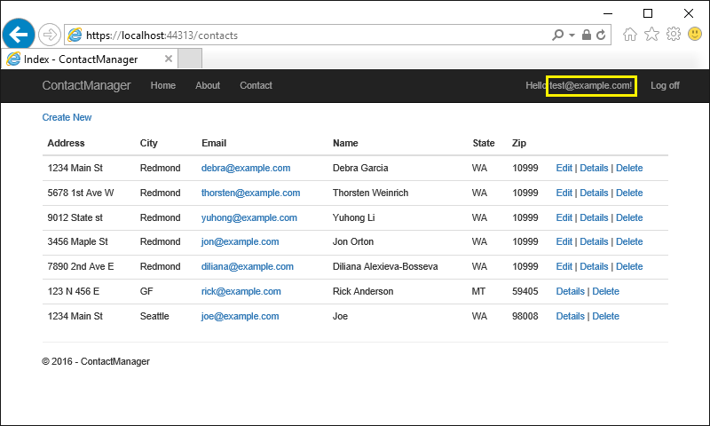

  # Create an app with user data protected by authorization

By [Rick Anderson](https://twitter.com/RickAndMSFT)

This tutorial shows how to create a web app with user data protected by authorization. Authenticated users can read all the contacts but can only edit their own contacts.  A user in the administrator role can delete any contact.

In the image below, user *rick@example.com* can edit and delete his contacts, and read other contacts.


In the image below, *test@example.com* is in the `canDelete` role, so she can edit her contacts and delete any contact.



The app was created by scaffolding the following `Contact` model:

[!code-csharp[Main](secure-data/samples/starter/Models/Contact.cs?name=snippet1)]

The contact information properties (Address, Name, etc.) are displayed in the images above. `ContactId` is the primary key for the table.

An authorization handler ensures that data can only be edited by the data owner. A `canDelete` handler allows administrators to delete any data.

  ## Prerequisites

This is not a beginning tutorial. You should be familiar with [creating an ASP.NET Core MVC app](xref:tutorials/first-mvc-app/start-mvc).

  ## The starter app

[Download](https://github.com/aspnet/Docs/tree/master/aspnet/security/authorization/secure-data/samples/starter) and test the starter app. See [Create the starter app](#create-the-starter-app) if you'd like to create it.

Update the database:

````none

   dotnet ef database update
   ````

Run the app, tap the **ContactManager** link, and verify you can create, edit, and delete a contact.

  ## Tie the contact data to the user

We'll use the ASP.NET [Identity](xref:security/authentication/identity) user ID to ensure users can edit their data, but not other users data. Add `OwnerID` to the `Contact` model :

[!code-csharp[Main](secure-data/samples/final15/Models/Contact.cs?name=snippet1&highlight=5-6)]

`OwnerID` is the user's ID from the `AspNetUser` table in the [Identity](../authentication/identity.md) database.

Scaffold a new migration and update the database:

```console
dotnet ef migrations add userID
dotnet ef database update
 ```

  ## Require SSL and authenticated users

In the `ConfigureServices` method of the *Startup.cs* file, add the [RequireHttpsAttribute](http://docs.asp.net/projects/api/en/latest/autoapi/Microsoft/AspNetCore/Mvc/RequireHttpsAttribute/index.html.md#Microsoft.AspNetCore.Mvc.RequireHttpsAttribute.md) authorization filter that requires all requests use HTTPS:

[!code-csharp[Main](secure-data/samples/final15/Startup.cs?name=snippet_SSL&highlight=1)]

If you're using Visual Studio, [Set up IIS Express for SSL/HTTPS](xref:security/enforcing-ssl#set-up-iis-express-for-sslhttps)

Set the default authentication policy to require users to be authenticated. You can opt out of authentication at the controller or action method with the `[AllowAnonymous]` attribute. With this approach, any new controllers added will automatically require authentication, which is more fail safe than relying on new controllers to include the `[Authorize]` attribute. Add the following to  the `ConfigureServices` method of the *Startup.cs* file:

[!code-csharp[Main](secure-data/samples/final15/Startup.cs?name=snippet_defaultPolicy&highlight=2-)]

Add `[AllowAnonymous]` to the home controller so anonymous users can get information about the site before they register.

<!-- TODO add link to middleware showing how to rediret HTTP to HTTPS -->

  ## Configure the test account

The `SeedData` class creates a test user account. Use the [Secret Manager tool](xref:security/app-secrets) to set a password for the account. Do this from the project directory (the directory containing *Program.cs*).

```console
dotnet user-secrets set SeedUserPW <PW>
```

Update `Configure` to use the test password:

[!code-csharp[Main](secure-data/samples/final15/Startup.cs?name=snippetUserPW&highlight=2)]

Add the test accounts user ID to the seed data. Only one contact is shown, add the user ID to all contacts:

[!code-csharp[Main](secure-data/samples/final15/Data/SeedData.cs?name=snippet1&highlight=16)]

Delete all the records in the `Contact` table and restart the app to seed the database. You'll need to register a user to browse the contact database.

## Resource based authorization

* Create an *Authorization* folder for the handlers and classes we will create to implement authorization.

* Create a *ContactIsOwnerAuthorizationHandler* class we can invoke to verify the user acting on the resource owns the resource. Create this in the *Authorization* folder.

[!code-csharp[Main](secure-data/samples/final15/Authorization/ContactIsOwnerAuthorizationHandler.cs)]

The `ContactIsOwnerAuthorizationHandler` calls `context.Succeed` if the current authenticated user is the contact owner. We allow contact owners to perform any operation on their own data, so we don't need to check the operation passed in the requirement parameter,

Services using Entity Framework Core must be registered for [dependency injection](xref:fundamentals/dependency-injection) using [AddScoped](http://docs.asp.net/projects/api/en/latest/autoapi/Microsoft/Extensions/DependencyInjection/ServiceCollectionServiceExtensions/index.html.md#Microsoft.Extensions.DependencyInjection.ServiceCollectionServiceExtensions.AddScoped.md). The `ContactIsOwnerAuthorizationHandler` uses ASP.NET Core Identity, which is built on Entity Framework Core. Register the `ContactIsOwner` handler with the service collection so it will be available to the `ContactsController` through [dependency injection](xref:fundamentals/dependency-injection). Add the following code to the end of `ConfigureServices`:

[!code-csharp[Main](secure-data/samples/final15/Startup.cs?name=snippet_ContactIsOwnerAuthorizationHandler&highlight=1-2)]

Update the `ContactsController` constructor to resolve the `IAuthorizationService` service so we'll have access to our authorization handlers we have registered. While we're at it we'll also get the `Identity` `UserManager` service:

````c#

   public class ContactsController : Controller
   {
       private readonly ApplicationDbContext _context;
       private readonly IAuthorizationService _authorizationService;
       private readonly UserManager<ApplicationUser> _userManager;

       public ContactsController(
           ApplicationDbContext context,
           IAuthorizationService authorizationService,
           UserManager<ApplicationUser> userManager)
       {
           _context = context;
           _userManager = userManager;
           _authorizationService = authorizationService;
       }

   ````

Add the `ContactOperationsRequirements` class to the *Authorization* folder to contain the requirements our app supports:


````c#

   using ContactManager.Authorization;
   using Microsoft.AspNetCore.Authorization.Infrastructure;

   // Add https://github.com/blowdart/AspNetAuthorization-Samples/blob/master/src/AspNetAuthorization/Authorization/DocumentAuthorizationHandler.cs
   // MapClaimsToOperations

   namespace ContactManager.Authorization
   {
       public static class ContactOperationsRequirements
       {
           public static OperationAuthorizationRequirement Create =  // Add a create handler
               new OperationAuthorizationRequirement { Name = "Create" };
           public static OperationAuthorizationRequirement Read =
               new OperationAuthorizationRequirement { Name = "Read" };  // Add a read handler
           public static OperationAuthorizationRequirement Update =
               new OperationAuthorizationRequirement { Name = "Update" }; // Add a delete handler
           public static OperationAuthorizationRequirement Delete =
               new OperationAuthorizationRequirement { Name = Constants.canDelete };
           public static OperationAuthorizationRequirement ContainsOne =
             new OperationAuthorizationRequirement { Name = Constants.ContainsOne };
       }

       public class Constants
       {
           public static readonly string canDelete = "canDelete";
           public static readonly string ContainsOne = "ContainsOne";
       }
   }

   // operations are not permission, permissions are what grant operations
   ````

Update the `HTTP POST Create` method to add the user ID to the `Contact` model:


````c#

   // POST: Contacts/Create
   [HttpPost]
   [ValidateAntiForgeryToken]
   public async Task<IActionResult> Create(
               [Bind("ContactId,Address,City,Email,Name,State,Zip")] Contact contact)
   {
       if (ModelState.IsValid)
       {
           contact.OwnerID = _userManager.GetUserId(User);
           _context.Add(contact);
           await _context.SaveChangesAsync();
           return RedirectToAction("Index");
       }
       return View(contact);
   }

   ````

Update both `Edit` methods to use the authorization handler to verify the user owns the contact. Because we are performing resource authorization we cannot use the `[Authorize]` attribute as we don't have access to the resource when attributes are evaluated. Resource based authorization must be imperative. Checks must be performed once we have access to the resource, either by loading it in our controller, or by loading it within the handler itself. Frequently you will access the resource by passing in the resource key.


````c#

   public async Task<IActionResult> Edit(int? id)
   {
       if (id == null)
       {
           return NotFound();
       }

       var contactDB = await _context.Contact.SingleOrDefaultAsync(m => m.ContactId == id);
       if (contactDB == null)
       {
           return NotFound();
       }

       var isAuthorized = await _authorizationService.AuthorizeAsync(User, contactDB, 
                                   ContactOperationsRequirements.Update);
       if (!isAuthorized)
       {
           return new ChallengeResult();
       }

       return View(contactDB);
   }

   // Make ContactViewModel -- might need multiple viewModeles
   // POST: Contacts/Edit/5
   [HttpPost]
   [ValidateAntiForgeryToken]
   public async Task<IActionResult> Edit(int id, 
       [Bind("ContactId,Address,City,Email,Name,State,Zip")] Contact contact)
   {
       // Why is this here? Scaffolding??
       if (id != contact.ContactId)
       {
           return NotFound();
       }

       // Fetch Contact from DB to get OwnerID.
       var contactDB = await _context.Contact.SingleOrDefaultAsync(m => m.ContactId == id);
       if (contactDB == null)
       {
           return NotFound();
       }

       var isAuthorized = await _authorizationService.AuthorizeAsync(User, contactDB,
                                   ContactOperationsRequirements.Update);
       if (!isAuthorized)
       {
           return new ChallengeResult();
       }
       // Review with EF - should I copy changed fields to contactDB and update
       // rather that what I'm doing here.
       contact.OwnerID = contactDB.OwnerID;
       _context.Entry(contactDB).State = EntityState.Detached;

       if (ModelState.IsValid)
       {
           try
           {
               _context.Update(contact);
               await _context.SaveChangesAsync();
           }
           catch (DbUpdateConcurrencyException)
           {
               if (!ContactExists(contact.ContactId))
               {
                   return NotFound();
               }
               else
               {
                   throw;
               }
           }
           return RedirectToAction("Index");
       }
       return View(contact);
   }

   ````

Update both `Delete` methods to use the authorization handler to verify the user owns the contact.


````c#

   public async Task<IActionResult> Delete(int? id)
   {
       if (id == null)
       {
           return NotFound();
       }

       var contact = await _context.Contact.SingleOrDefaultAsync(m => m.ContactId == id);
       if (contact == null)
       {
           return NotFound();
       }

       var isAuthorized = await _authorizationService.AuthorizeAsync(User, contact,
                                   ContactOperationsRequirements.Delete);
       if (!isAuthorized)
       {
           return new ChallengeResult();
       }

       return View(contact);
   }

   // POST: Contacts/Delete/5
   [HttpPost, ActionName("Delete")]
   [ValidateAntiForgeryToken]
   public async Task<IActionResult> DeleteConfirmed(int id)
   {
       var contact = await _context.Contact.SingleOrDefaultAsync(m => m.ContactId == id);

       var isAuthorized = await _authorizationService.AuthorizeAsync(User, contact,
                                   ContactOperationsRequirements.Delete);
       if (!isAuthorized)
       {
           return new ChallengeResult();
       }

       _context.Contact.Remove(contact);
       await _context.SaveChangesAsync();
       return RedirectToAction("Index");
   }

   ````

<a name=update-access-denied-label></a>

  ## Update the `AccountController` to display friendly access denied errors

Add the `AccessDenied` method to the `AccountController`. This method will be invoked when we call `ChallengeResult`.

````c#

   //
   // GET /Account/AccessDenied
   [HttpGet]
   [AllowAnonymous]
   public IActionResult AccessDenied()
   {
       return View();
   }

   ````

Add the *Views/Account/AccessDenied.cshtml* Razor view:


````html

   @{
       ViewData["Title"] = "Access Denied";
   }

   <header>
       <h1 class="text-danger">Access Denied.</h1>
       <p class="text-danger">You do not have access to this resource.</p>
   </header>
   ````

  ## Test the `Edit`, `Delete`, and `Create` methods

An easy way to test the changes we made is to launch two different browsers (for example Edge and Internet Explorer). Log into one browser as user `test@example.com`. In the other browser register a new user (for example `rick@example.com`) and create a new contact.

Verify `test@example.com` can edit and delete the seed data and any contacts created with that account. Verify `test@example.com` cannot edit or delete a contact created by the second account.

  ## Inject the authorization service into the views

Currently the UI shows edit and delete links for data the user cannot modify. We'll fix that by applying the authorization handler to the views.

Inject the authorization service in the *Views/_ViewImports.cshtml* file so it will be available to all views:


````none

   @using ContactManager
   @using ContactManager.Models
   @using ContactManager.Models.AccountViewModels
   @using ContactManager.Models.ManageViewModels
   @using Microsoft.AspNetCore.Identity
   @addTagHelper *, Microsoft.AspNetCore.Mvc.TagHelpers
   @using Microsoft.AspNetCore.Authorization
   @inject IAuthorizationService AuthorizationService 

   ````

Update the *Views/Contacts/Index.cshtml* Razor view to show only display the edit and delete links for the users data:

````none

   @using ContactManager.Authorization;

   ````


````none

   </td>
   <td>
       @Html.DisplayFor(modelItem => item.Zip)
   </td>
   <td>
       @if (await AuthorizationService.AuthorizeAsync(User,
                                              item, ContactOperationsRequirements.Update))
       {
           <a asp-action="Edit" asp-route-id="@item.ContactId">Edit</a><text> | </text>
       }
       <a asp-action="Details" asp-route-id="@item.ContactId">Details</a>
       @if (await AuthorizationService.AuthorizeAsync(User,
                                                item, ContactOperationsRequirements.Delete))
       {
           <text> | </text>
           <a asp-action="Delete" asp-route-id="@item.ContactId">Delete</a>
       }
   </td>

   ````

Test the app with two different browsers and users to verify they cannot edit or delete contacts they didn't create.

Warning: Hiding links from users that do not have permission to edit or delete data does not secure that app, it makes the app more user friendly by displaying only valid links. Users can hack the generated URLs to invoke edit and delete operations on data they don't own.  The controller must repeat the access checks to be secure.

  ### Adding an administrative role

Applications frequently support an administrator account with permissions to modify user data.  In this sample we'll create the "canDelete" role, and users in this role will be able to delete any contacts.

The "canDelete" requirement will have two handlers, one for the contact owner and one for administrative users in the "canDelete" role. Using multiple handlers for a requirement significantly simplifies your code, as the controller and UI code don't change, you simply add the administrative "canDelete" handler. See [Authorization Handlers](xref:security/authorization/policies) for more information.

Log out of the "[test@example.com](mailto:test@example.com)" browser session or close the browser to clear the identity cookie.

Update `SeedData` to create and call the "canDelete" role:


````c#

   private static async Task<IdentityResult> CreateCanDeleteRole(IServiceProvider serviceProvider,
                                                                  string uid, string canDeleteRole)
   {
       IdentityResult IR = null;
       var roleManager = serviceProvider.GetService<RoleManager<IdentityRole>>();

       if (!await roleManager.RoleExistsAsync(canDeleteRole))
       {
           IR = await roleManager.CreateAsync(new IdentityRole(canDeleteRole));
       }

       var userManager = serviceProvider.GetService<UserManager<ApplicationUser>>();

       var user = await userManager.FindByIdAsync(uid);

       IR = await userManager.AddToRoleAsync(user, canDeleteRole);

       return IR;
   }

   ````


````c#

   public static async Task Initialize(IServiceProvider serviceProvider, string testUserPw)
   {
       using (var context = new ApplicationDbContext(
           serviceProvider.GetRequiredService<DbContextOptions<ApplicationDbContext>>()))
       {
           var uid = await CreateTestUser(serviceProvider, testUserPw);
           await CreateCanDeleteRole(serviceProvider, uid, Constants.canDelete);
           SeedDB(context, uid);
       }
   }

   ````

Create a new class called `ContactRoleAuthorizationHandler` for the role handler to validate the user is in the specified role:


````c#

   using System.Threading.Tasks;
   using ContactManager.Models;
   using Microsoft.AspNetCore.Authorization;
   using Microsoft.AspNetCore.Authorization.Infrastructure;

   namespace ContactManager.Authorization
   {
       public class ContactRoleAuthorizationHandler
                       : AuthorizationHandler<OperationAuthorizationRequirement, Contact>
       {
           protected override Task HandleRequirementAsync(AuthorizationHandlerContext context,
                               OperationAuthorizationRequirement requirement, Contact resource)
           {
               if (context.User == null)
               {
                   return Task.FromResult(0);
               }

               if (context.User.IsInRole(requirement.Name))
               {
                   context.Succeed(requirement);
               }
               return Task.FromResult(0);
           }
       }
   }

   ````

Then, if we have the "Admin" role, you'd have two handlers for the requirement/operation, one which is "Admin" which ignores the operation entirely.

Add the role authorization handler to the service container in `ConfigureServices`.


````c#

   services.AddSingleton<IAuthorizationHandler, ContactRoleAuthorizationHandler>();

   ````

The `ContactRoleAuthorizationHandler` is added as a singleton because all the information it needs is in the `Context` parameter of the *HandleRequirementAsync* method.

Test the app and verify the "[test@example.com](mailto:test@example.com)" user can delete contacts created by other users. Verify that regular users can't edit or delete other users data. An easy way to test this is to tap on another users **Details** link and change the URL from /Contacts/Details/18 to /Contacts/Delete/18.

The `ContactRoleAuthorizationHandler` allowed us to add an administrator that can delete user data without changing the UI code or the controller code. We were able to do this because we wrote the handlers to OR evaluate; any handler that succeeds allows the requirement to be met. This is typical for authorization handlers.

You could write a handler that fails the requirements, even if the other handlers succeed. For example, consider the following handler that fails if the contact address doesn't contain "1":

````c#

   using System;
   using System.Threading.Tasks;
   using ContactManager.Models;
   using Microsoft.AspNetCore.Authorization;
   using Microsoft.AspNetCore.Authorization.Infrastructure;

   namespace ContactManager.Authorization
   {
       public class ContactHasOneAuthorizationHandler 
                   : AuthorizationHandler<OperationAuthorizationRequirement, Contact>
       {        

           protected override Task HandleRequirementAsync(AuthorizationHandlerContext context, 
               OperationAuthorizationRequirement requirement, Contact resource)
           {
               if (resource == null)
               {
                   return Task.FromResult(0);
               }

               // Return if we haven't requested this requirement.
               if (string.CompareOrdinal(requirement.Name, Constants.ContainsOne) != 0)
               {
                   return Task.FromResult(0);
               }

               if (!resource.Address.Contains("1"))
               {
                   context.Fail();
               }
               return Task.FromResult(0);
           }
       }
   }
   ````

If you applied this handler to the **Details** link, addresses without a "1" would not display the **Details** link.

````none

       @* Has 1 filter *@
       @if (await AuthorizationService.AuthorizeAsync(User, item, 
                                          ContactOperationsRequirements.ContainsOne))
       {
           <a asp-action="Details" asp-route-id="@item.ContactId">Details</a>
       }

   ````

See reference<!-- {"refid": "secure-data-add-resources-label", "dupnames": [], "classes": [], "ids": [], "backrefs": [], "internal": true, "names": []} --> for more information.

<a name=create-secure-data-starter-app-label></a>

  ## Create the starter app

* Create a new **ASP.NET Core Web Application** using [Visual Studio 2015](https://www.visualstudio.com/en-us/visual-studio-homepage-vs.aspx) named "ContactManager"

  * Create the app with **Individual User Accounts**

  * Name it "ContactManager" so your namespace will match the namespace use in the sample

* Add the following `Contact` model:


````c#

   namespace ContactManager.Models
   {
       #region snippet_1
       public class Contact
       {
           public int ContactId { get; set; }

           public string Name { get; set; }
           public string Address { get; set; }
           public string City { get; set; }
           public string State { get; set; }
           public string Zip { get; set; }
           public string Email { get; set; }
       }
       #endregion
   }
   ````

* Scaffold the `Contact` model using Entity Framework Core and the `ApplicationDbContext` data context. Accept all the scaffolding defaults. Using `ApplicationDbContext` for the data context class  puts the contact table in the [Identity](../authentication/identity.md) database. See [Adding a model](../../tutorials/first-mvc-app/adding-model.md) for more information.

* Update the **ContactManager** anchor in the *Views/Shared/_Layout.cshtml* file from `asp-controller="Home"` to `asp-controller="Contacts"` so tapping the **ContactManager** link will invoke the Contacts controller. The original markup:


````html

   <a asp-area="" asp-controller="Home" asp-action="Index" class="navbar-brand">ContactManager</a>
   ````

The updated markup:

````html

   <a asp-area="" asp-controller="Contacts" asp-action="Index" class="navbar-brand">ContactManager</a>
   ````

* Scaffold the initial migration and update the database


````none

   dotnet ef migrations add initial
   dotnet ef database update
   ````

* Test the app by creating, editing and deleting a contact

  ## Seed the database

Add the `SeedData` class to the *Data* folder. If you've downloaded the sample, you can copy the *SeedData.cs* file to the *Data* folder of the starter project.

````c#

   using ContactManager.Models;
   using Microsoft.AspNetCore.Identity;
   using Microsoft.AspNetCore.Identity.EntityFrameworkCore;
   using Microsoft.EntityFrameworkCore;
   using Microsoft.Extensions.DependencyInjection;
   using System;
   using System.Linq;
   using System.Threading.Tasks;

   namespace ContactManager.Data
   {
       public static class SeedData
       {
           public static async Task Initialize(IServiceProvider serviceProvider, string testUserPw)
           {
               using (var context = new ApplicationDbContext(
                   serviceProvider.GetRequiredService<DbContextOptions<ApplicationDbContext>>()))
               {
                   var uid = await CreateTestUser(serviceProvider, testUserPw);
                   SeedDB(context, uid);
               }
           }

           private static async Task<string> CreateTestUser(IServiceProvider serviceProvider, string testUserPw)
           {
               if (String.IsNullOrEmpty(testUserPw))
                   return "";

               const string SeedUserName = "test@example.com";

               var userManager = serviceProvider.GetService<UserManager<ApplicationUser>>();

               var user = await userManager.FindByNameAsync(SeedUserName);
               if (user == null)
               {
                   user = new ApplicationUser { UserName = SeedUserName };
                   await userManager.CreateAsync(user, testUserPw);
               }

               return user.Id;
           }

           public static void SeedDB(ApplicationDbContext context, string uid)
           {
               if (context.Contact.Any())
               {
                   return;   // DB has been seeded
               }

               context.Contact.AddRange(
                   new Contact
                   {
                       Name = "Debra Garcia",
                       Address = "1234 Main St",
                       City = "Redmond",
                       State = "WA",
                       Zip = "10999",
                       Email = "debra@example.com"
                   },
                new Contact
                {
                    Name = "Thorsten Weinrich",
                    Address = "5678 1st Ave W",
                    City = "Redmond",
                    State = "WA",
                    Zip = "10999",
                    Email = "thorsten@example.com"
                },
                new Contact
                {
                    Name = "Yuhong Li",
                    Address = "9012 State st",
                    City = "Redmond",
                    State = "WA",
                    Zip = "10999",
                    Email = "yuhong@example.com"
                },
                new Contact
                {
                    Name = "Jon Orton",
                    Address = "3456 Maple St",
                    City = "Redmond",
                    State = "WA",
                    Zip = "10999",
                    Email = "jon@example.com"
                },
                new Contact
                {
                    Name = "Diliana Alexieva-Bosseva",
                    Address = "7890 2nd Ave E",
                    City = "Redmond",
                    State = "WA",
                    Zip = "10999",
                    Email = "diliana@example.com"
                }
                );
               context.SaveChanges();
           }
       }
   }
   ````

Add the highlighted code to the end of the `Configure` method in the *Startup.cs* file:


````c#

   app.UseMvc(routes =>
   {
       routes.MapRoute(
           name: "default",
           template: "{controller=Home}/{action=Index}/{id?}");
   });

   try
   {
       SeedData.Initialize(app.ApplicationServices, "").Wait();
   }
   catch
   {
       throw new System.Exception("You need to update the DB "
           + "\nPM > Update - Database " + "\n or \n" +
             "> dotnet ef database update"
             + "\nIf that doesn't work, comment out SeedData and register a new user");
   }

   ````

Test that the app seeded the database. The seed method will not run if there are any rows in the contact DB.

<a name=secure-data-add-resources-label></a>

  ### Additional resources

* [ASP.NET Core Authorization Lab](https://github.com/blowdart/AspNetAuthorizationWorkshop)

* [Authorization](index.md)

* [Custom Policy-Based Authorization](policies.md)
