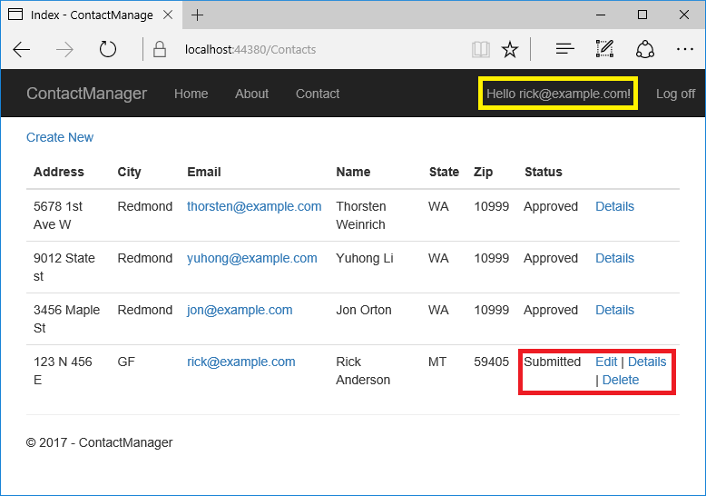

# Create an ASP.NET Core app with user data protected by authorization

By [Rick Anderson](https://twitter.com/RickAndMSFT) and [Joe Audette](https://twitter.com/joeaudette)

This tutorial shows how to create an ASP.NET Core web app with user data protected by authorization. It displays a list of contacts that authenticated (registered) users have created. There are three security groups:

* **Registered users** can view all the approved data and can edit/delete their own data.
* **Managers** can approve or reject contact data. Only approved contacts are visible to users.
* **Administrators** can approve/reject and edit/delete any data.

In the following image, user Rick (`rick@example.com`) is signed in. Rick can only view approved contacts and **Edit**/**Delete**/**Create New** links for his contacts. Only the last record, created by Rick, displays **Edit** and **Delete** links. Other users won't see the last record until a manager or administrator changes the status to "Approved".



In the following image, `manager@contoso.com` is signed in and in the managers role:


The following image shows the managers details view of a contact:


The **Approve** and **Reject** buttons are only displayed for managers and administrators.

In the following image, `admin@contoso.com` is signed in and in the administrators role:


The administrator has all privileges. She can read/edit/delete any contact and change the status of contacts.

The app was created by [scaffolding](xref:tutorials/first-mvc-app-xplat/adding-model#scaffold-the-moviecontroller) the following `Contact` model:

[!code-csharp[Main](secure-data/samples/starter2/Models/Contact.cs?name=snippet1)]

The sample contains the following authorization handlers:

* `ContactIsOwnerAuthorizationHandler`: Ensures that a user can only edit their data.
* `ContactManagerAuthorizationHandler`: Allows managers to approve or reject contacts.
* `ContactAdministratorsAuthorizationHandler`: Allows administrators to approve or reject contacts and to edit/delete contacts.

## Prerequisites

This tutorial is advanced. You should be familiar with:

* [ASP.NET Core](xref:tutorials/first-mvc-app/start-mvc)
* [Authentication](xref:security/authentication/index)
* [Account Confirmation and Password Recovery](xref:security/authentication/accconfirm)
* [Authorization](xref:security/authorization/index)
* [Entity Framework Core](xref:data/ef-mvc/intro)

See [this PDF file](https://github.com/aspnet/Docs/tree/master/aspnetcore/security/authorization/secure-data/asp.net_repo_pdf_1-16-18.pdf) for the ASP.NET Core MVC version. The ASP.NET Core 1.1 version of this tutorial is in [this](https://github.com/aspnet/Docs/tree/master/aspnetcore/security/authorization/secure-data) folder. The 1.1 ASP.NET Core sample is in the [samples](https://github.com/aspnet/Docs/tree/master/aspnetcore/security/authorization/secure-data/samples/final2).

## The starter and completed app

[Download](xref:tutorials/index#how-to-download-a-sample) the [completed](https://github.com/aspnet/Docs/tree/master/aspnetcore/security/authorization/secure-data/samples/final2) app. [Test](#test-the-completed-app) the completed app so you become familiar with its security features.

### The starter app

[Download](xref:tutorials/index#how-to-download-a-sample) the [starter](https://github.com/aspnet/Docs/tree/master/aspnetcore/security/authorization/secure-data/samples/starter2) app.

Run the app, tap the **ContactManager** link, and verify you can create, edit, and delete a contact.

## Secure user data

The following sections have all the major steps to create the secure user data app. You may find it helpful to refer to the completed project.

### Tie the contact data to the user

Use the ASP.NET [Identity](xref:security/authentication/identity) user ID to ensure users can edit their data, but not other users data. Add `OwnerID` and `ContactStatus` to the `Contact` model:

[!code-csharp[Main](secure-data/samples/final2/Models/Contact.cs?name=snippet1&highlight=5-6,16-)]

`OwnerID` is the user's ID from the `AspNetUser` table in the [Identity](xref:security/authentication/identity) database. The `Status` field determines if a contact is viewable by general users.

Create a new migration and update the database:

```console
dotnet ef migrations add userID_Status
dotnet ef database update
```

### Require SSL and authenticated users

Add [IHostingEnvironment](/dotnet/api/microsoft.aspnetcore.hosting.ihostingenvironment) to `Startup`:

[!code-csharp[Main](secure-data/samples/final2/Startup.cs?name=snippet_env)]

In the `ConfigureServices` method of the *Startup.cs* file, add the [RequireHttpsAttribute](/aspnet/core/api/microsoft.aspnetcore.mvc.requirehttpsattribute) authorization filter:

[!code-csharp[Main](secure-data/samples/final2/Startup.cs?name=snippet_SSL&highlight=19-)]

If you're using Visual Studio, enable SSL.

To redirect HTTP requests to HTTPS, see [URL Rewriting Middleware](xref:fundamentals/url-rewriting). If you're using Visual Studio Code or testing on a local platform that doesn't include a test certificate for SSL:

  Set `"LocalTest:skipSSL": true` in the *appsettings.Developement.json* file.

### Require authenticated users

Set the default authentication policy to require users to be authenticated. You can opt out of authentication at the Razor Page, controller, or action method level with the `[AllowAnonymous]` attribute. Setting the default authentication policy to require users to be authenticated protects newly added Razor Pages and controllers. Having authentication required by default is safer than relying on new controllers and Razor Pages to include the `[Authorize]` attribute. Add the following to the `ConfigureServices` method of the *Startup.cs* file:

[!code-csharp[Main](secure-data/samples/final2/Startup.cs?name=snippet_defaultPolicy&highlight=31-)]

Add [AllowAnonymous](/dotnet/api/microsoft.aspnetcore.authorization.allowanonymousattribute) to the Index, About, and Contact pages so anonymous users can get information about the site before they register. 

[!code-csharp[Main](secure-data/samples/final2/Pages/Index.cshtml.cs?name=snippet&highlight=2)]

Add `[AllowAnonymous]` to the [LoginModel and RegisterModel](https://github.com/aspnet/templating/issues/238).

### Configure the test account

The `SeedData` class creates two accounts: administrator and manager. Use the [Secret Manager tool](xref:security/app-secrets) to set a password for these accounts. Set the password from the project directory (the directory containing *Program.cs*):

```console
dotnet user-secrets set SeedUserPW <PW>
```

Update `Main` to use the test password:

[!code-csharp[Main](secure-data/samples/final2/Program.cs?name=snippet)]

### Create the test accounts and update the contacts

Update the `Initialize` method in the `SeedData` class to create the test accounts:

[!code-csharp[Main](secure-data/samples/final2/Data/SeedData.cs?name=snippet_Initialize)]

Add the administrator user ID and `ContactStatus` to the contacts. Make one of the contacts "Submitted" and one "Rejected". Add the user ID and status to all the contacts. Only one contact is shown:

[!code-csharp[Main](secure-data/samples/final2/Data/SeedData.cs?name=snippet1&highlight=17,18)]

## Create owner, manager, and administrator authorization handlers

Create a `ContactIsOwnerAuthorizationHandler` class in the *Authorization* folder. The `ContactIsOwnerAuthorizationHandler` verifies that the user acting on a resource owns the resource.

[!code-csharp[Main](secure-data/samples/final2/Authorization/ContactIsOwnerAuthorizationHandler.cs)]

The `ContactIsOwnerAuthorizationHandler` calls [context.Succeed](/dotnet/api/microsoft.aspnetcore.authorization.authorizationhandlercontext.succeed#Microsoft_AspNetCore_Authorization_AuthorizationHandlerContext_Succeed_Microsoft_AspNetCore_Authorization_IAuthorizationRequirement_) if the current authenticated user is the contact owner. Authorization handlers generally:

* Return `context.Succeed` when the requirements are met.
* Return `Task.CompletedTask` when requirements aren't met. `Task.CompletedTask` is neither success or failure&mdash;it allows other authorization handlers to run.

If you need to explicitly fail, return [context.Fail](/dotnet/api/microsoft.aspnetcore.authorization.authorizationhandlercontext.fail).

The app allows contact owners to edit/delete/create their own data. `ContactIsOwnerAuthorizationHandler` doesn't need to check the operation passed in the requirement parameter.

### Create a manager authorization handler

Create a `ContactManagerAuthorizationHandler` class in the *Authorization* folder. The `ContactManagerAuthorizationHandler` verifies the user acting on the resource is a manager. Only managers can approve or reject content changes (new or changed).

[!code-csharp[Main](secure-data/samples/final2/Authorization/ContactManagerAuthorizationHandler.cs)]

### Create an administrator authorization handler

Create a `ContactAdministratorsAuthorizationHandler` class in the *Authorization* folder. The `ContactAdministratorsAuthorizationHandler` verifies the user acting on the resource is an administrator. Administrator can do all operations.

[!code-csharp[Main](secure-data/samples/final2/Authorization/ContactAdministratorsAuthorizationHandler.cs)]

## Register the authorization handlers

Services using Entity Framework Core must be registered for [dependency injection](xref:fundamentals/dependency-injection) using [AddScoped](/aspnet/core/api/microsoft.extensions.dependencyinjection.servicecollectionserviceextensions). The `ContactIsOwnerAuthorizationHandler` uses ASP.NET Core [Identity](xref:security/authentication/identity), which is built on Entity Framework Core. Register the handlers with the service collection so they're available to the `ContactsController` through [dependency injection](xref:fundamentals/dependency-injection). Add the following code to the end of `ConfigureServices`:

[!code-csharp[Main](secure-data/samples/final2/Startup.cs?name=ConfigureServices&highlight=41-)]

`ContactAdministratorsAuthorizationHandler` and `ContactManagerAuthorizationHandler` are added as singletons. They're singletons because they don't use EF and all the information needed is in the `Context` parameter of the `HandleRequirementAsync` method.

## Support authorization

In this section, you update the Razor Pages and add an operations requirements class.

### Review the contact operations requirements class

Review the `ContactOperations` class. This class contains the requirements the app supports:

[!code-csharp[Main](secure-data/samples/final2/Authorization/ContactOperations.cs)]

### Create a base class for the Razor Pages

Create a base class that contains the services used in the contacts Razor Pages. The base class puts that initialization code in one location:

[!code-csharp[Main](secure-data/samples/final2/Pages/Contacts/DI_BasePageModel.cs)]

The preceding code:

* Adds the `IAuthorizationService` service to access to the authorization handlers.
* Adds the Identity `UserManager` service.
* Add the `ApplicationDbContext`.

### Update the CreateModel

Update the create page model constructor to use the `DI_BasePageModel` base class:

[!code-csharp[Main](secure-data/samples/final2/Pages/Contacts/Create.cshtml.cs?name=snippetCtor)]

Update the `CreateModel.OnPostAsync` method to:

* Add the user ID to the `Contact` model.
* Call the authorization handler to verify the user has permission to create contacts.

[!code-csharp[Main](secure-data/samples/final2/Pages/Contacts/Create.cshtml.cs?name=snippet_Create)]

### Update the IndexModel

Update the `OnGetAsync` method so only approved contacts are shown to general users:

[!code-csharp[Main](secure-data/samples/final2/Pages/Contacts/Index.cshtml.cs?name=snippet)]

### Update the EditModel

Add an authorization handler to verify the user owns the contact. Because resource authorization is being validated, the `[Authorize]` attribute is not enough. The app doesn't have access to the resource when attributes are evaluated. Resource-based authorization must be imperative. Checks must be performed once the app has access to the resource, either by loading it in the page model or by loading it within the handler itself. You frequently access the resource by passing in the resource key.

[!code-csharp[Main](secure-data/samples/final2/Pages/Contacts/Edit.cshtml.cs?name=snippet)]

### Update the DeleteModel

Update the delete page model to use the authorization handler to verify the user has delete permission on the contact.

[!code-csharp[Main](secure-data/samples/final2/Pages/Contacts/Delete.cshtml.cs?name=snippet)]

## Inject the authorization service into the views

Currently, the UI shows edit and delete links for data the user can't modify. The UI is fixed by applying the authorization handler to the views.

Inject the authorization service in the *Views/_ViewImports.cshtml* file so it's available to all views:

[!code-cshtml[Main](secure-data/samples/final2/Pages/_ViewImports.cshtml?highlight=6-9)]

The preceding markup adds several `using` statements.

Update the **Edit** and **Delete** links in *Pages/Contacts/Index.cshtml* so they're only rendered for users with the appropriate permissions:

[!code-cshtml[Main](secure-data/samples/final2/Pages/Contacts/Index.cshtml?highlight=34-36,64-)]

> [!WARNING]
> Hiding links from users that don't have permission to change data doesn't secure the app. Hiding links makes the app more user-friendly by displaying only valid links. Users can hack the generated URLs to invoke edit and delete operations on data they don't own. The Razor Page or controller must enforce access checks to secure the data.

### Update Details

Update the details view so managers can approve or reject contacts:

[!code-cshtml[Main](secure-data/samples/final2/Pages/Contacts/Details.cshtml?range=48-)]

Update the details page model:

[!code-csharp[Main](secure-data/samples/final2/Pages/Contacts/Details.cshtml.cs?name=snippet)]

## Test the completed app

If you're using Visual Studio Code or testing on a local platform that doesn't include a test certificate for SSL:

* Set `"LocalTest:skipSSL": true` in the *appsettings.Developement.json* file to skip the SSL requirement. Skip SSL only on a development machine.

If the app has contacts:

* Delete all the records in the `Contact` table.
* Restart the app to seed the database.

Register a user for browsing the contacts.

An easy way to test the completed app is to launch three different browsers (or incognito/InPrivate versions). In one browser, register a new user (for example, `test@example.com`). Sign in to each browser with a different user. Verify the following operations:

* Registered users can view all the approved contact data.
* Registered users can edit/delete their own data.
* Managers can approve or reject contact data. The `Details` view shows **Approve** and **Reject** buttons.
* Administrators can approve/reject and edit/delete any data.

| User| Options |
| ------------ | ---------|
| test@example.com | Can edit/delete own data |
| manager@contoso.com | Can approve/reject and edit/delete own data |
| admin@contoso.com | Can edit/delete and approve/reject all data|

Create a contact in the administrator's browser. Copy the URL for delete and edit from the administrator contact. Paste these links into the test user's browser to verify the test user can't perform these operations.

## Create the starter app

* Create a Razor Pages app named "ContactManager"

  * Create the app with **Individual User Accounts**.
  * Name it "ContactManager" so your namespace matches the namespace used in the sample.

  ```console
  dotnet new razor -o ContactManager -au Individual -uld
  ```

  * `-uld` specifies LocalDB instead of SQLite

* Add the following `Contact` model:

  [!code-csharp[Main](secure-data/samples/starter2/Models/Contact.cs?name=snippet1)]

* Scaffold the `Contact` model:

```console
dotnet aspnet-codegenerator razorpage -m Contact -udl -dc ApplicationDbContext -outDir Pages\Contacts --referenceScriptLibraries
```

* Update the **ContactManager** anchor in the *Pages/_Layout.cshtml* file:

```cshtml
<a asp-page="/Contacts/Index" class="navbar-brand">ContactManager</a>
```

* Scaffold the initial migration and update the database:

```console
dotnet ef migrations add initial
dotnet ef database update
```

* Test the app by creating, editing, and deleting a contact

### Seed the database

Add the `SeedData` class to the *Data* folder. If you've downloaded the sample, you can copy the *SeedData.cs* file to the *Data* folder of the starter project.

Call `SeedData.Initialize` from `Main`:

[!code-csharp[Main](secure-data/samples/starter2/Program.cs?name=snippet)]

Test that the app seeded the database. If there are any rows in the contact DB, the seed method doesn't run.

<a name="secure-data-add-resources-label"></a>

### Additional resources

* [ASP.NET Core Authorization Lab](https://github.com/blowdart/AspNetAuthorizationWorkshop). This lab goes into more detail on the security features introduced in this tutorial.
* [Authorization in ASP.NET Core: Simple, role, claims-based, and custom](xref:security/authorization/index)
* [Custom policy-based authorization](xref:security/authorization/policies)
