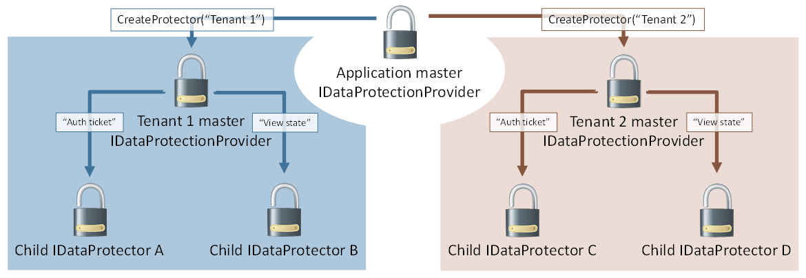

# Purpose hierarchy and multi-tenancy in ASP.NET Core

Since an IDataProtector is also implicitly an IDataProtectionProvider, purposes can be chained together. In this sense provider.CreateProtector([ "purpose1", "purpose2" ]) is equivalent to provider.CreateProtector("purpose1").CreateProtector("purpose2").

This allows for some interesting hierarchical relationships through the data protection system. In the earlier example of [Contoso.Messaging.SecureMessage](purpose-strings.md#data-protection-contoso-purpose), the SecureMessage component can call provider.CreateProtector("Contoso.Messaging.SecureMessage") once upfront and cache the result into a private _myProvider field. Future protectors can then be created via calls to _myProvider.CreateProtector("User: username"), and these protectors would be used for securing the individual messages.

This can also be flipped. Consider a single logical application which hosts multiple tenants (a CMS seems reasonable), and each tenant can be configured with its own authentication and state management system. The umbrella application has a single master provider, and it calls provider.CreateProtector("Tenant 1") and provider.CreateProtector("Tenant 2") to give each tenant its own isolated slice of the data protection system. The tenants could then derive their own individual protectors based on their own needs, but no matter how hard they try they cannot create protectors which collide with any other tenant in the system. Graphically this is represented as below.

>[!WARNING]
> This assumes the umbrella application controls which APIs are available to individual tenants and that tenants cannot execute arbitrary code on the server. If a tenant can execute arbitrary code, they could perform private reflection to break the isolation guarantees, or they could just read the master keying material directly and derive whatever subkeys they desire.

The data protection system actually uses a sort of multi-tenancy in its default out-of-the-box configuration. By default master keying material is stored in the worker process account's user profile folder (or the registry, for IIS application pool identities). But it is actually fairly common to use a single account to run multiple applications, and thus all these applications would end up sharing the master keying material. To solve this, the data protection system automatically inserts a unique-per-application identifier as the first element in the overall purpose chain. This implicit purpose serves to [isolate individual applications](../configuration/overview.md#data-protection-configuration-per-app-isolation) from one another by effectively treating each application as a unique tenant within the system, and the protector creation process looks identical to the image above.
