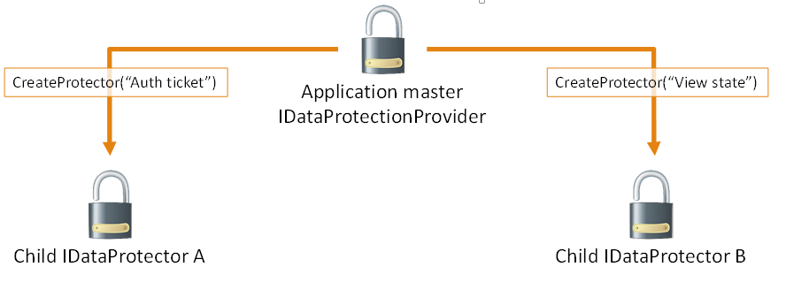

# Purpose strings in ASP.NET Core

Components which consume `IDataProtectionProvider` must pass a unique *purposes* parameter to the `CreateProtector` method. The purposes *parameter* is inherent to the security of the data protection system, as it provides isolation between cryptographic consumers, even if the root cryptographic keys are the same.

When a consumer specifies a purpose, the purpose string is used along with the root cryptographic keys to derive cryptographic subkeys unique to that consumer. This isolates the consumer from all other cryptographic consumers in the application: no other component can read its payloads, and it cannot read any other component's payloads. This isolation also renders infeasible entire categories of attack against the component.

In the diagram above, `IDataProtector` instances A and B **cannot** read each other's payloads, only their own.

The purpose string doesn't have to be secret. It should simply be unique in the sense that no other well-behaved component will ever provide the same purpose string.

>[!TIP]
> Using the namespace and type name of the component consuming the data protection APIs is a good rule of thumb, as in practice this information will never conflict.
>
>A Contoso-authored component which is responsible for minting bearer tokens might use Contoso.Security.BearerToken as its purpose string. Or - even better - it might use Contoso.Security.BearerToken.v1 as its purpose string. Appending the version number allows a future version to use Contoso.Security.BearerToken.v2 as its purpose, and the different versions would be completely isolated from one another as far as payloads go.

Since the purposes parameter to `CreateProtector` is a string array, the above could've been instead specified as `[ "Contoso.Security.BearerToken", "v1" ]`. This allows establishing a hierarchy of purposes and opens up the possibility of multi-tenancy scenarios with the data protection system.

>[!WARNING]
> Components shouldn't allow untrusted user input to be the sole source of input for the purposes chain.
>
>For example, consider a component Contoso.Messaging.SecureMessage which is responsible for storing secure messages. If the secure messaging component were to call `CreateProtector([ username ])`, then a malicious user might create an account with username "Contoso.Security.BearerToken" in an attempt to get the component to call `CreateProtector([ "Contoso.Security.BearerToken" ])`, thus inadvertently causing the secure messaging system to mint payloads that could be perceived as authentication tokens.
>
>A better purposes chain for the messaging component would be `CreateProtector([ "Contoso.Messaging.SecureMessage", "User: username" ])`, which provides proper isolation.

The isolation provided by and behaviors of `IDataProtectionProvider`, `IDataProtector`, and purposes are as follows:

* For a given `IDataProtectionProvider` object, the `CreateProtector` method will create an `IDataProtector` object uniquely tied to both the `IDataProtectionProvider` object which created it and the purposes parameter which was passed into the method.

* The purpose parameter must not be null. (If purposes is specified as an array, this means that the array must not be of zero length and all elements of the array must be non-null.) An empty string purpose is technically allowed but is discouraged.

* Two purposes arguments are equivalent if and only if they contain the same strings (using an ordinal comparer) in the same order. A single purpose argument is equivalent to the corresponding single-element purposes array.

* Two `IDataProtector` objects are equivalent if and only if they're created from equivalent `IDataProtectionProvider` objects with equivalent purposes parameters.

* For a given `IDataProtector` object, a call to `Unprotect(protectedData)` will return the original `unprotectedData` if and only if `protectedData := Protect(unprotectedData)` for an equivalent `IDataProtector` object.

> [!NOTE]
> We're not considering the case where some component intentionally chooses a purpose string which is known to conflict with another component. Such a component would essentially be considered malicious, and this system isn't intended to provide security guarantees in the event that malicious code is already running inside of the worker process.
