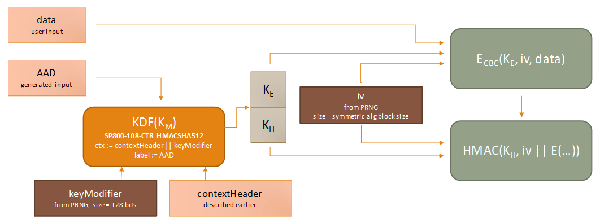
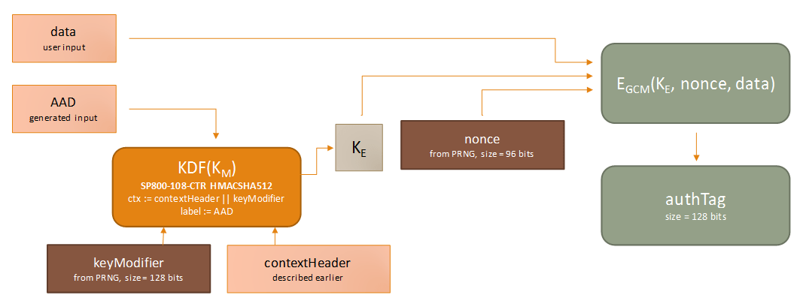

# Subkey derivation and authenticated encryption in ASP.NET Core

Most keys in the key ring will contain some form of entropy and will have algorithmic information stating "CBC-mode encryption + HMAC validation" or "GCM encryption + validation". In these cases, we refer to the embedded entropy as the master keying material (or KM) for this key, and we perform a key derivation function to derive the keys that will be used for the actual cryptographic operations.

> [!NOTE]
> Keys are abstract, and a custom implementation might not behave as below. If the key provides its own implementation of `IAuthenticatedEncryptor` rather than using one of our built-in factories, the mechanism described in this section no longer applies.

## Additional authenticated data and subkey derivation

The `IAuthenticatedEncryptor` interface serves as the core interface for all authenticated encryption operations. Its `Encrypt` method takes two buffers: plaintext and additionalAuthenticatedData (AAD). The plaintext contents flow unchanged the call to `IDataProtector.Protect`, but the AAD is generated by the system and consists of three components:

1. The 32-bit magic header 09 F0 C9 F0 that identifies this version of the data protection system.

2. The 128-bit key id.

3. A variable-length string formed from the purpose chain that created the `IDataProtector` that's performing this operation.

Because the AAD is unique for the tuple of all three components, we can use it to derive new keys from KM instead of using KM itself in all of our cryptographic operations. For every call to `IAuthenticatedEncryptor.Encrypt`, the following key derivation process takes place:

`( K_E, K_H ) = SP800_108_CTR_HMACSHA512(K_M, AAD, contextHeader || keyModifier)`

Here, we're calling the NIST SP800-108 KDF in Counter Mode (see [NIST SP800-108](https://nvlpubs.nist.gov/nistpubs/Legacy/SP/nistspecialpublication800-108.pdf), Sec. 5.1) with the following parameters:

* Key derivation key (KDK) = `K_M`

* PRF = HMACSHA512

* label = additionalAuthenticatedData

* context = contextHeader || keyModifier

The context header is of variable length and essentially serves as a thumbprint of the algorithms for which we're deriving `K_E` and `K_H`. The key modifier is a 128-bit string randomly generated for each call to `Encrypt` and serves to ensure with overwhelming probability that KE and KH are unique for this specific authentication encryption operation, even if all other input to the KDF is constant.

For CBC-mode encryption + HMAC validation operations, `| K_E |` is the length of the symmetric block cipher key, and `| K_H |` is the digest size of the HMAC routine. For GCM encryption + validation operations, `| K_H | = 0`.

## CBC-mode encryption + HMAC validation

Once `K_E` is generated via the above mechanism, we generate a random initialization vector and run the symmetric block cipher algorithm to encipher the plaintext. The initialization vector and ciphertext are then run through the HMAC routine initialized with the key `K_H` to produce the MAC. This process and the return value is represented graphically below.

`output:= keyModifier || iv || E_cbc (K_E,iv,data) || HMAC(K_H, iv || E_cbc (K_E,iv,data))`

> [!NOTE]
> The `IDataProtector.Protect` implementation will [prepend the magic header and key id](xref:security/data-protection/implementation/authenticated-encryption-details) to output before returning it to the caller. Because the magic header and key id are implicitly part of [AAD](xref:security/data-protection/implementation/subkeyderivation#data-protection-implementation-subkey-derivation-aad), and because the key modifier is fed as input to the KDF, this means that every single byte of the final returned payload is authenticated by the MAC.

## Galois/Counter Mode encryption + validation

Once `K_E` is generated via the above mechanism, we generate a random 96-bit nonce and run the symmetric block cipher algorithm to encipher the plaintext and produce the 128-bit authentication tag.

`output := keyModifier || nonce || E_gcm (K_E,nonce,data) || authTag`

> [!NOTE]
> Even though GCM natively supports the concept of AAD, we're still feeding AAD only to the original KDF, opting to pass an empty string into GCM for its AAD parameter. The reason for this is two-fold. First, [to support agility](xref:security/data-protection/implementation/context-headers#data-protection-implementation-context-headers) we never want to use `K_M` directly as the encryption key. Additionally, GCM imposes very strict uniqueness requirements on its inputs. The probability that the GCM encryption routine is ever invoked on two or more distinct sets of input data with the same (key, nonce) pair must not exceed 2^32. If we fix `K_E` we cannot perform more than 2^32 encryption operations before we run afoul of the 2^-32 limit. This might seem like a very large number of operations, but a high-traffic web server can go through 4 billion requests in mere days, well within the normal lifetime for these keys. To stay compliant of the 2^-32 probability limit, we continue to use a 128-bit key modifier and 96-bit nonce, which radically extends the usable operation count for any given `K_M`. For simplicity of design we share the KDF code path between CBC and GCM operations, and since AAD is already considered in the KDF there's no need to forward it to the GCM routine.
