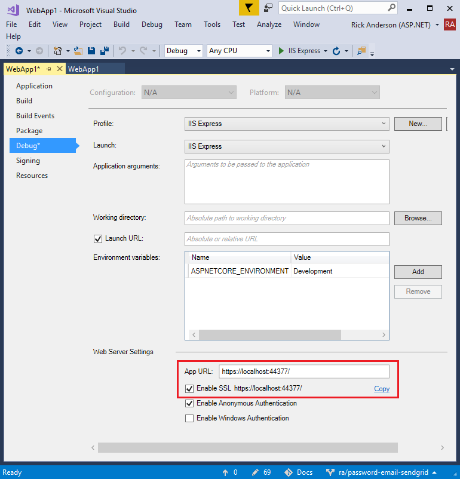

# Enforcing SSL in an ASP.NET Core app

This document shows how to:

- Require SSL for all requests (HTTPS requests only).
- Redirect all HTTP requests to HTTPS.
- Set up IIS Express to use SSL/HTTPS.

## Require SSL

The [RequireHttpsAttribute](https://docs.microsoft.com/aspnet/core/api/microsoft.aspnetcore.mvc.requirehttpsattribute) is used to require SSL. You can decorate controllers or methods with this attribute or you can apply it globally as shown below:

Add the following code to `ConfigureServices` in `Startup`:

[!code-csharp[Main](authentication/accconfirm/sample/WebApp1/Startup.cs?name=snippet2&highlight=4-)]

The highlighted code above requires all requests use `HTTPS`, therefore HTTP requests are ignored. The following highlighted code redirects all HTTP requests to HTTPS:

[!code-csharp[Main](authentication/accconfirm/sample/WebApp1/Startup.cs?name=snippet_AddRedirectToHttps&highlight=6-)]

See [URL Rewriting Middleware](xref:fundamentals/url-rewriting) for more information.

Requiring HTTPS globally (`options.Filters.Add(new RequireHttpsAttribute());`) is a security best practice. Applying the `[RequireHttps]` to controllers has the drawback that you're not guaranteed new controllers added to you project will get this protection.

## Set up IIS Express for SSL/HTTPS

   * In Solution Explorer, right click the project and select **Properties**.
   * On the left pane, select **Debug**.
   * Check **Enable SSL**
   * Copy the SSL URL and paste it into the **App URL**

