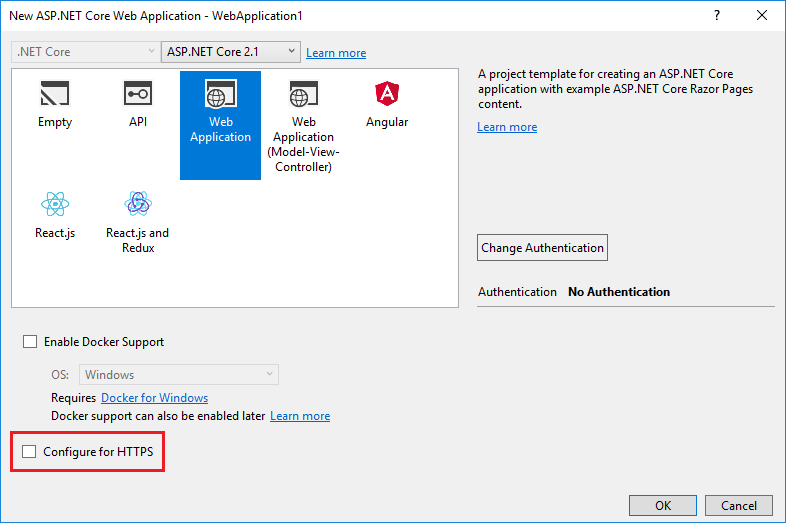

# Enforce HTTPS in ASP.NET Core

By [Rick Anderson](https://twitter.com/RickAndMSFT)

This document shows how to:

* Require HTTPS for all requests.
* Redirect all HTTP requests to HTTPS.

No API can prevent a client from sending sensitive data on the first request.

::: moniker range=">= aspnetcore-3.0"

> [!WARNING]
> ## API projects
>
> Do **not** use [RequireHttpsAttribute](/dotnet/api/microsoft.aspnetcore.mvc.requirehttpsattribute) on Web APIs that receive sensitive information. `RequireHttpsAttribute` uses HTTP status codes to redirect browsers from HTTP to HTTPS. API clients may not understand or obey redirects from HTTP to HTTPS. Such clients may send information over HTTP. Web APIs should either:
>
> * Not listen on HTTP.
> * Close the connection with status code 400 (Bad Request) and not serve the request.
>
> ## HSTS and API projects
>
> The default API projects don't include [HSTS](#hsts) because HSTS is generally a browser only instruction. Other callers, such as phone or desktop apps, do **not** obey the instruction. Even within browsers, a single authenticated call to an API over HTTP has risks on insecure networks. The secure approach is to configure API projects to only listen to and respond over HTTPS.

::: moniker-end

::: moniker range="<= aspnetcore-2.2"

> [!WARNING]
> ## API projects
>
> Do **not** use [RequireHttpsAttribute](/dotnet/api/microsoft.aspnetcore.mvc.requirehttpsattribute) on Web APIs that receive sensitive information. `RequireHttpsAttribute` uses HTTP status codes to redirect browsers from HTTP to HTTPS. API clients may not understand or obey redirects from HTTP to HTTPS. Such clients may send information over HTTP. Web APIs should either:
>
> * Not listen on HTTP.
> * Close the connection with status code 400 (Bad Request) and not serve the request.

::: moniker-end

## Require HTTPS

We recommend that production ASP.NET Core web apps use:

* HTTPS Redirection Middleware (<xref:Microsoft.AspNetCore.Builder.HttpsPolicyBuilderExtensions.UseHttpsRedirection*>) to redirect HTTP requests to HTTPS.
* HSTS Middleware ([UseHsts](#http-strict-transport-security-protocol-hsts)) to send HTTP Strict Transport Security Protocol (HSTS) headers to clients.

> [!NOTE]
> Apps deployed in a reverse proxy configuration allow the proxy to handle connection security (HTTPS). If the proxy also handles HTTPS redirection, there's no need to use HTTPS Redirection Middleware. If the proxy server also handles writing HSTS headers (for example, [native HSTS support in IIS 10.0 (1709) or later](/iis/get-started/whats-new-in-iis-10-version-1709/iis-10-version-1709-hsts#iis-100-version-1709-native-hsts-support)), HSTS Middleware isn't required by the app. For more information, see [Opt-out of HTTPS/HSTS on project creation](#opt-out-of-httpshsts-on-project-creation).

### UseHttpsRedirection

The following code calls `UseHttpsRedirection` in the `Startup` class:

::: moniker range=">= aspnetcore-3.0"

[!code-csharp[](enforcing-ssl/sample-snapshot/3.x/Startup.cs?name=snippet1&highlight=14)]

::: moniker-end

::: moniker range="<= aspnetcore-2.2"

[!code-csharp[](enforcing-ssl/sample-snapshot/2.x/Startup.cs?name=snippet1&highlight=13)]

::: moniker-end

The preceding highlighted code:

* Uses the default [HttpsRedirectionOptions.RedirectStatusCode](/dotnet/api/microsoft.aspnetcore.httpspolicy.httpsredirectionoptions.redirectstatuscode) ([Status307TemporaryRedirect](/dotnet/api/microsoft.aspnetcore.http.statuscodes.status307temporaryredirect)).
* Uses the default [HttpsRedirectionOptions.HttpsPort](/dotnet/api/microsoft.aspnetcore.httpspolicy.httpsredirectionoptions.httpsport) (null) unless overridden by the `ASPNETCORE_HTTPS_PORT` environment variable or [IServerAddressesFeature](/dotnet/api/microsoft.aspnetcore.hosting.server.features.iserveraddressesfeature).

We recommend using temporary redirects rather than permanent redirects. Link caching can cause unstable behavior in development environments. If you prefer to send a permanent redirect status code when the app is in a non-Development environment, see the [Configure permanent redirects in production](#configure-permanent-redirects-in-production) section. We recommend using [HSTS](#http-strict-transport-security-protocol-hsts) to signal to clients that only secure resource requests should be sent to the app (only in production).

### Port configuration

A port must be available for the middleware to redirect an insecure request to HTTPS. If no port is available:

* Redirection to HTTPS doesn't occur.
* The middleware logs the warning "Failed to determine the https port for redirect."

Specify the HTTPS port using any of the following approaches:

* Set [HttpsRedirectionOptions.HttpsPort](#options).

::: moniker range=">= aspnetcore-3.0"

* Set the `https_port` [host setting](../fundamentals/host/generic-host.md?view=aspnetcore-3.0#https_port):

  * In host configuration.
  * By setting the `ASPNETCORE_HTTPS_PORT` environment variable.
  * By adding a top-level entry in *appsettings.json*:

    [!code-json[](enforcing-ssl/sample-snapshot/3.x/appsettings.json?highlight=2)]

* Indicate a port with the secure scheme using the [ASPNETCORE_URLS environment variable](../fundamentals/host/generic-host.md?view=aspnetcore-3.0#urls). The environment variable configures the server. The middleware indirectly discovers the HTTPS port via <xref:Microsoft.AspNetCore.Hosting.Server.Features.IServerAddressesFeature>. This approach doesn't work in reverse proxy deployments.

::: moniker-end

::: moniker range="<= aspnetcore-2.2"

* Set the `https_port` [host setting](xref:fundamentals/host/web-host#https-port):

  * In host configuration.
  * By setting the `ASPNETCORE_HTTPS_PORT` environment variable.
  * By adding a top-level entry in *appsettings.json*:

    [!code-json[](enforcing-ssl/sample-snapshot/2.x/appsettings.json?highlight=2)]

* Indicate a port with the secure scheme using the [ASPNETCORE_URLS environment variable](xref:fundamentals/host/web-host#server-urls). The environment variable configures the server. The middleware indirectly discovers the HTTPS port via <xref:Microsoft.AspNetCore.Hosting.Server.Features.IServerAddressesFeature>. This approach doesn't work in reverse proxy deployments.

::: moniker-end

* In development, set an HTTPS URL in *launchsettings.json*. Enable HTTPS when IIS Express is used.

* Configure an HTTPS URL endpoint for a public-facing edge deployment of [Kestrel](xref:fundamentals/servers/kestrel) server or [HTTP.sys](xref:fundamentals/servers/httpsys) server. Only **one HTTPS port** is used by the app. The middleware discovers the port via <xref:Microsoft.AspNetCore.Hosting.Server.Features.IServerAddressesFeature>.

> [!NOTE]
> When an app is run in a reverse proxy configuration, <xref:Microsoft.AspNetCore.Hosting.Server.Features.IServerAddressesFeature> isn't available. Set the port using one of the other approaches described in this section.

### Edge deployments 

When Kestrel or HTTP.sys is used as a public-facing edge server, Kestrel or HTTP.sys must be configured to listen on both:

* The secure port where the client is redirected (typically, 443 in production and 5001 in development).
* The insecure port (typically, 80 in production and 5000 in development).

The insecure port must be accessible by the client in order for the app to receive an insecure request and redirect the client to the secure port.

For more information, see [Kestrel endpoint configuration](xref:fundamentals/servers/kestrel#endpoint-configuration) or <xref:fundamentals/servers/httpsys>.

### Deployment scenarios

Any firewall between the client and server must also have communication ports open for traffic.

If requests are forwarded in a reverse proxy configuration, use [Forwarded Headers Middleware](xref:host-and-deploy/proxy-load-balancer) before calling HTTPS Redirection Middleware. Forwarded Headers Middleware updates the `Request.Scheme`, using the `X-Forwarded-Proto` header. The middleware permits redirect URIs and other security policies to work correctly. When Forwarded Headers Middleware isn't used, the backend app might not receive the correct scheme and end up in a redirect loop. A common end user error message is that too many redirects have occurred.

When deploying to Azure App Service, follow the guidance in [Tutorial: Bind an existing custom SSL certificate to Azure Web Apps](/azure/app-service/app-service-web-tutorial-custom-ssl).

### Options

The following highlighted code calls [AddHttpsRedirection](/dotnet/api/microsoft.aspnetcore.builder.httpsredirectionservicesextensions.addhttpsredirection) to configure middleware options:


::: moniker range=">= aspnetcore-3.0"

[!code-csharp[](enforcing-ssl/sample-snapshot/3.x/Startup.cs?name=snippet2&highlight=14-18)]

::: moniker-end

::: moniker range="<= aspnetcore-2.2"

[!code-csharp[](enforcing-ssl/sample-snapshot/2.x/Startup.cs?name=snippet2&highlight=14-18)]

::: moniker-end


Calling `AddHttpsRedirection` is only necessary to change the values of `HttpsPort` or `RedirectStatusCode`.

The preceding highlighted code:

* Sets [HttpsRedirectionOptions.RedirectStatusCode](xref:Microsoft.AspNetCore.HttpsPolicy.HttpsRedirectionOptions.RedirectStatusCode*) to <xref:Microsoft.AspNetCore.Http.StatusCodes.Status307TemporaryRedirect>, which is the default value. Use the fields of the <xref:Microsoft.AspNetCore.Http.StatusCodes> class for assignments to `RedirectStatusCode`.
* Sets the HTTPS port to 5001.

#### Configure permanent redirects in production

The middleware defaults to sending a [Status307TemporaryRedirect](/dotnet/api/microsoft.aspnetcore.http.statuscodes.status307temporaryredirect) with all redirects. If you prefer to send a permanent redirect status code when the app is in a non-Development environment, wrap the middleware options configuration in a conditional check for a non-Development environment.

::: moniker range=">= aspnetcore-3.0"

When configuring services in *Startup.cs*:

```csharp
public void ConfigureServices(IServiceCollection services)
{
    // IWebHostEnvironment (stored in _env) is injected into the Startup class.
    if (!_env.IsDevelopment())
    {
        services.AddHttpsRedirection(options =>
        {
            options.RedirectStatusCode = StatusCodes.Status308PermanentRedirect;
            options.HttpsPort = 443;
        });
    }
}
```

::: moniker-end

::: moniker range="<= aspnetcore-2.2"

When configuring services in *Startup.cs*:

```csharp
public void ConfigureServices(IServiceCollection services)
{
    // IHostingEnvironment (stored in _env) is injected into the Startup class.
    if (!_env.IsDevelopment())
    {
        services.AddHttpsRedirection(options =>
        {
            options.RedirectStatusCode = StatusCodes.Status308PermanentRedirect;
            options.HttpsPort = 443;
        });
    }
}
```

::: moniker-end


## HTTPS Redirection Middleware alternative approach

An alternative to using HTTPS Redirection Middleware (`UseHttpsRedirection`) is to use URL Rewriting Middleware (`AddRedirectToHttps`). `AddRedirectToHttps` can also set the status code and port when the redirect is executed. For more information, see [URL Rewriting Middleware](xref:fundamentals/url-rewriting).

When redirecting to HTTPS without the requirement for additional redirect rules, we recommend using HTTPS Redirection Middleware (`UseHttpsRedirection`) described in this topic.

<a name="hsts"></a>

## HTTP Strict Transport Security Protocol (HSTS)

Per [OWASP](https://www.owasp.org/index.php/About_The_Open_Web_Application_Security_Project), [HTTP Strict Transport Security (HSTS)](https://cheatsheetseries.owasp.org/cheatsheets/HTTP_Strict_Transport_Security_Cheat_Sheet.html) is an opt-in security enhancement that's specified by a web app through the use of a response header. When a [browser that supports HSTS](https://cheatsheetseries.owasp.org/cheatsheets/Transport_Layer_Protection_Cheat_Sheet.html#browser-support) receives this header:

* The browser stores configuration for the domain that prevents sending any communication over HTTP. The browser forces all communication over HTTPS.
* The browser prevents the user from using untrusted or invalid certificates. The browser disables prompts that allow a user to temporarily trust such a certificate.

Because HSTS is enforced by the client, it has some limitations:

* The client must support HSTS.
* HSTS requires at least one successful HTTPS request to establish the HSTS policy.
* The application must check every HTTP request and redirect or reject the HTTP request.

ASP.NET Core 2.1 and later implements HSTS with the `UseHsts` extension method. The following code calls `UseHsts` when the app isn't in [development mode](xref:fundamentals/environments):

::: moniker range=">= aspnetcore-3.0"

[!code-csharp[](enforcing-ssl/sample-snapshot/3.x/Startup.cs?name=snippet1&highlight=11)]

::: moniker-end

::: moniker range="<= aspnetcore-2.2"

[!code-csharp[](enforcing-ssl/sample-snapshot/2.x/Startup.cs?name=snippet1&highlight=10)]

::: moniker-end

`UseHsts` isn't recommended in development because the HSTS settings are highly cacheable by browsers. By default, `UseHsts` excludes the local loopback address.

For production environments that are implementing HTTPS for the first time, set the initial [HstsOptions.MaxAge](xref:Microsoft.AspNetCore.HttpsPolicy.HstsOptions.MaxAge*) to a small value using one of the <xref:System.TimeSpan> methods. Set the value from hours to no more than a single day in case you need to revert the HTTPS infrastructure to HTTP. After you're confident in the sustainability of the HTTPS configuration, increase the HSTS `max-age` value; a commonly used value is one year.

The following code:


::: moniker range=">= aspnetcore-3.0"

[!code-csharp[](enforcing-ssl/sample-snapshot/3.x/Startup.cs?name=snippet2&highlight=5-12)]

::: moniker-end

::: moniker range="<= aspnetcore-2.2"

[!code-csharp[](enforcing-ssl/sample-snapshot/2.x/Startup.cs?name=snippet2&highlight=5-12)]

::: moniker-end


* Sets the preload parameter of the `Strict-Transport-Security` header. Preload isn't part of the [RFC HSTS specification](https://tools.ietf.org/html/rfc6797), but is supported by web browsers to preload HSTS sites on fresh install. For more information, see [https://hstspreload.org/](https://hstspreload.org/).
* Enables [includeSubDomain](https://tools.ietf.org/html/rfc6797#section-6.1.2), which applies the HSTS policy to Host subdomains.
* Explicitly sets the `max-age` parameter of the `Strict-Transport-Security` header to 60 days. If not set, defaults to 30 days. For more information, see the [max-age directive](https://tools.ietf.org/html/rfc6797#section-6.1.1).
* Adds `example.com` to the list of hosts to exclude.

`UseHsts` excludes the following loopback hosts:

* `localhost` : The IPv4 loopback address.
* `127.0.0.1` : The IPv4 loopback address.
* `[::1]` : The IPv6 loopback address.

## Opt-out of HTTPS/HSTS on project creation

In some backend service scenarios where connection security is handled at the public-facing edge of the network, configuring connection security at each node isn't required. Web apps that are generated from the templates in Visual Studio or from the [dotnet new](/dotnet/core/tools/dotnet-new) command enable [HTTPS redirection](#require-https) and [HSTS](#http-strict-transport-security-protocol-hsts). For deployments that don't require these scenarios, you can opt-out of HTTPS/HSTS when the app is created from the template.

To opt-out of HTTPS/HSTS:

# [Visual Studio](#tab/visual-studio) 

Uncheck the **Configure for HTTPS** check box.

::: moniker range=">= aspnetcore-3.0"


::: moniker-end

::: moniker range="<= aspnetcore-2.2"



::: moniker-end


# [.NET Core CLI](#tab/netcore-cli) 

Use the `--no-https` option. For example

```dotnetcli
dotnet new webapp --no-https
```

---

<a name="trust"></a>

## Trust the ASP.NET Core HTTPS development certificate on Windows and macOS

The .NET Core SDK includes an HTTPS development certificate. The certificate is installed as part of the first-run experience. For example, `dotnet --info` produces a variation of the following output:

```
ASP.NET Core
------------
Successfully installed the ASP.NET Core HTTPS Development Certificate.
To trust the certificate run 'dotnet dev-certs https --trust' (Windows and macOS only).
For establishing trust on other platforms refer to the platform specific documentation.
For more information on configuring HTTPS see https://go.microsoft.com/fwlink/?linkid=848054.
```

Installing the .NET Core SDK installs the ASP.NET Core HTTPS development certificate to the local user certificate store. The certificate has been installed, but it's not trusted. To trust the certificate, perform the one-time step to run the dotnet `dev-certs` tool:

```dotnetcli
dotnet dev-certs https --trust
```

The following command provides help on the `dev-certs` tool:

```dotnetcli
dotnet dev-certs https --help
```

## How to set up a developer certificate for Docker

See [this GitHub issue](https://github.com/dotnet/AspNetCore.Docs/issues/6199).

<a name="ssl-linux"></a>

## Trust HTTPS certificate on Linux

<!-- Instructions to be updated by engineering team after 5.0 RTM. -->

For instructions on Linux, refer to the distribution documentation.

<a name="wsl"></a>

## Trust HTTPS certificate from Windows Subsystem for Linux

The Windows Subsystem for Linux (WSL) generates an HTTPS self-signed cert. To configure the Windows certificate store to trust the WSL certificate:

* Run the following command to export the WSL-generated certificate:

  ```
  dotnet dev-certs https -ep %USERPROFILE%\.aspnet\https\aspnetapp.pfx -p <cryptic-password>
  ```
* In a WSL window, run the following command:

  ```
    ASPNETCORE_Kestrel__Certificates__Default__Password="<cryptic-password>" 
    ASPNETCORE_Kestrel__Certificates__Default__Path=/mnt/c/Users/user-name/.aspnet/https/aspnetapp.pfx
    dotnet watch run
  ```

  The preceding command sets the environment variables so Linux uses the Windows trusted certificate.

## Troubleshoot certificate problems

This section provides help when the ASP.NET Core HTTPS development certificate has been [installed and trusted](#trust), but you still have browser warnings that the certificate is not trusted. The ASP.NET Core HTTPS development certificate is used by [Kestrel](xref:fundamentals/servers/kestrel).

### All platforms - certificate not trusted

Run the following commands:

```dotnetcli
dotnet dev-certs https --clean
dotnet dev-certs https --trust
```

Close any browser instances open. Open a new browser window to app. Certificate trust is cached by browsers.

The preceding commands solve most browser trust issues. If the browser is still not trusting the certificate, follow the platform-specific suggestions that follow.

### Docker - certificate not trusted

* Delete the *C:\Users\{USER}\AppData\Roaming\ASP.NET\Https* folder.
* Clean the solution. Delete the *bin* and *obj* folders.
* Restart the development tool. For example, Visual Studio, Visual Studio Code, or Visual Studio for Mac.

### Windows - certificate not trusted

* Check the certificates in the certificate store. There should be a `localhost` certificate with the `ASP.NET Core HTTPS development certificate` friendly name both under `Current User > Personal > Certificates` and `Current User > Trusted root certification authorities > Certificates`
* Remove all the found certificates from both Personal and Trusted root certification authorities. Do **not** remove the IIS Express localhost certificate.
* Run the following commands:

```dotnetcli
dotnet dev-certs https --clean
dotnet dev-certs https --trust
```

Close any browser instances open. Open a new browser window to app.

### OS X - certificate not trusted

* Open KeyChain Access.
* Select the System keychain.
* Check for the presence of a localhost certificate.
* Check that it contains a `+` symbol on the icon to indicate it's trusted for all users.
* Remove the certificate from the system keychain.
* Run the following commands:

```dotnetcli
dotnet dev-certs https --clean
dotnet dev-certs https --trust
```

Close any browser instances open. Open a new browser window to app.

See [HTTPS Error using IIS Express (dotnet/AspNetCore #16892)](https://github.com/dotnet/AspNetCore/issues/16892) for troubleshooting certificate issues with Visual Studio.

### IIS Express SSL certificate used with Visual Studio

To fix problems with the IIS Express certificate, select **Repair** from the Visual Studio installer. For more information, see [this GitHub issue](https://github.com/dotnet/aspnetcore/issues/16892).

## Additional information

* <xref:host-and-deploy/proxy-load-balancer>
* [Host ASP.NET Core on Linux with Apache: HTTPS configuration](xref:host-and-deploy/linux-apache#https-configuration)
* [Host ASP.NET Core on Linux with Nginx: HTTPS configuration](xref:host-and-deploy/linux-nginx#https-configuration)
* [How to Set Up SSL on IIS](/iis/manage/configuring-security/how-to-set-up-ssl-on-iis)
* [OWASP HSTS browser support](https://www.owasp.org/index.php/HTTP_Strict_Transport_Security_Cheat_Sheet#Browser_Support)