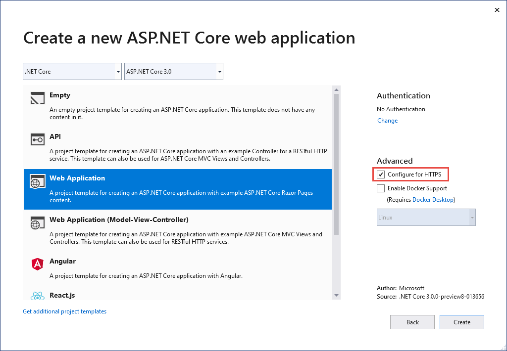

# Enforce HTTPS in ASP.NET Core

By [David Galvan](https://www.linkedin.com/in/dave-galvan/) and [Rick Anderson](https://twitter.com/RickAndMSFT)

This document shows how to:

* Require HTTPS for all requests.
* Redirect all HTTP requests to HTTPS.

No API can prevent a client from sending sensitive data on the first request.

:::moniker range=">= aspnetcore-6.0"

> [!WARNING]
> ## API projects
>
> Do **not** use <xref:Microsoft.AspNetCore.Mvc.RequireHttpsAttribute> on Web APIs that receive sensitive information. `RequireHttpsAttribute` uses HTTP status codes to redirect browsers from HTTP to HTTPS. API clients may not understand or obey redirects from HTTP to HTTPS. Such clients may send information over HTTP. Web APIs should either:
>
> * Not listen on HTTP.
> * Close the connection with status code 400 (Bad Request) and not serve the request.
>
> To disable HTTP redirection in an API, set the `ASPNETCORE_URLS` environment variable or use the `--urls` command line flag. For more information, see <xref:fundamentals/environments> and [5 ways to set the URLs for an ASP.NET Core app](https://andrewlock.net/5-ways-to-set-the-urls-for-an-aspnetcore-app/) by Andrew Lock.
>
> ## HSTS and API projects
>
> The default API projects don't include [HSTS](#hsts) because [HSTS](https://developer.mozilla.org/docs/Web/HTTP/Headers/Strict-Transport-Security) is generally a browser only instruction. Other callers, such as phone or desktop apps, do **not** obey the instruction. Even within browsers, a single authenticated call to an API over HTTP has risks on insecure networks. The secure approach is to configure API projects to only listen to and respond over HTTPS.

<a name="no-http"></a>

### HTTP redirection to HTTPS causes ERR_INVALID_REDIRECT on the CORS preflight request

Requests to an endpoint using HTTP that are redirected to HTTPS by <xref:Microsoft.AspNetCore.Builder.HttpsPolicyBuilderExtensions.UseHttpsRedirection%2A> fail with `ERR_INVALID_REDIRECT on the CORS preflight request`.

API projects can reject HTTP requests rather than use `UseHttpsRedirection` to redirect requests to HTTPS.

## Require HTTPS

We recommend that production ASP.NET Core web apps use:

* HTTPS Redirection Middleware (<xref:Microsoft.AspNetCore.Builder.HttpsPolicyBuilderExtensions.UseHttpsRedirection%2A>) to redirect HTTP requests to HTTPS.
* HSTS Middleware ([UseHsts](#http-strict-transport-security-protocol-hsts)) to send HTTP Strict Transport Security Protocol (HSTS) headers to clients.

> [!NOTE]
> Apps deployed in a reverse proxy configuration allow the proxy to handle connection security (HTTPS). If the proxy also handles HTTPS redirection, there's no need to use HTTPS Redirection Middleware. If the proxy server also handles writing HSTS headers (for example, [native HSTS support in IIS 10.0 (1709) or later](/iis/get-started/whats-new-in-iis-10-version-1709/iis-10-version-1709-hsts#iis-100-version-1709-native-hsts-support)), HSTS Middleware isn't required by the app. For more information, see [Opt-out of HTTPS/HSTS on project creation](#opt-out-of-httpshsts-on-project-creation).

### UseHttpsRedirection

The following code calls <xref:Microsoft.AspNetCore.Builder.HttpsPolicyBuilderExtensions.UseHttpsRedirection%2A> in the `Program.cs` file:

[!code-csharp[](enforcing-ssl/sample-snapshot/6.x/Program.cs?highlight=13)]

The preceding highlighted code:

* Uses the default <xref:Microsoft.AspNetCore.HttpsPolicy.HttpsRedirectionOptions.RedirectStatusCode?displayProperty=nameWithType> (<xref:Microsoft.AspNetCore.Http.StatusCodes.Status307TemporaryRedirect>).
* Uses the default <xref:Microsoft.AspNetCore.HttpsPolicy.HttpsRedirectionOptions.HttpsPort?displayProperty=nameWithType> (null) unless overridden by the `ASPNETCORE_HTTPS_PORT` environment variable or <xref:Microsoft.AspNetCore.Hosting.Server.Features.IServerAddressesFeature>.

We recommend using temporary redirects rather than permanent redirects. Link caching can cause unstable behavior in development environments. If you prefer to send a permanent redirect status code when the app is in a non-Development environment, see the [Configure permanent redirects in production](#configure-permanent-redirects-in-production) section. We recommend using [HSTS](#http-strict-transport-security-protocol-hsts) to signal to clients that only secure resource requests should be sent to the app (only in production).

### Port configuration

A port must be available for the middleware to redirect an insecure request to HTTPS. If no port is available:

* Redirection to HTTPS doesn't occur.
* The middleware logs the warning "Failed to determine the https port for redirect."

Specify the HTTPS port using any of the following approaches:

* Set [HttpsRedirectionOptions.HttpsPort](#options).
* Set the `https_port` [host setting](xref:fundamentals/host/generic-host#https_port):

  * In host configuration.
  * By setting the `ASPNETCORE_HTTPS_PORT` environment variable.
  * By adding a top-level entry in `appsettings.json`:

    [!code-json[](enforcing-ssl/sample-snapshot/6.x/appsettings.json?highlight=2)]

* Indicate a port with the secure scheme using the [ASPNETCORE_URLS environment variable](xref:fundamentals/host/generic-host#urls). The environment variable configures the server. The middleware indirectly discovers the HTTPS port via <xref:Microsoft.AspNetCore.Hosting.Server.Features.IServerAddressesFeature>. This approach doesn't work in reverse proxy deployments.
* The ASP.NET Core web templates set an HTTPS URL in `Properties/launchsettings.json` for both Kestrel and IIS Express. `launchsettings.json` is only used on the local machine.
* Configure an HTTPS URL endpoint for a public-facing edge deployment of [Kestrel](xref:fundamentals/servers/kestrel) server or [HTTP.sys](xref:fundamentals/servers/httpsys) server. Only **one HTTPS port** is used by the app. The middleware discovers the port via <xref:Microsoft.AspNetCore.Hosting.Server.Features.IServerAddressesFeature>.

> [!NOTE]
> When an app is run in a reverse proxy configuration, <xref:Microsoft.AspNetCore.Hosting.Server.Features.IServerAddressesFeature> isn't available. Set the port using one of the other approaches described in this section.

### Edge deployments

When [Kestrel](xref:fundamentals/servers/kestrel) or [HTTP.sys](xref:fundamentals/servers/httpsys) is used as a public-facing edge server, Kestrel or HTTP.sys must be configured to listen on both:

* The secure port where the client is redirected (typically, 443 in production and 5001 in development).
* The insecure port (typically, 80 in production and 5000 in development).

The insecure port must be accessible by the client in order for the app to receive an insecure request and redirect the client to the secure port.

For more information, see [Kestrel endpoint configuration](xref:fundamentals/servers/kestrel#endpoint-configuration) or <xref:fundamentals/servers/httpsys>.

### Deployment scenarios

Any firewall between the client and server must also have communication ports open for traffic.

If requests are forwarded in a reverse proxy configuration, use [Forwarded Headers Middleware](xref:host-and-deploy/proxy-load-balancer) before calling HTTPS Redirection Middleware. Forwarded Headers Middleware updates the `Request.Scheme`, using the `X-Forwarded-Proto` header. The middleware permits redirect URIs and other security policies to work correctly. When Forwarded Headers Middleware isn't used, the backend app might not receive the correct scheme and end up in a redirect loop. A common end user error message is that too many redirects have occurred.

When deploying to Azure App Service, follow the guidance in [Tutorial: Bind an existing custom SSL certificate to Azure Web Apps](/azure/app-service/app-service-web-tutorial-custom-ssl).

### Options

The following highlighted code calls <xref:Microsoft.AspNetCore.Builder.HttpsRedirectionServicesExtensions.AddHttpsRedirection%2A> to configure middleware options:

[!code-csharp[](enforcing-ssl/sample-snapshot/6.x/Program2.cs?highlight=16-20)]

Calling `AddHttpsRedirection` is only necessary to change the values of `HttpsPort` or `RedirectStatusCode`.

The preceding highlighted code:

* Sets <xref:Microsoft.AspNetCore.HttpsPolicy.HttpsRedirectionOptions.RedirectStatusCode%2A?displayProperty=nameWithType> to <xref:Microsoft.AspNetCore.Http.StatusCodes.Status307TemporaryRedirect>, which is the default value. Use the fields of the <xref:Microsoft.AspNetCore.Http.StatusCodes> class for assignments to `RedirectStatusCode`.
* Sets the HTTPS port to 5001.

#### Configure permanent redirects in production

The middleware defaults to sending a <xref:Microsoft.AspNetCore.Http.StatusCodes.Status307TemporaryRedirect> with all redirects. If you prefer to send a permanent redirect status code when the app is in a non-Development environment, wrap the middleware options configuration in a conditional check for a non-Development environment.

When configuring services in `Program.cs`:

[!code-csharp[](enforcing-ssl/sample-snapshot/6.x/Program3.cs?highlight=7-14)]

## HTTPS Redirection Middleware alternative approach

An alternative to using HTTPS Redirection Middleware (`UseHttpsRedirection`) is to use URL Rewriting Middleware (`AddRedirectToHttps`). `AddRedirectToHttps` can also set the status code and port when the redirect is executed. For more information, see [URL Rewriting Middleware](xref:fundamentals/url-rewriting).

When redirecting to HTTPS without the requirement for additional redirect rules, we recommend using HTTPS Redirection Middleware (`UseHttpsRedirection`) described in this topic.

<a name="hsts"></a>

## HTTP Strict Transport Security Protocol (HSTS)

Per [OWASP](https://www.owasp.org/index.php/About_The_Open_Web_Application_Security_Project), [HTTP Strict Transport Security (HSTS)](https://cheatsheetseries.owasp.org/cheatsheets/HTTP_Strict_Transport_Security_Cheat_Sheet.html) is an opt-in security enhancement that's specified by a web app through the use of a response header. When a [browser that supports HSTS](https://cheatsheetseries.owasp.org/cheatsheets/Transport_Layer_Protection_Cheat_Sheet.html#browser-support) receives this header:

* The browser stores configuration for the domain that prevents sending any communication over HTTP. The browser forces all communication over HTTPS.
* The browser prevents the user from using untrusted or invalid certificates. The browser disables prompts that allow a user to temporarily trust such a certificate.

Because [HSTS](https://developer.mozilla.org/docs/Web/HTTP/Headers/Strict-Transport-Security) is enforced by the client, it has some limitations:

* The client must support HSTS.
* HSTS requires at least one successful HTTPS request to establish the HSTS policy.
* The application must check every HTTP request and redirect or reject the HTTP request.

ASP.NET Core implements HSTS with the <xref:Microsoft.AspNetCore.Builder.HstsBuilderExtensions.UseHsts%2A> extension method. The following code calls `UseHsts` when the app isn't in [development mode](xref:fundamentals/environments):

[!code-csharp[](enforcing-ssl/sample-snapshot/6.x/Program.cs?highlight=10)]

`UseHsts` isn't recommended in development because the HSTS settings are highly cacheable by browsers. By default, `UseHsts` excludes the local loopback address.

For production environments that are implementing HTTPS for the first time, set the initial <xref:Microsoft.AspNetCore.HttpsPolicy.HstsOptions.MaxAge%2A?displayProperty=nameWithType> to a small value using one of the <xref:System.TimeSpan> methods. Set the value from hours to no more than a single day in case you need to revert the HTTPS infrastructure to HTTP. After you're confident in the sustainability of the HTTPS configuration, increase the HSTS `max-age` value; a commonly used value is one year.

The following highlighted code:

[!code-csharp[](enforcing-ssl/sample-snapshot/6.x/Program2.cs?highlight=7-14)]

* Sets the preload parameter of the `Strict-Transport-Security` header. Preload isn't part of the [RFC HSTS specification](https://tools.ietf.org/html/rfc6797), but is supported by web browsers to preload HSTS sites on fresh install. For more information, see [https://hstspreload.org/](https://hstspreload.org/).
* Enables [includeSubDomain](https://tools.ietf.org/html/rfc6797#section-6.1.2), which applies the HSTS policy to Host subdomains.
* Explicitly sets the `max-age` parameter of the `Strict-Transport-Security` header to 60 days. If not set, defaults to 30 days. For more information, see the [max-age directive](https://tools.ietf.org/html/rfc6797#section-6.1.1).
* Adds `example.com` to the list of hosts to exclude.

`UseHsts` excludes the following loopback hosts:

* `localhost` : The IPv4 loopback address.
* `127.0.0.1` : The IPv4 loopback address.
* `[::1]` : The IPv6 loopback address.

## Opt-out of HTTPS/HSTS on project creation

In some backend service scenarios where connection security is handled at the public-facing edge of the network, configuring connection security at each node isn't required. Web apps that are generated from the templates in Visual Studio or from the [dotnet new](/dotnet/core/tools/dotnet-new) command enable [HTTPS redirection](#require-https) and [HSTS](#http-strict-transport-security-protocol-hsts). For deployments that don't require these scenarios, you can opt-out of HTTPS/HSTS when the app is created from the template.

To opt-out of HTTPS/HSTS:

# [Visual Studio](#tab/visual-studio) 

Uncheck the **Configure for HTTPS** checkbox.



# [.NET Core CLI](#tab/netcore-cli) 

Use the `--no-https` option. For example

```dotnetcli
dotnet new webapp --no-https
```

---

<a name="trust"></a>

## Trust the ASP.NET Core HTTPS development certificate on Windows and macOS

For the Firefox browser, see the next section.

The .NET Core SDK includes an HTTPS development certificate. The certificate is installed as part of the first-run experience. For example, `dotnet --info` produces a variation of the following output:

```cli
ASP.NET Core
------------
Successfully installed the ASP.NET Core HTTPS Development Certificate.
To trust the certificate run 'dotnet dev-certs https --trust' (Windows and macOS only).
For establishing trust on other platforms refer to the platform specific documentation.
For more information on configuring HTTPS see https://go.microsoft.com/fwlink/?linkid=848054.
```

Installing the .NET Core SDK installs the ASP.NET Core HTTPS development certificate to the local user certificate store. The certificate has been installed, but it's not trusted. To trust the certificate, perform the one-time step to run the dotnet `dev-certs` tool:

```dotnetcli
dotnet dev-certs https --trust
```

The following command provides help on the `dev-certs` tool:

```dotnetcli
dotnet dev-certs https --help
```

> [!WARNING]
> Do not create a development certificate in an environment that will be redistributed, such as a container image or virtual machine. Doing so can lead to spoofing and elevation of privilege. To help prevent this, set the `DOTNET_GENERATE_ASPNET_CERTIFICATE` environment variable to `false` prior to calling the .NET CLI for the first time. This will skip the automatic generation of the ASP.NET Core development certificate during the CLI's first-run experience.

<a name="trust-ff"></a>

### Trust the HTTPS certificate with Firefox to prevent SEC_ERROR_INADEQUATE_KEY_USAGE error

The Firefox browser uses its own certificate store, and therefore doesn't trust the [IIS Express](/iis/extensions/introduction-to-iis-express/iis-express-overview) or [Kestrel](xref:fundamentals/servers/kestrel) developer certificates.

There are two approaches to trusting the HTTPS certificate with Firefox, create a policy file or configure with the FireFox browser. Configuring with the browser creates the policy file, so the two approaches are equivalent.

#### Create a policy file to trust HTTPS certificate with Firefox

Create a policy file (`policies.json`) at:

* Windows: `%PROGRAMFILES%\Mozilla Firefox\distribution\`
* MacOS: `Firefox.app/Contents/Resources/distribution`
* Linux: See [Trust the certificate with Firefox on Linux](#trust-ff-linux) in this document.

Add the following JSON to the Firefox policy file:

```json
{
  "policies": {
    "Certificates": {
      "ImportEnterpriseRoots": true
    }
  }
}
```

The preceding policy file makes Firefox trust certificates from the trusted certificates in the Windows certificate store. The next section provides an alternative approach to create the preceding policy file by using the Firefox browser.

<a name="trust-ff-ba"></a>

### Configure trust of HTTPS certificate using Firefox browser

Set  `security.enterprise_roots.enabled` = `true` using the following instructions:

1. Enter `about:config` in the FireFox browser.
1. Select **Accept the Risk and Continue** if you accept the risk.
1. Select **Show All**
1. Set `security.enterprise_roots.enabled` = `true`
1. Exit and restart Firefox

For more information, see [Setting Up Certificate Authorities (CAs) in Firefox](https://support.mozilla.org/kb/setting-certificate-authorities-firefox) and the [mozilla/policy-templates/README file](https://github.com/mozilla/policy-templates/blob/master/README.md).

## How to set up a developer certificate for Docker

See [this GitHub issue](https://github.com/dotnet/AspNetCore.Docs/issues/6199).

## Trust HTTPS certificate on Linux

Establishing trust is distribution and browser specific. The following sections provide instructions for some popular distributions and the Chromium browsers (Edge and Chrome) and for Firefox.

### Ubuntu trust the certificate for service-to-service communication

The following instructions don't work for some Ubuntu versions, such as 20.04. For more information, see GitHub issue [dotnet/AspNetCore.Docs #23686](https://github.com/dotnet/AspNetCore.Docs/issues/23686).

1. Install [OpenSSL](https://www.openssl.org/) 1.1.1h or later. See your distribution for instructions on how to update OpenSSL.
1. Run the following commands:

    ```cli
    dotnet dev-certs https
    sudo -E dotnet dev-certs https -ep /usr/local/share/ca-certificates/aspnet/https.crt --format PEM
    sudo update-ca-certificates
    ```

The preceding commands:

* Ensure the current user's developer certificate is created.
* Exports the certificate with elevated permissions needed for the `ca-certificates` folder, using the current user's environment.
* Removing the `-E`  flag exports the root user certificate, generating it if necessary. Each newly generated certificate has a different thumbprint. When running as root, `sudo`  and  `-E` are not needed.

The path in the preceding command is specific for Ubuntu. For other distributions, select an appropriate path or use the path for the Certificate Authorities (CAs).

<a name="ssl-linux"></a>

### Trust HTTPS certificate on Linux using Edge or Chrome

# [Ubuntu](#tab/linux-ubuntu)

For chromium browsers on Linux:

* Install the `libnss3-tools` for your distribution.
* Create or verify the `$HOME/.pki/nssdb` folder exists on the machine.
* Export the certificate with the following command:

   ```cli
   dotnet dev-certs https
   sudo -E dotnet dev-certs https -ep /usr/local/share/ca-certificates/aspnet/https.crt --format PEM
   ```

   The path in the preceding command is specific for Ubuntu. For other distributions, select an appropriate path or use the path for the Certificate Authorities (CAs).

* Run the following commands:

   ```cli
   certutil -d sql:$HOME/.pki/nssdb -A -t "P,," -n localhost -i /usr/local/share/ca-certificates/aspnet/https.crt
   certutil -d sql:$HOME/.pki/nssdb -A -t "C,," -n localhost -i /usr/local/share/ca-certificates/aspnet/https.crt
   ```

* Exit and restart the browser.

<a name="trust-ff-linux"></a>

#### Trust the certificate with Firefox on Linux

* Export the certificate with the following command:

  ```vstscli
  dotnet dev-certs https
  sudo -E dotnet dev-certs https -ep /usr/local/share/ca-certificates/aspnet/https.crt --format PEM
  ```

  The path in the preceding command is specific for Ubuntu. For other distributions, select an appropriate path or use the path for the Certificate Authorities (CAs).

* Create a JSON file at `/usr/lib/firefox/distribution/policies.json` with the following command:

```sh
cat <<EOF | sudo tee /usr/lib/firefox/distribution/policies.json
{
    "policies": {
        "Certificates": {
            "Install": [
                "/usr/local/share/ca-certificates/aspnet/https.crt"
            ]
        }
    }
}
EOF
```
  
See [Configure trust of HTTPS certificate using Firefox browser](#trust-ff-ba) in this document for an alternative way to configure the policy file using the browser.

# [Red Hat Enterprise Linux](#tab/linux-rhel)

> [!WARNING]
> The following instructions are intended for development purposes only. Do not use the certificates generated in these instructions for a production environment.

These instructions use Mozilla's *legacy* tool `certutil` at  `https://firefox-source-docs.mozilla.org/security/nss/legacy/tools/nss_tools_certutil/index.html`. Instructions may be updated as modern utilities and practices are discovered.

> [!CAUTION]
> Improper use of TLS certificates could lead to spoofing.

> [!TIP]
> Instructions for valid production certificates can be found in the RHEL Documentation.
> [RHEL8 TLS Certificates](https://access.redhat.com/documentation/en-us/red_hat_enterprise_linux/8/html-single/securing_networks/index#creating-and-managing-tls-keys-and-certificates_securing-networks)
> [RHEL9 TLS Certificates](https://access.redhat.com/documentation/en-us/red_hat_enterprise_linux/9/html-single/securing_networks/index#creating-and-managing-tls-keys-and-certificates_securing-networks)
> [RHEL9 Certificate System](https://access.redhat.com/documentation/en-us/red_hat_certificate_system/9)

### Install Dependencies

```sh
dnf install nss-tools
```

### Export The ASP.NET Core Development Certificate

> [!IMPORTANT]
> Replace `${ProjectDirectory}` with your projects directory.
> Replace `${CertificateName}` with a name you'll be able to identify in the future.

```sh
cd ${ProjectDirectory}
dotnet dev-certs https -ep ${ProjectDirectory}/${CertificateName}.crt --format PEM
```

> [!CAUTION]
> If using git, add your certificate to your `${ProjectDirectory}/.gitignore` or `${ProjectDirectory}/.git/info/exclude`.
> View the [git documentation](https://git-scm.com/docs/gitignore) for information about these files.

> [!TIP]
> You can move your exported certificate outside of your Git repository and replace the occurrences of `${ProjectDirectory}`, in the following instructions, with the new location.

### Import The ASP.NET Core Development Certificate

> [!IMPORTANT]
> Replace `${UserProfile}` with the profile you intend to use.
> Do not replace `$HOME`, it is the environment variable to your user directory.

#### Chromium-based Browsers

```sh
certutil -d sql:$HOME/.pki/nssdb -A -t "P,," -n ${CertificateName} -i ${ProjectDirectory}/${CertificateName}.crt
certutil -d sql:$HOME/.pki/nssdb -A -t "C,," -n ${CertificateName} -i ${ProjectDirectory}/${CertificateName}.crt
```

#### Mozilla Firefox

```sh
certutil -d sql:$HOME/.mozilla/firefox/${UserProfile}/ -A -t "P,," -n ${CertificateName} -i ${ProjectDirectory}/${CertificateName}.crt
certutil -d sql:$HOME/.mozilla/firefox/${UserProfile}/ -A -t "C,," -n ${CertificateName} -i ${ProjectDirectory}/${CertificateName}.crt
```

#### Create An Alias To Test With Curl

> [!IMPORTANT]
>
> Don't delete the exported certificate if you plan to test with curl.
> You'll need to create an alias referencing it in your `$SHELL`'s profile

```sh
alias curl="curl --cacert ${ProjectDirectory}/${CertificateName}.crt"
```

### Cleaning up the Development Certificates

```sh
certutil -d sql:$HOME/.pki/nssdb -D -n ${CertificateName}
certutil -d sql:$HOME/.mozilla/firefox/${UserProfile}/ -D -n ${CertificateName}
rm ${ProjectDirectory}/${CertificateName}.crt
dotnet dev-certs https --clean
```

>[!NOTE]
> Remove the curl alias you created earlier

# [SUSE Linux Enterprise Server](#tab/linux-sles)

See [this GitHub issue](https://github.com/dotnet/AspNetCore.Docs/issues/28292)

<!--
> [!WARNING]
> The following instructions are intended for development purposes only. Do not use the certificates generated in these instructions for a production environment.

These instructions use Mozilla's *legacy* tool [certutil](https://firefox-source-docs.mozilla.org/security/nss/legacy/tools/nss_tools_certutil/index.html). Instructions may be updated as modern utilities and practices are discovered.

> [!CAUTION]
> Improper use of TLS certificates could lead to spoofing.

> [!TIP]
> Instructions for valid production certificates can be found in the RHEL Documentation.
> [RHEL8 TLS Certificates](https://access.redhat.com/documentation/en-us/red_hat_enterprise_linux/8/html-single/securing_networks/index#creating-and-managing-tls-keys-and-certificates_securing-networks)
> [RHEL9 TLS Certificates](https://access.redhat.com/documentation/en-us/red_hat_enterprise_linux/9/html-single/securing_networks/index#creating-and-managing-tls-keys-and-certificates_securing-networks)
> [RHEL9 Certificate System](https://access.redhat.com/documentation/en-us/red_hat_certificate_system/9)

### Install Dependencies

```sh
dnf install nss-tools
```

### Export The ASP.NET Core Development Certificate

> [!IMPORTANT]
> Replace `${ProjectDirectory}` with your projects directory.
> Replace `${CertificateName}` with a name you'll be able to identify in the future.

```sh
cd ${ProjectDirectory}
dotnet dev-certs https -ep ${ProjectDirectory}/${CertificateName}.crt --format PEM
```

> [!CAUTION]
> If using git, add your certificate to your `${ProjectDirectory}/.gitignore` or `${ProjectDirectory}/.git/info/exclude`.
> View the [git documentation](https://git-scm.com/docs/gitignore) for information about these files.

> [!TIP]
> You can move your exported certificate outside of your Git repository and replace the occurrences of `${ProjectDirectory}`, in the following instructions, with the new location.

### Import The ASP.NET Core Development Certificate

> [!IMPORTANT]
> Replace `${UserProfile}` with the profile you intend to use.
> Do not replace `$HOME`, it is the environment variable to your user directory.

#### Chromium-based Browsers

```sh
certutil -d sql:$HOME/.pki/nssdb -A -t "P,," -n ${CertificateName} -i ${ProjectDirectory}/${CertificateName}.crt
certutil -d sql:$HOME/.pki/nssdb -A -t "C,," -n ${CertificateName} -i ${ProjectDirectory}/${CertificateName}.crt
```

#### Mozilla Firefox

```sh
certutil -d sql:$HOME/.mozilla/firefox/${UserProfile}/ -A -t "P,," -n ${CertificateName} -i ${ProjectDirectory}/${CertificateName}.crt
certutil -d sql:$HOME/.mozilla/firefox/${UserProfile}/ -A -t "C,," -n ${CertificateName} -i ${ProjectDirectory}/${CertificateName}.crt
```

#### Create An Alias To Test With Curl

> [!IMPORTANT]
>
> Don't delete the exported certificate if you plan to test with curl.
> You'll need to create an alias referencing it in your `$SHELL`'s profile

```sh
alias curl="curl --cacert ${ProjectDirectory}/${CertificateName}.crt"
```

### Cleaning up the Development Certificates

```sh
certutil -d sql:$HOME/.pki/nssdb -D -n ${CertificateName}
certutil -d sql:$HOME/.mozilla/firefox/${UserProfile}/ -D -n ${CertificateName}
rm ${ProjectDirectory}/${CertificateName}.crt
dotnet dev-certs https --clean
```

>[!NOTE]
> Remove the curl alias you created earlier
-->

---

<a name="wsl"></a>

### Trust the certificate with Fedora 34

See:

* [This GitHub comment](https://github.com/dotnet/aspnetcore/issues/32361#issuecomment-837111639)
* [Fedora: Using Shared System Certificates](https://docs.fedoraproject.org/en-US/quick-docs/using-shared-system-certificates/)
* [Set up a .NET development environment](https://fedoramagazine.org/set-up-a-net-development-environment/) on Fedora.

### Trust the certificate with other distros

See [this GitHub issue](https://github.com/dotnet/aspnetcore/issues/32842).

## Trust HTTPS certificate from Windows Subsystem for Linux

The following instructions don't work for some Linux distributions, such as Ubuntu 20.04. For more information, see GitHub issue [dotnet/AspNetCore.Docs #23686](https://github.com/dotnet/AspNetCore.Docs/issues/23686).

The [Windows Subsystem for Linux (WSL)](/windows/wsl/about) generates an HTTPS self-signed development certificate, which by default isn't trusted in Windows. The easiest way to have Windows trust the WSL certificate, is to configure WSL to use the same certificate as Windows:

* On ***Windows***, export the developer certificate to a file:

  ```
  dotnet dev-certs https -ep https.pfx -p $CREDENTIAL_PLACEHOLDER$ --trust
  ```
  Where `$CREDENTIAL_PLACEHOLDER$` is a password.

* In a WSL window, import the exported certificate on the WSL instance:

  ```
  dotnet dev-certs https --clean --import <<path-to-pfx>> --password $CREDENTIAL_PLACEHOLDER$
  ```

The preceding approach is a one time operation per certificate and per WSL distribution. It's easier than exporting the certificate over and over. If you update or regenerate the certificate on windows, you might need to run the preceding commands again.

<a name="tcp"></a>

## Troubleshoot certificate problems such as certificate not trusted

This section provides help when the ASP.NET Core HTTPS development certificate has been [installed and trusted](#trust), but you still have browser warnings that the certificate is not trusted. The ASP.NET Core HTTPS development certificate is used by [Kestrel](xref:fundamentals/servers/kestrel).

To repair the IIS Express certificate, see [this Stackoverflow](https://stackoverflow.com/a/20048613/502537) issue.

### All platforms - certificate not trusted

Run the following commands:

```dotnetcli
dotnet dev-certs https --clean
dotnet dev-certs https --trust
```

Close any browser instances open. Open a new browser window to app. Certificate trust is cached by browsers.

### dotnet dev-certs https --clean Fails

The preceding commands solve most browser trust issues. If the browser is still not trusting the certificate, follow the platform-specific suggestions that follow.

### Docker - certificate not trusted

* Delete the *C:\Users\{USER}\AppData\Roaming\ASP.NET\Https* folder.
* Clean the solution. Delete the *bin* and *obj* folders.
* Restart the development tool. For example, Visual Studio or Visual Studio Code.

### Windows - certificate not trusted

* Check the certificates in the certificate store. There should be a `localhost` certificate with the `ASP.NET Core HTTPS development certificate` friendly name both under `Current User > Personal > Certificates` and `Current User > Trusted root certification authorities > Certificates`
* Remove all the found certificates from both Personal and Trusted root certification authorities. Do **not** remove the IIS Express localhost certificate.
* Run the following commands:

```dotnetcli
dotnet dev-certs https --clean
dotnet dev-certs https --trust
```

Close any browser instances open. Open a new browser window to app.

### OS X - certificate not trusted

* Open KeyChain Access.
* Select the System keychain.
* Check for the presence of a localhost certificate.
* Check that it contains a `+` symbol on the icon to indicate it's trusted for all users.
* Remove the certificate from the system keychain.
* Run the following commands:

```dotnetcli
dotnet dev-certs https --clean
dotnet dev-certs https --trust
```

Close any browser instances open. Open a new browser window to app.

See [HTTPS Error using IIS Express (dotnet/AspNetCore #16892)](https://github.com/dotnet/AspNetCore/issues/16892) for troubleshooting certificate issues with Visual Studio.

### Linux certificate not trusted

Check that the certificate being configured for trust is the user HTTPS developer certificate that will be used by the Kestrel server.

Check the current user default HTTPS developer Kestrel certificate at the following location:

```
ls -la ~/.dotnet/corefx/cryptography/x509stores/my
```

The HTTPS developer Kestrel certificate file is the SHA1 thumbprint. When the file is deleted via `dotnet dev-certs https --clean`, it's regenerated when needed with a different thumbprint.
Check the thumbprint of the exported certificate matches with the following command:

```
openssl x509 -noout -fingerprint -sha1 -inform pem -in /usr/local/share/ca-certificates/aspnet/https.crt
```

If the certificate doesn't match, it could be one of the following:

* An old certificate.
* An exported a developer certificate for the root user. For this case, export the  certificate.

The root user certificate can be checked at:

```
ls -la /root/.dotnet/corefx/cryptography/x509stores/my
```

### IIS Express SSL certificate used with Visual Studio

To fix problems with the IIS Express certificate, select **Repair** from the Visual Studio installer. For more information, see [this GitHub issue](https://github.com/dotnet/aspnetcore/issues/16892).

### Group policy prevents self-signed certificates from being trusted

In some cases, group policy may prevent self-signed certificates from being trusted. For more information, see [this GitHub issue](https://github.com/dotnet/aspnetcore/issues/21173).

## Additional information

* <xref:host-and-deploy/proxy-load-balancer>
* [Host ASP.NET Core on Linux with Apache: HTTPS configuration](xref:host-and-deploy/linux-apache#https-configuration)
* [Host ASP.NET Core on Linux with Nginx: HTTPS configuration](xref:host-and-deploy/linux-nginx#https-configuration)
* [How to Set Up SSL on IIS](/iis/manage/configuring-security/how-to-set-up-ssl-on-iis)
* <xref:fundamentals/servers/kestrel/endpoints>
* [OWASP HSTS browser support](https://www.owasp.org/index.php/HTTP_Strict_Transport_Security_Cheat_Sheet#Browser_Support)

:::moniker-end

:::moniker range="< aspnetcore-6.0"

> [!WARNING]
> ## API projects
>
> Do **not** use <xref:Microsoft.AspNetCore.Mvc.RequireHttpsAttribute> on Web APIs that receive sensitive information. `RequireHttpsAttribute` uses HTTP status codes to redirect browsers from HTTP to HTTPS. API clients may not understand or obey redirects from HTTP to HTTPS. Such clients may send information over HTTP. Web APIs should either:
>
> * Not listen on HTTP.
> * Close the connection with status code 400 (Bad Request) and not serve the request.
>
> To disable HTTP redirection in an API, set the `ASPNETCORE_URLS` environment variable or use the `--urls` command line flag. For more information, see <xref:fundamentals/environments> and [5 ways to set the URLs for an ASP.NET Core app](https://andrewlock.net/5-ways-to-set-the-urls-for-an-aspnetcore-app/) by Andrew Lock.
>
> ## HSTS and API projects
>
> The default API projects don't include [HSTS](#hsts) because HSTS is generally a browser only instruction. Other callers, such as phone or desktop apps, do **not** obey the instruction. Even within browsers, a single authenticated call to an API over HTTP has risks on insecure networks. The secure approach is to configure API projects to only listen to and respond over HTTPS.

## Require HTTPS

We recommend that production ASP.NET Core web apps use:

* HTTPS Redirection Middleware (<xref:Microsoft.AspNetCore.Builder.HttpsPolicyBuilderExtensions.UseHttpsRedirection%2A>) to redirect HTTP requests to HTTPS.
* HSTS Middleware ([UseHsts](#http-strict-transport-security-protocol-hsts)) to send HTTP Strict Transport Security Protocol (HSTS) headers to clients.

> [!NOTE]
> Apps deployed in a reverse proxy configuration allow the proxy to handle connection security (HTTPS). If the proxy also handles HTTPS redirection, there's no need to use HTTPS Redirection Middleware. If the proxy server also handles writing HSTS headers (for example, [native HSTS support in IIS 10.0 (1709) or later](/iis/get-started/whats-new-in-iis-10-version-1709/iis-10-version-1709-hsts#iis-100-version-1709-native-hsts-support)), HSTS Middleware isn't required by the app. For more information, see [Opt-out of HTTPS/HSTS on project creation](#opt-out-of-httpshsts-on-project-creation).

### UseHttpsRedirection

The following code calls `UseHttpsRedirection` in the `Startup` class:

[!code-csharp[](enforcing-ssl/sample-snapshot/3.x/Startup.cs?name=snippet1&highlight=14)]

The preceding highlighted code:

* Uses the default <xref:Microsoft.AspNetCore.HttpsPolicy.HttpsRedirectionOptions.RedirectStatusCode?displayProperty=nameWithType> (<xref:Microsoft.AspNetCore.Http.StatusCodes.Status307TemporaryRedirect>).
* Uses the default <xref:Microsoft.AspNetCore.HttpsPolicy.HttpsRedirectionOptions.HttpsPort?displayProperty=nameWithType> (null) unless overridden by the `ASPNETCORE_HTTPS_PORT` environment variable or <xref:Microsoft.AspNetCore.Hosting.Server.Features.IServerAddressesFeature>.

We recommend using temporary redirects rather than permanent redirects. Link caching can cause unstable behavior in development environments. If you prefer to send a permanent redirect status code when the app is in a non-Development environment, see the [Configure permanent redirects in production](#configure-permanent-redirects-in-production) section. We recommend using [HSTS](#http-strict-transport-security-protocol-hsts) to signal to clients that only secure resource requests should be sent to the app (only in production).

### Port configuration

A port must be available for the middleware to redirect an insecure request to HTTPS. If no port is available:

* Redirection to HTTPS doesn't occur.
* The middleware logs the warning "Failed to determine the https port for redirect."

Specify the HTTPS port using any of the following approaches:

* Set [HttpsRedirectionOptions.HttpsPort](#options).
* Set the `https_port` [host setting](xref:fundamentals/host/generic-host#https_port):

  * In host configuration.
  * By setting the `ASPNETCORE_HTTPS_PORT` environment variable.
  * By adding a top-level entry in `appsettings.json`:

    [!code-json[](enforcing-ssl/sample-snapshot/3.x/appsettings.json?highlight=2)]

* Indicate a port with the secure scheme using the [ASPNETCORE_URLS environment variable](xref:fundamentals/host/generic-host#urls). The environment variable configures the server. The middleware indirectly discovers the HTTPS port via <xref:Microsoft.AspNetCore.Hosting.Server.Features.IServerAddressesFeature>. This approach doesn't work in reverse proxy deployments.
* In development, set an HTTPS URL in `launchsettings.json`. Enable HTTPS when IIS Express is used.

* Configure an HTTPS URL endpoint for a public-facing edge deployment of [Kestrel](xref:fundamentals/servers/kestrel) server or [HTTP.sys](xref:fundamentals/servers/httpsys) server. Only **one HTTPS port** is used by the app. The middleware discovers the port via <xref:Microsoft.AspNetCore.Hosting.Server.Features.IServerAddressesFeature>.

> [!NOTE]
> When an app is run in a reverse proxy configuration, <xref:Microsoft.AspNetCore.Hosting.Server.Features.IServerAddressesFeature> isn't available. Set the port using one of the other approaches described in this section.

### Edge deployments 

When Kestrel or HTTP.sys is used as a public-facing edge server, Kestrel or HTTP.sys must be configured to listen on both:

* The secure port where the client is redirected (typically, 443 in production and 5001 in development).
* The insecure port (typically, 80 in production and 5000 in development).

The insecure port must be accessible by the client in order for the app to receive an insecure request and redirect the client to the secure port.

For more information, see [Kestrel endpoint configuration](xref:fundamentals/servers/kestrel#endpoint-configuration) or <xref:fundamentals/servers/httpsys>.

### Deployment scenarios

Any firewall between the client and server must also have communication ports open for traffic.

If requests are forwarded in a reverse proxy configuration, use [Forwarded Headers Middleware](xref:host-and-deploy/proxy-load-balancer) before calling HTTPS Redirection Middleware. Forwarded Headers Middleware updates the `Request.Scheme`, using the `X-Forwarded-Proto` header. The middleware permits redirect URIs and other security policies to work correctly. When Forwarded Headers Middleware isn't used, the backend app might not receive the correct scheme and end up in a redirect loop. A common end user error message is that too many redirects have occurred.

When deploying to Azure App Service, follow the guidance in [Tutorial: Bind an existing custom SSL certificate to Azure Web Apps](/azure/app-service/app-service-web-tutorial-custom-ssl).

### Options

The following highlighted code calls <xref:Microsoft.AspNetCore.Builder.HttpsRedirectionServicesExtensions.AddHttpsRedirection%2A> to configure middleware options:

[!code-csharp[](enforcing-ssl/sample-snapshot/3.x/Startup.cs?name=snippet2&highlight=14-18)]

Calling `AddHttpsRedirection` is only necessary to change the values of `HttpsPort` or `RedirectStatusCode`.

The preceding highlighted code:

* Sets <xref:Microsoft.AspNetCore.HttpsPolicy.HttpsRedirectionOptions.RedirectStatusCode%2A?displayProperty=nameWithType> to <xref:Microsoft.AspNetCore.Http.StatusCodes.Status307TemporaryRedirect>, which is the default value. Use the fields of the <xref:Microsoft.AspNetCore.Http.StatusCodes> class for assignments to `RedirectStatusCode`.
* Sets the HTTPS port to 5001.

#### Configure permanent redirects in production

The middleware defaults to sending a <xref:Microsoft.AspNetCore.Http.StatusCodes.Status307TemporaryRedirect> with all redirects. If you prefer to send a permanent redirect status code when the app is in a non-Development environment, wrap the middleware options configuration in a conditional check for a non-Development environment.

When configuring services in `Startup.cs`:

```csharp
public void ConfigureServices(IServiceCollection services)
{
    // IWebHostEnvironment (stored in _env) is injected into the Startup class.
    if (!_env.IsDevelopment())
    {
        services.AddHttpsRedirection(options =>
        {
            options.RedirectStatusCode = (int) HttpStatusCode.PermanentRedirect;
            options.HttpsPort = 443;
        });
    }
}
```

## HTTPS Redirection Middleware alternative approach

An alternative to using HTTPS Redirection Middleware (`UseHttpsRedirection`) is to use URL Rewriting Middleware (`AddRedirectToHttps`). `AddRedirectToHttps` can also set the status code and port when the redirect is executed. For more information, see [URL Rewriting Middleware](xref:fundamentals/url-rewriting).

When redirecting to HTTPS without the requirement for additional redirect rules, we recommend using HTTPS Redirection Middleware (`UseHttpsRedirection`) described in this topic.

<a name="hsts"></a>

## HTTP Strict Transport Security Protocol (HSTS)

Per [OWASP](https://www.owasp.org/index.php/About_The_Open_Web_Application_Security_Project), [HTTP Strict Transport Security (HSTS)](https://cheatsheetseries.owasp.org/cheatsheets/HTTP_Strict_Transport_Security_Cheat_Sheet.html) is an opt-in security enhancement that's specified by a web app through the use of a response header. When a [browser that supports HSTS](https://cheatsheetseries.owasp.org/cheatsheets/Transport_Layer_Protection_Cheat_Sheet.html#browser-support) receives this header:

* The browser stores configuration for the domain that prevents sending any communication over HTTP. The browser forces all communication over HTTPS.
* The browser prevents the user from using untrusted or invalid certificates. The browser disables prompts that allow a user to temporarily trust such a certificate.

Because HSTS is enforced by the client, it has some limitations:

* The client must support HSTS.
* HSTS requires at least one successful HTTPS request to establish the HSTS policy.
* The application must check every HTTP request and redirect or reject the HTTP request.

ASP.NET Core implements HSTS with the `UseHsts` extension method. The following code calls `UseHsts` when the app isn't in [development mode](xref:fundamentals/environments):

[!code-csharp[](enforcing-ssl/sample-snapshot/3.x/Startup.cs?name=snippet1&highlight=11)]

`UseHsts` isn't recommended in development because the HSTS settings are highly cacheable by browsers. By default, `UseHsts` excludes the local loopback address.

For production environments that are implementing HTTPS for the first time, set the initial <xref:Microsoft.AspNetCore.HttpsPolicy.HstsOptions.MaxAge%2A?displayProperty=nameWithType> to a small value using one of the <xref:System.TimeSpan> methods. Set the value from hours to no more than a single day in case you need to revert the HTTPS infrastructure to HTTP. After you're confident in the sustainability of the HTTPS configuration, increase the HSTS `max-age` value; a commonly used value is one year.

The following code:

[!code-csharp[](enforcing-ssl/sample-snapshot/3.x/Startup.cs?name=snippet2&highlight=5-12)]

* Sets the preload parameter of the `Strict-Transport-Security` header. Preload isn't part of the [RFC HSTS specification](https://tools.ietf.org/html/rfc6797), but is supported by web browsers to preload HSTS sites on fresh install. For more information, see [https://hstspreload.org/](https://hstspreload.org/).
* Enables [includeSubDomain](https://tools.ietf.org/html/rfc6797#section-6.1.2), which applies the HSTS policy to Host subdomains.
* Explicitly sets the `max-age` parameter of the `Strict-Transport-Security` header to 60 days. If not set, defaults to 30 days. For more information, see the [max-age directive](https://tools.ietf.org/html/rfc6797#section-6.1.1).
* Adds `example.com` to the list of hosts to exclude.

`UseHsts` excludes the following loopback hosts:

* `localhost` : The IPv4 loopback address.
* `127.0.0.1` : The IPv4 loopback address.
* `[::1]` : The IPv6 loopback address.

## Opt-out of HTTPS/HSTS on project creation

In some backend service scenarios where connection security is handled at the public-facing edge of the network, configuring connection security at each node isn't required. Web apps that are generated from the templates in Visual Studio or from the [dotnet new](/dotnet/core/tools/dotnet-new) command enable [HTTPS redirection](#require-https) and [HSTS](#http-strict-transport-security-protocol-hsts). For deployments that don't require these scenarios, you can opt-out of HTTPS/HSTS when the app is created from the template.

To opt-out of HTTPS/HSTS:

# [Visual Studio](#tab/visual-studio) 

Uncheck the **Configure for HTTPS** checkbox.


# [.NET Core CLI](#tab/netcore-cli) 

Use the `--no-https` option. For example

```dotnetcli
dotnet new webapp --no-https
```

---

<a name="trust"></a>

## Trust the ASP.NET Core HTTPS development certificate on Windows and macOS

For the Firefox browser, see the next section.

The .NET Core SDK includes an HTTPS development certificate. The certificate is installed as part of the first-run experience. For example, `dotnet --info` produces a variation of the following output:

```cli
ASP.NET Core
------------
Successfully installed the ASP.NET Core HTTPS Development Certificate.
To trust the certificate run 'dotnet dev-certs https --trust' (Windows and macOS only).
For establishing trust on other platforms refer to the platform specific documentation.
For more information on configuring HTTPS see https://go.microsoft.com/fwlink/?linkid=848054.
```

Installing the .NET Core SDK installs the ASP.NET Core HTTPS development certificate to the local user certificate store. The certificate has been installed, but it's not trusted. To trust the certificate, perform the one-time step to run the dotnet `dev-certs` tool:

```dotnetcli
dotnet dev-certs https --trust
```

The following command provides help on the `dev-certs` tool:

```dotnetcli
dotnet dev-certs https --help
```

> [!WARNING]
> Do not create a development certificate in an environment that will be redistributed, such as a container image or virtual machine. Doing so can lead to spoofing and elevation of privilege. To help prevent this, set the `DOTNET_GENERATE_ASPNET_CERTIFICATE` environment variable to `false` prior to calling the .NET CLI for the first time. This will skip the automatic generation of the ASP.NET Core development certificate during the CLI's first-run experience.

<a name="trust-ff"></a>

### Trust the HTTPS certificate with Firefox to prevent SEC_ERROR_INADEQUATE_KEY_USAGE error

The Firefox browser uses its own certificate store, and therefore doesn't trust the [IIS Express](/iis/extensions/introduction-to-iis-express/iis-express-overview) or [Kestrel](xref:fundamentals/servers/kestrel) developer certificates.

There are two approaches to trusting the HTTPS certificate with Firefox, create a policy file or configure with the FireFox browser. Configuring with the browser creates the policy file, so the two approaches are equivalent.

#### Create a policy file to trust HTTPS certificate with Firefox

Create a policy file (`policies.json`) at:

* Windows: `%PROGRAMFILES%\Mozilla Firefox\distribution\`
* MacOS: `Firefox.app/Contents/Resources/distribution`
* Linux: See [Trust the certificate with Firefox on Linux](#trust-ff-linux) in this document.

Add the following JSON to the Firefox policy file:

```json
{
  "policies": {
    "Certificates": {
      "ImportEnterpriseRoots": true
    }
  }
}
```

The preceding policy file makes Firefox trust certificates from the trusted certificates in the Windows certificate store. The next section provides an alternative approach to create the preceding policy file by using the Firefox browser.

<a name="trust-ff-ba"></a>

### Configure trust of HTTPS certificate using Firefox browser

Set  `security.enterprise_roots.enabled` = `true` using the following instructions:

1. Enter `about:config` in the FireFox browser.
1. Select **Accept the Risk and Continue** if you accept the risk.
1. Select **Show All**
1. Set `security.enterprise_roots.enabled` = `true`
1. Exit and restart Firefox

For more information, see [Setting Up Certificate Authorities (CAs) in Firefox](https://support.mozilla.org/kb/setting-certificate-authorities-firefox) and the [mozilla/policy-templates/README file](https://github.com/mozilla/policy-templates/blob/master/README.md).

## How to set up a developer certificate for Docker

See [this GitHub issue](https://github.com/dotnet/AspNetCore.Docs/issues/6199).

## Trust HTTPS certificate on Linux

Establishing trust is distribution and browser specific. The following sections provide instructions for some popular distributions and the Chromium browsers (Edge and Chrome) and for Firefox.

### Ubuntu trust the certificate for service-to-service communication

1. Install [OpenSSL](https://www.openssl.org/) 1.1.1h or later. See your distribution for instructions on how to update OpenSSL.
1. Run the following commands:

    ```cli
    dotnet dev-certs https
    sudo -E dotnet dev-certs https -ep /usr/local/share/ca-certificates/aspnet/https.crt --format PEM
    sudo update-ca-certificates
    ```

The preceding commands:

* Ensure the current user's developer certificate is created.
* Exports the certificate with elevated permissions needed for the `ca-certificates` folder, using the current user's environment.
* Removing the `-E`  flag exports the root user certificate, generating it if necessary. Each newly generated certificate has a different thumbprint. When running as root, `sudo`  and  `-E` are not needed.


The path in the preceding command is specific for Ubuntu. For other distributions, select an appropriate path or use the path for the Certificate Authorities (CAs).

<a name="ssl-linux"></a>

### Trust HTTPS certificate on Linux using Edge or Chrome

For chromium browsers on Linux:

* Install the `libnss3-tools` for your distribution.
* Create or verify the `$HOME/.pki/nssdb` folder exists on the machine.
* Export the certificate with the following command:
  
   ```cli
   dotnet dev-certs https
   sudo -E dotnet dev-certs https -ep /usr/local/share/ca-certificates/aspnet/https.crt --format PEM
   ```

   The path in the preceding command is specific for Ubuntu. For other distributions, select an appropriate path or use the path for the Certificate Authorities (CAs).

* Run the following commands:
  
   ```cli
   certutil -d sql:$HOME/.pki/nssdb -A -t "P,," -n localhost -i /usr/local/share/ca-certificates/aspnet/https.crt
   certutil -d sql:$HOME/.pki/nssdb -A -t "C,," -n localhost -i /usr/local/share/ca-certificates/aspnet/https.crt
   ```

* Exit and restart the browser.

<a name="trust-ff-linux"></a>

### Trust the certificate with Firefox on Linux

* Export the certificate with the following command:

  ```vstscli
  dotnet dev-certs https
  sudo -E dotnet dev-certs https -ep /usr/local/share/ca-certificates/aspnet/https.crt --format PEM
  ```

  The path in the preceding command is specific for Ubuntu. For other distributions, select an appropriate path or use the path for the Certificate Authorities (CAs).

* Create a JSON file at `/usr/lib/firefox/distribution/policies.json` with the following contents:

```sh
cat <<EOF | sudo tee /usr/lib/firefox/distribution/policies.json
{
    "policies": {
        "Certificates": {
            "Install": [
                "/usr/local/share/ca-certificates/aspnet/https.crt"
            ]
        }
    }
}
EOF
```
  
See [Configure trust of HTTPS certificate using Firefox browser](#trust-ff-ba) in this document for an alternative way to configure the policy file using the browser.

<a name="wsl"></a>

### Trust the certificate with Fedora 34

#### Firefox on Fedora

```bash
echo 'pref("general.config.filename", "firefox.cfg");
pref("general.config.obscure_value", 0);' > ./autoconfig.js

echo '//Enable policies.json
lockPref("browser.policies.perUserDir", false);' > firefox.cfg

echo "{
    \"policies\": {
        \"Certificates\": {
            \"Install\": [
                \"aspnetcore-localhost-https.crt\"
            ]
        }
    }
}" > policies.json

dotnet dev-certs https -ep localhost.crt --format PEM

sudo mv autoconfig.js /usr/lib64/firefox/
sudo mv firefox.cfg /usr/lib64/firefox/
sudo mv policies.json /usr/lib64/firefox/distribution/
mkdir -p ~/.mozilla/certificates
cp localhost.crt ~/.mozilla/certificates/aspnetcore-localhost-https.crt
rm localhost.crt
```

#### Trust dotnet-to-dotnet on Fedora

```bash
sudo cp localhost.crt /etc/pki/tls/certs/localhost.pem
sudo update-ca-trust
rm localhost.crt
```

See [this GitHub comment](https://github.com/dotnet/aspnetcore/issues/32361#issuecomment-837111639) for more information.

### Trust the certificate with other distros

See [this GitHub issue](https://github.com/dotnet/aspnetcore/issues/32842).


## Trust HTTPS certificate from Windows Subsystem for Linux

The [Windows Subsystem for Linux (WSL)](/windows/wsl/about) generates an HTTPS self-signed development certificate. To configure the Windows certificate store to trust the WSL certificate:

* Export the developer certificate to a file on ***Windows***:

  ```
  dotnet dev-certs https -ep C:\<<path-to-folder>>\aspnetcore.pfx -p $CREDENTIAL_PLACEHOLDER$
  ```
  Where `$CREDENTIAL_PLACEHOLDER$` is a password.

* In a WSL window, import the exported certificate on the WSL instance:

  ```
  dotnet dev-certs https --clean --import /mnt/c/<<path-to-folder>>/aspnetcore.pfx -p $CREDENTIAL_PLACEHOLDER$
  ```

The preceding approach is a one time operation per certificate and per WSL distribution. It's easier than exporting the certificate over and over. If you update or regenerate the certificate on windows, you might need to run the preceding commands again.

<a name="tcp"></a>

## Troubleshoot certificate problems such as certificate not trusted

This section provides help when the ASP.NET Core HTTPS development certificate has been [installed and trusted](#trust), but you still have browser warnings that the certificate is not trusted. The ASP.NET Core HTTPS development certificate is used by [Kestrel](xref:fundamentals/servers/kestrel).

To repair the IIS Express certificate, see [this Stackoverflow](https://stackoverflow.com/a/20048613/502537) issue.

### All platforms - certificate not trusted

Run the following commands:

```dotnetcli
dotnet dev-certs https --clean
dotnet dev-certs https --trust
```

Close any browser instances open. Open a new browser window to app. Certificate trust is cached by browsers.

### dotnet dev-certs https --clean Fails

The preceding commands solve most browser trust issues. If the browser is still not trusting the certificate, follow the platform-specific suggestions that follow.

### Docker - certificate not trusted

* Delete the *C:\Users\{USER}\AppData\Roaming\ASP.NET\Https* folder.
* Clean the solution. Delete the *bin* and *obj* folders.
* Restart the development tool. For example, Visual Studio, Visual Studio Code, or Visual Studio for Mac.

### Windows - certificate not trusted

* Check the certificates in the certificate store. There should be a `localhost` certificate with the `ASP.NET Core HTTPS development certificate` friendly name both under `Current User > Personal > Certificates` and `Current User > Trusted root certification authorities > Certificates`
* Remove all the found certificates from both Personal and Trusted root certification authorities. Do **not** remove the IIS Express localhost certificate.
* Run the following commands:

```dotnetcli
dotnet dev-certs https --clean
dotnet dev-certs https --trust
```

Close any browser instances open. Open a new browser window to app.

### OS X - certificate not trusted

* Open KeyChain Access.
* Select the System keychain.
* Check for the presence of a localhost certificate.
* Check that it contains a `+` symbol on the icon to indicate it's trusted for all users.
* Remove the certificate from the system keychain.
* Run the following commands:

```dotnetcli
dotnet dev-certs https --clean
dotnet dev-certs https --trust
```

Close any browser instances open. Open a new browser window to app.

See [HTTPS Error using IIS Express (dotnet/AspNetCore #16892)](https://github.com/dotnet/AspNetCore/issues/16892) for troubleshooting certificate issues with Visual Studio.

### Linux certificate not trusted

Check that the certificate being configured for trust is the user HTTPS developer certificate that will be used by the Kestrel server.

Check the current user default HTTPS developer Kestrel certificate at the following location:

```
ls -la ~/.dotnet/corefx/cryptography/x509stores/my
```

The HTTPS developer Kestrel certificate file is the SHA1 thumbprint. When the file is deleted via `dotnet dev-certs https --clean`, it's regenerated when needed with a different thumbprint.
Check the thumbprint of the exported certificate matches with the following command:

```
openssl x509 -noout -fingerprint -sha1 -inform pem -in /usr/local/share/ca-certificates/aspnet/https.crt
```

If the certificate doesn't match, it could be one of the following:

* An old certificate.
* An exported a developer certificate for the root user. For this case, export the  certificate.

The root user certificate can be checked at:

```
ls -la /root/.dotnet/corefx/cryptography/x509stores/my
```

### IIS Express SSL certificate used with Visual Studio

To fix problems with the IIS Express certificate, select **Repair** from the Visual Studio installer. For more information, see [this GitHub issue](https://github.com/dotnet/aspnetcore/issues/16892).

## Additional information

* <xref:host-and-deploy/proxy-load-balancer>
* [Host ASP.NET Core on Linux with Apache: HTTPS configuration](xref:host-and-deploy/linux-apache#https-configuration)
* [Host ASP.NET Core on Linux with Nginx: HTTPS configuration](xref:host-and-deploy/linux-nginx#https-configuration)
* [How to Set Up SSL on IIS](/iis/manage/configuring-security/how-to-set-up-ssl-on-iis)
* [OWASP HSTS browser support](https://www.owasp.org/index.php/HTTP_Strict_Transport_Security_Cheat_Sheet#Browser_Support)
* [`dotnet dev-certs`](/dotnet/core/tools/dotnet-dev-certs)

:::moniker-end
