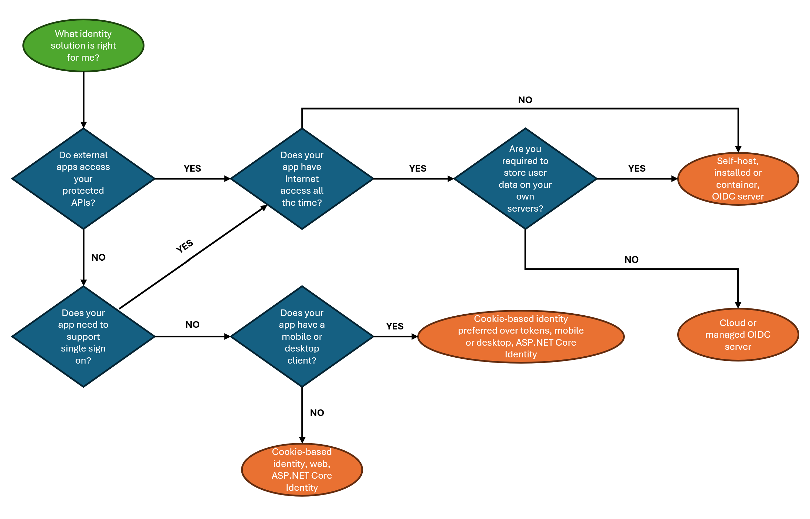

# Choose an identity management solution

Most web applications support authentication to ensure that users are who they claim to be (a "user" might be a person or another application). Management of access is also important to ensure users are only able to see and modify the information they are authorized to. For example, an end user should not have access to the administrative section of a website. Identity management solutions are built to handle the requirements of authentication and authorization-related tasks (if you are not familiar with identity management, you can learn more by reading: [What is identity and access management?](/azure/active-directory/fundamentals/introduction-identity-access-management)). There are many [identity management solutions for .NET web apps](xref:security/identity-management-solutions) available, each with different capabilities and requirements to use or install. This article provides guidance on how to choose the right solution for your project.

## Basic identity management with ASP.NET Core Identity

ASP.NET Core ships with a built-in authentication provider: [ASP.NET Core Identity](xref:security/authentication/identity). The provider includes the APIs, UI, and backend database configuration to support managing user identities, storing user credentials, and granting or revoking permissions. Other features it supports include:

* [External logins](xref:security/authentication/social/index)
* [Two-factor authentication (2FA)](xref:security/authentication/2fa)
* [Password management](xref:security/authentication/accconfirm)
* Account lockout and reactivation
* Authenticator apps

For most scenarios, this may be the only provider you need. To learn more:

* Read the [Introduction to Identity on ASP.NET Core](xref:security/authentication/identity)
* Follow a tutorial to build your own secure .NET web app: [Secure a .NET web app with the ASP.NET Core Identity framework](/training/modules/secure-aspnet-core-identity/). 

In other scenarios you may need a server or service that manages authentication and identity.

## Determine if you need a token server

Web applications require a way to "remember" past actions because the web, by default, is stateless. Otherwise, users would be forced to enter their credentials every time they navigated to a new page. The common solution for this that was invented decades ago is *cookies*, a browser-based mechanism for storing data. The web server sends the initial cookie, then the browser stores it and sends it back with each request. This is done automatically without the need for the developer to write any code. Cookies are easy to use and built into the browser but are designed for use within a single website and/or web domain. The default solution that is built into ASP.NET Core uses cookie-based authentication. 

Tokens are containers with metadata that are explicitly passed through the headers or body of HTTP requests. The main advantage of tokens over cookies is that they are not tied to a specific application or domain. Instead, tokens are usually "signed" with asymmetric cryptography, a process that uses a combination of a private key known only to the signer, and a public key which everyone can know. 

The token cannot be tampered with due to the private key, but the public key makes it possible to validate the token to ensure it has not been changed and that it was generated by the entity holding the private key. The main disadvantage to using tokens is that they require a token server to both issue and provide validation for tokens. That server must be installed, configured, and maintained.

The first reason you may need a token server is if your app exposes web-based APIs that are consumed by other apps. In this case, client UIs such as Single Page Applications or SPA (for example: Angular, React, and Blazor WebAssembly), mobile clients, and desktop clients are considered to be part of the same app. If an app other than your web app or any client UIs must make a secure API call to your app, you'll likely want to use tokens. If you only have client UIs, ASP.NET Core Identity provides the option to acquire a token during authentication that can be used by mobile and desktop clients but is not suitable for managing access from external apps.

The second reason you may need a token server is if you want to share logins with other apps. Commonly referred to as "single sign on," this feature enables your users to login once with your web app's form and use the resulting credentials to authenticate with other apps without having to login again or choose a different password. A token server is typically preferred for this scenario to provide a secure and scalable solution. 

If your app doesn't have either of these requirements, the simplest way to quickly secure your app is to use the built-in ASP.NET Core Identity provider. Otherwise, you need a token server provided by a third-party identity management solution. Token servers are available as products you install on your servers ("self-host"), containers you run in a host like Docker, and as web-based services you integrate with to manage identity. Some solutions are free and open source, while others are commercially licensed. You can see some available options by reading the list of [identity management solutions](xref:security/identity-management-solutions).

There are a few more considerations to help you decide which solution is right for you.  

## Consider disconnected scenarios

Many solutions, such as [Microsoft Entra ID](/azure/active-directory/fundamentals/active-directory-whatis), are cloud-based and require an Internet connection to work. If your environment does not allow Internet connectivity, you will not be able to use the service. Consider the environment your app will run in. If you must support scenarios where either your app cannot access the Internet or must still function on the local network even if the Internet is disconnected, be sure to choose a solution that allows you to either install and run the service on your machines, or run it locally as a container.

## Decide where user data such as logins will be stored

Another important factor to consider is where the user login data will be stored. Many developers choose external, cloud-based services like Microsoft Entra ID to manage identity because the service provider takes on the responsibilities of securely storing data, keeping the software up to date with the latest security patches and releases, and complying with privacy regulations. Others prefer to store data on their own servers due to regulations, compliance, policy, and other reasons.

If the data will be stored on your servers, you'll most likely need to choose an installable or container-based solution. 

## Pros and cons

The decision process is diagrammed here for fast reference:

The following table lists some of the things to consider when choosing your identity management solution.

|**Feature**  |Pro/con|**Self-host**  |Pro/con|**Container**  |Pro/con|**Cloud**  |
|-------------:|:-:|---------------|:-:|---------------|:-:|-----------|
|**App integration**|✅|Local solutions that are implemented as libraries or frameworks can often be integrated directly in your own app|❌|Container-based solutions require a hand-off to occur between your web app and the container-based service|❌|Container-based solutions typically integrate at specific points in your login flow and provide configuration to update the UI to match your theme, but the level of customization available is limited |
|**Configuration**|❌|Self host solutions require configuring the software for the environment in addition to setting up how you want to manage identities|✅|Container-based solutions typically provide a web-based UI for configuration|✅|Cloud-based solutions typically provide a web-based UI for configuration|
|**Customization**|✅|Self-host solutions are usually highly customizable, including code-based changes|❌|Although containerized solutions provide extensibility options, they are often more limited|❌|Cloud-based services allow customization but it is typically limited to configuration-based changes|
|**Maintenance**|❌|Installed products require a dedicated resource to ensure all security patches are applied in a timely fashion and to manage upgrades|❌|The upgrade and patch process for containers is usually lower-friction and involves simply installing the provided container image|✅|The service provider maintains their cloud-based solution, including applying needed patches and handling upgrades|
|**User credentials storage**|❌|You are responsible for data governance and handling breaches|❌|You are responsible for data governance and handling breaches|✅|The risks and regulations associated with handling user credentials are delegated to the service provider|

With these caveats in mind, you can read more about available options and find links to their resources for ASP. NET Core developers in our list of [identity management solutions for ASP.NET Core](xref:security/identity-management-solutions).

## Next steps

Depending on your choice, you may want to...

* Browse [sample apps with authentication/authorization and identity for ASP.NET Core](/aspnet/core/security/authentication/samples).
* Follow a tutorial to [secure your .NET web using built-in ASP.NET Core Identity](/training/modules/secure-aspnet-core-identity).
* Learn more about how to [protect web APIs](/azure/active-directory/develop/index-web-api).
