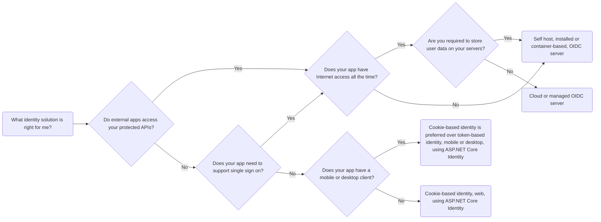

```mermaid
graph LR
    A(What identity solution is right for me?) --> B{Do external apps access your protected APIs?}
    B --> |Yes| C{Does your app have Internet access all the time?}
    B --> |No| D{Does your app need to support single sign on?}
    C --> |Yes| E{Are you required to store user data on your servers?}
    C --> |No| F(Self host, installed or container-based, OIDC server)
    D --> |Yes| C
    D --> |No| G{Does your app have a mobile or desktop client?}
    E --> |Yes| F
    E --> |No| H(Cloud or managed OIDC server)
    G --> |Yes| I(Cookie-based identity is preferred over token-based identity, mobile or desktop, using ASP.NET Core Identity)
    G --> |No| J(Cookie-based identity, web, using ASP.NET Core Identity)
```
