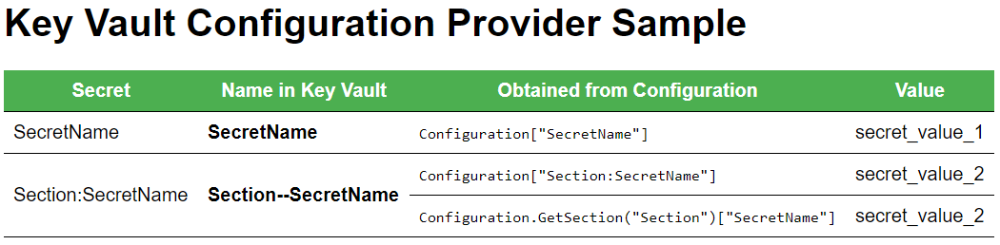
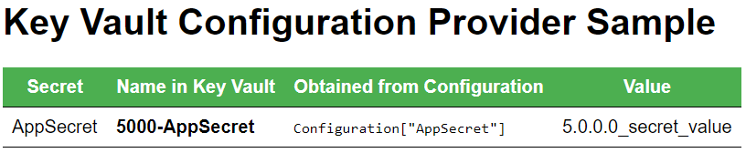
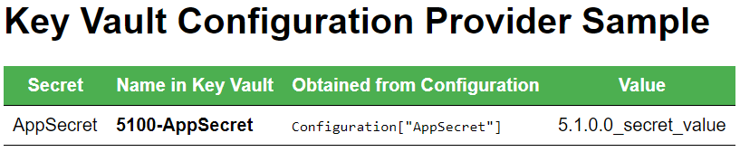

# Azure Key Vault configuration provider

By [Luke Latham](https://github.com/GuardRex) and [Andrew Stanton-Nurse](https://github.com/anurse)

# [ASP.NET Core 2.x](#tab/aspnetcore2x)

View or download sample code for 2.x:

* [Basic sample](https://github.com/aspnet/Docs/tree/master/aspnetcore/security/key-vault-configuration/samples/basic-sample/2.x) - Reads secret values into an app.
* [Key name prefix sample](https://github.com/aspnet/Docs/tree/master/aspnetcore/security/key-vault-configuration/samples/key-name-prefix-sample/2.x) - Reads secret values using a key name prefix that represents the version of an app, which allows you to load a different set of secret values for each app version.

# [ASP.NET Core 1.x](#tab/aspnetcore1x)

View or download sample code for 1.x:

* [Basic sample](https://github.com/aspnet/Docs/tree/master/aspnetcore/security/key-vault-configuration/samples/basic-sample/1.x) - Reads secret values into an app.
* [Key name prefix sample](https://github.com/aspnet/Docs/tree/master/aspnetcore/security/key-vault-configuration/samples/key-name-prefix-sample/1.x) - Reads secret values using a key name prefix that represents the version of an app, which allows you to load a different set of secret values for each app version. 

---

This document explains how to use the [Microsoft Azure Key Vault](https://azure.microsoft.com/services/key-vault/) configuration provider to load application configuration values from Azure Key Vault secrets. Azure Key Vault is a cloud-based service that helps you safeguard cryptographic keys and secrets used by apps and services. Common scenarios include controlling access to sensitive configuration data and meeting the requirement for FIPS 140-2 Level 2 validated Hardware Security Modules (HSM's) when storing configuration data. This feature is available for applications that target ASP.NET Core 1.1 or higher.

## Package
To use the provider, add a reference to the [Microsoft.Extensions.Configuration.AzureKeyVault](https://www.nuget.org/packages/Microsoft.Extensions.Configuration.AzureKeyVault/) package.

## Application configuration
You can explore the provider with the [sample apps](https://github.com/aspnet/Docs/tree/master/aspnetcore/security/key-vault-configuration/samples). Once you establish a key vault and create secrets in the vault, the sample apps securely load the secret values into their configurations and display them in webpages.

The provider is added to the `ConfigurationBuilder` with the `AddAzureKeyVault` extension. In the sample apps, the extension uses three configuration values loaded from the *appsettings.json* file.

| App Setting    | Description                    | Example                                      |
| -------------- | ------------------------------ | -------------------------------------------- |
| `Vault`        | Azure Key Vault name           | contosovault                                 |
| `ClientId`     | Azure Active Directory App Id  | 627e911e-43cc-61d4-992e-12db9c81b413         |
| `ClientSecret` | Azure Active Directory App Key | g58K3dtg59o1Pa+e59v2Tx829w6VxTB2yv9sv/101di= |

[!code-csharp[Program](key-vault-configuration/samples/basic-sample/2.x/Program.cs?name=snippet1&highlight=2,7-10)]

## Creating key vault secrets and loading configuration values (basic-sample)
1. Create a key vault and set up Azure Active Directory (Azure AD) for the application following the guidance in [Get started with Azure Key Vault](https://azure.microsoft.com/documentation/articles/key-vault-get-started/).
  * Add secrets to the key vault using the [AzureRM Key Vault PowerShell Module](/powershell/module/azurerm.keyvault) available from the [PowerShell Gallery](https://www.powershellgallery.com/packages/AzureRM.KeyVault), the [Azure Key Vault REST API](/rest/api/keyvault/), or the [Azure Portal](https://portal.azure.com/). Secrets are created as either *Manual* or *Certificate* secrets. *Certificate* secrets are certificates for use by apps and services but are not supported by the configuration provider. You should use the *Manual* option to create name-value pair secrets for use with the configuration provider.
    * Simple secrets are created as name-value pairs. Azure Key Vault secret names are limited to alphanumeric characters and dashes.
    * Hierarchical values (configuration sections) use `--` (two dashes) as a separator in the sample. Colons, which are normally used to delimit a section from a subkey in [ASP.NET Core configuration](xref:fundamentals/configuration), aren't allowed in secret names. Therefore, two dashes are used and swapped for a colon when the secrets are loaded into the app's configuration.
    * Create two *Manual* secrets with the following name-value pairs. The first secret is a simple name and value, and the second secret creates a secret value with a section and subkey in the secret name:
      * `SecretName`: `secret_value_1`
      * `Section--SecretName`: `secret_value_2`
  * Register the sample app with Azure Active Directory.
  * Authorize the app to access the key vault. When you use the `Set-AzureRmKeyVaultAccessPolicy` PowerShell cmdlet to authorize the app to access the key vault, provide `List` and `Get` access to secrets with `-PermissionsToKeys list,get`.
2. Update the app's *appsettings.json* file with the values of `Vault`, `ClientId`, and `ClientSecret`.
3. Run the sample app, which obtains its configuration values from `IConfigurationRoot` with the same name as the secret name.
  * Non-hierarchical values: The value for `SecretName` is obtained with `config["SecretName"]`.
  * Hierarchical values (sections): Use `:` (colon) notation or the `GetSection` extension method. Use either of these approaches to obtain the configuration value:
    * `config["Section:SecretName"]`
    * `config.GetSection("Section")["SecretName"]`

When you run the app, a webpage shows the loaded secret values:



## Creating prefixed key vault secrets and loading configuration values (key-name-prefix-sample)
`AddAzureKeyVault` also provides an overload that accepts an implementation of `IKeyVaultSecretManager`, which allows you to control how key vault secrets are converted into configuration keys. For example, you can implement the interface to load secret values based on a prefix value you provide at app startup. This allows you, for example, to load secrets based on the version of the app.

> [!WARNING]
> Don't use prefixes on key vault secrets to place secrets for multiple apps into the same key vault or to place environmental secrets (for example, *development* verus *production* secrets) into the same vault. We recommend that different apps and development/production environments use separate key vaults to isolate app environments for the highest level of security.

Using the second sample app, you create a secret in the key vault for `5000-AppSecret` (periods aren't allowed in key vault secret names) representing an app secret for version 5.0.0.0 of your app. For another version, 5.1.0.0, you create a secret for `5100-AppSecret`. Each app version loads its own secret value into its configuration as `AppSecret`, stripping off the version as it loads the secret. The sample's implementation is shown below:

[!code-csharp[Configuration builder](key-vault-configuration/samples/key-name-prefix-sample/2.x/Program.cs?name=snippet1&highlight=12)]

[!code-csharp[PrefixKeyVaultSecretManager](key-vault-configuration/samples/key-name-prefix-sample/2.x/Startup.cs?name=snippet1)]

The `Load` method is called by a provider algorithm that iterates through the vault secrets to find the ones that have the version prefix. When a version prefix is found with `Load`, the algorithm uses the `GetKey` method to return the configuration name of the secret name. It strips off the version prefix from the secret's name and returns the rest of the secret name for loading into the app's configuration name-value pairs.

When you implement this approach:

1. The key vault secrets are loaded.
2. The string secret for `5000-AppSecret` is matched.
3. The version, `5000` (with the dash), is stripped off of the key name leaving `AppSecret` to load with the secret value into the app's configuration.

> [!NOTE]
> You can also provide your own `KeyVaultClient` implementation to `AddAzureKeyVault`. Supplying a custom client allows you to share a single instance of the client between the configuration provider and other parts of your app.

1. Create a key vault and set up Azure Active Directory (Azure AD) for the application following the guidance in [Get started with Azure Key Vault](https://azure.microsoft.com/documentation/articles/key-vault-get-started/).
  * Add secrets to the key vault using the [AzureRM Key Vault PowerShell Module](/powershell/module/azurerm.keyvault) available from the [PowerShell Gallery](https://www.powershellgallery.com/packages/AzureRM.KeyVault), the [Azure Key Vault REST API](/rest/api/keyvault/), or the [Azure Portal](https://portal.azure.com/). Secrets are created as either *Manual* or *Certificate* secrets. *Certificate* secrets are certificates for use by apps and services but are not supported by the configuration provider. You should use the *Manual* option to create name-value pair secrets for use with the configuration provider.
    * Hierarchical values (configuration sections) use `--` (two dashes) as a separator.
    * Create two *Manual* secrets with the following name-value pairs:
      * `5000-AppSecret`: `5.0.0.0_secret_value`
      * `5100-AppSecret`: `5.1.0.0_secret_value`
  * Register the sample app with Azure Active Directory.
  * Authorize the app to access the key vault. When you use the `Set-AzureRmKeyVaultAccessPolicy` PowerShell cmdlet to authorize the app to access the key vault, provide `List` and `Get` access to secrets with `-PermissionsToKeys list,get`.
2. Update the app's *appsettings.json* file with the values of `Vault`, `ClientId`, and `ClientSecret`.
3. Run the sample app, which obtains its configuration values from `IConfigurationRoot` with the same name as the prefixed secret name. In this sample, the prefix is the app's version, which you provided to the `PrefixKeyVaultSecretManager` when you added the Azure Key Vault configuration provider. The value for `AppSecret` is obtained with `config["AppSecret"]`. The webpage generated by the app shows the loaded value:

   

4. Change the version of the app assembly in the project file from `5.0.0.0` to `5.1.0.0` and run the app again. This time, the secret value returned is `5.1.0.0_secret_value`. The webpage generated by the app shows the loaded value:

   

## Controlling access to the ClientSecret
Use the [Secret Manager tool](xref:security/app-secrets) to maintain the `ClientSecret` outside of your project source tree. With Secret Manager, you associate app secrets with a specific project and share them across multiple projects.

When developing a .NET Framework app in an environment that supports certificates, you can authenticate to Azure Key Vault with an X.509 certificate. The X.509 certificate's private key is managed by the OS. For more information, see [Authenticate with a Certificate instead of a Client Secret](https://docs.microsoft.com/azure/key-vault/key-vault-use-from-web-application#authenticate-with-a-certificate-instead-of-a-client-secret). Use the `AddAzureKeyVault` overload that accepts an `X509Certificate2`.

```csharp
var store = new X509Store(StoreLocation.CurrentUser);
store.Open(OpenFlags.ReadOnly);
var cert = store.Certificates.Find(X509FindType.FindByThumbprint, config["CertificateThumbprint"], false);

builder.AddAzureKeyVault(
    config["Vault"],
    config["ClientId"],
    cert.OfType<X509Certificate2>().Single(),
    new EnvironmentSecretManager(env.ApplicationName));
store.Close();

Configuration = builder.Build();
```

## Reloading secrets
Secrets are cached until `IConfigurationRoot.Reload()` is called. Expired, disabled, and updated secrets in the key vault are not respected by the application until `Reload` is executed.

```csharp
Configuration.Reload();
```

## Disabled and expired secrets
Disabled and expired secrets throw a `KeyVaultClientException`. To prevent your app from throwing, replace your app or update the disabled/expired secret.

## Troubleshooting
When the application fails to load configuration using the provider, an error message is written to the [ASP.NET Logging infrastructure](xref:fundamentals/logging). The following conditions will prevent configuration from loading:
* The app isn't configured correctly in Azure Active Directory.
* The key vault doesn't exist in Azure Key Vault.
* The app isn't authorized to access the key vault.
* The access policy doesn't include `Get` and `List` permissions.
* In the key vault, the configuration data (name-value pair) is incorrectly named, missing, disabled, or expired.
* The app has the wrong key vault name (`Vault`), Azure AD App Id (`ClientId`), or Azure AD Key (`ClientSecret`).
* The Azure AD Key (`ClientSecret`) is expired.
* The configuration key (name) is incorrect in the app for the value you're trying to load.

## Additional resources
* <xref:fundamentals/configuration>
* [Microsoft Azure: Key Vault](https://azure.microsoft.com/services/key-vault/)
* [Microsoft Azure: Key Vault Documentation](https://docs.microsoft.com/azure/key-vault/)
* [How to generate and transfer HSM-protected keys for Azure Key Vault](https://docs.microsoft.com/azure/key-vault/key-vault-hsm-protected-keys)
* [KeyVaultClient Class](https://docs.microsoft.com/dotnet/api/microsoft.azure.keyvault.keyvaultclient)
