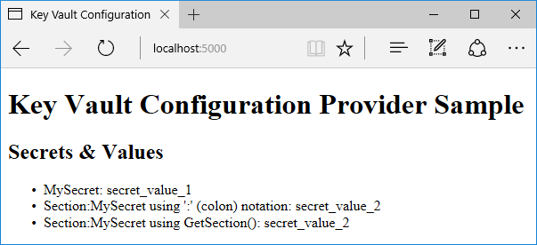

# Azure Key Vault configuration provider

By [Luke Latham](https://github.com/GuardRex) and [Andrew Stanton-Nurse](https://github.com/anurse)

[View or download sample code](https://github.com/aspnet/Docs/tree/master/aspnetcore/security/key-vault-configuration/sample)

This document explains how to use the [Microsoft Azure Key Vault](https://azure.microsoft.com/services/key-vault/) configuration provider to load application configuration values from Azure Key Vault. Azure Key Vault is a cloud-based service that helps you safeguard cryptographic keys and secrets used by apps and services. Common scenarios include controlling access to sensitive configuration data and meeting the requirement for FIPS 140-2 Level 2 validated Hardware Security Modules (HSM's) when storing configuration data.

## Package
To use the provider, add a reference to the [`Microsoft.Extensions.Configuration.AzureKeyVault`](https://www.nuget.org/packages/Microsoft.Extensions.Configuration.AzureKeyVault/) package. The provider depends on .NET Framework 4.5.1 or .NET Standard 1.5 or higher. This feature is available for applications that target ASP.NET Core 1.1.0 or higher.

## Application configuration
You can explore the provider with the [sample application](https://github.com/aspnet/Docs/tree/master/aspnetcore/security/key-vault-configuration/sample). Once you establish a key vault and create a pair of secrets in the vault by [following the guidance below](#creating-key-vault-secrets-and-loading-configuration-values), the sample app securely loads the secret values into its configuration and displays them in a webpage.

The provider is added to the `ConfigurationBuilder` with the `AddAzureKeyVault` extension. In the sample app, the extension uses three configuration values loaded from the *appsettings.json* file.

App Setting | Description | Example
--- | --- | ---
`Vault` | Azure Key Vault name | contosovault
`ClientId` | Azure Active Directory App Id | 627e911e-43cc-61d4-992e-12db9c81b413
`ClientSecret` | Azure Active Directory App Key | g58K3dtg59o1Pa+e59v2Tx829w6VxTB2yv9sv/101di=

[!code-csharp[Main](key-vault-configuration/sample/Startup.cs?name=snippet1&highlight=5,10-13)]

`AddAzureKeyVault` also provides an overload that accepts an implementation of `IKeyVaultSecretManager`, which allows you to control how key vault secrets are converted into configuration keys. For example, you can implement the interface to load configuration values by application, where you prefix app names to configuration secrets you've stored in the key vault. This allows you to maintain secrets for multiple apps in one key vault.

Assume we have several `ConnectionString` key vault secrets with the application name prefixed. For the sample app, we create a secret in the key vault for `KeyVaultConfigProviderSample-ConnectionString` and its value. For a second app, we create a secret for `SomeOtherApplicationName-ConnectionString` and its value. We want each app to load its own `ConnectionString` secret into its configuration as `ConnectionString`. An example of this implementation is shown below:

```csharp
public class EnvironmentSecretManager : IKeyVaultSecretManager
{
    private readonly string _appNamePrefix;

    public EnvironmentSecretManager(string appName)
    {
        _appNamePrefix = appName + "-";
    }

    public bool Load(SecretItem secret)
    {
        return secret.Identifier.Name.StartsWith(_appNamePrefix);
    }

    public string GetKey(SecretBundle secret)
    {
        return secret.SecretIdentifier.Name.Substring(_appNamePrefix.Length);
    }
}
```

```csharp
builder.AddAzureKeyVault(
    $"https://{config["Vault"]}.vault.azure.net/",
    config["ClientId"],
    config["ClientSecret"],
    new EnvironmentSecretManager(env.ApplicationName));
    
Configuration = builder.Build();
```

The `Load` method is called by a provider algorithm that iterates through the secrets to find the one that matches the application name as a prefix to the secret's name. When a match is found with `Load`, the algorithm uses the `GetKey` method to return the configuration name of the secret name. It strips off the app name prefix from the secret's name and returns the name for loading into the app's configuration name-value pairs.

If you implement this approach:

1. The key vault secrets are loaded.
2. The string secret for `KeyVaultConfigProviderSample-ConnectionString` is matched.
3. The application name `KeyVaultConfigProviderSample` (with the dash) is stripped off and used to load `ConnectionString` with its value into the app's configuration.

You can also provide your own `KeyVaultClient` implementation to `AddAzureKeyVault`. Supplying a custom client allows you to share a single instance of the client between the configuration provider and other parts of your app.

## Controlling access to the ClientSecret
Use the [Secret Manager tool](xref:security/app-secrets) to maintain the `ClientSecret` outside of your project source tree. With Secret Manager, you associate app secrets with a specific project and share them across multiple projects.

When developing a .NET Framework app in an environment that supports certificates, you can authenticate to Azure Key Vault with an X.509 certificate. The X.509 certificate's private key is managed by the OS. For more information, see [Authenticate with a Certificate instead of a Client Secret](https://docs.microsoft.com/azure/key-vault/key-vault-use-from-web-application#authenticate-with-a-certificate-instead-of-a-client-secret). Use the `AddAzureKeyVault` overload that accepts an `X509Certificate2`.

```csharp
var store = new X509Store(StoreLocation.CurrentUser);
store.Open(OpenFlags.ReadOnly);
var cert = store.Certificates.Find(X509FindType.FindByThumbprint, config["CertificateThumbprint"], false);

builder.AddAzureKeyVault(
    config["Vault"],
    config["ClientId"],
    cert.OfType<X509Certificate2>().Single(),
    new EnvironmentSecretManager(env.ApplicationName));
store.Close();

Configuration = builder.Build();
```

## Creating key vault secrets and loading configuration values
1. Create a key vault and set up Azure Active Directory (Azure AD) for the application following the guidance in [Get started with Azure Key Vault](https://azure.microsoft.com/documentation/articles/key-vault-get-started/).
  * Add secrets to the key vault using the Azure PowerShell Module, the Azure Management API, or the Azure Portal. Secrets are uploaded as either *Manual* or *Certificate* secrets. *Certificate* secrets are certificates for use by apps and services but are not supported by the configuration provider. You should use the *Manual* option to create name-value pair secrets for use with the configuration provider.
    * Hierarchical values (configuration sections) use `--` (two dashes) as a separator.
    * For the sample app, create two *Manual* secrets with the following name-value pairs:
      * `MySecret`: `secret_value_1`
      * `Section--MySecret`: `secret_value_2`
  * Register the sample app with Azure Active Directory.
  * Authorize the app to access the key vault. When you use the `Set-AzureRmKeyVaultAccessPolicy` PowerShell cmdlet to authorize the app to access the key vault, provide `List` and `Get` access to secrets with `-PermissionsToKeys list,get`.
2. Update the app's *appsettings.json* file with the values of `Vault`, `ClientId`, and `ClientSecret`.
3. Run the sample app, which obtains its configuration values from `IConfigurationRoot` with the same name as the secret name.
  * Non-hierarchical Values: The value for `MySecret` is obtained with `config["MySecret"]`.
  * Hierarchical Values (sections): Use `:` (colon) notation or the `GetSection` extension method.
    * `config["Section:MySecret"]`
    * `config.GetSection("Section")["MySecret"]`



## Reloading secrets
Secrets are cached until `IConfigurationRoot.Reload()` is called. Expired, disabled, and updated secrets in the key vault are not respected by the application until `Reload` is executed.

```csharp
Configuration.Reload();
```

## Disabled and expired secrets
Disabled and expired secrets throw a `KeyVaultClientException`. To prevent your app from throwing, replace your app or update the disabled/expired secret.

## Troubleshooting
When the application fails to load configuration using the provider, an error message is written to the [ASP.NET Logging infrastructure](xref:fundamentals/logging). The following conditions will prevent configuration from loading:
* The app isn't configured correctly in Azure Active Directory.
* The key vault doesn't exist in Azure Key Vault.
* The app isn't authorized to access the key vault.
* The access policy doesn't include `Get` and `List` permissions.
* In the key vault, the configuration data (name-value pair) is incorrectly named, missing, disabled, or expired.
* The app has the wrong key vault name (`Vault`), Azure AD App Id (`ClientId`), or Azure AD Key (`ClientSecret`).
* The Azure AD Key (`ClientSecret`) is expired.
* The configuration key (name) is incorrect in the app for the value you're trying to load.

## Additional resources
* <xref:fundamentals/configuration>
* [Microsoft Azure: Key Vault](https://azure.microsoft.com/services/key-vault/)
* [Microsoft Azure: Key Vault Documentation](https://docs.microsoft.com/azure/key-vault/)
* [How to generate and transfer HSM-protected keys for Azure Key Vault](https://docs.microsoft.com/azure/key-vault/key-vault-hsm-protected-keys)
* [KeyVaultClient Class](https://msdn.microsoft.com/library/microsoft.azure.keyvault.keyvaultclient.aspx)
