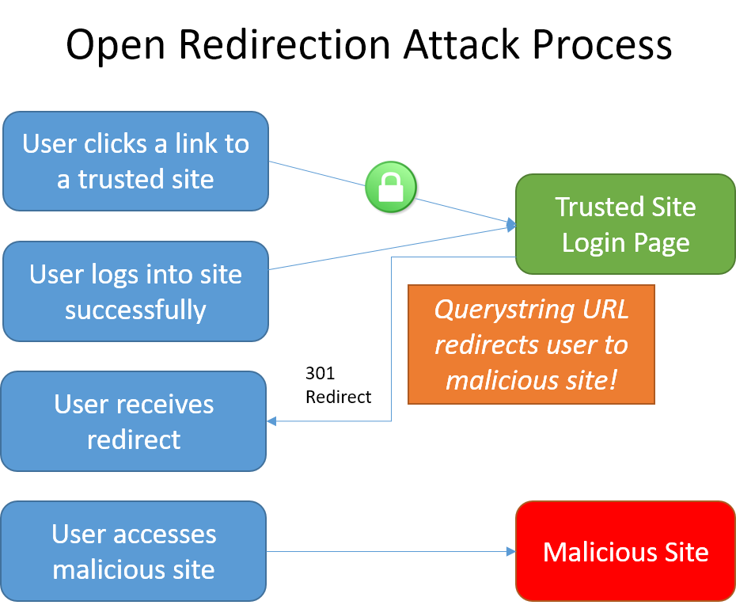

# Prevent open redirect attacks in ASP.NET Core

A web app that redirects to a URL that's specified via the request such as the querystring or form data can potentially be tampered with to redirect users to an external, malicious URL. This tampering is called an open redirection attack.

Whenever your application logic redirects to a specified URL, you must verify that the redirection URL hasn't been tampered with. ASP.NET Core has built-in functionality to help protect apps from open redirect (also known as open redirection) attacks.

## What is an open redirect attack?

Web applications frequently redirect users to a login page when they access resources that require authentication. The redirection typically includes a `returnUrl` querystring parameter so that the user can be returned to the originally requested URL after they have successfully logged in. After the user authenticates, they're redirected to the URL they had originally requested.

Because the destination URL is specified in the querystring of the request, a malicious user could tamper with the querystring. A tampered querystring could allow the site to redirect the user to an external, malicious site. This technique is called an open redirect (or redirection) attack.

### An example attack

A malicious user can develop an attack intended to allow the malicious user access to a user's credentials or sensitive information. To begin the attack, the malicious user convinces the user to click a link to your site's login page with a `returnUrl` querystring value added to the URL. For example, consider an app at `contoso.com` that includes a login page at `http://contoso.com/Account/LogOn?returnUrl=/Home/About`. The attack follows these steps:

1. The user clicks a malicious link to `http://contoso.com/Account/LogOn?returnUrl=http://contoso1.com/Account/LogOn` (the second URL is "contoso**1**.com", not "contoso.com").
2. The user logs in successfully.
3. The user is redirected (by the site) to `http://contoso1.com/Account/LogOn` (a malicious site that looks exactly like real site).
4. The user logs in again (giving malicious site their credentials) and is redirected back to the real site.

The user likely believes that their first attempt to log in failed and that their second attempt is successful. The user most likely remains unaware that their credentials are compromised.



In addition to login pages, some sites provide redirect pages or endpoints. Imagine your app has a page with an open redirect, `/Home/Redirect`. An attacker could create, for example, a link in an email that goes to `[yoursite]/Home/Redirect?url=http://phishingsite.com/Home/Login`. A typical user will look at the URL and see it begins with your site name. Trusting that, they will click the link. The open redirect would then send the user to the phishing site, which looks identical to yours, and the user would likely login to what they believe is your site.

## Protecting against open redirect attacks

When developing web applications, treat all user-provided data as untrustworthy. If your application has functionality that redirects the user based on the contents of the URL,  ensure that such redirects are only done locally within your app (or to a known URL, not any URL that may be supplied in the querystring).

### LocalRedirect

Use the `LocalRedirect` helper method from the base `Controller` class:

```csharp
public IActionResult SomeAction(string redirectUrl)
{
    return LocalRedirect(redirectUrl);
}
```

`LocalRedirect` will throw an exception if a non-local URL is specified. Otherwise, it behaves just like the `Redirect` method.

### IsLocalUrl

Use the <xref:Microsoft.AspNetCore.Mvc.IUrlHelper.IsLocalUrl%2A> method to test URLs before redirecting:

The following example shows how to check whether a URL is local before redirecting.

```csharp
private IActionResult RedirectToLocal(string returnUrl)
{
    if (Url.IsLocalUrl(returnUrl))
    {
        return Redirect(returnUrl);
    }
    else
    {
        return RedirectToAction(nameof(HomeController.Index), "Home");
    }
}
```

The `IsLocalUrl` method protects users from being inadvertently redirected to a malicious site. You can log the details of the URL that was provided when a non-local URL is supplied in a situation where you expected a local URL. Logging redirect URLs may help in diagnosing redirection attacks.
