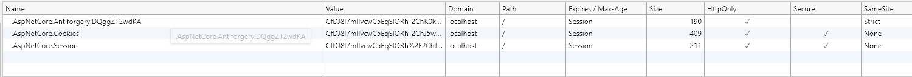

---
title: ASP.NET Core 3.1 Razor Pages SameSite cookie sample
author: rick-anderson
description: ASP.NET Core 3.1 Razor Pages SameSite cookie sample
monikerRange: '= aspnetcore-3.1'
ms.author: riande
ms.custom: mvc
ms.date: 12/03/2019
uid: security/samesite/rp31
---

# ASP.NET Core 3.1 Razor Pages SameSite cookie sample

ASP.NET Core 3.0 has built-in support for the [SameSite](https://owasp.org/www-community/SameSite) attribute, including a `SameSiteMode` attribute value of `Unspecified` to suppress writing the attribute.

[!INCLUDE[](~/includes/SameSiteIdentity.md)]

## <a name="sampleCode"></a>Writing the SameSite attribute

Following is an example of how to write a SameSite attribute on a cookie;

```csharp
var cookieOptions = new CookieOptions
{
    // Set the secure flag, which Chrome's changes will require for SameSite none.
    // Note this will also require you to be running on HTTPS
    Secure = true,

    // Set the cookie to HTTP only which is good practice unless you really do need
    // to access it client side in scripts.
    HttpOnly = true,

    // Add the SameSite attribute, this will emit the attribute with a value of none.
    // To not emit the attribute at all set the SameSite property to SameSiteMode.Unspecified.
    SameSite = SameSiteMode.None
};

// Add the cookie to the response cookie collection
Response.Cookies.Append(CookieName, "cookieValue", cookieOptions);
```

## Setting Cookie Authentication and Session State cookies

Cookie authentication, session state and [various other components](../samesite.md)
set their sameSite options via Cookie options, for example

```csharp
services.AddAuthentication(CookieAuthenticationDefaults.AuthenticationScheme)
    .AddCookie(options =>
    {
        options.Cookie.SameSite = SameSiteMode.None;
        options.Cookie.SecurePolicy = CookieSecurePolicy.Always;
        options.Cookie.IsEssential = true;
    });

services.AddSession(options =>
{
    options.Cookie.SameSite = SameSiteMode.None;
    options.Cookie.SecurePolicy = CookieSecurePolicy.Always;
    options.Cookie.IsEssential = true;
});
```

In the code shown above both cookie authentication and session state set their sameSite attribute to None, emitting the
attribute with a `None` value, and also set the Secure attribute to true.

### Run the sample

If you run the [sample project](https://github.com/blowdart/AspNetSameSiteSamples/tree/master/AspNetCore31RazorPages), load your browser debugger on the initial page and use it to view the cookie collection for the site. To do so in Edge and Chrome press `F12` then select the `Application` tab and click the site URL under the `Cookies` option in the `Storage` section.



You can see from the image above that the cookie created by the sample when you click the "Create SameSite Cookie" button has a SameSite attribute value of `Lax`, matching the value set in the [sample code](#sampleCode).

## <a name="interception"></a>Intercepting cookies

In order to intercept cookies, to adjust the none value according to its support in the user's browser agent you must
use the `CookiePolicy` middleware. This must be placed into the http request pipeline **before** any components that write cookies and configured within `ConfigureServices()`.

To insert it into the pipeline use `app.UseCookiePolicy()` in the `Configure(IApplicationBuilder, IHostingEnvironment)`
method in your [Startup.cs](https://github.com/blowdart/AspNetSameSiteSamples/blob/master/AspNetCore21MVC/Startup.cs). For example

```csharp
public void Configure(IApplicationBuilder app, IHostingEnvironment env)
{
    if (env.IsDevelopment())
    {
       app.UseDeveloperExceptionPage();
    }
    else
    {
        app.UseExceptionHandler("/Home/Error");
        app.UseHsts();
    }

    app.UseHttpsRedirection();
    app.UseStaticFiles();
    app.UseCookiePolicy();
    app.UseAuthentication();
    app.UseSession();

    app.UseMvc(routes =>
    {
        routes.MapRoute(
            name: "default",
            template: "{controller=Home}/{action=Index}/{id?}");
    });
}
```

Then in the `ConfigureServices(IServiceCollection services)` configure the cookie policy to call out to a helper
class when cookies are appended or deleted, like so;

```csharp
public void ConfigureServices(IServiceCollection services)
{
    services.Configure<CookiePolicyOptions>(options =>
    {
        options.CheckConsentNeeded = context => true;
        options.MinimumSameSitePolicy = SameSiteMode.None;
        options.OnAppendCookie = cookieContext =>
            CheckSameSite(cookieContext.Context, cookieContext.CookieOptions);
        options.OnDeleteCookie = cookieContext =>
            CheckSameSite(cookieContext.Context, cookieContext.CookieOptions);
    });
}

private void CheckSameSite(HttpContext httpContext, CookieOptions options)
{
    if (options.SameSite == SameSiteMode.None)
    {
        var userAgent = httpContext.Request.Headers["User-Agent"].ToString();
        if (SameSite.BrowserDetection.DisallowsSameSiteNone(userAgent))
        {
            options.SameSite = SameSiteMode.Unspecified;
        }
    }
}
```

The helper function `CheckSameSite(HttpContext, CookieOptions)`:

* Is called when cookies are appended to the request or deleted from the request.
* Checks to see if the `SameSite` property is set to `None`.
* If `SameSite` is set to `None` and the current user agent is known to not support the
none attribute value. The check is done using the [SameSiteSupport](https://github.com/dotnet/AspNetCore.Docs/blob/main/aspnetcore/security/samesite/snippets/SameSiteSupport.cs) class:
  * Sets `SameSite` to not emit the value by setting the property to `(SameSiteMode)(-1)`

### More Information
 
[Chrome Updates](https://www.chromium.org/updates/same-site)
[ASP.NET Core SameSite Documentation](xref:security/samesite)
