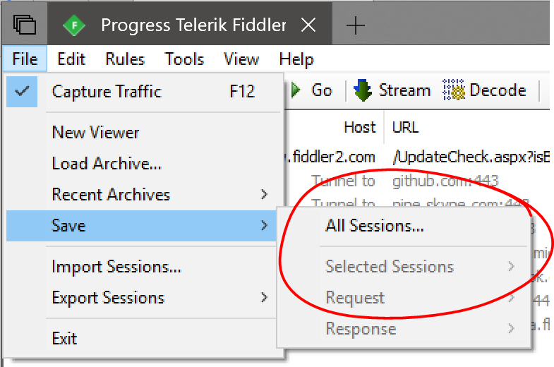
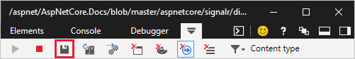
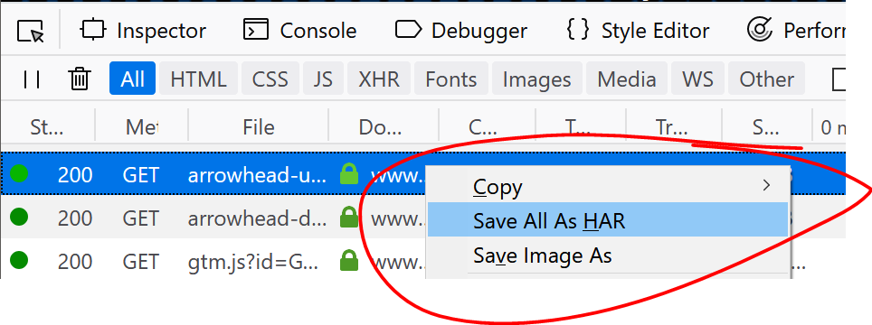

# Logging and diagnostics in ASP.NET Core SignalR

By [Andrew Stanton-Nurse](https://twitter.com/anurse)

This article provides guidance for gathering diagnostics from your ASP.NET Core SignalR app to help troubleshoot issues.

## Server-side logging

> [!WARNING]
> Server-side logs may contain sensitive information from your app. **Never** post raw logs from production apps to public forums like GitHub.

Since SignalR is part of ASP.NET Core, it uses the ASP.NET Core logging system. In the default configuration, SignalR logs very little information, but this can configured. See the documentation on [ASP.NET Core logging](xref:fundamentals/logging/index) for details on configuring ASP.NET Core logging.

SignalR uses two logger categories:

* `Microsoft.AspNetCore.SignalR`: For logs related to Hub Protocols, activating Hubs, invoking methods, and other Hub-related activities.
* `Microsoft.AspNetCore.Http.Connections`: For logs related to transports, such as WebSockets, Long Polling, Server-Sent Events, and low-level SignalR infrastructure.

To enable detailed logs from SignalR, configure both of the preceding prefixes to the `Debug` level in your `appsettings.json` file by adding the following items to the `LogLevel` sub-section in `Logging`:

[!code-json[](diagnostics/logging-config.json?highlight=7-8)]

You can also configure this in code in your `CreateWebHostBuilder` method:

[!code-csharp[](diagnostics/logging-config-code.cs?highlight=5-6)]

If you aren't using JSON-based configuration, set the following configuration values in your configuration system:

* `Logging:LogLevel:Microsoft.AspNetCore.SignalR` = `Debug`
* `Logging:LogLevel:Microsoft.AspNetCore.Http.Connections` = `Debug`

Check the documentation for your configuration system to determine how to specify nested configuration values. For example, when using environment variables, two `_` characters are used instead of the `:` (for example, `Logging__LogLevel__Microsoft.AspNetCore.SignalR`).

We recommend using the `Debug` level when gathering more detailed diagnostics for your app. The `Trace` level produces very low-level diagnostics and is rarely needed to diagnose issues in your app.

## Access server-side logs

How you access server-side logs depends on the environment in which you're running.

### As a console app outside IIS

If you're running in a console app, the [Console logger](xref:fundamentals/logging/index#console) should be enabled by default. SignalR logs will appear in the console.

### Within IIS Express from Visual Studio

Visual Studio displays the log output in the **Output** window. Select the **ASP.NET Core Web Server** drop down option.

### Azure App Service

Enable the **Application Logging (Filesystem)** option in the **Diagnostics logs** section of the Azure App Service portal and configure the **Level** to `Verbose`. Logs should be available from the **Log streaming** service and in logs on the file system of the App Service. For more information, see [Azure log streaming](xref:fundamentals/logging/index#azure-log-streaming).

### Other environments

If the app is deployed to another environment (for example, Docker, Kubernetes, or Windows Service), see <xref:fundamentals/logging/index> for more information on how to configure logging providers suitable for the environment.

## JavaScript client logging

> [!WARNING]
> Client-side logs may contain sensitive information from your app. **Never** post raw logs from production apps to public forums like GitHub.

When using the JavaScript client, you can configure logging options using the `configureLogging` method on `HubConnectionBuilder`:

[!code-javascript[](diagnostics/logging-config-js.js?highlight=3)]

To disable logging entirely, specify `signalR.LogLevel.None` in the `configureLogging` method.

The following table shows log levels available to the JavaScript client. Setting the log level to one of these values enables logging at that level and all levels above it in the table.

| Level | Description |
| ----- | ----------- |
| `None` | No messages are logged. |
| `Critical` | Messages that indicate a failure in the entire app. |
| `Error` | Messages that indicate a failure in the current operation. |
| `Warning` | Messages that indicate a non-fatal problem. |
| `Information` | Informational messages. |
| `Debug` | Diagnostic messages useful for debugging. |
| `Trace` | Very detailed diagnostic messages designed for diagnosing specific issues. |

Once you've configured the verbosity, the logs will be written to the Browser Console (or Standard Output in a NodeJS app).

If you want to send logs to a custom logging system, you can provide a JavaScript object implementing the `ILogger` interface. The only method that needs to be implemented is `log`, which takes the level of the event and the message associated with the event. For example:

:::moniker range=">= aspnetcore-3.0"

[!code-typescript[](diagnostics/3.x/custom-logger.ts?highlight=3-7,13)]

:::moniker-end

:::moniker range="< aspnetcore-3.0"

[!code-typescript[](diagnostics/2.x/custom-logger.ts?highlight=3-7,13)]

:::moniker-end

## .NET client logging

> [!WARNING]
> Client-side logs may contain sensitive information from your app. **Never** post raw logs from production apps to public forums like GitHub.

To get logs from the .NET client, you can use the `ConfigureLogging` method on `HubConnectionBuilder`. This works the same way as the `ConfigureLogging` method on `WebHostBuilder` and `HostBuilder`. You can configure the same logging providers you use in ASP.NET Core. However, you have to manually install and enable the NuGet packages for the individual logging providers.

To add .NET client logging to a Blazor WebAssembly app, see <xref:blazor/fundamentals/logging#signalr-net-client-logging>.

### Console logging

In order to enable Console logging, add the [Microsoft.Extensions.Logging.Console](https://www.nuget.org/packages/Microsoft.Extensions.Logging.Console) package. Then, use the `AddConsole` method to configure the console logger:

[!code-csharp[](diagnostics/net-client-console-log.cs?highlight=6)]

### Debug output window logging

You can also configure logs to go to the **Output** window in Visual Studio. Install the [Microsoft.Extensions.Logging.Debug](https://www.nuget.org/packages/Microsoft.Extensions.Logging.Debug) package and use the `AddDebug` method:

[!code-csharp[](diagnostics/net-client-debug-log.cs?highlight=6)]

### Other logging providers

SignalR supports other logging providers such as Serilog, Seq, NLog, or any other logging system that integrates with `Microsoft.Extensions.Logging`. If your logging system provides an `ILoggerProvider`, you can register it with `AddProvider`:

[!code-csharp[](diagnostics/net-client-custom-log.cs?highlight=6)]

### Control verbosity

If you are logging from other places in your app, changing the default level to `Debug` may be too verbose. You can use a Filter to configure the logging level for SignalR logs. This can be done in code, in much the same way as on the server:

[!code-csharp[Controlling verbosity in .NET client](diagnostics/logging-config-client-code.cs?highlight=9-10)]

## Network traces

> [!WARNING]
> A network trace contains the full contents of every message sent by your app. **Never** post raw network traces from production apps to public forums like GitHub.

If you encounter an issue, a network trace can sometimes provide a lot of helpful information. This is particularly useful if you're going to file an issue on our issue tracker.

## Collect a network trace with Fiddler (preferred option)

This method works for all apps.

Fiddler is a very powerful tool for collecting HTTP traces. Install it from [telerik.com/fiddler](https://www.telerik.com/fiddler), launch it, and then run your app and reproduce the issue. Fiddler is available for Windows, and there are beta versions for macOS and Linux.

If you connect using HTTPS, there are some extra steps to ensure Fiddler can decrypt the HTTPS traffic. For more details, see the [Fiddler documentation](https://docs.telerik.com/fiddler/Configure-Fiddler/Tasks/DecryptHTTPS).

Once you've collected the trace, you can export the trace by choosing **File** > **Save** > **All Sessions** from the menu bar.



## Collect a network trace with tcpdump (macOS and Linux only)

This method works for all apps.

You can collect raw TCP traces using tcpdump by running the following command from a command shell. You may need to be `root` or prefix the command with `sudo` if you get a permissions error:

```console
tcpdump -i [interface] -w trace.pcap
```

Replace `[interface]` with the network interface you wish to capture on. Usually, this is something like `/dev/eth0` (for your standard Ethernet interface) or `/dev/lo0` (for localhost traffic). For more information, see the `tcpdump` man page on your host system.

## Collect a network trace in the browser

This method only works for browser-based apps.

Most browser developer tools consoles have a "Network" tab that allows you to capture network activity between the browser and the server. However, these traces don't include WebSocket and Server-Sent Event messages. If you are using those transports, using a tool like Fiddler or TcpDump (described below) is a better approach.

### Microsoft Edge and Internet Explorer

(The instructions are the same for both Edge and Internet Explorer)

1. Press F12 to open the Dev Tools
2. Click the Network Tab
3. Refresh the page (if needed) and reproduce the problem
4. Click the Save icon in the toolbar to export the trace as a "HAR" file:



### Google Chrome

1. Press F12 to open the Dev Tools
2. Click the Network Tab
3. Refresh the page (if needed) and reproduce the problem
4. Right click anywhere in the list of requests and choose "Save as HAR with content":


### Mozilla Firefox

1. Press F12 to open the Dev Tools
2. Click the Network Tab
3. Refresh the page (if needed) and reproduce the problem
4. Right click anywhere in the list of requests and choose "Save All As HAR"



## Attach diagnostics files to GitHub issues

You can attach Diagnostics files to GitHub issues by renaming them so they have a `.txt` extension and then dragging and dropping them on to the issue.

> [!NOTE]
> Please don't paste the content of log files or network traces into a GitHub issue. These logs and traces can be quite large, and GitHub usually truncates them.


## Metrics

Metrics is a representation of data measures over intervals of time. For example, requests per second. Metrics data allows observation of the state of an app at a high level. .NET gRPC metrics are emitted using <xref:System.Diagnostics.Tracing.EventCounter>.

### SignalR server metrics

SignalR server metrics are reported on the <xref:Microsoft.AspNetCore.Http.Connections> event source.

| Name                    | Description                 |
|-------------------------|-----------------------------|
| `connections-started`   | Total connections started   |
| `connections-stopped`   | Total connections stopped   |
| `connections-timed-out` | Total connections timed out |
| `current-connections`   | Current connections         |
| `connections-duration`  | Average connection duration |

### Observe metrics

[dotnet-counters](/dotnet/core/diagnostics/dotnet-counters) is a performance monitoring tool for ad-hoc health monitoring and first-level performance investigation. Monitor a .NET app with `Microsoft.AspNetCore.Http.Connections` as the provider name. For example:

```console
> dotnet-counters monitor --process-id 37016 Microsoft.AspNetCore.Http.Connections

Press p to pause, r to resume, q to quit.
    Status: Running
[Microsoft.AspNetCore.Http.Connections]
    Average Connection Duration (ms)       16,040.56
    Current Connections                         1
    Total Connections Started                   8
    Total Connections Stopped                   7
    Total Connections Timed Out                 0
```

## Additional resources

* <xref:signalr/configuration>
* <xref:signalr/javascript-client>
* <xref:signalr/dotnet-client>
