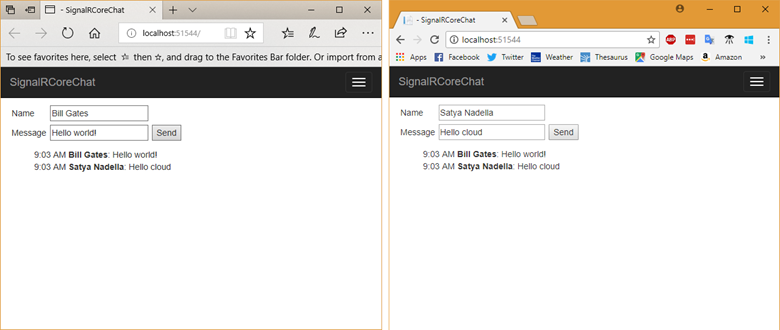
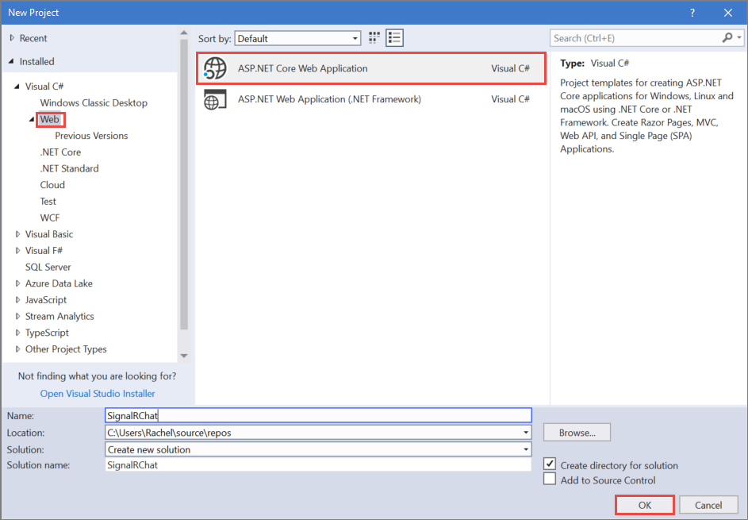
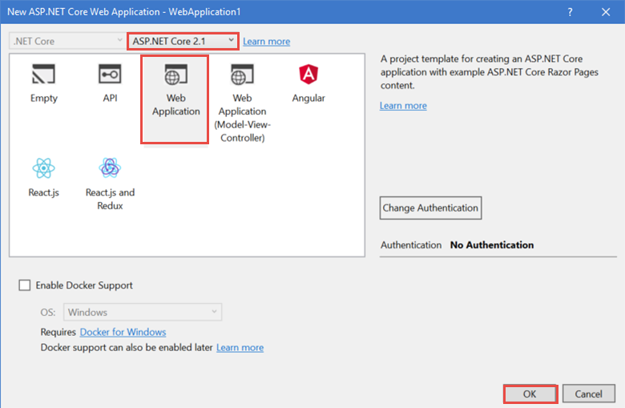

# Tutorial: Get started with SignalR for ASP.NET Core

By [Rachel Appel](https://twitter.com/rachelappel)

This tutorial teaches the basics of building a real-time app using SignalR for ASP.NET Core.

   

[View or download sample code](https://github.com/aspnet/Docs/tree/master/aspnetcore/signalr/get-started-signalr-core/sample/) ([how to download](xref:tutorials/index#how-to-download-a-sample))

This tutorial demonstrates the following SignalR development tasks:

> [!div class="checklist"]
> * Create an ASP.NET Core web app.
> * Create a SignalR hub to push content to clients.
> * Use the SignalR JavaScript library to send messages and display updates from the hub.

# Prerequisites

Install the following software:

* [.NET Core 2.1.0 Preview 1 SDK](https://www.microsoft.com/net/download/dotnet-core/sdk-2.1.300-preview1) or later
* [Visual Studio 2017](https://www.visualstudio.com/downloads/) version 15.6 or later with the ASP.NET and web development workload
* [npm](https://www.npmjs.com/get-npm)

## Create an ASP.NET Core project that hosts SignalR client and server

1. Use the **File** > **New Project** menu option and choose **ASP.NET Core Web Application**. Name the project `SignalRChat`.

  

2. Select **Web Application** to create a project using Razor Pages. Then select **Ok**. Be sure that **ASP.NET Core 2.1** is selected from the framework selector, though SignalR runs on older versions of .NET.

  

  The libraries that host SignalR server-side code are included in the project template. Install the client-side JavaScript separately with [npm](https://www.npmjs.com/).

  ```console
   npm install @aspnet/signalr
  ```

3. Copy the *signalr.js* from *node_modules\\@aspnet\signalr\dist\browser* to the *wwwroot\lib* folder in your project.

## Create the SignalR Hub

A hub is a class that serves as a high-level pipeline that allows the client and server to call methods on each other.

1. Add a class to the project by choosing **File** > **New** > **File** and selecting **Visual C# Class**. 

1. Inherit from `Microsoft.AspNetCore.SignalR.Hub`. The `Hub` class contains properties and events for managing connections and groups, as well as sending and receiving data.

1. Create the `Send` method that sends a message to all connected chat clients. Notice it returns a `Task`, because SignalR is asynchronous. Asynchronous code scales better.

  [!code-csharp[Startup](get-started-signalr-core/sample/Hubs/ChatHub.cs?range=7-14)]

## Configure the project to use SignalR

The SignalR server must be configured so that it knows to pass requests to SignalR.

1. To configure a SignalR project, modify the `ConfigureServices` method of the application's `Startup` class by inserting a call to `services.AddSignalR`.

  `services.AddSignalR` adds SignalR as part of the [ASP.NET Core middleware](xref:fundamentals/middleware/index) pipeline.

1. Configure routes to your hubs using `UseSignalR`.

  [!code-csharp[Startup](get-started-signalr-core/sample/Startup.cs?highlight=22,40-43)]

## Create the SignalR client code

1. Replace the content in *Pages\Index.cshtml* with the following code:

  [!code-cshtml[Index](get-started-signalr-core/sample/Pages/Index.cshtml)]

  The preceding HTML displays name and message fields, and a submit button. Notice the script references at the bottom: a reference to SignalR and *chat.js*.

1. Add a JavaScript file to the *wwwroot\js* folder named *chat.js* and add the following code to it:

  [!code-javascript[Index](get-started-signalr-core/sample/wwwroot/js/chat.js)]

## Run the app

1. Select **Debug** > **Start without debugging** to launch a browser and load the website locally. Copy the URL from the address bar.

1. Open another browser instance (any browser) and paste the URL in the address bar.

1. Choose either browser, enter a name and message, and click the **Send** button. The name and message are displayed on both pages instantly.

  
