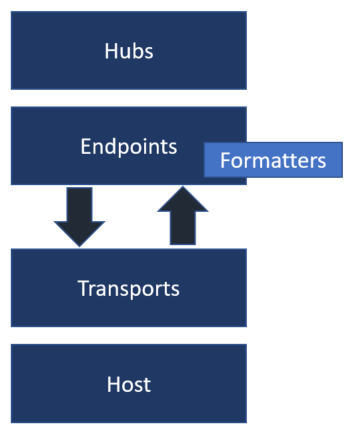

# Introduction to SignalR

By [Rachel Appel](https://twitter.com/rachelappel)

## What is SignalR?

ASP.NET Core SignalR is a library that simplifies adding real-time web functionality to apps. Real-time web functionality enables server-side code to push content to clients instantly.

Good candidates for SignalR:

* Apps that require high frequency updates from the server. Some examples are gaming, social networks, voting, auction, maps, and GPS apps.
* Dashboards and monitoring apps. Some examples include company dashboards, instant sales updates, or travel alerts.
* Collaborative apps. Whiteboard apps and team meeting software are examples of collaborative apps.
* Apps that require notifications. Social networks, email, chat, games, travel alerts, and many other apps use notifications.

SignalR provides an API for creating server-to-client remote procedure calls (RPC). The RPCs call JavaScript functions on clients from server-side .NET Core code.

SignalR for ASP.NET Core:

* Handles connection management automatically.
* Enables broadcasting messages to all connected clients simultaneously. For example, a chat room.
* Enables sending messages to specific clients or groups of clients.
* Is open-sourced at [GitHub](https://github.com/aspnet/SignalR).
* Scales nicely.

The connection between the client and server is persistent, unlike an HTTP connection.

## Transports and fallbacks

 SignalR is an abstraction over some of the transports that are required to send messages between client and server. A SignalR connection starts as HTTP. SignalR uses the [WebSocket transport](https://tools.ietf.org/html/rfc7118) when available, and falls back to other transports when it's not available. WebSocket is an ideal transport for SignalR since it can facilitate full duplex communication between client and server. SignalR automatically assigns a transport per connection, though you can override this functionality.

## Hubs and Endpoints

SignalR uses Hubs and Endpoints to communicate between clients and servers. The Hubs API covers the vast majority of scenarios the average ASP.NET Core developer needs.

A hub is a high-level pipeline built upon the Endpoint API that allows your client and server to call methods on each other. SignalR handles the dispatching across machine boundaries as if by magic, allowing clients to call methods on the server as easily as local methods, and vice versa. Using a hub allows you to pass strongly-typed parameters to methods, enabling model binding. SignalR provides two built-in hub protocols: a text protocol based on JSON and a binary protocol based on [MessagePack](http://msgpack.org/). Using MessagePack generally creates smaller messages than when using JSON. Older browsers that don't support [XHR level 2](https://caniuse.com/#feat=xhr2) can't support the MessagePack protocol.

Hubs call client-side code by sending messages using the active transport. The messages contain the name and parameters of the client-side method. Objects sent as method parameters are deserialized using the configured protocol. The client tries to match the name to a method in the client-side code. When a match happens, the client method runs using the deserialized parameter data.

Endpoints have a raw socket-like API, enabling them to read and write from the client. It's up to the developer to handle grouping, broadcasting, and other functions. The Hubs API is built on top of the Endpoints layer.

The following diagram shows the relationship between hubs, endpoints, and clients.

## Related Resources

[Get Started with SignalR for ASP.NET Core](get-started-signalr-core)