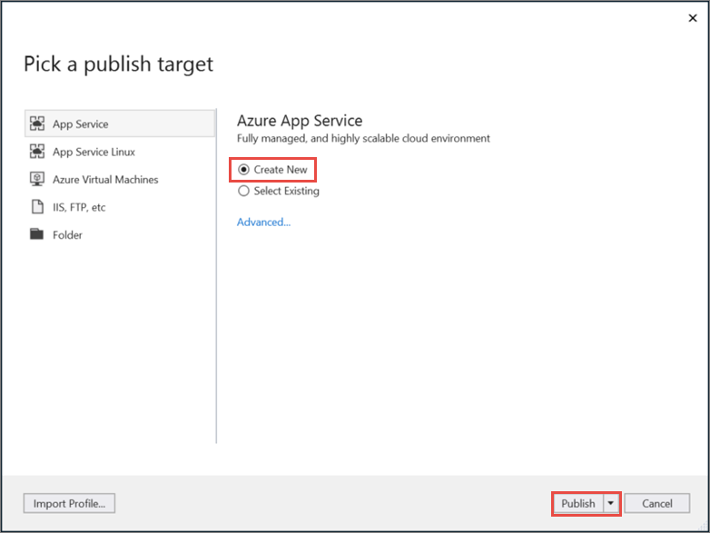
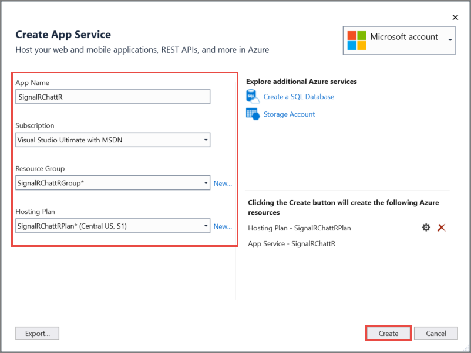
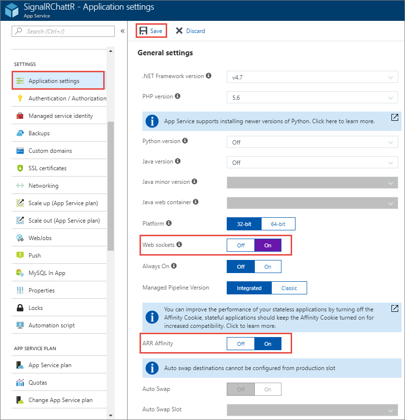

# Publish an ASP.NET Core SignalR app to an Azure Web App

[Azure Web App](/azure/app-service/app-service-web-overview) is a [Microsoft cloud computing](https://azure.microsoft.com/) platform service for hosting web apps, including ASP.NET Core.

> [!NOTE]
> This article refers to publishing an ASP.NET Core SignalR app from Visual Studio. Visit [SignalR service for Azure](https://azure.microsoft.com/en-gb/services/signalr-service?) for more information about using SignalR on Azure.

## Publish the app

Visual Studio provides built-in tools for publishing to an Azure Web App. Visual Studio Code user can use [Azure CLI](/cli/azure) commands to publish apps to Azure. This article covers publishing using the tools in Visual Studio. To publish an app using Azure CLI, see [Publish an ASP.NET Core app to Azure with command line tools](xref:tutorials/publish-to-azure-webapp-using-cli).

Right-click on the project in **Solution Explorer** and select **Publish**. Confirm that **Create new** is checked in the **Pick a publish target** dialog, and select **Publish**.

Enter the following information in the **Create App Service** dialog and select **Create**.

| Item | Description |
| ---- | ----------- |
| **App name** | A unique name of the app. |
| **Subscription** | The Azure subscription that the app uses. |
| **Resource Group** | The group of related resources to which the app belongs.  |
| **Hosting Plan** | The pricing plan for the web app. |

Visual Studio completes the following tasks:

* Creates a Publish Profile containing publish settings.
* Creates or uses an existing *Azure Web App* with the provided details.
* Publishes the app.
* Launches a browser, with the published web app loaded.

Notice the format of the URL for the app is *{app name}.azurewebsites.net*. For example, an app named `SignalRChattR` has a URL that looks like `https://signalrchattr.azurewebsites.net`.

If an HTTP 502.2 error occurs, see [Deploy ASP.NET Core preview release to Azure App Service](xref:host-and-deploy/azure-apps/index) to resolve it.

## Configure SignalR web app

ASP.NET Core SignalR apps that are published as an Azure Web App must have [ARR Affinity](https://en.wikipedia.org/wiki/Application_Request_Routing) enabled. [WebSockets](xref:fundamentals/websockets) should be enabled, to allow the WebSockets transport to function.

In the Azure portal, navigate to **App Settings** for your web app. Set **WebSockets** to **On**, and verify **ARR Affinity** is **On**.

 WebSockets and other transports [are limited based on the App Service Plan](/azure/azure-subscription-service-limits#app-service-limits).

## Related resources

* [Publish an ASP.NET Core app to Azure with command line tools](xref:tutorials/publish-to-azure-webapp-using-cli?tabs=windows)
* [Publish an ASP.NET Core app to Azure with Visual Studio](xref:tutorials/publish-to-azure-webapp-using-vs)
* [Host and deploy ASP.NET Core Preview apps on Azure](xref:host-and-deploy/azure-apps/index#deploy-aspnet-core-preview-release-to-azure-app-service)
