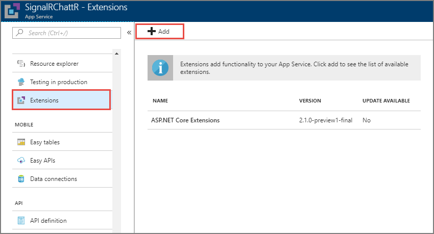
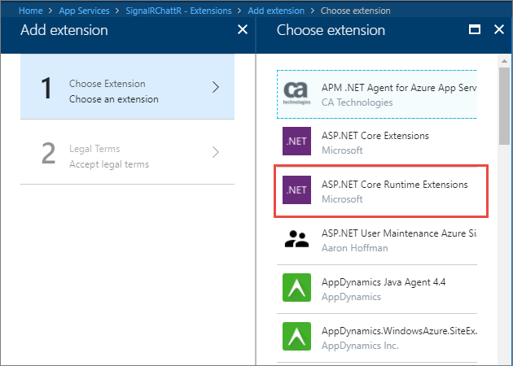
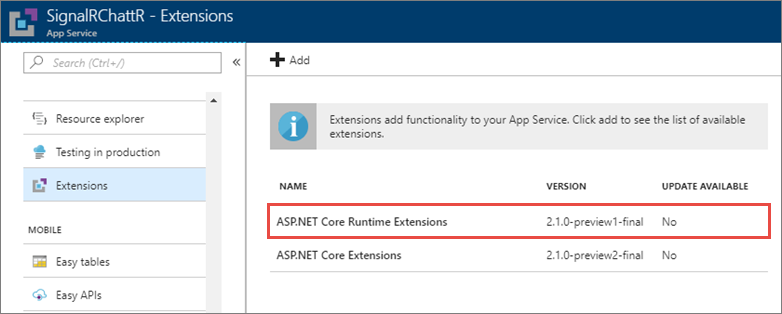

# Publish an ASP.NET Core SignalR app to an Azure Web App

[Azure Web App](https://docs.microsoft.com/azure/app-service/app-service-web-overview) is a [Microsoft cloud computing](https://azure.microsoft.com/) platform service for hosting web apps, including ASP.NET Core.

## Publish the app

Visual Studio provides built-in tools for publishing to an Azure Web App. Visual Studio Code user can use [Azure CLI](https://docs.microsoft.com/cli/azure) commands to publish apps to Azure. This article covers publishing using  the tools in Visual Studio. To publish an app using Azure CLI, see [Publish an ASP.NET Core app to Azure with command line tools](xref:tutorials/publish-to-azure-webapp-using-cli).

Right-click on the project in **Solution Explorer** and select **Publish**. Confirm that **Create new** is checked in the **Pick a publish target** dialog, and select **Publish**.

Enter the following information in the **Create App Service** dialog and select **Create**.

| Item | Description |
| ---- | ----------- |
| **App name** | A unique name of the app. |
| **Subscription** | The Azure subscription that the app uses. |
| **Resource Group** | The group of related resources to which the app belongs.  |
| **Hosting Plan** | The pricing plan for the web app. |

Visual Studio completes the following tasks:

* Creates a Publish Profile containing publish settings.
* Creates or uses an existing *Azure Web App* with the provided details.
* Publishes the app.
* Launches a browser, with the published web app loaded.

Notice the format of the URL for the app is *{app name}.azurewebsites.net*. For example, an app named `SignalRChattR` has a URL that looks like *https://signalrchattr.azurewebsites.net*.

> [!NOTE]
> If an HTTP 502.2 error occurs, it is because some ASP.NET Core components haven't been loaded. To resolve this error, complete the steps later in the *Add ASP.NET Core Runtime extensions* section of this article.

## Configure SignalR web app

ASP.NET Core SignalR apps that are published as an Azure Web App must have [WebSockets](xref:fundamentals/websockets) and [ARR Affinity](https://en.wikipedia.org/wiki/Application_Request_Routing) enabled. To configure and manage the published app, use the [Azure Portal](https://portal.azure.com).

In the Azure portal, navigate to **App Settings** for your web app. Set **WebSockets** to **On**, and verify **ARR Affinity** is **On**.

## Add ASP.NET Core Runtime extensions</a>

ASP.NET Core 2.1 Preview apps published on Azure Web Apps require the *ASP.NET Core Runtime Extensions*. To install the extensions, navigate to the **Extensions** page of the app. Select **Add**, and locate **ASP.NET Core Runtime Extensions** in the list. 

Choose the extension, and select **OK**. Accept the legal terms, and select **OK**.

Verify that **ASP.NET Core Runtime Extensions** appears in the list of installed extensions.

## Verify successful deployment

Open a web browser and navigate to *{appname}.azurewebsites.net* to verify the app runs.

## Related resources

* [Publish an ASP.NET Core app to Azure with command line tools](xref:tutorials/publish-to-azure-webapp-using-cli?tabs=windows)
* [Publish an ASP.NET Core app to Azure with Visual Studio](xref:tutorials/publish-to-azure-webapp-using-vs)
* [Host and deploy ASP.NET Core Preview apps on Azure](xref:host-and-deploy/azure-apps/index#deploy-aspnet-core-preview-release-to-azure-app-service)
