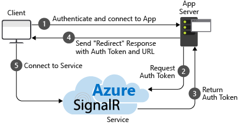
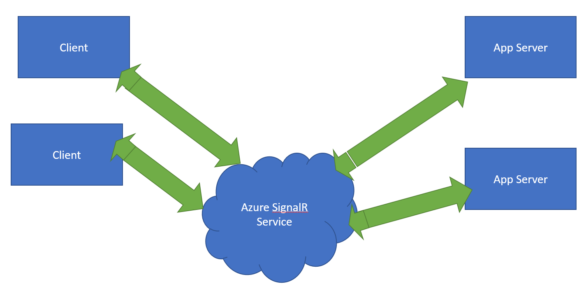
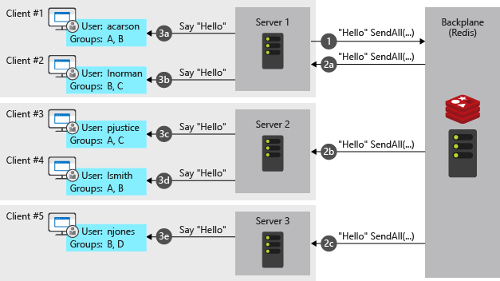

# ASP.NET Core SignalR hosting and scaling

By [Andrew Stanton-Nurse](https://twitter.com/anurse), [Brady Gaster](https://twitter.com/bradygaster), and [Tom Dykstra](https://github.com/tdykstra)

This article explains hosting and scaling considerations for high-traffic apps that use ASP.NET Core SignalR.

## Sticky Sessions

SignalR requires that all HTTP requests for a specific connection be handled by the same server process. When SignalR is running on a server farm (multiple servers), "sticky sessions" must be used. "Sticky sessions" are also called session affinity by some load balancers. Azure App Service uses [Application Request Routing](/iis/extensions/planning-for-arr/application-request-routing-version-2-overview) (ARR) to route requests. Enabling the "ARR Affinity" setting in your Azure App Service will enable "sticky sessions". The only circumstances in which sticky sessions are not required are:

1. When hosting on a single server, in a single process.
1. When using the Azure SignalR Service.
1. When all clients are configured to **only** use WebSockets, **and** the [SkipNegotiation setting](xref:signalr/configuration#configure-additional-options) is enabled in the client configuration.

In all other circumstances (including when the Redis backplane is used), the server environment must be configured for sticky sessions.

For guidance on configuring Azure App Service for SignalR, see <xref:signalr/publish-to-azure-web-app>. For guidance on configuring sticky sessions for Blazor apps that use the [Azure SignalR Service](#azure-signalr-service), see <xref:blazor/host-and-deploy/server#signalr-configuration>.

## TCP connection resources

The number of concurrent TCP connections that a web server can support is limited. Standard HTTP clients use *ephemeral* connections. These connections can be closed when the client goes idle and reopened later. On the other hand, a SignalR connection is *persistent*. SignalR connections stay open even when the client goes idle. In a high-traffic app that serves many clients, these persistent connections can cause servers to hit their maximum number of connections.

Persistent connections also consume some additional memory, to track each connection.

The heavy use of connection-related resources by SignalR can affect other web apps that are hosted on the same server. When SignalR opens and holds the last available TCP connections, other web apps on the same server also have no more connections available to them.

If a server runs out of connections, you'll see random socket errors and connection reset errors. For example:

```
An attempt was made to access a socket in a way forbidden by its access permissions...
```

To keep SignalR resource usage from causing errors in other web apps, run SignalR on different servers than your other web apps.

To keep SignalR resource usage from causing errors in a SignalR app, scale out to limit the number of connections a server has to handle.

## Scale out

An app that uses SignalR needs to keep track of all its connections, which creates problems for a server farm. Add a server, and it gets new connections that the other servers don't know about. For example, SignalR on each server in the following diagram is unaware of the connections on the other servers. When SignalR on one of the servers wants to send a message to all clients, the message only goes to the clients connected to that server.


The options for solving this problem are the [Azure SignalR Service](#azure-signalr-service) and [Redis backplane](#redis-backplane).

## Azure SignalR Service

The Azure SignalR Service functions as a proxy for real-time traffic and doubles as a backplane when the app is scaled out across multiple servers. Each time a client initiates a connection to the server, the client is redirected to connect to the service. The process is illustrated by the following diagram:



The result is that the service manages all of the client connections, while each server needs only a small constant number of connections to the service, as shown in the following diagram:



This approach to scale-out has several advantages over the Redis backplane alternative:

* Sticky sessions, also known as [client affinity](/iis/extensions/configuring-application-request-routing-arr/http-load-balancing-using-application-request-routing#step-3---configure-client-affinity), is not required, because clients are immediately redirected to the Azure SignalR Service when they connect.
* A SignalR app can scale out based on the number of messages sent, while the Azure SignalR Service scales to handle any number of connections. For example, there could be thousands of clients, but if only a few messages per second are sent, the SignalR app won't need to scale out to multiple servers just to handle the connections themselves.
* A SignalR app won't use significantly more connection resources than a web app without SignalR.

For these reasons, we recommend the Azure SignalR Service for all ASP.NET Core SignalR apps hosted on Azure, including App Service, VMs, and containers.

For more information see the [Azure SignalR Service documentation](/azure/azure-signalr/signalr-overview).

## Redis backplane

[Redis](https://redis.io/) is an in-memory key-value store that supports a messaging system with a publish/subscribe model. The SignalR Redis backplane uses the pub/sub feature to forward messages to other servers. When a client makes a connection, the connection information is passed to the backplane. When a server wants to send a message to all clients, it sends to the backplane. The backplane knows all connected clients and which servers they're on. It sends the message to all clients via their respective servers. This process is illustrated in the following diagram:



The Redis backplane is the recommended scale-out approach for apps hosted on your own infrastructure. If there is significant connection latency between your data center and an Azure data center, Azure SignalR Service may not be a practical option for on-premises apps with low latency or high throughput requirements.

The Azure SignalR Service advantages noted earlier are disadvantages for the Redis backplane:

* Sticky sessions, also known as [client affinity](/iis/extensions/configuring-application-request-routing-arr/http-load-balancing-using-application-request-routing#step-3---configure-client-affinity), is required, except when **both** of the following are true:
  * All clients are configured to **only** use WebSockets.
  * The [SkipNegotiation setting](xref:signalr/configuration#configure-additional-options) is enabled in the client configuration. 
   Once a connection is initiated on a server, the connection has to stay on that server.
* A SignalR app must scale out based on number of clients even if few messages are being sent.
* A SignalR app uses significantly more connection resources than a web app without SignalR.

## IIS limitations on Windows client OS

Windows 10 and Windows 8.x are client operating systems. IIS on client operating systems has a limit of 10 concurrent connections. SignalR's connections are:

* Transient and frequently re-established.
* **Not** disposed immediately when no longer used.

The preceding conditions make it likely to hit the 10 connection limit on a client OS. When a client OS is used for development, we recommend:

* Avoid IIS.
* Use Kestrel or IIS Express as deployment targets.

## Linux with Nginx

The following contains the minimum required settings to enable WebSockets, ServerSentEvents, and LongPolling for SignalR:

```nginx
http {
  map $http_connection $connection_upgrade {
    "~*Upgrade" $http_connection;
    default keep-alive;
  }

  server {
    listen 80;
    server_name example.com *.example.com;

    # Configure the SignalR Endpoint
    location /hubroute {
      # App server url
      proxy_pass http://localhost:5000;

      # Configuration for WebSockets
      proxy_set_header Upgrade $http_upgrade;
      proxy_set_header Connection $connection_upgrade;
      proxy_cache off;
      # WebSockets were implemented after http/1.0
      proxy_http_version 1.1;

      # Configuration for ServerSentEvents
      proxy_buffering off;

      # Configuration for LongPolling or if your KeepAliveInterval is longer than 60 seconds
      proxy_read_timeout 100s;

      proxy_set_header Host $host;
      proxy_set_header X-Forwarded-For $proxy_add_x_forwarded_for;
      proxy_set_header X-Forwarded-Proto $scheme;
    }
  }
}
```

When multiple backend servers are used, sticky sessions must be added to prevent SignalR connections from switching servers when connecting. There are multiple ways to add sticky sessions in Nginx. Two approaches are shown below depending on what you have available.

The following is added in addition to the previous configuration. In the following examples, `backend` is the name of the group of servers.

With [Nginx Open Source](https://nginx.org/en/), use `ip_hash` to route connections to a server based on the client's IP address:

```nginx
http {
  upstream backend {
    # App server 1
    server localhost:5000;
    # App server 2
    server localhost:5002;

    ip_hash;
  }
}
```

With [Nginx Plus](https://www.nginx.com/products/nginx), use `sticky` to add a cookie to requests and pin the user's requests to a server:

```nginx
http {
  upstream backend {
    # App server 1
    server localhost:5000;
    # App server 2
    server localhost:5002;

    sticky cookie srv_id expires=max domain=.example.com path=/ httponly;
  }
}
```

Finally, change `proxy_pass http://localhost:5000` in the `server` section to `proxy_pass http://backend`.

For more information on WebSockets over Nginx, see [NGINX as a WebSocket Proxy](https://www.nginx.com/blog/websocket-nginx).

For more information on load balancing and sticky sessions, see [NGINX load balancing](https://docs.nginx.com/nginx/admin-guide/load-balancer/http-load-balancer/).

For more information about ASP.NET Core with Nginx see the following article:
* <xref:host-and-deploy/linux-nginx>

## Third-party SignalR backplane providers

* [NCache](https://www.alachisoft.com/ncache/asp-net-core-signalr.html)
* [Orleans](https://github.com/OrleansContrib/SignalR.Orleans)
* [Rebus](https://github.com/rebus-org/Rebus.SignalR)
* [SQL Server](https://github.com/IntelliTect/IntelliTect.AspNetCore.SignalR.SqlServer)

## Next steps

For more information, see the following resources:

* [Azure SignalR Service documentation](/azure/azure-signalr/signalr-overview)
* [Set up a Redis backplane](xref:signalr/redis-backplane)
