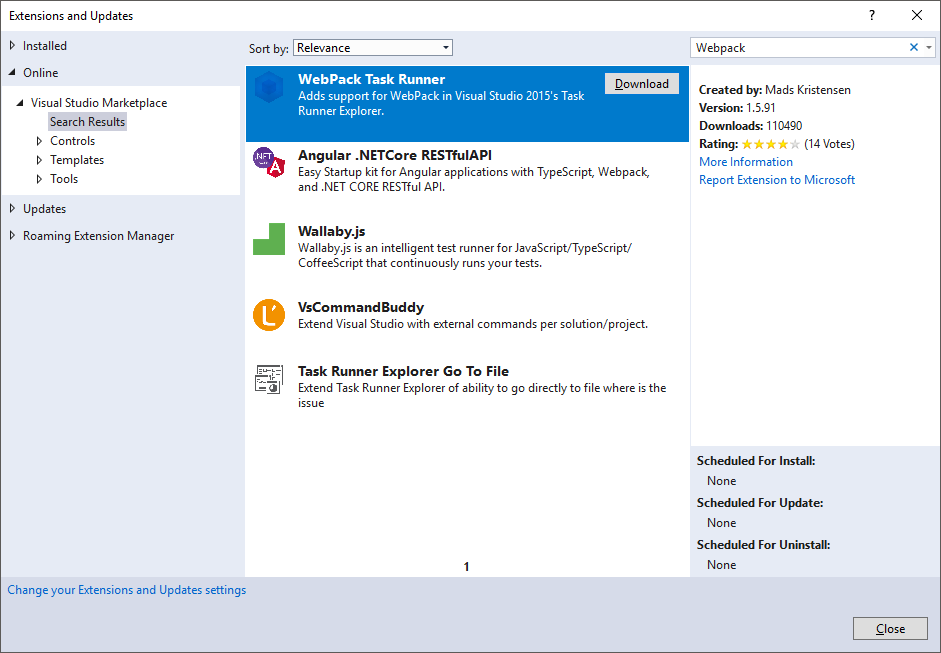
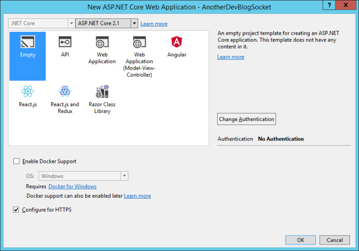

# Using ASP.NET Core SignalR with TypeScript and WebPack

By [Sébastien Sougnez](https://twitter.com/ssougnez)

**WebPack** enables developers to easily bundle the client side of a web application. This tutorial teaches how to use it to bundle an application written in **TypeScript** that communicates with a server through web sockets using **SignalR**.

[View or download sample code](https://github.com/aspnet/Docs/tree/live/aspnetcore/signalr/webpack-and-typescript/sample) ([how to download](xref:tutorials/index#how-to-download-a-sample))

## Prerequisites

* **[NodeJs](https://nodejs.org/en/)** and **npm** must be installed on your system to be able to use **WebPack**.

There is two options to run **WebPack** with **Visual Studio**:

* Either you use an external terminal.
* Or you can use the **WebPack Task Runner** extension that allows you to see the output of **WebPack** directly in **Visual Studio** and launch the compilation automatically when the project is opened. If you opt for this option, please follow these instructions:

1. Use the **Tools** > **Extensions and updates** menu option then select **Online** in the left pane of the screen.
2. Type "*WebPack*" and install the extension developed by *Mads Kristesen* by clicking on **Download**.

   

3. Close **Visual Studio** to complete the installation.

> [!NOTE]
> If you plan on using global **NodeJs** packages, it's better to configure **Visual Studio** to look for them in the **PATH** environment variable before it looks in its installation directory.

1. Use the **Tools** > **Options** menu option and select **Projects and solutions** > **Web Package Management** > **External Web Tools**.
2. Select the **$(PATH)** value in the list then click on the up arrow to move it at the second place (the first line refers to the local packages). 

    

## Create the ASP.NET Core web application

# [Visual Studio](#tab/visual-studio/)

1. Use the **File** > **New Project** menu option and choose **ASP.NET Core Web Application**. Give a meaningful name to the application and validate.
2. Select **Empty** and ensure that **ASP.NET Core 2.1** is selected from the framework selector.

   

# [Visual Studio Code](#tab/visual-studio-code/)

1. From the **Integrated Terminal**, run the following command:

    ```console
    dotnet new web -o SignalRWebPack
    ```
---

## Configure WebPack and TypeScript

To be able to bundle all front end related resources (stylesheets, images and **TypeScript** files), you need to install the following packages using your prefered packages manager.

1. Run the following command to install the required packages for **WebPack**.

    ```console
    npm install clean-webpack-plugin css-loader html-webpack-plugin mini-css-extract-plugin ts-loader typescript webpack webpack-cli -D
    ```

2. Update your **package.json** file to include these scripts:

    [!code-javascript[Package](webpack-and-typescript/sample/package.json?range=2-6)]

* build: Bundles your front end resources in development mode and watch for file changes.
* release: Bundles your front end resources in production mode.
* publish: Run the "release" script to bundle your front end resources in production mode then call the "publish" dotnet CLI command to publish your whole application.

> [!NOTE]
> The "build" script starts **WebPack** in watch mode, meaning that the bundle gets regenerated as soon as a file of the application changes. Moreover, the **mode** flag defines that production optimizations such as tree-shaking or minification won't be applied. This script should only be used for development purpose. To bundle your application for production, use the "release" script.

> [!NOTE]
> As you use Kestrel to host your application, it's not possible to use **webpack-dev-server**.

> [!NOTE]
> You can run these scripts in an external terminal by typing "*npm run SCRIPT_NAME*" or you can use the **Task Runner Explorer** window in **Visual Studio**.

3. Create a file called **webpack.config.js** in the root of your project to configure the compilation of **WebPack**.

    [!code-javascript[WebPack](webpack-and-typescript/sample/webpack.config.js)]

Here are the things to pay attention to:

* The **output** part overrides its default value to emit the bundle in the **wwwroot** directory instead of the **dist** one.
* **resolve.extensions** must contain ".js" in order to be able to import the "JavaScript" code of **SignalR**.

4. Create a file called **index.html** in the folder **./src** to define the template of the homepage.

    [!code-html[Index](webpack-and-typescript/sample/src/index.html)]

5. Create a file called **main.css** in the folder **./src/assets/css** to define the basic CSS classes of the application.

    [!code-css[CSS](webpack-and-typescript/sample/src/assets/css/main.css)]

6. Create a file called **tsconfig.json** in root of your project to configure the TypeScript compilation.

    [!code-javascript[tsconfig](webpack-and-typescript/sample/tsconfig.json)]

This settings defines that the **TypeScript** source code must be compiled in ES5 compatible "JavaScript" code.

7. Create a file called **index.ts** in the **./src** directory.

    [!code-typescript[tsconfig](webpack-and-typescript/sample/src/index.ts?range=1,5-8,25-33,35)]

Besides retrieving references to the different elements of the page, two event handled are defined:

* One that fires when the user types something in the **input** to call the **send** function when the user presses the "Enter" key.
* One that fires when the user clicks on the "Send" button and call the **send** function.

## Configure the ASP.NET Core application

1. The current code of the file **Startup.cs** is responsible for displaying "*Hello World!*". Replace the last **app.Run** method call by the following one to ensure that the server is able to find and serve the **index.html** whether the user enters its full URL or just the root URL of the web application.

    [!code-csharp[Startup](webpack-and-typescript/sample/Startup.cs?range=30,31)]

2. Add the following line in the **ConfigureServices** method to add the **SignalR** service to your application.

    [!code-csharp[Startup](webpack-and-typescript/sample/Startup.cs?range=19)]

2. **SignalR** needs to be configured to define the available routes and to plug them with a specific hub. Add the following lines at the end of the **Configure** method to defines a "/hub" route plugged to the **ChatHub** class.

    [!code-csharp[Startup](webpack-and-typescript/sample/Startup.cs?range=33-36)]

3. Add a file called **./Core/ChatHub.cs** with the following content to create you hub:

    [!code-csharp[ChatHub](webpack-and-typescript/sample/Core/ChatHub.cs)]

4. Don't forget to add a **using** statement to import the **Core** namespace in the **Startup.cs** file.

## Enable the communication between the client and the server

Right now, you have an application that displays a simple form to send messages but nothing happens when you actually try to do so. On the other hand, the server is just listening to a specific route but don't do anything with sent messages. 

1. To allow the client to send messages to the server, start by installing the **SignalR** **npm* package:

    ```console
    npm install @aspnet/signalr -S
    ```

2. Add the following lines below the declaration of the **username** constant in the **./src/index.ts** file to be able to receive messages from the server:

    [!code-csharp[Index](webpack-and-typescript/sample/src/index.ts?range=10-23)]

The class **HubConnectionBuilder** creates a new builder that you can use to configure the connection to the server. To configure the URL of the hub, you need to use the **withUrl** function.

The idea behind **SignalR** is pretty simple, you exchange messages between a client and a server and each message has a specific name. For example, you can have messages with the name "messageReceived" that executes the logic responsible for displaying the new message in the messages zone. Listening to a specific message can be done via the **on** function and you can listen to any number of message names that you want. It is also possible to pass parameters to the message, like the author's name and the content of the message received. Once a the client received a message, a new "div" is created with the author's name and the message content in its "innerHTML" property and added to the main "div" displaying the messages.

3. Now that the client can receive a message, it needs to be able to send some. For that matter, add the following line in the **send** function of the **./src/index.ts** file:

    [!code-csharp[Index](webpack-and-typescript/sample/src/index.ts?range=34)]

Sending a message through the "web socket" connection is as easy as using the **send** method with the message name as first parameter and the message data as the rest of the parameters, so here, you just send a "newMessage" message with the username and the content of the "input" to the server and if it works, the "input" value is cleaned.

4. To broadcast received messages to all the connected users as soon as the server receives them, add the following method to the **ChatHub** class:

    [!code-csharp[ChatHub](webpack-and-typescript/sample/Core/ChatHub.cs?range=8-11)]

It's not necessary to have a generic **on** method to receive all the messages, all you need is a method named like the message name. For example, the **TypeScript** code sends a "newMessage" message, so in the **C#** code, you just need a **NewMessage** method that expects the data sent by the client.

Here, a call is made to the method **SendAsync** on **Clients.All** to broadcast the received messages to everyone.