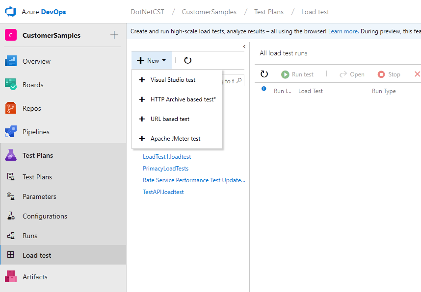
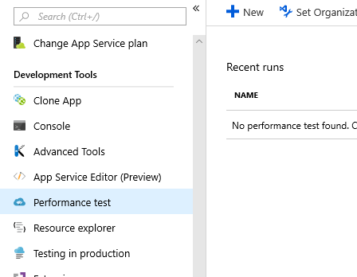
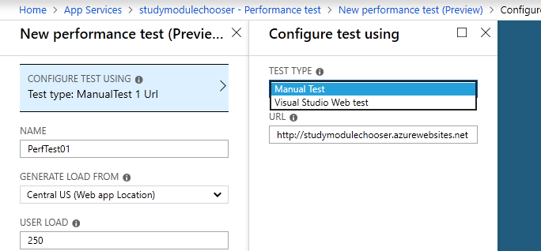

# ASP.NET Core load/stress testing

Load testing and stress testing are important to ensure a web app is performant and scalable. Their goals are different even though they often share similar tests.

**Load tests** &ndash; Test whether the app can handle a specified load of users for a certain scenario while still satisfying the response goal. The app is run under normal conditions.

**Stress tests** &ndash; Test app stability when running under extreme conditions, often for a long period of time. The tests place high user load, either spikes or gradually increasing load, on the app, or they limit the app's computing resources.

Stress tests determine if an app under stress can recover from failure and gracefully return to expected behavior. Under stress, the app isn't run under normal conditions.

Visual Studio 2019 is the last version of Visual Studio with load test features. For customers requiring load testing tools in the future, we recommend alternate tools, such as Apache JMeter, Akamai CloudTest, and BlazeMeter. For more information, see the [Visual Studio 2019 Release Notes](/visualstudio/releases/2019/release-notes#test-tools).

The load testing service in Azure DevOps is ending in 2020. For more information, see [Cloud-based load testing service end of life](https://devblogs.microsoft.com/devops/cloud-based-load-testing-service-eol/).

## Visual Studio tools

Visual Studio allows users to create, develop, and debug web performance and load tests. An option is available to create tests by recording actions in a web browser.

For information on how to create, configure, and run a load test projects using Visual Studio 2017, see [Quickstart: Create a load test project](/visualstudio/test/quickstart-create-a-load-test-project?view=vs-2017). For more information, see the [Additional resources](#additional-resources) section.

Load tests can be configured to run on-premise or run in the cloud using Azure DevOps.

## Azure DevOps

Load test runs can be started using the [Azure DevOps Test Plans](/azure/devops/test/load-test/index?view=vsts) service.

The service supports the following test formats:

* Visual Studio &ndash; Web test created in Visual Studio.
* HTTP Archive &ndash; Captured HTTP traffic inside archive is replayed during testing.
* [URL-based](/azure/devops/test/load-test/get-started-simple-cloud-load-test?view=vsts) &ndash; Allows specifying URLs to load test, request types, headers, and query strings. Run setting parameters such as duration, load pattern, and number of users can be configured.
* [Apache JMeter](https://jmeter.apache.org/).

## Azure portal

[Azure portal allows setting up and running load testing of web apps](/azure/devops/test/load-test/app-service-web-app-performance-test?view=vsts) directly from the **Performance** tab of the App Service in Azure portal.

The test can be a manual test with a specified URL or a Visual Studio Web Test file, which can test multiple URLs.

At end of the test, generated reports show the performance characteristics of the app. Example statistics include:

* Average response time
* Max throughput: requests per second
* Failure percentage

## Third-party tools

The following list contains third-party web performance tools with various feature sets:

* [Apache JMeter](https://jmeter.apache.org/)
* [ApacheBench (ab)](https://httpd.apache.org/docs/2.4/programs/ab.html)
* [Gatling](https://gatling.io/)
* [Locust](https://locust.io/)
* [West Wind WebSurge](http://websurge.west-wind.com/)
* [Netling](https://github.com/hallatore/Netling)

## Additional resources

* [Load Test blog series](https://blogs.msdn.microsoft.com/charles_sterling/2015/06/01/load-test-series-part-i-creating-web-performance-tests-for-a-load-test/)
